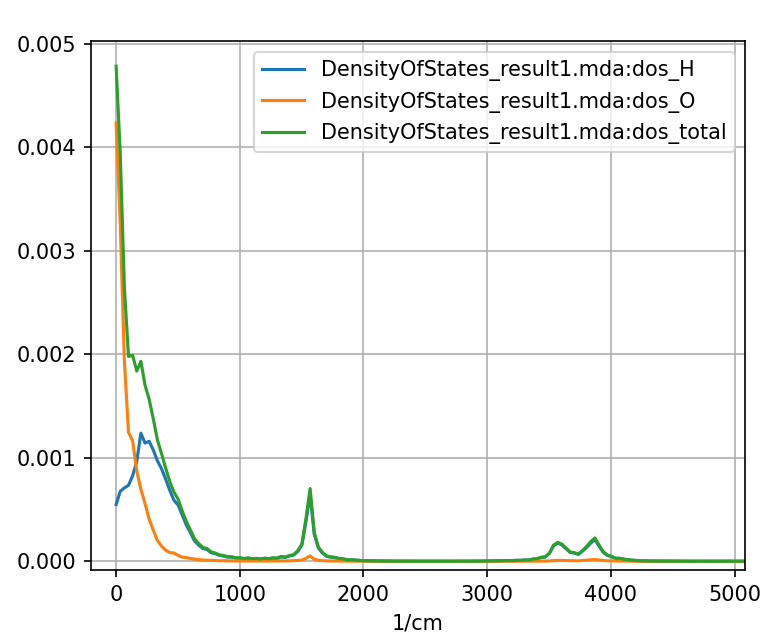
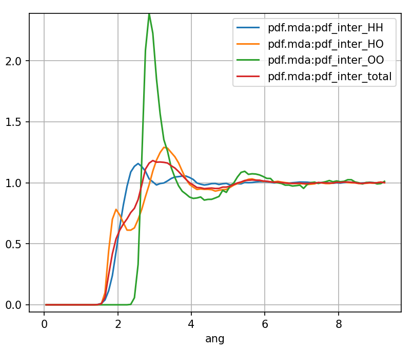

.. _weighting-scheme:

Weighting Scheme
================

Partial properties
^^^^^^^^^^^^^^^^^^

In MDANSE, most properties are split by atom-type
and the total result is a sum of these partial
properties. For example, the partial coherent and incoherent intermediate
scattering functions scaled with weight factors are

.. math::
   :label: partial1

   \mathcal{F}_{\text{coh},\alpha\beta}(\mathbf{q},t) =  \frac{W_{\alpha\beta}}{N \sqrt{c_{\alpha}c_{\beta}}} \sum\limits_{j \in \alpha} \sum\limits_{k \in \beta} \mathrm{Re} \left[ F_{jk}(\mathbf{q},t) \right],

.. math::
   :label: partial2

   \mathcal{F}_{\text{inc},\alpha}(\mathbf{q},t ) = \frac{W_{\alpha}}{Nc_{\alpha}} \sum\limits_{j \in \alpha} \mathrm{Re} \left[ F_{jj}(\mathbf{q},t) \right],

.. math::
   :label: partial2_1

   F_{jk}{(\mathbf{q},t) = \left\langle {\exp\left\lbrack {{- i}\mathbf{q}\cdot\mathbf{r}_{j}\left( 0 \right)} \right\rbrack\exp\left\lbrack {i\mathbf{q}\cdot\mathbf{r}_{k}\left( t \right)} \right\rbrack} \right\rangle}

where :math:`\alpha` and :math:`\beta` are the atom-types.
:math:`W_{\alpha\beta}` and :math:`W_{\alpha}` are the weights of the
atom-type pairs :math:`\alpha\beta` and the atom type :math:`\alpha`.
:math:`c_{\alpha} = N_{\alpha} / N` and :math:`c_{\beta} = N_{\beta} / N` are
the concentrations of atoms of atom-types :math:`\alpha` and :math:`\beta`.
:math:`N_{\alpha}` and :math:`N_{\beta}` are the the number of atoms-type
:math:`\alpha` and :math:`\beta`, and :math:`N` is the total number of atoms.
In MDANSE, the real part of :math:`F_{jk}(\mathbf{q},t)` is taken in Eqs.
:math:numref:`partial1` so that it is the average over :math:`+\mathbf{q}`
and :math:`-\mathbf{q}`. The total is now a sum of the partial terms

.. math::
   :label: partial3

    F_{\text{coh}}(\mathbf{q},t) = \sum_{\alpha}\sum_{\beta \geq \alpha} \mathcal{F}_{\text{coh},\alpha\beta}(\mathbf{q},t), \qquad F_{\text{inc}}(\mathbf{q},t) = \sum_{\alpha} \mathcal{F}_{\text{inc},\alpha}(\mathbf{q},t).

For summation involving two atom-types only the unique pairs are included up,
since the averaging over :math:`+\mathbf{q}` and :math:`-\mathbf{q}` will mean that
:math:`\mathcal{F}_{\text{coh},\alpha\beta}(\mathbf{q},t) \approx \mathcal{F}_{\text{coh},\beta\alpha}(\mathbf{q},t)`.
The factor of two for the off-diagonal terms is included in the weight factor.

.. _water-dos-weighted:

   The total and partial DOS of water. Partial DOS are **weighted** so that the
   sum of partial DOS equals to the total.

The partial properties can also be scaled without the weights

.. math::
   :label: partial4

   F_{\text{coh},\alpha\beta}(\mathbf{q},t) =  \frac{1}{N \sqrt{c_{\alpha}c_{\beta}}} \sum\limits_{j \in \alpha} \sum\limits_{k \in \beta} \mathrm{Re} \left[ F_{jk}(\mathbf{q},t) \right],

.. math::
   :label: partial5

   F_{\text{inc},\alpha}(\mathbf{q},t ) = \frac{1}{Nc_{\alpha}} \sum\limits_{j \in \alpha} \mathrm{Re} \left[ F_{jj}(\mathbf{q},t) \right],

so the total will now be a weighted sum of these partial terms

.. math::
   :label: partial6

    F_{\text{coh}}(\mathbf{q},t) = \sum_{\alpha}\sum_{\beta \geq \alpha} W_{\alpha\beta} F_{\text{coh},\alpha\beta}(\mathbf{q},t), \qquad F_{\text{inc}}(\mathbf{q},t) = \sum_{\alpha} W_{\alpha} F_{\text{inc},\alpha}(\mathbf{q},t).

In the MDANSE_GUI you have the option to plot either weighted (e.g. :math:`\mathcal{F}_{\text{coh},\alpha\beta}(\mathbf{q},t)`
and :math:`\mathcal{F}_{\text{inc},\alpha}(\mathbf{q},t)`) or unweighted (e.g. :math:`F_{\text{coh},\alpha\beta}(\mathbf{q},t)`
and :math:`F_{\text{inc},\alpha}(\mathbf{q},t)`) partial properties.

.. _water-pdf-unweighted:

   The total and partial intermolecular PDF of water. Partial PDF are
   **unweighted** and only
   their weighted sum equals to the total PDF.

The weighted and unweighted options are more useful for different cases, for example,
it might be more useful to use the weighted terms for the density of states (DOS) calculations (:numref:`water-dos-weighted`)
while the unweighted terms might be more useful of the pair distribution function (PDF) calculations (:numref:`water-pdf-unweighted`).

Rescaled Weights
^^^^^^^^^^^^^^^^

Single Atom-Type Weights
~~~~~~~~~~~~~~~~~~~~~~~~

MDANSE weights are rescaled so that weights for DISF calculation using the ``b_incoherent`` will be

.. math::
   :label: single1

   W_{\alpha} = \frac{c_{\alpha} \vert b_{\mathrm{inc},\alpha} \vert^2}{\sum_{\gamma} c_{\gamma} \vert b_{\mathrm{inc},\gamma} \vert^2}

where :math:`\vert b_{\mathrm{inc},\alpha} \vert^2` is the squared incoherent
scattering length of the atom type :math:`\alpha`. Note that the
weights were squared prior to the rescaling, see :ref:`weighting-scheme-squared`
for details. By using the rescaled weights the total incoherent intermediate
scattering functions becomes

.. math::
   :label: single2

   F_{\text{inc}}(\mathbf{q},t ) = \frac{1}{\sum_{\gamma} c_{\gamma} \vert b_{\mathrm{inc},\gamma} \vert^2 } \frac{1}{N} \sum\limits_{j} \vert b_{\mathrm{inc},\alpha} \vert^2 \ \mathrm{Re} \left[ F_{jj}(\mathbf{q},t) \right]

Notice that by using this weight scheme the total DISF has the property that

.. math::
   :label: single3

   F_{\text{inc}}(\mathbf{q},t=0) = 1.

Double Atom-Type Weights (DCSF and CCF)
~~~~~~~~~~~~~~~~~~~~~~~~~~~~~~~~~~~~~~~

For the DCSF calculation using ``b_coherent``, the weights are

.. math::
   :label: doubledcsf1

   W_{\alpha\beta} = \left[2 - \delta_{\alpha\beta}\right] \frac{\sqrt{c_{\alpha}c_{\beta}}\ \mathrm{Re} \left[b_{\mathrm{coh},\alpha}^{\dagger}b_{\mathrm{coh},\beta} \right]}{\sum_{\gamma\delta} c_{\gamma}c_{\delta}  b_{\mathrm{coh},\gamma}^{\dagger}b_{\mathrm{coh},\delta}}

where :math:`b_{\mathrm{coh},\alpha}^{\dagger}` and :math:`b_{\mathrm{coh},\beta}` are
the coherent scattering lengths of the atoms of types :math:`\alpha` and
:math:`\beta`. (:math:`b_{\mathrm{coh},\alpha}^{\dagger}` is the complex conjugate of
:math:`b_{\mathrm{coh},\alpha}`, as neutron scattering lengths are complex numbers.)
The total coherent intermediate scattering functions becomes

.. math::
   :label: doubledcsf2

   F_{\text{coh}}(\mathbf{q},t) = \frac{\sqrt{c_{\alpha}c_{\beta}}}{\sum_{\gamma\delta} c_{\gamma}c_{\delta}  b_{\mathrm{coh},\gamma}^{\dagger}b_{\mathrm{coh},\delta}} \frac{1}{N} \sum\limits_{jk} \mathrm{Re} \left[  b_{\mathrm{coh},\alpha}^{\dagger}b_{\mathrm{coh},\beta} \right]  \mathrm{Re} \left[ F_{jk}(\mathbf{q},t) \right]

where :math:`b_{\mathrm{coh},j}^{\dagger}` and
:math:`b_{\mathrm{coh},k}` are the coherent scattering lengths of
atoms :math:`j` and :math:`k`. Notice that the total intermediate scattering function
(sum of the incoherent and coherent parts) will not be equal (or equal to the
sum by some scaling factor) to the to the sum of intermediate scattering function
from the DISF and DCSF calculations using the scaled weight scheme since they
are not scaled in the same way.

Double Atom-Type Weights (Other)
~~~~~~~~~~~~~~~~~~~~~~~~~~~~~~~~

For calculation other than the DCSF and current correlation function (CCF)
a slightly different weight scheme must be used as their partials are
normalized slightly differently. In MDANSE the partial static structure
factor (SSF) is

.. math::
    :label: doubleother1

    S_{\alpha\beta}(q) = 1 + \frac{4 \pi \rho}{q} \int\limits_{0}^{\infty} \mathrm{d}r  \, \left[ g_{\alpha\beta}(r) - 1\right] r\sin(qr)

where

.. math::
    :label: doubleother2

    g_{\alpha\beta}(r) = \frac{1}{N c_{\alpha} c_{\beta}}\frac{1}{4 \pi r^2} \frac{1}{\rho} \sum_{j \in \alpha} \sum_{\substack{k \in \beta \\ k \neq j}}  \left\langle \delta(r - \vert \mathbf{r}_{k} + \mathbf{r}_{j} \vert ) \right\rangle

are the partial PDFs. Using ``b_coherent`` the weights are

.. math::
   :label: doubleother3

   W_{\alpha\beta} = \left[2 - \delta_{\alpha\beta}\right] \frac{c_{\alpha}c_{\beta} \ \mathrm{Re} \left[b_{\mathrm{coh},\alpha}^{\dagger}b_{\mathrm{coh},\beta} \right]}{\sum_{\gamma\delta} c_{\gamma}c_{\delta}  b_{\mathrm{coh},\gamma}^{\dagger}b_{\mathrm{coh},\delta}}

notice that the concentrations :math:`c_{\alpha}c_{\beta}` are not
square-rooted, this is because the the partial SSF has a prefactor of
:math:`1 / N c_{\alpha}c_{\beta}` while DCSF and CCF calculations have a
prefactor of :math:`1 / N \sqrt{c_{\alpha}c_{\beta}}`.

.. _weighting-scheme-squared:

Squared Weights
^^^^^^^^^^^^^^^

For the DISF, GDISF, EISF, and VHF (self-part) calculations all weights are squared prior
to being rescaled. For the DOS, PACF, VACF, and PPS calculations
the weights are squared prior to being rescaled for only the ``b_coherent``
or ``b_incoherent`` weights. In most cases the rescaled weights
with single atom-type weights will be

.. math::
   :label: squared1

   W_{\alpha} = \mathrm{Re} \left[ \frac{c_{\alpha} w_{\alpha}}{\sum_{\gamma} c_{\gamma} w_{\gamma}} \right]

while in some cases when the weight are squared

.. math::
   :label: squared2

   W_{\alpha} = \frac{c_{\alpha} \vert w_{\alpha} \vert^2}{\sum_{\gamma} c_{\gamma} \vert w_{\gamma} \vert^2}

where :math:`w_{\alpha}` is some weight parameter for the atom-type :math:`\alpha`.
