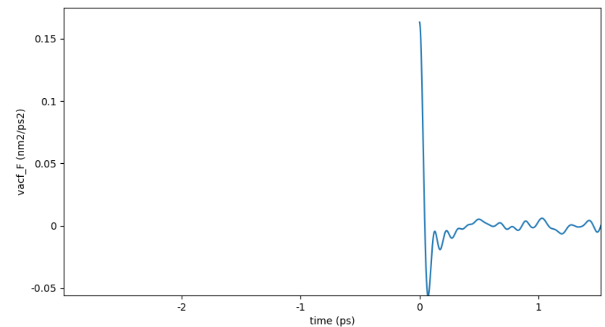
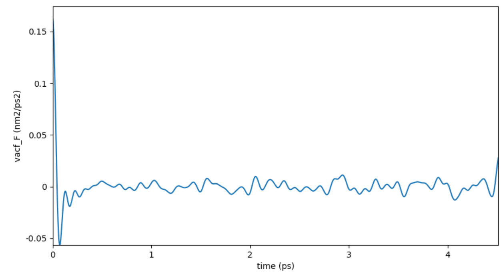
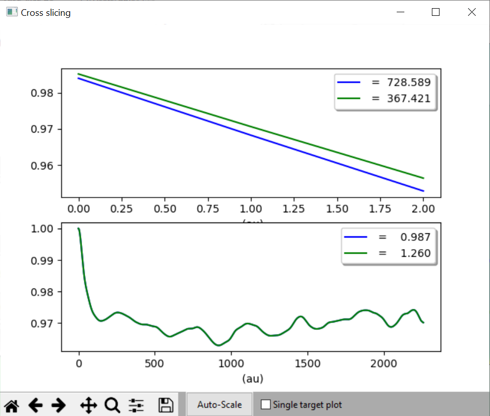

Units
=====

The units used by MDANSE are nm for length and ps for time, and their
inverses for Q (nm\ :sup:`-1`) and angular frequencies, :math:`\omega`
(ps\ :sup:`-1`). Any input must be given using these units, and the
output files do also employ the same units. The :ref:`2d3dplotter` includes
the Python magnitude module, so you can modify the units when plotting
the results using the `Axes settings <#_Axes_settings>`__ (available
from the context menu that appears by right clicking on the plot). If
you use the export option in the graphic after having changed the units,
your output file will be saved with the desired units. But remember that
the original output file (typically a HDF) is written using the
original standard units.

The list of prefixes to physical quantities is listed in Table 1.
The leftmost column is what can be written in front
of the symbol of a physical quantity.

Table 1: A list of prefixes that can be used to modify units.

====== ===== =====
Symbol Name  Value
y      yocto 1e-24
z      zepto 1e-21
a      atto  1e-18
f      femto 1e-15
p      pico  1e-12
n      nano  1e-9
u      micro 1e-6
m      mili  1e-3
c      centi 1e-2
d      deci  1e-1
da     deca  1e1
h      hecto 1e2
k      kilo  1e3
M      mega  1e6
G      giga  1e9
T      tera  1e12
P      peta  1e15
E      exa   1e18
Z      zetta 1e21
Y      yotta 1e24
====== ===== =====

All these prefixes can be used with any of the units from Table 2.
All these units can also be accessed through the
:ref:`units-editor`.

Table 2: A list of all units that can be used in MDANSE.

+--------------+----------------+----------------+----------------+
| **Symbol**   | **Unit**       | **Value in SI  | **Physical     |
|              |                | units**        | quantity**     |
+--------------+----------------+----------------+----------------+
| au           | atomic unit    | 0              | -              |
+--------------+----------------+----------------+----------------+
| m            | meter          | 1 m            | length         |
+--------------+----------------+----------------+----------------+
| ang          | Angstrom       | 1 \*           |                |
|              |                | 10\ :sup:`-10` |                |
|              |                | m              |                |
+--------------+----------------+----------------+----------------+
| ft           | foot           | 0.3048 m       |                |
+--------------+----------------+----------------+----------------+
| inch         | inch           | 0.0254 m       |                |
+--------------+----------------+----------------+----------------+
| ly           | light year     | 9.             |                |
|              |                | 460,730,472,58 |                |
|              |                | \*             |                |
|              |                | 10\ :sup:`15`  |                |
|              |                | m              |                |
+--------------+----------------+----------------+----------------+
| b            | Barn           | 1 \*           | surface        |
|              |                | 10\ :sup:`-28` |                |
|              |                | m\ :sup:`2`    |                |
+--------------+----------------+----------------+----------------+
| l            | litre          | 1 \*           | volume         |
|              |                | 10\ :sup:`-3`  |                |
|              |                | m\ :sup:`3`    |                |
+--------------+----------------+----------------+----------------+
| s            | second         | 1 s            | time           |
+--------------+----------------+----------------+----------------+
| year         | year           | 3              |                |
|              |                | 1,556,925.9747 |                |
|              |                | s              |                |
+--------------+----------------+----------------+----------------+
| day          | day            | 86400 s        |                |
+--------------+----------------+----------------+----------------+
| h            | hour           | 3600 s         |                |
+--------------+----------------+----------------+----------------+
| min          | minute         | 60 s           |                |
+--------------+----------------+----------------+----------------+
| kg           | kilogram       | 1 kg           | mass           |
+--------------+----------------+----------------+----------------+
| g            | gram           | 1 \*           |                |
|              |                | 10\ :sup:`-3`  |                |
|              |                | kg             |                |
+--------------+----------------+----------------+----------------+
| uma          | unified mass   | 1.660,540,2 \* |                |
|              | unit           | 10\ :sup:`-27` |                |
|              |                | kg             |                |
+--------------+----------------+----------------+----------------+
| mol          | mole           | 1 mol          | amount of mass |
+--------------+----------------+----------------+----------------+
| J            | Joule          | 1 kg           | energy         |
|              |                | m\ :sup:`2`    |                |
|              |                | s\ :sup:`-2`   |                |
+--------------+----------------+----------------+----------------+
| eV           | electron volt  | 1.602,176,49   |                |
|              |                | \*             |                |
|              |                | 10\ :sup:`-19` |                |
|              |                | kg m\ :sup:`2` |                |
|              |                | s\ :sup:`-2`   |                |
+--------------+----------------+----------------+----------------+
| cal          | calorie        | 4.184 kg       |                |
|              |                | m\ :sup:`2`    |                |
|              |                | s\ :sup:`-2`   |                |
+--------------+----------------+----------------+----------------+
| cal_per_mole | calorie per    | 6.947,78 \*    |                |
|              | mole           | 10\ :sup:`-24` |                |
|              |                | kg m\ :sup:`2` |                |
|              |                | s\ :sup:`-2`   |                |
|              |                | mol\ :sup:`-1` |                |
+--------------+----------------+----------------+----------------+
| J_per_mole   | Joule per mole | 1.             |                |
|              |                | 660,559,273,42 |                |
|              |                | \*             |                |
|              |                | 10\ :sup:`-24` |                |
|              |                | kg m\ :sup:`2` |                |
|              |                | s\ :sup:`-2`   |                |
|              |                | mol\ :sup:`-1` |                |
+--------------+----------------+----------------+----------------+
| Ha           | Hartree        | 4.359,743,94   |                |
|              |                | \*             |                |
|              |                | 10\ :sup:`-18` |                |
|              |                | kg m\ :sup:`2` |                |
|              |                | s\ :sup:`-2`   |                |
+--------------+----------------+----------------+----------------+
| K            | Kelvin         | 1 K            | temperature    |
+--------------+----------------+----------------+----------------+
| N            | Newton         | 1 kg m         | force          |
|              |                | s\ :sup:`-2`   |                |
+--------------+----------------+----------------+----------------+
| Pa           | Pascal         | 1 kg           | pressure       |
|              |                | m\ :sup:`-1`   |                |
|              |                | s\ :sup:`-2`   |                |
+--------------+----------------+----------------+----------------+
| W            | Watt           | 1 kg           | power          |
|              |                | m\ :sup:`2`    |                |
|              |                | s\ :sup:`-3`   |                |
+--------------+----------------+----------------+----------------+
| Hz           | Hertz          | 1 s\ :sup:`-1` | frequency      |
+--------------+----------------+----------------+----------------+
| A            | Ampere         | 1 A            | electric       |
|              |                |                | current        |
+--------------+----------------+----------------+----------------+
| C            | Coulomb        | 1 A s          | charge         |
+--------------+----------------+----------------+----------------+
| V            | Volt           | 1 kg           | voltage        |
|              |                | m\ :sup:`2`    |                |
|              |                | s\ :sup:`-3`   |                |
|              |                | A\ :sup:`-1`   |                |
+--------------+----------------+----------------+----------------+
| F            | Farad          | 1 s\ :sup:`4`  | capacitance    |
|              |                | A\ :sup:`2`    |                |
|              |                | kg\ :sup:`-1`  |                |
|              |                | m\ :sup:`-2`   |                |
+--------------+----------------+----------------+----------------+
| ohm          | Ohm            | 1 kg           | resistance     |
|              |                | m\ :sup:`2`    |                |
|              |                | s\ :sup:`-3`   |                |
|              |                | A\ :sup:`-2`   |                |
+--------------+----------------+----------------+----------------+
| S            | Siemens        | 1 s\ :sup:`3`  | conductance    |
|              |                | A\ :sup:`2`    |                |
|              |                | kg\ :sup:`-1`  |                |
|              |                | m\ :sup:`-2`   |                |
+--------------+----------------+----------------+----------------+
| Wb           | Weber          | 1 kg           | magnetic flux  |
|              |                | m\ :sup:`2`    |                |
|              |                | s\ :sup:`-2`   |                |
|              |                | A\ :sup:`-1`   |                |
+--------------+----------------+----------------+----------------+
| T            | Tesla          | 1 kg           | flux density   |
|              |                | s\ :sup:`-2`   |                |
|              |                | A\ :sup:`-1`   |                |
+--------------+----------------+----------------+----------------+
| H            | Henry          | 1 kg           | inductance     |
|              |                | m\ :sup:`2`    |                |
|              |                | s\ :sup:`-2`   |                |
|              |                | A\ :sup:`-2`   |                |
+--------------+----------------+----------------+----------------+
| cd           | Candela        | 1 cd           | luminous       |
|              |                |                | intensity      |
+--------------+----------------+----------------+----------------+
| lm           | Lumen          | 1 cd sr        | luminous flux  |
+--------------+----------------+----------------+----------------+
| lux          | lux            | 1 cd sr        | illuminance    |
|              |                | m\ :sup:`-2`   |                |
+--------------+----------------+----------------+----------------+
| Bq           | Becquerel      | 1 s\ :sup:`-1` | radioactivity  |
+--------------+----------------+----------------+----------------+
| Gy           | gray           | 1 m\ :sup:`2`  | ionising       |
|              |                | s\ :sup:`-2`   | radiation      |
+--------------+----------------+----------------+----------------+
| kat          | Katal          | 1 mol          | catalytic      |
|              |                | s\ :sup:`-1`   | activity       |
+--------------+----------------+----------------+----------------+
| dpi          | inches in      | 39.370,        | -              |
|              | meter          | 078,740,157,48 |                |
|              |                | m\ :sup:`-1`   |                |
+--------------+----------------+----------------+----------------+
| gravity      | gravitational  | 9.80665 m      | acceleration   |
|              | constant       | s\ :sup:`-2`   |                |
+--------------+----------------+----------------+----------------+
| c            | speed of light | 2.997,924,58   | velocity       |
|              |                | \*             |                |
|              |                | 10\ :sup:`8` m |                |
|              |                | s\ :sup:`-1`   |                |
+--------------+----------------+----------------+----------------+
| rad          | radian         | 1 rad          | angle          |
+--------------+----------------+----------------+----------------+
| cyc          | cycle          | 6.283,1        |                |
|              |                | 85,307,179,586 |                |
|              |                | rad            |                |
+--------------+----------------+----------------+----------------+
| sr           | steradian      | 1 sr           | solid angle    |
+--------------+----------------+----------------+----------------+
| inv_nm       | inverse nm     | 1 \*           | Inverse length |
|              |                | 10\ :sup:`9`   |                |
|              |                | m\ :sup:`-1`   |                |
+--------------+----------------+----------------+----------------+
| akma_time    | AKMA time      | 20.454,        | time           |
|              |                | 829,497,745,98 |                |
|              |                | \*             |                |
|              |                | 10\ :sup:`-12` |                |
|              |                | s              |                |
+--------------+----------------+----------------+----------------+

.. _section-1:

.. |image37| image:: ./Pictures/1000000100000478000002C6F32754BFA135B144.png
   :width: 6.854cm
   :height: 4.255cm
.. |image38| image:: ./Pictures/1000000100000483000002D2D853AC6BB7CFEA02.png
   :width: 6.791cm
   :height: 4.246cm
.. |image39| image:: ./Pictures/10000001000003C2000003347082A5808C577BC7.png
   :width: 4.815cm
   :height: 4.105cm

.. |image41| image:: ./Pictures/10000001000003BF0000032F9CDC0562548E815A.png
   :width: 4.798cm
   :height: 4.076cm
.. |image42| image:: ./Pictures/10000001000003C200000330E638C73D8C1D67D9.png
   :width: 5.239cm
   :height: 4.443cm
.. |image43| image:: ./Pictures/100000010000072F000003336ED265D0B6E3D58A.png
   :width: 9.844cm
   :height: 4.383cm
