Analysis: other options
=======================

.. _analysis-infrared:

Infrared
^^^^^^^^

.. _analysis-dacf:

Dipole AutoCorrelation Function
'''''''''''''''''''''''''''''''

-  available for trajectories only

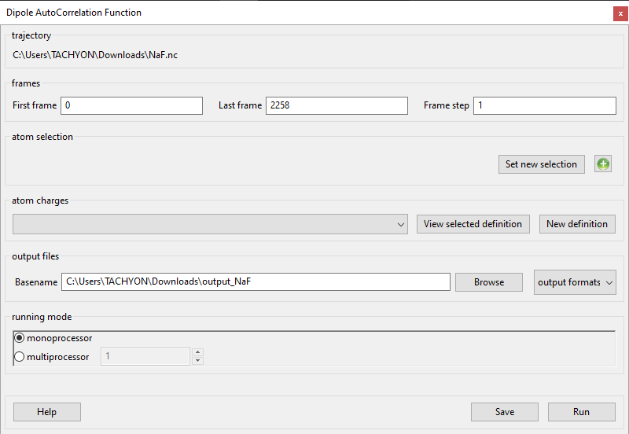

-  :ref:`param-frames`
-  :ref:`param-atom-selection`
-  :ref:`param-atom-charges`
-  :ref:`param-output-files`
-  :ref:`param-running-mode`

.. _analysis-macromolecules:

Macromolecules
^^^^^^^^^^^^^^

This section has one subsection, Lipids, which contains following
Plugins:

-  Refolded Membrane Trajectory

.. _analysis-rmt:

Refolded Membrane Trajectory
''''''''''''''''''''''''''''

-  available for trajectories only

.. image:: ./Pictures/100000010000032200000202AC02A063F408C4F9.png
   :width: 15.921cm
   :height: 10.204cm

-  :ref:`param-frames`
-  **membrane axis**

*Format:* drop-down

*Default:* c

*Description:* the axis along which is used for the trajectory
manipulation, the normal to the membrane.

-  **name of the lipid of the upper leaflet**

*Format:* str

*Default:* DMPC

*Description:* the name of the lipid positioned in the upper leaflet of
the membrane. It will be repositioned into the upper part of the
simulation box. The name must be the name with which MMTK refers to the
lipid.

-  **name of the lipid of the lower leaflet**

*Format:* str

*Default:* DMPC

*Description:* the name of the lipid positioned in the lower leaflet of
the membrane. It will be repositioned into the lower part of the
simulation box. The name must be the name with which MMTK refers to the
lipid.

-  :ref:`param-output-files`

Thermodynamics
^^^^^^^^^^^^^^

This section contains the following Plugins:

-  :ref:`analysis-density`
-  :ref:`analysis-temperature`

.. _analysis-density:

Density
'''''''

-  available for trajectories only

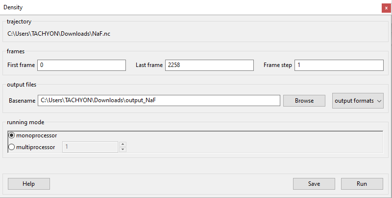

-  :ref:`param-frames`
-  :ref:`param-output-files`
-  :ref:`param-running-mode`

.. _analysis-temperature:

Temperature
'''''''''''

-  available for trajectories only

.. image:: ./Pictures/10000001000003220000017A08B3789C04716632.png
   :width: 15.921cm
   :height: 7.504cm

-  :ref:`param-frames`
-  :ref:`params-interpolation-order`
-  :ref:`param-output-files`
-  :ref:`param-running-mode`

Trajectory
^^^^^^^^^^

The Plugins within this section are listed below. They are used to
adjust the trajectory in some way.

-  :ref:`trajectory-btt`
-  :ref:`trajectory-comt`
-  :ref:`trajectory-ct`
-  :ref:`trajectory-gmft`
-  :ref:`trajectory-rbt`
-  :ref:`trajectory-ut`

.. _trajectory-btt:

Box Translated Trajectory
'''''''''''''''''''''''''

-  available for trajectories only

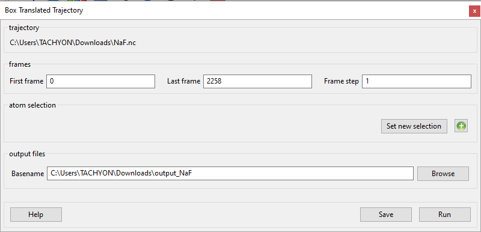

-  :ref:`param-frames`
-  :ref:`param-atom-selection`
-  :ref:`param-output-files`
-  :ref:`param-running-mode`

.. _trajectory-comt:

Center Of Masses Trajectory
'''''''''''''''''''''''''''

.. _theory-and-implementation-16:

Theory and implementation
                         

The Center Of Mass Trajectory (*COMT*) analysis consists in deriving the
trajectory of the respective centres of mass of a set of groups of
atoms. In order to produce a visualizable trajectory, *MDANSE* assigns
the centres of mass to pseudo-hydrogen atoms whose mass is equal to the
mass of their associated group. Thus, the produced trajectory can be
reused for other analysis. In that sense, *COMT* analysis is a practical
way to reduce noticeably the dimensionality of a system.

.. _gui-16:

GUI
   

-  available for trajectories only

.. image:: ./Pictures/1000000100000324000001CE931274740DA7326D.png
   :width: 15.921cm
   :height: 9.148cm

-  :ref:`param-frames`
-  :ref:`param-atom-selection`
-  :ref:`param-group-coordinates`
-  :ref:`param-output-files`
-  :ref:`param-running-mode`

.. _trajectory-ct:

Cropped Trajectory
''''''''''''''''''

-  available for trajectories only

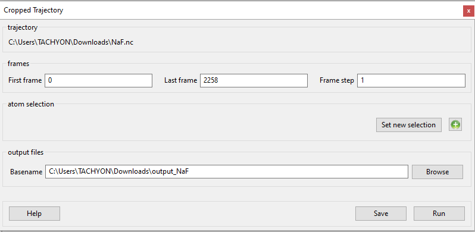

-  :ref:`param-frames`
-  :ref:`param-atom-selection`
-  :ref:`param-output-files`
-  :ref:`param-running-mode`

.. _trajectory-gmft:

Global Motion Filtered Trajectory
'''''''''''''''''''''''''''''''''

.. _theory-and-implementation-17:

Theory and implementation
                         

It is often of interest to separate global motion from internal motion,
both for quantitative analysis and for visualization by animated
display. Obviously, this can be done under the hypothesis that global
and internal motions are decoupled within the length and timescales of
the analysis. *MDANSE* can create Global Motion Filtered Trajectory
(*GMFT*) by filtering out global motions (made of the three
translational and rotational degrees of freedom), either on the whole
system or on a user-defined subset, by fitting it to a reference
structure (usually the first frame of the *MD*). Global motion filtering
uses a straightforward algorithm:

-  for the first frame, find the linear transformation such that the
   coordinate origin becomes the centre of mass of the system and its
   principal axes of inertia are parallel to the three coordinates axes
   (also called principal axes transformation),
-  this provides a reference configuration C\ :sub:`ref`,
-  for any other frames *f*, finds and applies the linear transformation
   that minimizes the RMS distance between frame *f* and C\ :sub:`ref`.

The result is stored in a new trajectory file that contains only
internal motions. This analysis can be useful in case where diffusive
motions are not of interest or simply not accessible to the experiment
(time resolution, powder analysis . . . ).

.. _gui-17:

GUI
   

-  available for trajectories only

.. image:: ./Pictures/1000000100000322000002196544DE20D17020BF.png
   :width: 15.921cm
   :height: 10.661cm

-  :ref:`param-frames`
-  :ref:`param-atom-selection`
-  **reference basis**

*Format:* drop-down

*Default:* None

*Description:* can be used exactly like
:ref:`param-axis-selection`

-  **Make the chemical object contiguous**

*Format:* bool

*Default:* False

*Description:* makes the configuration contiguous. This is done via MMTK
universe's contiguousObjectConfiguration() method.

-  :ref:`param-output-files`
-  :ref:`param-running-mode`

.. _trajectory-rbt:

Rigid Body Trajectory
'''''''''''''''''''''

.. _theory-and-implementation-18:

Theory and implementation
                         

To analyse the dynamics of complex molecular systems it is often
desirable to consider the overall motion of molecules or molecular
subunits. We will call this motion rigid-body motion in the following.
Rigid-body motions are fully determined by the dynamics of the centroid,
which may be the centre-of-mass, and the dynamics of the angular
coordinates describing the orientation of the rigid body. The angular
coordinates are the appropriate variables to compute angular correlation
functions of molecular systems in space and time. In most cases,
however, these variables are not directly available from *MD*
simulations since *MD* algorithms typically work in cartesian
coordinates. Molecules are either treated as flexible, or, if they are
treated as rigid, constraints are taken into account in the framework of
cartesian coordinates [Ref23]_. In *MDANSE*,
Rigid-Body Trajectory (*RBT*) can be defined from a *MD* trajectory by
fitting rigid reference structures, defining a (sub)molecule, to the
corresponding structure in each time frame of the trajectory. Here 'fit'
means the optimal superposition of the structures in a least-squares
sense. We will describe now how rigid body motions, i.e. global
translations and rotations of molecules or subunits of complex
molecules, can be extracted from a *MD* trajectory. A more detailed
presentation is given in [Ref24]_. We define
an optimal rigid-body trajectory in the following way: for each time
frame of the trajectory the atomic positions of a rigid reference
structure, defined by the three cartesian components of its centroid
(e.g. the centre of mass) and three angles, are as close as possible to
the atomic positions of the corresponding structure in the *MD*
configuration. Here 'as close as possible' means as close as possible in
a least-squares sense.

**Optimal superposition.** We consider a given time frame in which the
atomic positions of a (sub)molecule are given by

.. math::
   :label: pfx145
   
   {x_{\alpha},{\alpha = 1}\ldots N}

. The corresponding positions in the reference structure are denoted as

.. math::
   :label: pfx146
   
   {x_{\alpha}^{(0)},{\alpha = 1}\ldots N}

. For both the given structure and the reference structure we introduce
the yet undetermined centroids X and X\ :sup:`(0)`, respectively, and
define the deviation

.. math::
   :label: pfx147

   {\Delta_{\alpha}\doteq D(q){\left\lbrack {x_{\alpha}^{(0)} - X^{(0)}} \right\rbrack - \left\lbrack {x_{\alpha} - X} \right\rbrack}.}

Here **D(q)** is a rotation matrix which depends on also yet
undetermined angular coordinates which we chose to be *quaternion
parameters*, abbreviated as vector **q** = (q\ :sub:`0`, q\ :sub:`1`,
q\ :sub:`2`, q\ :sub:`3`). The quaternion parameters fulfil the
normalization condition

.. math::
   :label: pfx148
   
   {q \dot {q = 1}}

\ [Ref25]_. The target function to be
minimized is now defined as

.. math::
   :label: pfx149

   {m{\left( {q;X,X^{(0)}} \right) = {\sum\limits_{\alpha}{\omega_{\alpha}|\Delta|_{\alpha}^{2}}}}.}

where :math:`\omega_{\alpha}` are atomic weights (see Section ??). The minimization
with respect to the centroids is decoupled from the minimization with
respect to the quaternion parameters and yields

.. math::
   :label: pfx150

   {{X = {\sum\limits_{\alpha}\omega_{\alpha}}}x_{\alpha},}

.. math::
   :label: pfx151

   {{X^{(0)} = {\sum\limits_{\alpha}\omega_{\alpha}}}x_{\alpha}^{(0)}.}

We are now left with a minimization problem for the rotational part
which can be written as

.. math::
   :label: pfx152

   m{(q) = {\sum\limits_{\alpha}{\omega_{\alpha}\left\lbrack {{D(q)r}_{\alpha}^{(0)} - r_{\alpha}} \right\rbrack^{2}}}\overset{!}{=}\mathit{Min}}.

The relative position vectors

.. math::
   :label: pfx153

   {{r_{\alpha} = {x_{\alpha} - X}},}

.. math::
   :label: pfx154

   {r_{\alpha}^{(0)} = {x_{\alpha}^{(0)} - X^{(0)}}}

are fixed and the rotation matrix reads
[Ref25]_

.. math::
   :label: pfx155

   D(q) = \begin{matrix}
   {q_{0}^{2} + q_{1}^{2} - q_{2}^{2} - q_{3}^{2}} & {2\left( {{- q_{0}}{q_{3} + q_{1}}q_{2}} \right)} & {2\left( {q_{0}{q_{2} + q_{1}}q_{3}} \right)} \\
   {2\left( {q_{0}{q_{3} + q_{1}}q_{2}} \right)} & {q_{0}^{2} + q_{2}^{2} - q_{1}^{2} - q_{3}^{2}} & {2\left( {{- q_{0}}{q_{1} + q_{2}}q_{3}} \right)} \\
   {2\left( {{- q_{0}}{q_{2} + q_{1}}q_{3}} \right)} & {2\left( {q_{0}{q_{1} + q_{2}}q_{3}} \right)} & {q_{0}^{2} + q_{3}^{2} - q_{1}^{2} - q_{2}^{2}} \\
   \end{matrix}

**Quaternions and rotations.** The rotational minimization problem can
be elegantly solved by using quaternion algebra. Quaternions are
so-called hypercomplex numbers, having a real unit, 1, and three
imaginary units, **I**, **J**, and **K**. Since **IJ** = **K** (cyclic),
quaternion multiplication is not commutative. A possible matrix
representation of an arbitrary quaternion,

.. math::
   :label: pfx156

   {{A = a_{0}}\cdot{1 + a_{1}}\cdot{I + a_{2}}\cdot{J + a_{3}}\cdot K,}

reads

.. math::
   :label: pfx157

   A = \begin{matrix}
   a_{0} & {- a_{1}} & {- a_{2}} & {- a_{3}} \\
   a_{1} & a_{0} & {- a_{3}} & a_{2} \\
   a_{2} & a_{3} & a_{0} & {- a_{1}} \\
   a_{3} & {- a_{2}} & a_{1} & a_{0} \\
   \end{matrix}

The components :math:`a_{\upsilon}`
are real numbers. Similarly, as normal complex numbers allow one to
represent rotations in a plane, quaternions allow one to represent
rotations in space. Consider the quaternion representation of a vector
r, which is given by

.. math::
   :label: pfx158

   {{R = x}\cdot{I + y}\cdot{J + z}\cdot K,}

and perform the operation

.. math::
   :label: pfx159

   {{R^{'} = \mathit{QRQ}^{T}},}

where Q is a normalised quaternion

.. math::
   :label: pfx160

   {\text{|}Q\text{|}^{2}\doteq{{q_{0}^{2} + q_{1}^{2} + q_{2}^{2} + q_{3}^{2}} = \frac{1}{4}}\mathit{tr}\text{\textbackslash\{}Q^{T}Q{\text{\textbackslash\}} = 1.}}

The symbol *tr* stands for 'trace'. We note that a normalized quaternion
is represented by an *orthogonal* 4 x 4 matrix. **R'** may then be
written as

.. math::
   :label: pfx161

   {{R^{'} = x^{'}}\cdot{I + y^{'}}\cdot{J + z^{'}}\cdot K,}

where the components x', y', z', abbreviated as r', are given by

.. math::
   :label: pfx162

   {{r^{'} = D}(q)r.}

The matrix **D**\ (**q**) is the rotation matrix defined in
`95`.

**Solution of the minimization problem**. In quaternion algebra, the
rotational minimization problem may now be phrased as follows:

.. math::
   :label: pfx163

   {m{(q) = {{\sum\limits_{\alpha}{{\omega_{\alpha}\text{|}\mathit{QR}}_{\alpha}^{(0)}Q}^{T}} - R_{\alpha}}}{\text{|}^{2}\overset{!}{=}\mathit{Min}}.}

Since the matrix Q representing a normalized quaternion is orthogonal
this may also be written as

.. math::
   :label: pfx164

   {{{m{(q) = {\sum\limits_{\alpha}\omega_{\alpha}}}\text{|}\mathit{QR}}_{\alpha}^{(0)} - R_{\alpha}}Q\text{|}^{2}{.\overset{!}{=}\mathit{Min}}.}

This follows from the simple fact that

.. math::
   :label: pfx165
   
   {\text{|}A{\text{|} = \text{|}}\mathit{AQ}\text{|}}

, if Q is normalized. Eq. `104` shows that the
target function to be minimized can be written as a simple quadratic
form in the quaternion parameters [Ref24]_,

.. math::
   :label: pfx166

   {m{(q) = q}\cdot\mathit{Mq},}

.. math::
   :label: pfx167

   {{M = {\sum\limits_{\alpha}{\omega_{\alpha}M_{\alpha}}}}.}

The matrices M\_ are positive semi-definite matrices depending on the
positions :math:`r_{\alpha}` and :math:`r_{\alpha}^{(0)}`:

|image32|\ 

The rotational fit is now reduced to the problem of finding the minimum
of a quadratic form with the constraint that the quaternion to be
determined must be normalized. Using the method of Lagrange multipliers
to account for the normalization constraint we have

.. math::
   :label: pfx169

   {m^{'}{\left( {q,\lambda} \right) = q}\cdot{\mathit{Mq} - \lambda}{\left( {q\cdot{q - 1}} \right)\overset{!}{=}\mathit{Min}}.}

This leads immediately to the eigenvalue problem

.. math::
   :label: pfx170

   {{\mathit{Mq} = \lambda}q,}

.. math::
   :label: pfx171

   {q\cdot{q = 1.}}

Now any normalized eigenvector **q** fulfils the relation

.. math::
   :label: pfx172
   
   {{\lambda = q}\cdot\mathit{Mq}\equiv m(q)}

. Therefore, the eigenvector belonging to the smallest eigenvalue,
λ\ :sub:`min`, is the desired solution. At the same time λ\ :sub:`min`
gives the average error per atom. The result of *RBT* analysis is stored
in a new trajectory file that contains only *RBT* motions.

.. _gui-18:

GUI
   

-  available for trajectories only

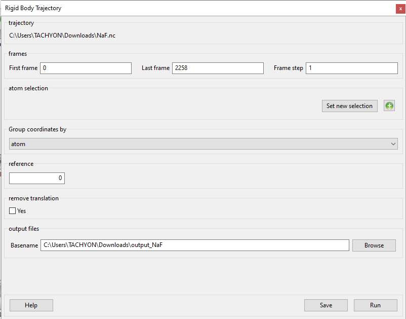

-  :ref:`param-frames`
-  :ref:`param-atom-selection`
-  :ref:`param-group-coordinates`
-  **reference**

*Format:* int

*Default:* 0

*Description:* the number of the frame that is used as reference.

-  **remove translation**

*Format:* bool

*Default:* False

*Description:* <insert>

-  :ref:`param-output-files`
-  :ref:`param-running-mode`

.. _trajectory-ut:

Unfolded Trajectory
'''''''''''''''''''

-  available for trajectories only

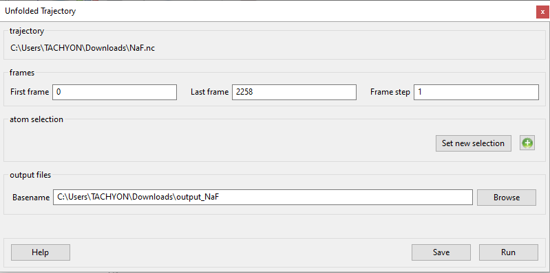

-  :ref:`param-frames`
-  :ref:`param-atom-selection`
-  :ref:`param-output-files`
-  :ref:`param-running-mode`

.. _analysis-virtual-instruments:

Virtual Instruments
^^^^^^^^^^^^^^^^^^^

McStas Virtual Instrument
'''''''''''''''''''''''''

-  available for trajectories only

|image33| |image34|

-  :ref:`param-frames`
-  **MDANSE Coherent Structure Factor**

*Format:* str

*Default:* ..\\..\\..\\Data\\NetCDF\\dcsf_prot.nc

*Description:* the path to a calculated Coherent Structure Factor. The
file must be in MMTK NetCDF file and should have been generated with
MDANSE's Dynamic Coherent Structure Factor analysis <link>.

-  **MDANSE Incoherent Structure Factor**

*Format:* str

*Default:* ..\\..\\..\\Data\\NetCDF\\disf_prot.nc

*Description:* the path to a calculated Incoherent Structure Factor. The
file must be in MMTK NetCDF file and should have been generated with
MDANSE's Dynamic Incoherent Structure Factor analysis <link>.

-  **temperature**

*Format:* strictly positive float

*Default:* 298.0

*Description:* the temperature in Kelvin at which the MD simulation was
performed.

-  **trace the 3D view of the simulation**

*Format:* bool

*Default:* False

*Description:* <insert>

-  **mcstas instrument**

*Format:* drop-down

*Default:* None

*Description:* <insert>

-  mcstas options

   -  **ncount**

*Format:* int

*Default:* 10000

*Description:* <insert>

-  

   -  **dir**

*Format:* str

*Default:* None

*Description:* <insert>

-  mcstas parameters - these options become visible once a McStas
   instrument has been chosen.
-  :ref:`param-output-files`
-  :ref:`param-running-mode`

.. _analysis-misc:

Miscellaneous
^^^^^^^^^^^^^

This section normally contains only one Plugin, which is present for
both trajectories and analysis results. However, some other Plugins
appear under certain circumstances.

.. _analysis-info:

Data info
^^^^^^^^^

-  available for trajectories and analysis results

This plugin opens a window containing an overview of the data stored in
the selected NetCDF file. For trajectory files, it might look like the
picture below, while it may not be able to read any data from an
analysis result. Generally, the following information should be included
for a trajectory:

-  Location of the trajectory on disk
-  Number of time steps
-  Universe (the MMTK object)
-  Direct cell at the beginning
-  Reciprocal cell at the beginning
-  List of molecules
-  List of variables contained in the trajectory

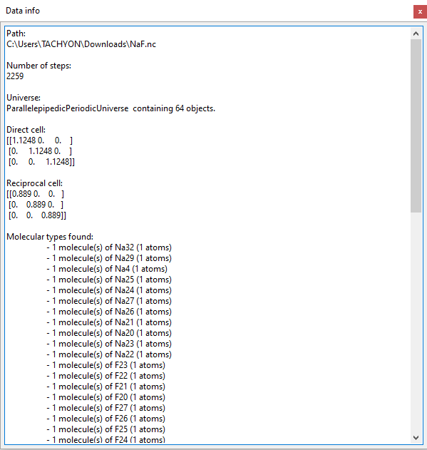

.. _analysis-animation:

Animation
^^^^^^^^^

-  available for trajectories only
-  appears only when :ref:`molecular-viewer` is active

Once double-clicked, it creates a new bar below Molecular Viewer that
allows you to watch the whole MD simulation.

.. image:: ./Pictures/10000001000004540000004B8ED7C35C8B494D1E.png
   :width: 15.921cm
   :height: 1.078cm

-  **Skip to the beginning** button (leftmost) sets the frame number (15
   in the picture above) to 0.
-  **Play** button starts the simulation at the speed determined by the
   rightmost box (95 in the picture above)
-  **Skip to the end** button (right of Play) sets the frame number to
   the last frame in the trajectory.
-  The left sliding bar allows you to select any of the frames in the
   trajectory. It displays the frame number by altering the Frame number
   box to the left of itself.
-  **Frame number** box allows you to view a frame by typing in its
   index. Press enter to view the frame.
-  The right sliding bar allows you to alter the speed at which the
   simulation is shown. It also shows the speed in the box to the left
   of itself.
-  **Speed** determines how fast the simulation is displayed. The higher
   the number, the faster the playback.

.. _analysis-den-sup:

Density Superposition
^^^^^^^^^^^^^^^^^^^^^

-  available for trajectories only
-  appears only when :ref:`molecular-viewer` is active
   and you have left-clicked anywhere inside it

Double-clicking this opens the following window:

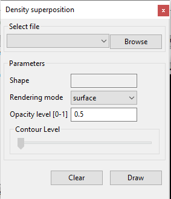

-  **Select file**

*Format:* drop-down

*Default:* None

*Description:* first, a file has to be found using the **Browse**
button, and then it can be found in the drop-down menu. This file has to
be the result of `Molecular Trace <#_Molecular_Trace>`__ analysis.

-  **Shape**

*Format:* str

*Default:* loaded from file

*Description:* cannot be edited.

-  **Rendering mode**

*Format:* drop-down

*Default:* surface

*Description:* determines the way in which the Density Superposition is
displayed.

-  **Opacity level**

*Format:* float between 0 and 1

*Default:* 0.5

*Description:* the opacity/transparency of the Density Superposition.

-  **Contour Level**

*Format:* sliding bar

*Default:* 0

*Description:* determines the level of detail?<insert>

-  **Clear** button removes the Density Superposition from :ref:`molecular-viewer`.
-  **Draw** button adds Density Superposition on top of :ref:`molecular-viewer`.

.. _trajectory-viewer:

Trajectory Viewer
^^^^^^^^^^^^^^^^^

-  Available for trajectories only
-  appears only when :ref:`molecular-viewer` is active

This plugin was designed to help visualise the variables contained in a
trajectory. It can only plot the 3D trajectory variables, and nothing
else. It does this by separating the chosen 3D variable into its
constituent 1D parts and plotting those. This way, the x, y, or z
component of a chosen variable can be plotted for one atom against time.
Once it is double-clicked, the following window opens:

.. image:: ./Pictures/100000010000025700000213FCFF259FE25DE0B6.png
   :width: 9.566cm
   :height: 8.453cm

The plotting is controlled through the panel at the top, which is unique
to the Trajectory Viewer. The plot is visualised immediately after all
three fields are filled. It consists of these parameters:

-  **Trajectory**

*Format*: drop-down

*Default*: None

*Description*: the variable that will be plotted. All 3D variables
present in the trajectory are available for plotting, meaning that
configuration (i.e., positions) can always be plotted, and velocities
and gradients if they are present.

-  **Atom**

*Format:* positive int

*Default:* 0

*Description*: The atom for which the chosen variable will be plotted.
The number represents the index of the atom in the trajectory. The
arrows next to this box can be used to navigate the atoms one by one. If
a number larger than the number of atoms is inputted, the last atom will
instead be selected.

-  **Dimension**

*Format:* drop-down

*Default:* None

*Description:* the spatial component of the selected variable which will
be plotted. For example, the change in position of a specific atom along
the x-axis over time can be plotted. The x, y, and z components of the
'variable' vectors are available for plotting.

The menu at the bottom of the plotter is identical to the one used in
`Line Plotter <#_Toolbar_1>`__, and so the description of its function
can be found there. However, there is some difference in that; at the
very bottom of the Trajectory Viewer window are three options which work
differently here:

-  **Clear** button removes all the lines from the plot.
-  **Plot on same figure**

*Format:* Bool

*Default:* False

*Description:* controls the number of lines that can be plotted
simultaneously.

When it's unticked (i.e., False) only one line can be plotted at a time.
Therefore, when a line is already plotted and any change is made in the
topmost toolbar, the current line is replaced by the new selection.

When it's ticked (i.e., True), any number of lines can be plotted.
Therefore, when a line is already plotted and any change is made in the
topmost toolbar, a new line is added.

-  **Show legend**

*Format:* Bool

*Default:* False

*Description:* Toggles the legend. When False, the legend is hidden.
When True, the legend appears in the location matplotlib determines as
'best'.

My jobs
^^^^^^^

This section only appears if you have used the `Save analysis
template <#save_analysis_template>`__ button in the main window's
toolbar. It contains all the analyses created this way and allows them
to be run.

Plotter
^^^^^^^

.. _d3d-plotter-1:

2D/3D Plotter
'''''''''''''

-  available for analysis results only

Launches the 2D/3D Plotter inside the current tab of the working panel,
like below. For more information, please see :ref:`2d3dplotter`.

.. image:: ./Pictures/1000000100000456000001F7F9358DAEDACCE259.png
   :width: 15.921cm
   :height: 7.214cm

User definition
^^^^^^^^^^^^^^^

This section contains all the
definitions/`selections <#_Creating_selections>`__ that have been made
for the selected NetCDF file, serving similar purpose to `User
definition editor <#user_definitions_editor>`__.

Viewer
^^^^^^

.. _molecular-viewer:

Molecular Viewer
''''''''''''''''

-  available for trajectories only

Double-clicking on this option opens the Molecular Viewer plugin inside
the current tab of the `Working panel <#_Working_panel>`__. This shows a
simulated 3D view of the first frame of the trajectory. The Viewer can
be interacted with by dragging the simulation and zooming in/out. It can
be closed using the x button in the top right corner:

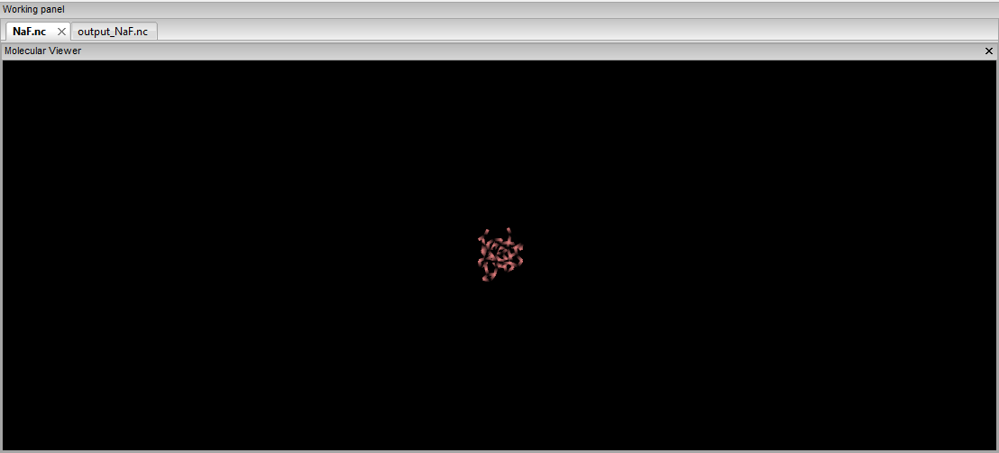

Clicking on an atom highlights it and prints out some basic information
about it in the Logger<link>. More options are available by
right-clicking anywhere inside the Molecular Viewer, which brings up the
following menu:

.. image:: ./Pictures/10000001000000E30000009A5B85D15F6882D700.png
   :width: 6.008cm
   :height: 4.075cm

-  **Rendering** brings up a menu of rendering options when hovered over
   or clicked. These change the way the system is displayed and should
   both self-explanatory and familiar from other molecular visualisation
   software.
-  **Show/hide selection box** creates a box around the whole system.
   This disables your ability to move and rotate the system, but instead
   you can move the faces of the box by dragging the large balls.
   Everything inside the box is highlighted and considered selected.

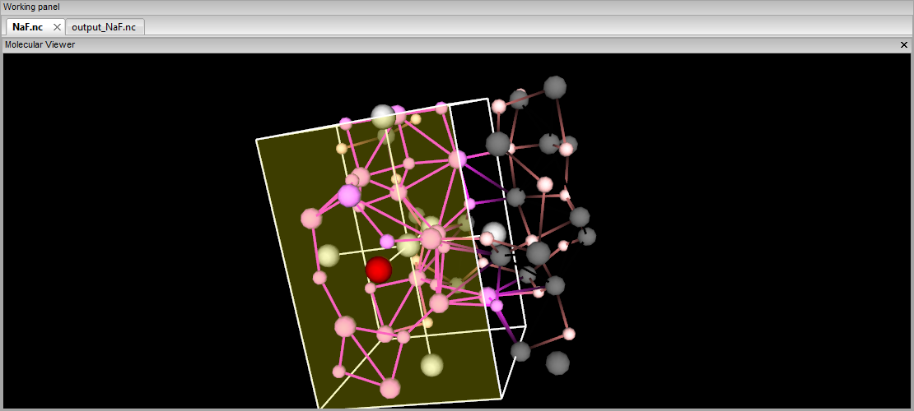

-  **Save selection** opens a window prompting you to enter a selection
   name. Once that is done and OK is pressed, the selection will be
   saved for the current trajectory using the atoms that have been
   selected by either clicking on them or with the selection box above.
-  **Clear selection** unselects all the selected atoms. It does not
   hide the selection box, so interacting with it will once again select
   all the atoms inside it.
-  **Parallel projection** toggles on/off trimetric parallel projection
   of the camera. According to Wikipedia
   [Ref26]_, this means that three axes of
   space should appear unequally foreshortened. The scale along each of
   the three axes and the angles among them are determined separately as
   dictated by the angle of viewing.
-  **Show/hide bounding box** shows/hides the simulation box within
   which the system is bound.

Jobs
^^^^

When an analysis is started by clicking on the Run button, it appears as
a job in this panel, like so:

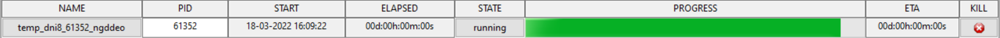

1. **NAME** field shows the unique name MDANSE assigned to the job. It
   is also a button which shows the options that were selected for the
   analysis:

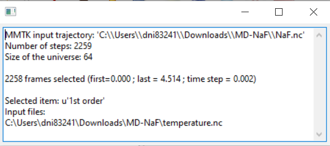

1. **PID** field shows the process ID assigned by the operating system
   to the job process.
2. **START** field shows the exact date and time when this job was
   started.
3. **ELAPSED** field shows the time elapsed since the start of the job.
4. **STATE** field shows the state of the job. This can be 'running',
   indicating that MDANSE is in the process of performing the job,
   'finished', indicating that the job was completed successfully, and
   'aborted', indicating that the job failed due to an error. This field
   is also a button which shows the traceback to the error that caused
   the failure when clicked. This should provide all the information to
   either correct your mistake or to inform us of a bug. When `reporting
   a bug <#_Toolbar>`__, please copy the entire traceback from here.

.. image:: ./Pictures/100000010000077E00000029ED03FC61583BB04B.png
   :width: 15.921cm
   :height: 0.34cm

1. **PROGRESS** field approximately shows the progress of the job. This
   is not perfect, so it is not unusual if it appears to get stuck for a
   long time, especially with large files. When that happens, it is
   likely that MDANSE is performing a large and computationally
   intensive stage. MDANSE performs jobs in four stages: initialisation,
   run, combination, and finalisation. Of these, only the run stage is
   composed of many steps, after each of which the progress bar is
   updated. Of the other stages, any can be very computationally
   intensive yet for them the bar is updated only at the beginning and
   end of the stage.
2. **ETA** field shows the estimated time until the completion of the
   job. Similar to the progress field, this is not entirely accurate,
   but it is a good rough estimate.
3. **KILL** field contains a button that allows for the cancellation of
   the job. This causes the job to be removed from this Jobs panel,
   making space, visually, for more job. If the job was running when it
   was killed, it will be stopped and no output file will be created.
   First though, the button will make a notification prompt to appear,
   asking if you are sure you want to kill the job.

.. image:: ./Pictures/100000010000025C000000B1ACE43AF975D440AC.png
   :width: 7.666cm
   :height: 2.245cm

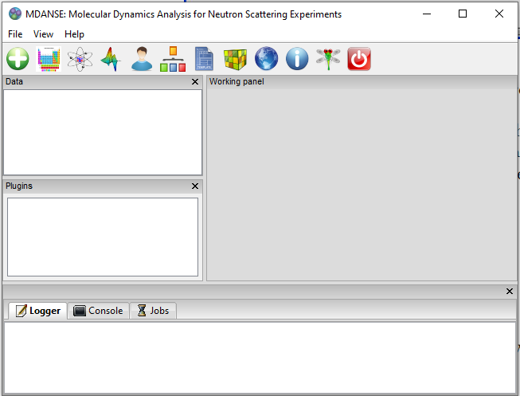
.. |image2| image:: ./Pictures/100000010000028D000001F583E3D2D6B25FED29.png
   :width: 7.131cm
   :height: 5.452cm

.. |image4| image:: ./Pictures/100000010000028C000001F092B9EB9B1E48AB9D.png
   :width: 7.193cm
   :height: 5.466cm

.. |image6| image:: ./Pictures/100000010000028C000001F40D7333B09A10BBF0.png
   :width: 7.131cm
   :height: 5.445cm
.. |image7| image:: ./Pictures/100000010000025E000001C3AC39A36717DC7EE3.png
   :width: 6.959cm
   :height: 5.156cm
.. |image8| image:: ./Pictures/100000010000025D000001C0F8379C92EEE1C895.png
   :width: 7.011cm
   :height: 5.191cm
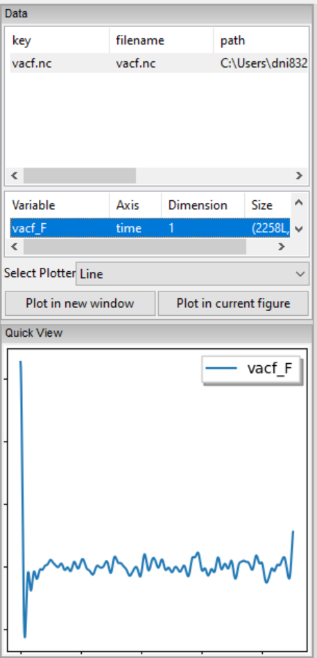
.. |image10| image:: ./Pictures/10000001000002A10000027D14B28490295A59FA.png
   :width: 7.728cm
   :height: 7.313cm
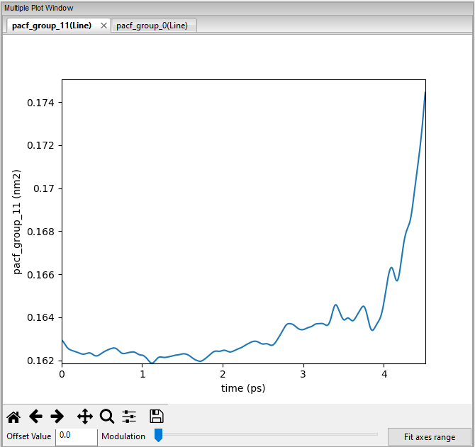

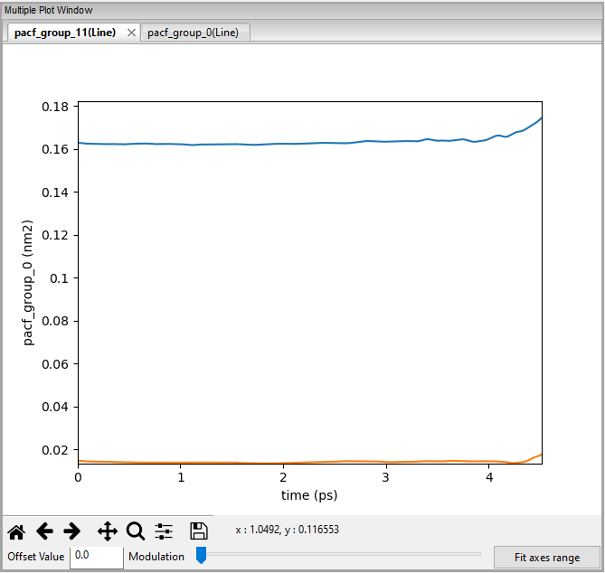
.. |image14| image:: ./Pictures/1000000100000323000002D1329469D922AFA541.png
   :width: 15.921cm
   :height: 14.295cm
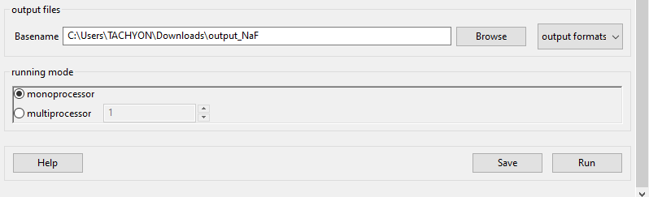
.. |image16| image:: ./Pictures/100000010000031F00000248D8781028790CCDA5.png
   :width: 15.921cm
   :height: 11.636cm
.. |image17| image:: ./Pictures/100000010000031E00000105F69265329BBA5756.png
   :width: 15.921cm
   :height: 5.207cm
.. |image18| image:: ./Pictures/100000010000031F00000247259172131CFA3B36.png
   :width: 15.921cm
   :height: 11.617cm
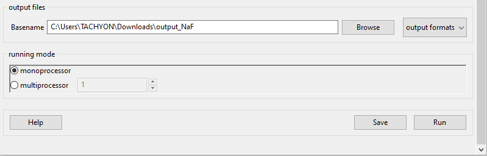
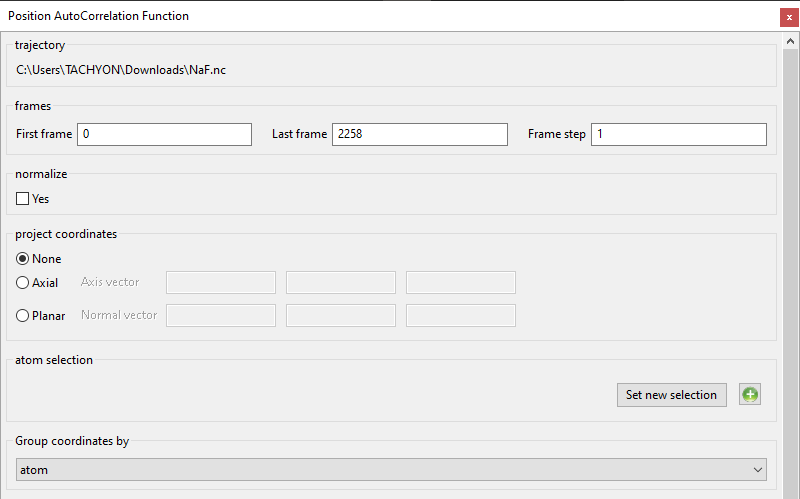
.. |image21| image:: ./Pictures/1000000100000322000001997BE6CF552F7A05D0.png
   :width: 15.921cm
   :height: 8.119cm
.. |image22| image:: ./Pictures/100000010000031F000001F4716D097EF0177F0B.png
   :width: 15.921cm
   :height: 9.964cm
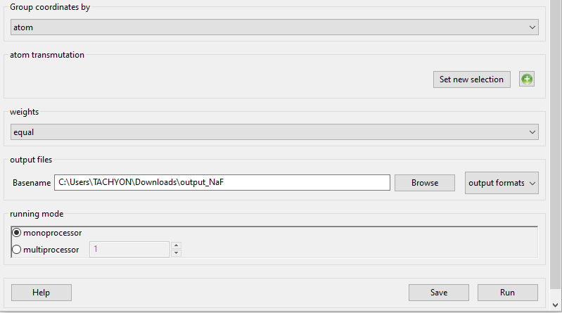

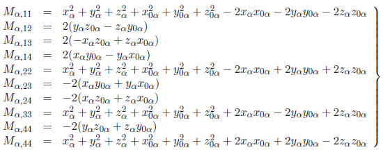
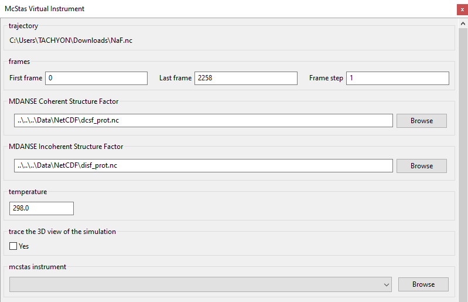
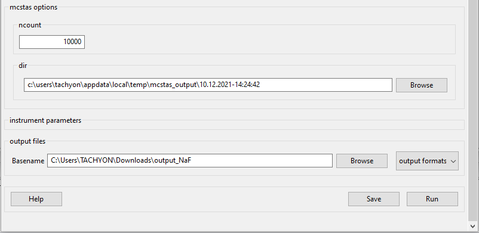
.. |image35| image:: ./Pictures/10000001000004E6000002A73EEAE87D5C660F5C.png
   :width: 7.655cm
   :height: 4.159cm
.. |image36| image:: ./Pictures/10000001000004E4000002A94202A3BFD79098BA.png
   :width: 7.465cm
   :height: 4.096cm
.. |image37| image:: ./Pictures/1000000100000478000002C6F32754BFA135B144.png
   :width: 6.854cm
   :height: 4.255cm
.. |image38| image:: ./Pictures/1000000100000483000002D2D853AC6BB7CFEA02.png
   :width: 6.791cm
   :height: 4.246cm
.. |image39| image:: ./Pictures/10000001000003C2000003347082A5808C577BC7.png
   :width: 4.815cm
   :height: 4.105cm
.. |image40| image:: ./Pictures/10000001000003C10000032F3AEF65741592C169.png
   :width: 4.904cm
   :height: 4.157cm
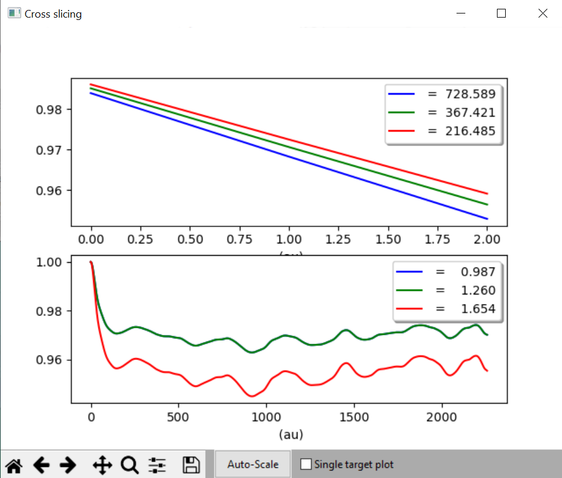
.. |image42| image:: ./Pictures/10000001000003C200000330E638C73D8C1D67D9.png
   :width: 5.239cm
   :height: 4.443cm
.. |image43| image:: ./Pictures/100000010000072F000003336ED265D0B6E3D58A.png
   :width: 9.844cm
   :height: 4.383cm
