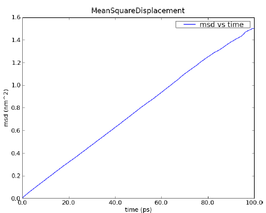

This section is dealing with specific types of analysis performed by
MDANSE. If you are not sure where these fit into the general workflow
of data analysis, please read :ref:`workflow-of-analysis`.

Analysis Theory: Dynamics
=========================

This section contains the following plugins:

-  :ref:`analysis-angular-correlation`
-  :ref:`analysis-dos`
-  :ref:`analysis-msd`
-  :ref:`analysis-op`
-  :ref:`analysis-pacf`
-  :ref:`analysis-vacf`

.. _analysis-angular-correlation:

Angular Correlation
'''''''''''''''''''
The angular correlation analysis computes the autocorrelation of a set
of vectors describing the extent of a molecule in three orthogonal
directions. This kind of analysis can be useful when trying to highlight
the fact that a molecule is constrained in a given direction.

For a given triplet of non-colinear atoms :math:`g=(a_1,a_2,a_3)`, one can
derive an orthonormal set of three vectors :math:`v_1`, :math:`v_2`, :math:`v_3` using the
following scheme:

-  :math:`v_{1} = (n_{1} + n_{2}) / \left| {n_{1} + n_{2}} \right|`
   where :math:`n_1` and :math:`n_2` are respectively the
   normalized vectors along (:math:`a_1`, :math:`a_2`) and (:math:`a_1`, :math:`a_3`) directions.
-  :math:`v_2` is defined as the clockwise normal vector orthogonal to :math:`v_1` that
   belongs to the plane defined by :math:`a_1`, :math:`a_2` and :math:`a_3` atoms
-  :math:`{\overrightarrow{v_{3}} = \overrightarrow{v_{1}}}\times\overrightarrow{v_{2}}`

Thus, one can define the following autocorrelation functions for the
vectors :math:`v_1`, :math:`v_2` and :math:`v_3` defined on triplet :math:`i`:

.. math::
   :label: pfx3

   {\mathrm{AC}_{g,i}{(t) = \left\langle {v_{g,i}(0)\cdot v_{g,i}(t)} \right\rangle} \qquad {i = 1,2,3}}

and the angular correlation averaged over all triplets is:

.. math::
   :label: pfx4

   {\mathrm{AC}_{i}{(t) = {\sum\limits_{g = 1}^{N_{\mathrm{triplets}}}{\mathrm{AC}_{g,i}(t)}}} \qquad {i = 1,2,3}}

where :math:`N_{\mathrm{triplets}}` is the number of selected triplets.

.. _analysis-dos:

Density Of States
'''''''''''''''''

.. _theory-and-implementation-1:

*MDANSE* calculates the power spectrum of the *VACF*, which in case of
the mass-weighted *VACF* defines the phonon discrete *DOS*, (see the
section on :ref:`analysis-vacf`) defined as:

.. math::
   :label: pfx5

   {\mathrm{DOS}\left( {n\cdot\mathit{\Delta\nu}} \right)\doteq{\sum\limits_{\alpha}\omega_{\alpha}}{\overset{\sim}{C}}_{\mathit{vv};\mathit{\alpha\alpha}}\left( {n\cdot\mathit{\Delta\nu}} \right) \qquad {n = 0}, \ldots, {N_{t} - 1.}}

where :math:`N_{t}` is the total number of time steps of the correlation function,
:math:`{\mathit{\Delta\nu} = 1}\text{/}\left( {2N_{t}\Delta t} \right)`
is the frequency step, :math:`{\overset{\sim}{C}}_{\mathit{vv};\mathit{\alpha\alpha}}\left( {n\cdot\mathit{\Delta\nu}} \right)`
is the Fourier transform of the velocity autocorrelation function and
:math:`\omega_{\alpha}` is the weighting factor used for atom :math:`\alpha`.
:math:`{\mathrm{DOS}\left( {n\cdot\mathit{\Delta\nu}} \right)}`
can be computed either for the isotropic case or with respect to a
user-defined axis. The spectrum
:math:`{\mathrm{DOS}\left( {n\cdot\Delta\nu} \right)}`
is computed from the *unnormalized VACF*, such that :math:`\mathrm{DOS}(0)` gives an
approximate value for the diffusion constant
:math:`D = {\sum\limits_{\alpha}D_{\alpha}}`
(see Eqs. :math:numref:`pfx20` and :math:numref:`pfx21`).

:math:`{\mathrm{DOS}\left( {n\cdot\Delta\nu} \right)}`
can be smoothed by, for example, a Gaussian window applied in the time domain
[Ref10]_ (see the section :ref:`appendix-fca`). Its width in the time domain
is :math:`{\sigma_{t} = \alpha}\text{/}T`
, where :math:`T` is the length of the correlation function. We remark that the diffusion
constant obtained from *DOS* is biased due to the spectral smoothing
procedure since the *VACF* is weighted by this window Gaussian function.
*MDANSE* computes the density of states starting from atomic
velocities. In the case that velocities are not available, the velocities will be
computed by numerical differentiation of the coordinate trajectories
correcting first for possible jumps due to periodic boundary conditions.

.. _analysis-msd:

Mean Square Displacement
''''''''''''''''''''''''

.. _theory-and-implementation-2:

.. _figure-one:

   *MSD* calculated for a 100 ps MD simulation of 256 water
   molecules using NPT condition at 1 bar and 300 K.

Molecules in liquids and gases do not stay in the same place but move
constantly. This process is called diffusion and it happens quite
naturally in fluids at equilibrium. During this process, the motion of
an individual molecule does not follow a simple path. As it travels, the
molecule undergoes some collisions with other molecules which prevent it
from following a straight line. If the path is examined in close detail,
it will be seen to be a good approximation to a random walk.
Mathematically, a random walk is a series of steps where each step is
taken in a completely random direction from the one before. This kind of
path was famously analysed by Albert Einstein in a study of Brownian
motion. He showed that the Mean-Square Displacement (*MSD*) of a
particle following a random walk is proportional to the time elapsed.
The :numref:`figure-one` shows an example of an *MSD* analysis
performed on a water box of 768 water molecules. To get the diffusion
coefficient out of this plot, the slope of the linear part of the plot
should be calculated.

By defining

.. math::
   :label: pfx13

   {d_{\alpha}\left( {t,t_{0}} \right)\doteq R_{\alpha}{\left( {t_{0} + t} \right) - R_{\alpha}}\left( t_{0} \right),}

the *MSD* of particle :math:`\alpha` can be written as:

.. math::
   :label: pfx14

   \mathrm{\Delta}_{\alpha}^{2}{(t) = \left\langle {d_{\alpha}^{2}\left( {t,t_{0}} \right)} \right\rangle_{t_{0}}}

where :math:`R_{\alpha}(t_0)` and :math:`R_{\alpha}(t_0 + t)` are
respectively the position of particle :math:`\alpha`
at times :math:`t_0` and :math:`t_0 + t`. One can introduce an *MSD* with respect to a given axis n:

.. math::
   :label: pfx15

   {\mathrm{\Delta}_{\alpha}^{2}\left( {t,t_{0};n} \right)\doteq\left\langle {d_{\alpha}^{2}\left( {t,t_{0};n} \right)} \right\rangle_{t_{0}}}

with

.. math::
   :label: pfx16

   {d_{\alpha}^{}\left( {t,t_{0};n} \right)\doteq n\cdot d_{\alpha}^{}\left( {t,t_{0}} \right).}

The calculation of *MSD* is the standard way to obtain diffusion
coefficients from Molecular Dynamics (*MD*) simulations. Assuming
Einstein-diffusion in the long time limit one has for isotropic systems

.. math::
   :label: pfx17

   {D_{\alpha} = {\lim\limits_{t\rightarrow\infty}{\frac{1}{6t}\mathrm{\Delta}_{\alpha}^{2}(t)}}}.

There exists also a well-known relation between the *MSD* and the
velocity autocorrelation function. Writing

.. math::
   :label: pfx18
   
   {d_{\alpha}{(t) = {\int\limits_{0}^{t}{\mathit{d\tau}v_{\alpha}(\tau)}}}}

in Eq. :math:numref:`pfx14` one can show (see
e.g. [Ref11]_) that

.. math::
   :label: pfx19

   {\mathrm{\Delta}_{\alpha}^{2}{(t) = 6}{\int\limits_{0}^{t}{\mathit{d\tau}\left( {t - \tau} \right)C_{\mathit{\upsilon\upsilon};\mathit{\alpha\alpha}}(t)}}.}

where :math:`C_{\mathit{\upsilon\upsilon};\mathit{\alpha\alpha}}(t)` is the velocity autocorrelation function. Using now the definition :math:numref:`pfx17` of the diffusion
coefficient one obtains the relation

.. math::
   :label: pfx20

   {{D_{\alpha} = {\int\limits_{0}^{t}{\mathit{d\tau}C_{\mathit{\upsilon\upsilon};\mathit{\alpha\alpha}}(t)}}}.}

and can also be written as

.. math::
   :label: pfx21

   {{D_{\alpha} = \pi}{\overset{\sim}{C}}_{\mathit{\upsilon\upsilon};\mathit{\alpha\alpha}}(0).}

Computationally, the *MSD* is calculated by calculating the position autocorrelation since
from Eq. :math:numref:`pfx13` and :math:numref:`pfx14`

.. math::
   :label: pfx22

   \mathrm{\Delta}_{\alpha}^{2}{(t) = \left\langle [R_{\alpha}{\left( {t_{0} + t} \right) - R_{\alpha}}\left( t_{0} \right)]^2 \right\rangle_{t_{0}}}

and therefore

.. math::
   :label: pfx23

   \mathrm{\Delta}_{\alpha}^{2}(t) = \left\langle R_{\alpha}^{2}\left( {t_{0} + t} \right) \right\rangle_{t_{0}} + \left\langle R_{\alpha}^{2}\left( {t_{0}} \right) \right\rangle_{t_{0}} - 2\left\langle R_{\alpha}\left( {t_{0}} + t \right)R_{\alpha}\left( {t_{0}} \right) \right\rangle_{t_{0}}

where the last part on the right side Eq. :math:numref:`pfx23` is the position autocorrelation of the atom :math:`\alpha`.

.. _analysis-op:

Order Parameter
'''''''''''''''

.. _theory-and-implementation-3:
                         

Adequate and accurate cross comparison of the NMR and *MD* simulation
data is of crucial importance in versatile studies conformational
dynamics of proteins. NMR relaxation spectroscopy has proven to be a
unique approach for a site-specific investigation of both global
tumbling and internal motions of proteins. The molecular motions
modulate the magnetic interactions between the nuclear spins and lead
for each nuclear spin to a relaxation behaviour which reflects its
environment. Since its first applications to the study of protein
dynamics, a wide variety of experiments has been proposed to investigate
backbone as well as side chain dynamics. Among them, the heteronuclear
relaxation measurement of amide backbone :sup:`15`\ N nuclei is one of
the most widespread techniques. The relationship between microscopic
motions and measured spin relaxation rates is given by Redfield's theory
[Ref13]_. Under the hypothesis that
:sup:`15`\ N relaxation occurs through dipole-dipole interactions with
the directly bonded :sup:`1`\ H atom and chemical shift anisotropy
(CSA), and assuming that the tensor describing the CSA is axially
symmetric with its axis parallel to the N-H bond, the relaxation rates
of the :sup:`15`\ N nuclei are determined by a time correlation
function,

.. math::
   :label: pfx34

   {C_{\mathit{ii}}{(t) = \left\langle {P_{2}\left( {\mu_{i}(0)\cdot\mu_{i}(t)} \right)} \right\rangle}}

which describes the dynamics of a unit vector :math:`\mu_{i}(t)` pointing
along the :sup:`15`\ N-:sup:`1`\ H bond of the residue :math:`i` in the
laboratory frame. Here :math:`P_{2}(x)` is the second order Legendre
polynomial. The Redfield theory shows that relaxation measurements probe
the relaxation dynamics of a selected nuclear spin only at a few
frequencies. Moreover, only a limited number of independent observables
are accessible. Hence, to relate relaxation data to protein dynamics one
has to postulate either a dynamical model for molecular motions or a
functional form for :math:`C_{ii}(t)`, yet depending on a limited number
of adjustable parameters. Usually, the tumbling motion of proteins in
solution is assumed isotropic and uncorrelated with the internal
motions, such that:

.. math::
   :label: pfx35

   {C_{\mathit{ii}}{(t) = C^{G}}(t)\cdot C_{\mathit{ii}}^{I}(t)}

where :math:`C^{G}(t)` and :math:`C_{\mathit{ii}}^{I}(t)` denote the
global and the internal time correlation function,
respectively. Within the so-called model free approach
[Ref14]_, [Ref15]_
the internal correlation function is modelled by an exponential,

.. math::
   :label: pfx37

   {C_{\mathit{ii}}^{I}{(t) = {S_{i}^{2} + \left( {1 - S_{i}^{2}} \right)}}\exp\left( \frac{- t}{\tau_{\mathrm{eff},i}} \right)}

Here the asymptotic value

.. math::
   :label: pfx38
   
   {S_{i}^{2} = C_{\mathit{ii}}}\left( {+ \infty} \right)

\ is the so-called generalized order parameter, which indicates the
degree of spatial restriction of the internal motions of a bond vector,
while the characteristic time :math:`\tau_{\mathrm{eff},i}` is an
effective correlation time, setting the time scale of the
internal relaxation processes. :math:`S_{i}^{2}` can adopt values
ranging from :math:`0` (completely disordered) to :math:`1` (fully ordered). So,
:math:`S_{i}^{2}` is the appropriate indicator of protein backbone motions in
computationally feasible timescales as it describes the spatial aspects
of the reorientational motion of N-H peptidic bonds vector.

When performing Order Parameter analysis, *MDANSE* computes for each
residue :math:`i` both :math:`C_{\mathit{ii}}(t)` and :math:`S_{i}^{2}`.
It also computes a correlation function averaged over all the selected
bonds defined as:

.. math::
   :label: pfx44

   {C^{I}{(t) = {\sum\limits_{i = 1}^{N_{\mathit{bonds}}}{C_{\mathit{ii}}^{I}(t)}}}}

where N\ :sub:`bonds` is the number of selected bonds for the analysis.

.. _analysis-pacf:

Position AutoCorrelation Function
'''''''''''''''''''''''''''''''''

The Position AutoCorrelation function (*PACF*) is similar to the
velocity autocorrelation function described below. In MDANSE the *PACF*
is calculated relative to the atoms average position over the entire
trajectory

.. math::
   :label: pfx44a

   {\mathrm{PACF}_{\alpha}(t)\doteq\frac{1}{3}\left\langle {\Delta R_{\alpha}\left( t_{0} \right)\cdot \Delta  R_{\alpha}\left( {t_{0} + t} \right)} \right\rangle_{t_{0}}}

where

.. math::
   :label: pfx44b

   \Delta R_{\alpha}\left( t \right) = R_{\alpha}\left( t \right) - \langle R_{\alpha}\left( t \right) \rangle_{t}

so that the origin dependence of the PACF function is removed.

.. _analysis-vacf:

Velocity AutoCorrelation Function
'''''''''''''''''''''''''''''''''

.. _theory-and-implementation-4:

The Velocity AutoCorrelation Function (*VACF*) is another interesting
property describing the dynamics of a molecular system. Indeed, it
reveals the underlying nature of the forces acting on the system.

In a molecular system that would be made of non-interacting particles,
the velocities would be constant at any time triggering the *VACF* to be
a constant value. Now, if we think about a system with small
interactions such as in a gas-phase, the magnitude and direction of the
velocity of a particle will change gradually over time due to its
collision with the other particles of the molecular system. In such a
system, the *VACF* will be represented by a decaying exponential.

In the case of solid phase, the interactions are much stronger and, as a
results, the atoms are bound to a given position from which they will
move backwards and forwards oscillating between positive and negative
values of their velocity. The oscillations will not be of equal
magnitude however, but will decay in time, because there are still
perturbative forces acting on the atoms to disrupt the perfection of
their oscillatory motion. So, in that case the *VACF* will look like a
damped harmonic motion.

Finally, in the case of liquid phase, the atoms have more freedom than
in solid phase and because of the diffusion process, the oscillatory
motion seen in solid phase will be cancelled quite rapidly depending on
the density of the system. So, the *VACF* will just have one very damped
oscillation before decaying to zero. This decaying time can be
considered as the average time for a collision between two atoms to
occur before they diffuse away.

Mathematically, the *VACF* of atom :math:`\alpha` in an atomic or molecular system is
usually defined as

.. math::
   :label: pfx45

   {C_{\mathit{vv};\mathit{\alpha\alpha}}(t)\doteq\frac{1}{3}\left\langle {v_{\alpha}\left( t_{0} \right)\cdot v_{\alpha}\left( {t_{0} + t} \right)} \right\rangle_{t_{0}}.}

In some cases, e.g. for non-isotropic systems, it is useful to define
*VACF* along a given axis,

.. math::
   :label: pfx46

   {C_{\mathit{vv};\mathit{\alpha\alpha}}\left( {t;n} \right)\doteq\left\langle {v_{\alpha}\left( {t_{0};n} \right)v_{\alpha}\left( {{t_{0} + t};n} \right)} \right\rangle_{t_{0}},}

where :math:`v_{\alpha}(t; n)` is given by

.. math::
   :label: pfx47

   {v_{\alpha}\left( {t;n} \right)\doteq n\cdot v_{\alpha}(t).}

The vector :math:`n` is a unit vector defining a space-fixed axis.

The *VACF* of the particles in a many body system can be related to the
incoherent dynamic structure factor by the relation:

.. math::
   :label: pfx48

   {\lim\limits_{q\rightarrow 0}\frac{\omega^{2}}{q^{2}}S{\left( {q,\omega} \right) = G}(\omega),}

where :math:`G(\omega)` is the Density Of States (*DOS*). For an isotropic system it
reads

.. math::
   :label: pfx49

   {G{(\omega) = {\sum\limits_{\alpha}{b_{\alpha,\mathit{inc}}^{2}{\overset{\sim}{C}}_{\mathit{vv};\mathit{\alpha\alpha}}(\omega)}}},}

.. math::
   :label: pfx50

   {{\overset{\sim}{C}}_{\mathit{vv};\mathit{\alpha\alpha}}{(\omega) = \frac{1}{2\pi}}{\int\limits_{- \infty}^{+ \infty}\mathit{dt}}\exp\left\lbrack {{- i}\omega t} \right\rbrack C_{\mathit{vv};\mathit{\alpha\alpha}}(t).}

For non-isotropic systems, relation :math:numref:`pfx48` holds if the *DOS*
is computed from the atomic velocity autocorrelation
functions :math:`C_{\mathit{vv};\mathit{\alpha\alpha}}\left( {t;n_{q}} \right)`
where :math:`n_q` is the unit vector in the direction of :math:`q`.
