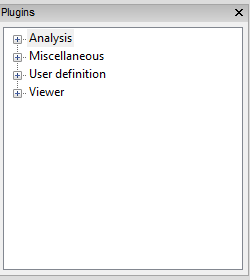

Using MDANSE Graphical User Interface
=====================================

Through the MDANSE graphical user interface (GUI), you will usually open
a trajectory, then specify the parameters for the analysis you wish to
perform and finally start the calculation itself. In this interface you
can also perform some other actions such as plotting the results of an
analysis, performing some file conversions, and view the geometrical
structure of your calculations. The GUI gives access to most of the
functionalities of MDANSE. Moreover, from the GUI it is possible to
create an input file for the command-line interface or an auto-start
analysis python script. Both kind of files provide a convenient starting
point to set up and run new analysis directly from the `command
line <#_Using_MDANSE_from>`__.

.. note::
   The MDANSE GUI can be operated by double-clicking different objects,
   but it also offers a less-advertised option of performing operations
   using the Drag & Drop mechanism. Just drag your trajectory into the main
   GUI window, and a tab will be created. Drop an analysis operation into
   the tab, and you will perform the analysis on the trajectory. Drop the
   Molecular Viewer into the tab, and yoy will visualise the trajectory.

Opening MDANSE GUI
------------------

On all platforms, the GUI can be started either through an icon, or from
the command line. Below are outlined the subtleties connected to each
platform. In each case, it might take some time before the GUI opens, so
please be patient.

.. _windows-1:

Windows
~~~~~~~

If, during the installation, you selected to create a desktop shortcut,
you can use that to start MDANSE. Otherwise, you will have to open the
folder where you installed MDANSE (C:\\Program Files\\MDANSE by
default). Inside you can double click on the file called MDANSE with the
MDANSE icon:

.. image:: ./Pictures/10000001000000730000006F64D69D1EB0E5B5D7.png
   :width: 1.789cm
   :height: 1.727cm

Alternatively, you can double click the file called MDANSE_launcher.bat.
If you want to start MDANSE GUI from the command line, you just have to
type in the path to this batch file, not forgetting to use “ if there
are spaces in the path.

.. _macos-1:

MacOS
~~~~~

If you installed it normally, MDANSE icon should appear in Applications
like any other app. However, starting it the first time is a bit more
complicated since Apple implements stricter protections and we are not
registered as trusted developers. Therefore, you might have to change
some settings (see Ref [Ref4]_ for a guide).
Before you do that though, try simply opening MDANSE from the right
click menu (see Ref [Ref3]_ for a guide).

To start MDANSE GUI from terminal, you will have to run the following
command (change /Applications if you installed MDANSE elsewhere):

/Applications/MDANSE.app/Contents/MacOS/MDANSE

.. _linux-1:

Linux
~~~~~

If your distribution has an applications menu of some sort, like below,
you should be able to find an MDANSE icon in there that can be used to
start the GUI.

.. image:: ./Pictures/100000010000055100000301A9B5B198B0D6FEE6.png
   :width: 12.314cm
   :height: 6.959cm

Otherwise, you will need to use the terminal. First, try running:

.. code-block:: console

  mdanse_gui

If that doesn't work, you will need to know where MDANSE got installed.
By default, it should be in /usr/local, so try looking if the above
script is inside /usr/local/bin. If it isn't there, the best bet is
searching for it with find / -name mdanse_gui. Once you know the path
(let's call it mdanse_bin), run the following:

.. code-block:: console

  mdanse_bin/mdanse_gui

The standalone GUI elements
---------------------------

Some parts of the GUI can also be started on their own. These are:

mdanse_elements_database
~~~~~~~~~~~~~~~~~~~~~~~~

This script has no options. When run, it opens the `Elements Database
Editor <#_Elements_database_editor>`__ GUI window.

mdanse_gui
~~~~~~~~~~

This script has no options. When run, it opens the main `MDANSE
GUI <#_The_main_window>`__ window.

mdanse_job
~~~~~~~~~~

This script is used to run a `job <#_Analysis>`__. It opens the GUI
window for the selected job without opening the main window. To do this,
two positional arguments are required (meaning only the values should be
placed after mdanse_job, no -- options like for the mdanse script).
These two arguments are as follows:

-  **job** – the short name of the job to be run (e.g., pdf for Pair
   Distribution Function).
-  **trajectory** – (only required for analyses; should be left blank
   for trajectory converters) the path to an MMTK trajectory file used
   for the job.

mdanse_periodic_table
~~~~~~~~~~~~~~~~~~~~~

This script has no options. When run, it opens the `Periodic
Table <#_Periodic_table_viewer>`__ GUI window.

mdanse_plotter
~~~~~~~~~~~~~~

This script has no options. When run, it opens the :ref:`2d3dplotter`
GUI window.

mdanse_ud_editor
~~~~~~~~~~~~~~~~

This script has no options. When run, it opens the `User Definitions
Editor <#_User_definition>`__ GUI window.

mdanse_units_editor
~~~~~~~~~~~~~~~~~~~

This script has no options. When run, it opens the Units Editor GUI
window.

The main window
---------------

Below is an image of the window you will see when you open MDANSE GUI.
All the parts have been marked and their short descriptions can be found
below. Further information on all parts is in the following sections.

Please note that all pictures come from Windows 10, so the GUI will look
very slightly different on other platforms. However, MDANSE works
equally well, bugs notwithstanding, on all platforms.

.. image:: ./Pictures/100000000000035A00000225D9D9B30259888397.jpg
   :width: 15.921cm
   :height: 10.186cm

1.  `File menu <#_The_File_menu>`__ handles file manipulation. It can be
    used to load NetCDF trajectories or to convert other trajectories
    into the NetCDF format.
2.  `View menu <#_The_View_menu>`__ allows you to hide/show various
    parts of MDANSE.
3.  `Help menu <#_The_Help_menu>`__ contains access to files that you
    can use to better understand MDANSE and the theory behind it.
4.  `Load trajectory button <#_Load_data>`__ can be used to load a
    NetCDF trajectory.
5.  `Periodic table viewer <#_Periodic_table_viewer>`__ opens a periodic
    table containing the constants and data that MDANSE uses for
    calculations.
6.  `Elements database editor <#_Elements_database_editor>`__ allows you
    to change the atomic constants that MDANSE uses for calculations.
7.  :ref:`2d3dplotter` launches a window where the
    calculated data can be plotted, and the plots formatted.
8.  **User definitions editor** opens a window where you can view the
    definitions that have been created for each trajectory. More on
    definitions in `Selections <#_Creating_selections>`__.
9.  `Units editor <#_Unites_Editor>`__ opens a window where the units
    used in MDANSE can be managed.
10. **MDANSE classes framework** allows you to peruse the documentation
    for the classes that make up MDANSE. This is useful if you want to
    use MDANSE from the command line.
11. **Save analysis template** allows you to create a new analysis. This
    will be available in My jobs inside the Plugins panel and can be run
    like the native analyses.
12. **Open MDANSE API** opens MDANSE documentation in a browser. This is
    very similar to MDANSE classes framework.
13. **Open MDANSE website** opens the MDANSE
    website [Ref8]_ in a browser.
14. **About** launches a window with very basic information about the
    MDANSE you have installed.
15. **Bug report** opens your default mail application. Please use this
    or create an issue on MDANSE
    GitHub [Ref9]_ to inform us of any issues
    you have come across.
16. `Quit MDANSE <#_Quit>`__ closes the MDANSE window.
17. `Data panel <#_Data_panel>`__ contains any NetCDF files you loaded
    into MDANSE using either #4 Load trajectory button, or from #1 File
    menu > Load trajectory.
18. `Plugins panel <#_Plugins_panel>`__ contains all the options you can
    do with the selected trajectory.
19. `Working panel <#_Working_panel>`__ shows the trajectories you have
    opened. To open a trajectory, double click a trajectory in #16 Data
    panel. You can then inspect the system described by the trajectory.
20. **Logger** shows all the messages generated by MDANSE. These can be
    errors or information messages, such as ones confirming you saved a
    script etc.
21. **Console** is a Python shell. It can be used like normal when
    python is being used from the command line, i.e.. when python is
    typed and executed in an OS shell. It contains all the bundled
    modules, but you will need to import them first.
22. `Jobs <#_Jobs>`__ shows the status of all current jobs. Once you
    start an analysis or trajectory conversion, you can view its
    progress here.

The File menu
-------------

Pressing the **File** menu button brings up the following menu:

.. image:: ./Pictures/10000001000000C70000006E1539438FACE07774.png
   :width: 3.759cm
   :height: 2.078cm

Load data
~~~~~~~~~

This option allows you to select an MMTK NetCDF file. Once you click the
Load data button, a standard (platform-specific) file browser will open,
like the one below:

.. image:: ./Pictures/10000001000003B4000002564F3D2836EB0B6495.png
   :width: 10.315cm
   :height: 6.509cm

Use it as per normal, and the file you selected will appear in the `Data
panel <#_Data_panel>`__. While it says in the file browser that you can
load mvi trace file format, this is not currently implemented. Please
only load NetCDF files that have been generated using MMTK or MMTK-based
software. If you have a trajectory from elsewhere, it must be converted
first. For more information about converting trajectories, please see
the `next section <#_Trajectory_converter>`__.

Trajectory converter
~~~~~~~~~~~~~~~~~~~~

This option allows to convert a trajectory derived with a non MMTK-based
program to the NetCDF MMTK trajectory format. Hovering over the
Trajectory converter brings up the following menu:

Clicking on any button opens a window of that converter. Each converter
contains these three buttons at the bottom:

-  **Help** will open MDANSE documentation for the converter class.
-  **Save** creates a python script with the values of all the fields
   set the way they were when the button is clicked. This script can be
   used to quickly run this conversion again in the future.
-  **Run** initiates the conversion. Its progress can be seen in
   `Jobs <#_Jobs>`__. After a successful Run, the converted trajectory
   is saved in the location specified in the field “output files” in the
   converter interface.

The descriptions of all converters will be found in `Appendix
1 <#_Appendix_1>`__.

Quit
~~~~

Selecting this option opens a confirmation prompt. If you select yes,
MDANSE will close.

The View menu
-------------

This menu contains several options to hide/show various parts of MDANSE:

.. image:: ./Pictures/10000001000000BE0000007FCAA964E78A90519D.png
   :width: 3.962cm
   :height: 2.649cm

-  **Toggle data tree** shows/hides the `Data panel <#_Data_panel>`__:

|image1|\ |image2|

-  **Toggle plugins tree** shows/hides the `Plugins
   panel <#_Plugins_panel>`__:

|image3|\ |image4|

-  **Toggle controller** shows/hides the bottom bar containing Logger,
   Console, and Jobs:

|image5|\ |image6|

-  **Toggle toolbar** should show/hide the `toolbar <#_Toolbar>`__:

|image7|\ |image8|

The Help menu
-------------

Pressing the Help button brings up the following menu:

-  **About** opens a window containing information about MDANSE version,
   a short summary, and a list of authors.
-  **Simple help** opens a window with a brief summary of MDANSE
   workflow and the various options that can be encountered.
-  **Theoretical background** opens, in a browser, a document
   summarising the theory behind many of the analyses.
-  **User guide** opens the DOI to this user guide in the default
   browser, showing a RAL Technical Report webpage. From there, this
   user guide can be downloaded as a pdf.
-  **Bug report** opens the default email app so that you can send us an
   email, informing us of any issue you have encountered. When reporting
   an issue, please include a picture or copy of the error, such as the
   `traceback from job failure <#STATE>`__.

Toolbar
-------

This is a set of pictographic buttons that you can use to quickly
perform many important actions. Below is a brief overview of all of
them, going left to right, and after that we will take a look at the
more complex ones.

1.  **Load trajectory button** can be used to load a NetCDF trajectory.
    More information in `Load data <#_Load_data>`__.
2.  `Periodic table viewer <#_Periodic_table_viewer>`__ opens a periodic
    table containing the constants and data that MDANSE uses for
    calculations.
3.  `Elements database editor <#_Elements_database_editor>`__ allows you
    to change the atomic constants that MDANSE uses for calculations.
4.  :ref:`2d3dplotter` launches a window where the
    calculated data can be plotted, and the plots formatted.
5.  **User definitions editor** opens a window where you can view the
    definitions that have been created for each trajectory. More on
    definitions in `Selections <#_Creating_selections>`__.
6.  `Units editor <#_Unites_Editor>`__ opens a window where the units
    used in MDANSE can be managed.
7.  **MDANSE classes framework** allows you to peruse the documentation
    for the classes that make up MDANSE. This is useful if you want to
    use MDANSE from the command line.
8.  **Save analysis template** allows you to create a new analysis. This
    will be available in My jobs inside the Plugins panel and can be run
    like the native analyses.
9.  **Open MDANSE API** opens MDANSE documentation in a browser. This is
    very similar to MDANSE classes framework.
10. **Open MDANSE website** opens the MDANSE website in a browser.
11. **About** launches a window with very basic information about the
    MDANSE you have installed.
12. **Bug report** opens your default mail application. Please use this
    or our GitHub [Ref9]_ to inform us of any
    issues you have come across. When reporting an issue, please include
    a picture or copy of the error, such as the `traceback from job
    failure <#STATE>`__.
13. **Quit MDANSE** closes MDANSE.

Periodic table viewer
~~~~~~~~~~~~~~~~~~~~~

Once launched, it will open this window:

.. image:: ./Pictures/100000010000031E000001EB8316D84CE16D60A9.png
   :width: 15.806cm
   :height: 9.733cm

By hovering over an element, detailed information from MDANSE elements
database will show up at the top. By clicking on an element, a list of
its isotopes will appear as a menu:

.. image:: ./Pictures/100000010000007B00000072BD990BE2296AF016.png
   :width: 3.254cm
   :height: 3.016cm

When an isotope is selected, all the information that is stored in the
database will be displayed:

.. image:: ./Pictures/100000010000024600000333543D0D0EC0A01C7E.png
   :width: 7.509cm
   :height: 10.566cm

Clicking on the link at the bottom opens a Wikipedia article about that
element. Other than that, you cannot interact with this page in any way.
If you would like to change any of the displayed data, you will have to
use the Elements database editor.

Elements database editor
~~~~~~~~~~~~~~~~~~~~~~~~

Clicking on this button opens this window:

It can be interacted with like a normal spreadsheet; click (or double
click) on a field you want to edit and type the new value. Once you are
done with making changes, don't forget to save them before closing. You
can do that through the file menu.

File menu
^^^^^^^^^

-  **Save database** overwrites the current database, so it is best to
   be careful. Due to that, you will need to confirm a prompt before the
   changes are saved.
-  **Save database as** opens a file browser which can be used to save
   the changes in a new file.

Database menu
^^^^^^^^^^^^^

Clicking on Database opens this menu:

.. image:: ./Pictures/10000001000000A900000052FEACFDD7C67801BA.png
   :width: 4.329cm
   :height: 1.99cm

-  **New element** allows you to add a new element.
-  **New property** allows you to add a new property.

.. _2d3dplotter:

2D/3D Plotter
~~~~~~~~~~~~~

Upon clicking on the icon, this window will open:

To use it, a file has to be loaded first. This can be done using the
File menu -> Load, which will open a file browser. Only NetCDF files
(ending in .nc, .cdf, or .netcdf) and HDF5 files (extension .h5 or .hdf)
can be loaded; other file formats will result in an error.

.. image:: ./Pictures/1000000100000079000000510978F762503F30F6.png
   :width: 3.201cm
   :height: 2.081cm

Once a file is loaded, it will appear in the data panel. This is a table
listing all the files loaded in the Plotter, showing the name MDANSE
assigned to the loaded instance (i.e. a key to e.g. distinguish between
files with the same name), the name of the file, and the full path to
the file.

Clicking on a loaded file will show all the variables that can be
plotted in the box below, though the whole Plotter window might have to
be resized so that more than one variable shows up at a time. A preview
of the plot of the first variable will also be shown at the bottom, but
only for 1D and 2D plots.

|image9|

Once you have selected a variable from the second box, you can select a
plotter from the Select Plotter drop-down menu. The following plotters
are available in MDANSE:

+---------------------------+-----------+---------------------------+
| Plotter                   | Dimension | Description               |
+---------------------------+-----------+---------------------------+
| Line                      | 1D        | A simple plot depicting   |
|                           |           | the dependence of one     |
|                           |           | variable on another. It   |
|                           |           | consists of a single      |
|                           |           | line. Uses normal plot()  |
|                           |           | function from matplotlib. |
+---------------------------+-----------+---------------------------+
| Image                     | 2D        | Plots data as an image,   |
|                           |           | i.e. on a 2D regular      |
|                           |           | raster. Uses matplotlib   |
|                           |           | imshow() function.        |
+---------------------------+-----------+---------------------------+
| Elevation                 | 2D        | Plots data as an image.   |
|                           |           | Uses VTK.                 |
+---------------------------+-----------+---------------------------+
| 2D Slice                  | 2D        | Plots a subset of a 3D    |
|                           |           | variable.                 |
|                           |           |                           |
+---------------------------+-----------+---------------------------+
| Isosurface                | 3D        | A 3D plot depicting a     |
|                           |           | surface through lines or  |
|                           |           | one continuous surface.   |
|                           |           | Uses VTK.                 |
+---------------------------+-----------+---------------------------+
| Scalar-Field              | 3D        |                           |
|                           |           |                           |
+---------------------------+-----------+---------------------------+

After all that is selected, the data can be plotted. There are two
options for this, represented by the two buttons:

-  **Plot in new window** creates a new tab, ie. a separate plot, inside
   the Multiple Plot Window.

|image10|\ |image11|

-  **Plot in current figure** plots the chosen data in the currently
   selected tab of the Multiple Plot Window, ie. it will create a plot
   with multiple lines etc.

|image12|\ |image13|

As can be seen, the plot automatically adjusts the axes so that all
plots fit. More details on plotting options is in `Appendix
3 <#_Appendix_3_1>`__.

.. _units-editor:

Units Editor
~~~~~~~~~~~~

When opened, this window will appear:

.. image:: ./Pictures/1000000100000248000001ECCC3F9A11E0472AF2.png
   :width: 9.693cm
   :height: 8.167cm

Here, the units that MDANSE uses can be managed. The white box on the
left is a list of all the defined units, which includes both the units
that come together with MDANSE as well as any user-defined units. More
information on how units work is in the `Units <#_Units>`__ section.
This list is interactive; any unit in it can be clicked on, which
displays its details, like so:

The fields in the middle and right of the window show the definition of
the selected unit using SI units. The selected unit is equivalent to
**Factor** \* the product of the SI units listed on the right, where the
values inside the fields are the powers of the SI units. Therefore, the
unit shown in the above example, J_per_mole, is in MDANSE defined as
1.66055927342 \* 10\ :sup:`-24` kg m\ :sup:`2` mol\ :sup:`-1`.

There are four buttons in the Units Editor window:

-  **Cancel** closes the window without saving any changes made.
-  **Save** saves the changes for future use; they can be used in the
   current session and in any future ones. The Units Editor window is
   also closed.
-  **OK** saves the changes for the current session; they can be used
   until the main MDANSE window is closed. When MDANSE is closed and
   opened again, the changes will not appear. The Units Editor window is
   also closed.
-  **Add unit** opens the following window, which can be used to add new
   units or edit existing ones.

-  **Unit name**

*Format:* str

*Default:* None

*Description:* the name of the unit. If a name not yet registered is
inputted, a new unit will be created. Please note that the names are
case-sensitive, and that already existing units cannot be overwritten.

-  **Factor**

*Format:* float

*Default:* 1.0

*Description:*

-  **unit** (any of the displayed SI basic units)

*Format:* int (it must lie in the interval )

*Default:* 0

*Description:* the power of the SI unit.

-  **OK** adds the new definition to the unit registry, but the change
   has to be saved in the Units Editor window to be useable in the rest
   of MDANSE. Please not that once, a new unit is added, it cannot be
   changed only removed.
-  **Cancel** closes the window without saving the changes.

Further, existing units can be deleted from the Units Editor window. To
do this, the unit to be deleted has to be selected by clicking on it,
and then the 'Delete' button has to be clicked. This will show a prompt
for confirmation, and once that is accepted, the unit will be removed,
though the change has to be saved by clicking on either the OK or Cancel
button.

Data panel
----------

This is where files loaded into MDANSE are displayed. Trajectories and
results of analyses are distinctly separated as 'mmtk trajectory' and
'netcdf data' respectively. To proceed, you need to double-click on a
file name here to bring it to the Working panel. This can be done
multiple times for each file.

.. image:: ./Pictures/10000001000000FD000001112D4B60FF74FCFC13.png
   :width: 6.696cm
   :height: 7.223cm

Working panel
-------------

The selected files appear in the Working panel as tabs. The currently
opened tab is the one that whose file is going to be used for analysis
and other operations when using the Plugins panel.

The Working panel is also the space which some of the plugins use to do
their job. :ref:`molecular-viewer`,
:ref:`analysis-animation`, and :ref:`2d3dplotter` plugins
all load into the `Working panel <#_Working_panel>`__. Furthermore, it
is possible to bring the windows opened by the other plugins into the
working panel, like below. To do that, you have to drag the window so
that its top is near the top of the working panel, where the tabs are.
An indicator will appear when you got it right.

.. image:: ./Pictures/100000010000039B00000223E26E6A96BBCAA5F7.png
   :width: 13.376cm
   :height: 7.927cm

.. image:: ./Pictures/10000001000003A4000000F537A5F4FDE03228C0.png
   :width: 15.921cm
   :height: 4.186cm

Plugins panel
-------------

This is the heart of MDANSE, where all the analyses as well as other
important features can be found. If the selected tab in the Working
panel is from a trajectory, the Plugins panel will look like this:

If it is from the result of an analysis, it will look like this:

.. image:: ./Pictures/10000001000000F700000112DF7A4DFE4F638571.png
   :width: 6.535cm
   :height: 7.251cm

There are far fewer options available for analysis results.
Nevertheless, in each of the sections below, it will be stated if the
plugin appears for trajectories, results, or both.

All the options in above are just headings. To get to the actual
plugins, click on the 'plus' buttons next to the text to unhide the
options. If there is no such button next to a text, that means that that
is a plugin and can be launched by double-clicking on the text.

.. _analysis:

Analysis
--------

This menu contains all data manipulations and appears as in the picture
below when a trajectory is loaded. As indicated by the plus buttons,
each of these options is a menu in itself.

They are explored in greater depth in the following sections, and the
analyses are in turn explored in their subsections. Some contain a
discussion of the theory behind the computation, and all show the
analysis window of that analysis, the one that is launched by
double-clicking the option in this Plugins panel.

Each analysis window is different since each requires different
parameters to be configured before it can be run. However, all of them
have the same structure (example window below), consisting of these
parts:

-  **trajectory** box shows the path to the :ref:`netcdf`
   trajectory that this analysis will
   be performed on.

-  **Parameters** are a group of options, of which the common ones are
   discussed in depth in :ref:`parameters`. These are the
   options which vary from analysis to analysis. The only parameters
   that exist on every analysis are Frames and Output files.

-  **Buttons** are situated at the bottom of each analysis and consist
   of these options:

   -  **Help** opens the source code documentation for the relevant
      class in an MDANSE window.
   -  **Save** opens a file browser that allows you to save the current
      analysis with the set options into a python script which can be
      run from the command line. More information about scripts in
      :ref:`mdanse-cli` and :ref:`mdanse-scripts`.
   -  **Run** starts the analysis and prompts you whether you want to
      close the window. The status of the analysis can be found in the
      `Jobs <#_Jobs>`__ panel, though there is a known bug where
      successful analyses do not show up.

.. |image1| image:: ./Pictures/100000010000028D000001F1F632B1C1173DE220.png
   :width: 7.096cm
   :height: 5.426cm

.. |image3| image:: ./Pictures/100000010000028D000001F1F632B1C1173DE220.png
   :width: 7.096cm
   :height: 5.426cm
.. |image4| image:: ./Pictures/100000010000028C000001F092B9EB9B1E48AB9D.png
   :width: 7.193cm
   :height: 5.466cm
.. |image5| image:: ./Pictures/100000010000028D000001F1F632B1C1173DE220.png
   :width: 7.096cm
   :height: 5.426cm

.. |image7| image:: ./Pictures/100000010000025E000001C3AC39A36717DC7EE3.png
   :width: 6.959cm
   :height: 5.156cm
.. |image8| image:: ./Pictures/100000010000025D000001C0F8379C92EEE1C895.png
   :width: 7.011cm
   :height: 5.191cm
.. |image9| image:: ./Pictures/10000001000001C9000003B286D7BAECC84888DA.png
   :width: 7.191cm
   :height: 14.887cm
.. |image10| image:: ./Pictures/10000001000002A10000027D14B28490295A59FA.png
   :width: 7.728cm
   :height: 7.313cm
.. |image11| image:: ./Pictures/100000010000029E000002771B2359A8E105AC9F.png
   :width: 7.798cm
   :height: 7.345cm
.. |image12| image:: ./Pictures/100000010000029E000002771B2359A8E105AC9F.png
   :width: 7.798cm
   :height: 7.345cm
.. |image13| image:: ./Pictures/100000010000029D0000027A5511D91E20AFD9A5.png
   :width: 7.765cm
   :height: 7.357cm
