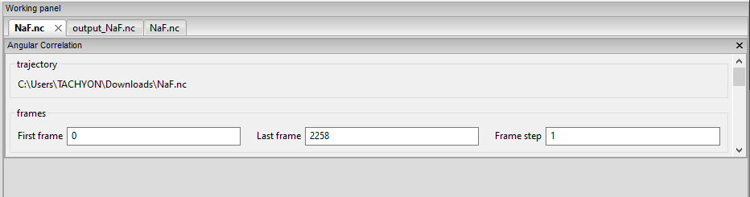
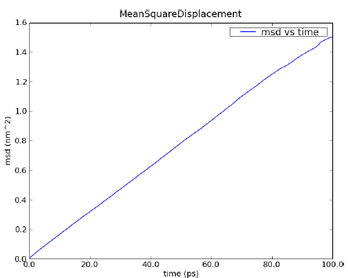
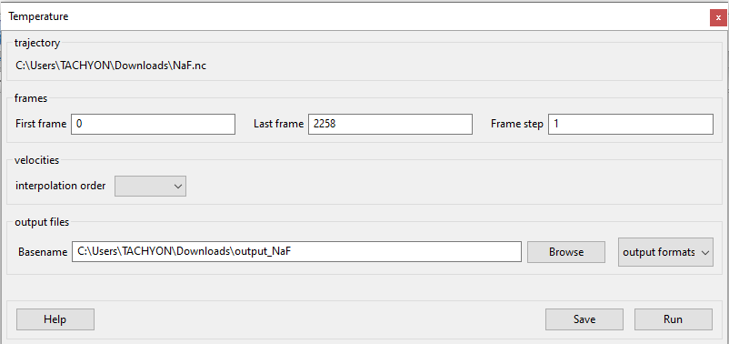
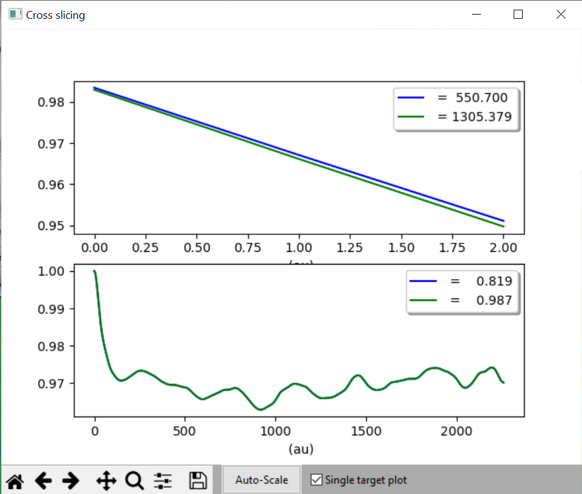
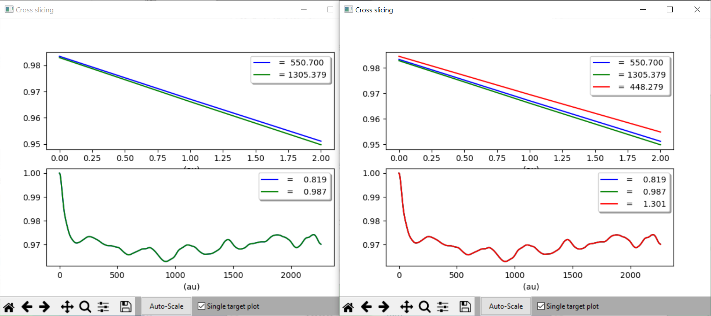

Using MDANSE Graphical User Interface
=====================================

Through the MDANSE graphical user interface (GUI), you will usually open
a trajectory, then specify the parameters for the analysis you wish to
perform and finally start the calculation itself. In this interface you
can also perform some other actions such as plotting the results of an
analysis, performing some file conversions, and view the geometrical
structure of your calculations. The GUI gives access to most of the
functionalities of MDANSE. Moreover, from the GUI it is possible to
create an input file for the command-line interface or an auto-start
analysis python script. Both kind of files provide a convenient starting
point to set up and run new analysis directly from the `command
line <#_Using_MDANSE_from>`__.

Opening MDANSE GUI
------------------

On all platforms, the GUI can be started either through an icon, or from
the command line. Below are outlined the subtleties connected to each
platform. In each case, it might take some time before the GUI opens, so
please be patient.

.. _windows-1:

Windows
~~~~~~~

If, during the installation, you selected to create a desktop shortcut,
you can use that to start MDANSE. Otherwise, you will have to open the
folder where you installed MDANSE (C:\\Program Files\\MDANSE by
default). Inside you can double click on the file called MDANSE with the
MDANSE icon:

.. image:: ./Pictures/100000010000025800000014D95D6D39C9FE12CE.png
   :width: 14.021cm
   :height: 0.467cm

Alternatively, you can double click the file called MDANSE_launcher.bat.
If you want to start MDANSE GUI from the command line, you just have to
type in the path to this batch file, not forgetting to use “ if there
are spaces in the path.

.. _macos-1:

MacOS
~~~~~

If you installed it normally, MDANSE icon should appear in Applications
like any other app. However, starting it the first time is a bit more
complicated since Apple implements stricter protections and we are not
registered as trusted developers. Therefore, you might have to change
some settings (see Ref [`4 <#SignetBibliographie_004>`__] for a guide).
Before you do that though, try simply opening MDANSE from the right
click menu (see Ref [`3 <#SignetBibliographie_003>`__] for a guide).

To start MDANSE GUI from terminal, you will have to run the following
command (change /Applications if you installed MDANSE elsewhere):

/Applications/MDANSE.app/Contents/MacOS/MDANSE

.. _linux-1:

Linux
~~~~~

If your distribution has an applications menu of some sort, like below,
you should be able to find an MDANSE icon in there that can be used to
start the GUI.

Otherwise, you will need to use the terminal. First, try running:

mdanse_gui

If that doesn't work, you will need to know where MDANSE got installed.
By default, it should be in /usr/local, so try looking if the above
script is inside /usr/local/bin. If it isn't there, the best bet is
searching for it with find / -name mdanse_gui. Once you know the path
(let's call it mdanse_bin), run the following:

mdanse_bin/mdanse_gui

The main window
---------------

Below is an image of the window you will see when you open MDANSE GUI.
All the parts have been marked and their short descriptions can be found
below. Further information on all parts is in the following sections.

Please note that all pictures come from Windows 10, so the GUI will look
very slightly different on other platforms. However, MDANSE works
equally well, bugs notwithstanding, on all platforms.

1.  `File menu <#_The_File_menu>`__ handles file manipulation. It can be
    used to load NetCDF trajectories or to convert other trajectories
    into the NetCDF format.
2.  `View menu <#_The_View_menu>`__ allows you to hide/show various
    parts of MDANSE.
3.  `Help menu <#_The_Help_menu>`__ contains access to files that you
    can use to better understand MDANSE and the theory behind it.
4.  `Load trajectory button <#_Load_data>`__ can be used to load a
    NetCDF trajectory.
5.  `Periodic table viewer <#_Periodic_table_viewer>`__ opens a periodic
    table containing the constants and data that MDANSE uses for
    calculations.
6.  `Elements database editor <#_Elements_database_editor>`__ allows you
    to change the atomic constants that MDANSE uses for calculations.
7.  `2D/3D Plotter <#_2D/3D_Plotter>`__ launches a window where the
    calculated data can be plotted, and the plots formatted.
8.  **User definitions editor** opens a window where you can view the
    definitions that have been created for each trajectory. More on
    definitions in `Selections <#_Creating_selections>`__.
9.  `Units editor <#_Unites_Editor>`__ opens a window where the units
    used in MDANSE can be managed.
10. **MDANSE classes framework** allows you to peruse the documentation
    for the classes that make up MDANSE. This is useful if you want to
    use MDANSE from the command line.
11. **Save analysis template** allows you to create a new analysis. This
    will be available in My jobs inside the Plugins panel and can be run
    like the native analyses.
12. **Open MDANSE API** opens MDANSE documentation in a browser. This is
    very similar to MDANSE classes framework.
13. **Open MDANSE website** opens the MDANSE
    website[`8 <#SignetBibliographie_008>`__] in a browser.
14. **About** launches a window with very basic information about the
    MDANSE you have installed.
15. **Bug report** opens your default mail application. Please use this
    or create an issue on MDANSE
    GitHub[`9 <#SignetBibliographie_009>`__] to inform us of any issues
    you have come across.
16. `Quit MDANSE <#_Quit>`__ closes the MDANSE window.
17. `Data panel <#_Data_panel>`__ contains any NetCDF files you loaded
    into MDANSE using either #4 Load trajectory button, or from #1 File
    menu > Load trajectory.
18. `Plugins panel <#_Plugins_panel>`__ contains all the options you can
    do with the selected trajectory.
19. `Working panel <#_Working_panel>`__ shows the trajectories you have
    opened. To open a trajectory, double click a trajectory in #16 Data
    panel. You can then inspect the system described by the trajectory.
20. **Logger** shows all the messages generated by MDANSE. These can be
    errors or information messages, such as ones confirming you saved a
    script etc.
21. **Console** is a Python shell. It can be used like normal when
    python is being used from the command line, i.e.. when python is
    typed and executed in an OS shell. It contains all the bundled
    modules, but you will need to import them first.
22. `Jobs <#_Jobs>`__ shows the status of all current jobs. Once you
    start an analysis or trajectory conversion, you can view its
    progress here.

The File menu
-------------

Pressing the **File** menu button brings up the following menu:

Load data
~~~~~~~~~

This option allows you to select an MMTK NetCDF file. Once you click the
Load data button, a standard (platform-specific) file browser will open,
like the one below:

Use it as per normal, and the file you selected will appear in the `Data
panel <#_Data_panel>`__. While it says in the file browser that you can
load mvi trace file format, this is not currently implemented. Please
only load NetCDF files that have been generated using MMTK or MMTK-based
software. If you have a trajectory from elsewhere, it must be converted
first. For more information about converting trajectories, please see
the `next section <#_Trajectory_converter>`__.

Trajectory converter
~~~~~~~~~~~~~~~~~~~~

This option allows to convert a trajectory derived with a non MMTK-based
program to the NetCDF MMTK trajectory format. Hovering over the
Trajectory converter brings up the following menu:

.. image:: ./Pictures/100000010000015B0000016E3E986405A542C06F.png
   :width: 6.909cm
   :height: 7.287cm

Clicking on any button opens a window of that converter. Each converter
contains these three buttons at the bottom:

-  **Help** will open MDANSE documentation for the converter class.
-  **Save** creates a python script with the values of all the fields
   set the way they were when the button is clicked. This script can be
   used to quickly run this conversion again in the future.
-  **Run** initiates the conversion. Its progress can be seen in
   `Jobs <#_Jobs>`__. After a successful Run, the converted trajectory
   is saved in the location specified in the field “output files” in the
   converter interface.

The descriptions of all converters will be found in `Appendix
1 <#_Appendix_1>`__.

Quit
~~~~

Selecting this option opens a confirmation prompt. If you select yes,
MDANSE will close.

The View menu
-------------

This menu contains several options to hide/show various parts of MDANSE:

-  **Toggle data tree** shows/hides the `Data panel <#_Data_panel>`__:

|image1|\ |image2|

-  **Toggle plugins tree** shows/hides the `Plugins
   panel <#_Plugins_panel>`__:

|image3|\ |image4|

-  **Toggle controller** shows/hides the bottom bar containing Logger,
   Console, and Jobs:

|image5|\ |image6|

-  **Toggle toolbar** should show/hide the `toolbar <#_Toolbar>`__:

|image7|\ |image8|

The Help menu
-------------

Pressing the Help button brings up the following menu:

.. image:: ./Pictures/10000001000000DB00000099F6B730A10B6BD3B5.png
   :width: 5.741cm
   :height: 4.048cm

-  **About** opens a window containing information about MDANSE version,
   a short summary, and a list of authors.
-  **Simple help** opens a window with a brief summary of MDANSE
   workflow and the various options that can be encountered.
-  **Theoretical background** opens, in a browser, a document
   summarising the theory behind many of the analyses.
-  **User guide** opens the DOI to this user guide in the default
   browser, showing a RAL Technical Report webpage. From there, this
   user guide can be downloaded as a pdf.
-  **Bug report** opens the default email app so that you can send us an
   email, informing us of any issue you have encountered. When reporting
   an issue, please include a picture or copy of the error, such as the
   `traceback from job failure <#STATE>`__.

Toolbar
-------

This is a set of pictographic buttons that you can use to quickly
perform many important actions. Below is a brief overview of all of
them, going left to right, and after that we will take a look at the
more complex ones.

.. image:: ./Pictures/10000001000001FB0000002B44E7FF7987426A26.png
   :width: 13.416cm
   :height: 1.138cm

1.  **Load trajectory button** can be used to load a NetCDF trajectory.
    More information in `Load data <#_Load_data>`__.
2.  `Periodic table viewer <#_Periodic_table_viewer>`__ opens a periodic
    table containing the constants and data that MDANSE uses for
    calculations.
3.  `Elements database editor <#_Elements_database_editor>`__ allows you
    to change the atomic constants that MDANSE uses for calculations.
4.  `2D/3D Plotter <#_2D/3D_Plotter>`__ launches a window where the
    calculated data can be plotted, and the plots formatted.
5.  **User definitions editor** opens a window where you can view the
    definitions that have been created for each trajectory. More on
    definitions in `Selections <#_Creating_selections>`__.
6.  `Units editor <#_Unites_Editor>`__ opens a window where the units
    used in MDANSE can be managed.
7.  **MDANSE classes framework** allows you to peruse the documentation
    for the classes that make up MDANSE. This is useful if you want to
    use MDANSE from the command line.
8.  **Save analysis template** allows you to create a new analysis. This
    will be available in My jobs inside the Plugins panel and can be run
    like the native analyses.
9.  **Open MDANSE API** opens MDANSE documentation in a browser. This is
    very similar to MDANSE classes framework.
10. **Open MDANSE website** opens the MDANSE website in a browser.
11. **About** launches a window with very basic information about the
    MDANSE you have installed.
12. **Bug report** opens your default mail application. Please use this
    or our GitHub[`9 <#SignetBibliographie_009>`__] to inform us of any
    issues you have come across. When reporting an issue, please include
    a picture or copy of the error, such as the `traceback from job
    failure <#STATE>`__.
13. **Quit MDANSE** closes MDANSE.

Periodic table viewer
~~~~~~~~~~~~~~~~~~~~~

Once launched, it will open this window:

By hovering over an element, detailed information from MDANSE elements
database will show up at the top. By clicking on an element, a list of
its isotopes will appear as a menu:

When an isotope is selected, all the information that is stored in the
database will be displayed:

Clicking on the link at the bottom opens a Wikipedia article about that
element. Other than that, you cannot interact with this page in any way.
If you would like to change any of the displayed data, you will have to
use the Elements database editor.

Elements database editor
~~~~~~~~~~~~~~~~~~~~~~~~

Clicking on this button opens this window:

.. image:: ./Pictures/10000001000003160000018C76F0FE861E14A12B.png
   :width: 15.789cm
   :height: 7.895cm

It can be interacted with like a normal spreadsheet; click (or double
click) on a field you want to edit and type the new value. Once you are
done with making changes, don't forget to save them before closing. You
can do that through the file menu.

File menu
^^^^^^^^^

.. image:: ./Pictures/10000001000001000000004B8B80A954F09BBF56.png
   :width: 6.773cm
   :height: 1.984cm

-  **Save database** overwrites the current database, so it is best to
   be careful. Due to that, you will need to confirm a prompt before the
   changes are saved.
-  **Save database as** opens a file browser which can be used to save
   the changes in a new file.

Database menu
^^^^^^^^^^^^^

Clicking on Database opens this menu:

.. image:: ./Pictures/10000001000000A900000052FEACFDD7C67801BA.png
   :width: 4.329cm
   :height: 1.99cm

-  **New element** allows you to add a new element.
-  **New property** allows you to add a new property.

2D/3D Plotter
~~~~~~~~~~~~~

Upon clicking on the icon, this window will open:

.. image:: ./Pictures/10000001000003DA000002B772D53BC965757606.png
   :width: 12.173cm
   :height: 8.58cm

To use it, a file has to be loaded first. This can be done using the
File menu -> Load, which will open a file browser. Only NetCDF files
(ending in .nc, .cdf, or .netcdf) and HDF5 files (extension .h5 or .hdf)
can be loaded; other file formats will result in an error.

Once a file is loaded, it will appear in the data panel. This is a table
listing all the files loaded in the Plotter, showing the name MDANSE
assigned to the loaded instance (i.e. a key to e.g. distinguish between
files with the same name), the name of the file, and the full path to
the file.

.. image:: ./Pictures/1000000100000130000000AFA255BACE473AB186.png
   :width: 6.645cm
   :height: 3.826cm

Clicking on a loaded file will show all the variables that can be
plotted in the box below, though the whole Plotter window might have to
be resized so that more than one variable shows up at a time. A preview
of the plot of the first variable will also be shown at the bottom, but
only for 1D and 2D plots.

|image9|

Once you have selected a variable from the second box, you can select a
plotter from the Select Plotter drop-down menu. The following plotters
are available in MDANSE:

+---------------------------+-----------+---------------------------+
| Plotter                   | Dimension | Description               |
+---------------------------+-----------+---------------------------+
| Line                      | 1D        | A simple plot depicting   |
|                           |           | the dependence of one     |
|                           |           | variable on another. It   |
|                           |           | consists of a single      |
|                           |           | line. Uses normal plot()  |
|                           |           | function from matplotlib. |
+---------------------------+-----------+---------------------------+
| Image                     | 2D        | Plots data as an image,   |
|                           |           | i.e. on a 2D regular      |
|                           |           | raster. Uses matplotlib   |
|                           |           | imshow() function.        |
+---------------------------+-----------+---------------------------+
| Elevation                 | 2D        | Plots data as an image.   |
|                           |           | Uses VTK.                 |
+---------------------------+-----------+---------------------------+
| 2D Slice                  | 2D        | Plots a subset of a 3D    |
|                           |           | variable.                 |
|                           |           |                           |
+---------------------------+-----------+---------------------------+
| Isosurface                | 3D        | A 3D plot depicting a     |
|                           |           | surface through lines or  |
|                           |           | one continuous surface.   |
|                           |           | Uses VTK.                 |
+---------------------------+-----------+---------------------------+
| Scalar-Field              | 3D        |                           |
|                           |           |                           |
+---------------------------+-----------+---------------------------+

After all that is selected, the data can be plotted. There are two
options for this, represented by the two buttons:

-  **Plot in new window** creates a new tab, ie. a separate plot, inside
   the Multiple Plot Window.

|image10|\ |image11|

-  **Plot in current figure** plots the chosen data in the currently
   selected tab of the Multiple Plot Window, ie. it will create a plot
   with multiple lines etc.

|image12|\ |image13|

As can be seen, the plot automatically adjusts the axes so that all
plots fit. More details on plotting options is in `Appendix
3 <#_Appendix_3_1>`__.

Units Editor
~~~~~~~~~~~~

When opened, this window will appear:

Here, the units that MDANSE uses can be managed. The white box on the
left is a list of all the defined units, which includes both the units
that come together with MDANSE as well as any user-defined units. More
information on how units work is in the `Units <#_Units>`__ section.
This list is interactive; any unit in it can be clicked on, which
displays its details, like so:

.. image:: ./Pictures/1000000100000247000001E9C7FFA85698785E9D.png
   :width: 9.804cm
   :height: 8.142cm

The fields in the middle and right of the window show the definition of
the selected unit using SI units. The selected unit is equivalent to
**Factor** \* the product of the SI units listed on the right, where the
values inside the fields are the powers of the SI units. Therefore, the
unit shown in the above example, J_per_mole, is in MDANSE defined as
1.66055927342 \* 10\ :sup:`-24` kg m\ :sup:`2` mol\ :sup:`-1`.

There are four buttons in the Units Editor window:

-  **Cancel** closes the window without saving any changes made.
-  **Save** saves the changes for future use; they can be used in the
   current session and in any future ones. The Units Editor window is
   also closed.
-  **OK** saves the changes for the current session; they can be used
   until the main MDANSE window is closed. When MDANSE is closed and
   opened again, the changes will not appear. The Units Editor window is
   also closed.
-  **Add unit** opens the following window, which can be used to add new
   units or edit existing ones.

.. image:: ./Pictures/10000001000000C10000017909613E0AF9D5EED0.png
   :width: 2.84cm
   :height: 5.547cm

-  **Unit name**

*Format:* str

*Default:* None

*Description:* the name of the unit. If a name not yet registered is
inputted, a new unit will be created. Please note that the names are
case-sensitive, and that already existing units cannot be overwritten.

-  **Factor**

*Format:* float

*Default:* 1.0

*Description:*

-  **unit** (any of the displayed SI basic units)

*Format:* int (it must lie in the interval )

*Default:* 0

*Description:* the power of the SI unit.

-  **OK** adds the new definition to the unit registry, but the change
   has to be saved in the Units Editor window to be useable in the rest
   of MDANSE. Please not that once, a new unit is added, it cannot be
   changed only removed.
-  **Cancel** closes the window without saving the changes.

Further, existing units can be deleted from the Units Editor window. To
do this, the unit to be deleted has to be selected by clicking on it,
and then the 'Delete' button has to be clicked. This will show a prompt
for confirmation, and once that is accepted, the unit will be removed,
though the change has to be saved by clicking on either the OK or Cancel
button.

Data panel
----------

This is where files loaded into MDANSE are displayed. Trajectories and
results of analyses are distinctly separated as 'mmtk trajectory' and
'netcdf data' respectively. To proceed, you need to double-click on a
file name here to bring it to the Working panel. This can be done
multiple times for each file.

.. image:: ./Pictures/10000001000000FD000001112D4B60FF74FCFC13.png
   :width: 6.696cm
   :height: 7.223cm

Working panel
-------------

The selected files appear in the Working panel as tabs. The currently
opened tab is the one that whose file is going to be used for analysis
and other operations when using the Plugins panel.

.. image:: ./Pictures/100000010000010C0000002EFF8582524B23620C.png
   :width: 7.093cm
   :height: 1.217cm

The Working panel is also the space which some of the plugins use to do
their job. `The Molecular Viewer <#_Molecular_Viewer>`__,
`Animation <#_Animation>`__, and `2D/3D Plotter <#_Plotter>`__ plugins
all load into the `Working panel <#_Working_panel>`__. Furthermore, it
is possible to bring the windows opened by the other plugins into the
working panel, like below. To do that, you have to drag the window so
that its top is near the top of the working panel, where the tabs are.
An indicator will appear when you got it right.

Plugins panel
-------------

This is the heart of MDANSE, where all the analyses as well as other
important features can be found. If the selected tab in the Working
panel is from a trajectory, the Plugins panel will look like this:

.. image:: ./Pictures/10000001000000FA0000011803C2A7616D0C2E95.png
   :width: 6.616cm
   :height: 7.408cm

If it is from the result of an analysis, it will look like this:

There are far fewer options available for analysis results.
Nevertheless, in each of the sections below, it will be stated if the
plugin appears for trajectories, results, or both.

All the options in above are just headings. To get to the actual
plugins, click on the 'plus' buttons next to the text to unhide the
options. If there is no such button next to a text, that means that that
is a plugin and can be launched by double-clicking on the text.

Analysis
~~~~~~~~

This menu contains all data manipulations and appears as in the picture
below when a trajectory is loaded. As indicated by the plus buttons,
each of these options is a menu in itself.

.. image:: ./Pictures/10000001000000F9000000B9A79707AE37EC9465.png
   :width: 6.588cm
   :height: 4.895cm

They are explored in greater depth in the following sections, and the
analyses are in turn explored in their subsections. Some contain a
discussion of the theory behind the computation, and all show the
analysis window of that analysis, the one that is launched by
double-clicking the option in this Plugins panel.

Each analysis window is different since each requires different
parameters to be configured before it can be run. However, all of them
have the same structure (example window below), consisting of these
parts:

-  **trajectory** box shows the path to the `MMTK
   NetCDF <#_NetCDF_file_format>`__ trajectory that this analysis will
   be performed on.

-  **Parameters** are a group of options, of which the common ones are
   discussed in depth in `Appendix 2 <#_Appendix_2>`__. These are the
   options which vary from analysis to analysis. The only parameters
   that exist on every analysis are Frames and Output files.

-  **Buttons** are situated at the bottom of each analysis and consist
   of these options:

   -  **Help** opens the source code documentation for the relevant
      class in an MDANSE window.
   -  **Save** opens a file browser that allows you to save the current
      analysis with the set options into a python script which can be
      run from the command line. More information about scripts in
      `Using MDANSE from command line. <#_Using_MDANSE_from>`__
   -  **Run** starts the analysis and prompts you whether you want to
      close the window. The status of the analysis can be found in the
      `Jobs <#_Jobs>`__ panel, though there is a known bug where
      successful analyses do not show up.

Dynamics
^^^^^^^^

This section contains the following Plugins:

-  `Angular Correlation <#_Angular_Correlation>`__
-  `Density Of States <#_Density_Of_States>`__
-  `General AutoCorrelation
   Function <#_General_AutoCorrelation_Function>`__
-  `Mean Square Displacement <#_Mean_Square_Displacement>`__
-  `Order Parameter <#_Order_Parameter>`__
-  `Position AutoCorrelation
   Function <#_Position_AutoCorrelation_Function>`__
-  `Velocity AutoCorrelation
   Function <#_Velocity_AutoCorrelation_Function>`__

Angular Correlation
'''''''''''''''''''

-  Available for trajectories only

Theory and implementation
                         

The angular correlation analysis computes the autocorrelation of a set
of vectors describing the extent of a molecule in three orthogonal
directions. This kind of analysis can be useful when trying to highlight
the fact that a molecule is constrained in a given direction.

For a given triplet of non-colinear atoms *g*\ =(a1,a2,a3), one can
derive an orthonormal set of three vectors v1, v2, v3 using the
following scheme:

-  

   .. math:: v_{1} = \frac{n_{1} + n_{2}}{\left| \left| {n_{1} + n_{2}} \right| \right|}

   \ where **n**\ :sub:`1` and **n**\ :sub:`2` are respectively the
   normalized vectors along (**a1,a2**) and (**a1,a3**) directions.
-  v2 is defined as the clockwise normal vector orthogonal to v1 that
   belongs to the plane defined by a1, a2 and a3 atoms
-  

   .. math:: {\overrightarrow{v_{3}} = \overrightarrow{v_{1}}}\times\overrightarrow{v_{2}}

Thus, one can define the following autocorrelation functions for the
vectors v1, v2 and v3 defined on triplet t :

.. math::

   \begin{matrix}
   {AC_{g,i}{(t) = \left\langle {v_{t,i}(0)\cdot v_{t,i}(t)} \right\rangle},{i = 1,2,3}} \\
   {({\mathit{SEQ}\mathit{Equation}\mathit{ARABIC}1})} \\
   \end{matrix}

And the angular correlation averaged over all triplets is:

.. math::

   \begin{matrix}
   {AC_{i}{(t) = {\sum\limits_{g = 1}^{N_{\mathit{triplets}}}{AC_{g,i}(t)}}},{i = 1,2,3}} \\
   \left( {\mathit{SEQ}\mathit{Equation}\mathit{ARABIC}2} \right) \\
   \end{matrix}

where N\ :sub:`triplets` is the number of selected triplets.

GUI
   

.. image:: ./Pictures/10000001000003220000021BA346CFB73717C1BE.png
   :width: 15.921cm
   :height: 10.7cm

Parameters:

-  `frames <#_Frames>`__
-  `axis selection <#_Axis_Selection_1>`__
-  `output contribution per axis <#_Output_contribution_per>`__
-  `output files <#_Output_files>`__
-  `running mode <#_Running_mode>`__

Density Of States
'''''''''''''''''

.. _theory-and-implementation-1:

Theory and implementation
                         

*MDANSE* calculates the power spectrum of the *VACF*, which in case of
the mass-weighted *VACF* defines the phonon discrete *DOS*, (see the
section on `VACF <#_Theory_and_implementation_1>`__) defined as:

.. math::

   \begin{matrix}
   {\mathit{DOS}\left( {n\cdot\mathit{\Delta\nu}} \right)\doteq{\sum\limits_{\alpha}\omega_{\alpha}}{\overset{\sim}{C}}_{\mathit{vv};\mathit{\alpha\alpha}}\left( {n\cdot\mathit{\Delta\nu}} \right),{n = 0}\ldots{N_{t} - 1.}} \\
   (3) \\
   \end{matrix}

N\ :sub:`t` is the total number of time steps and

.. math:: {\mathit{\Delta\nu} = 1}\text{/}\left( {2N_{t}\Delta t} \right)

\ is the frequency step.

.. math:: \mathit{DOS}\left( {n\cdot\mathit{\Delta\nu}} \right)

can be computed either for the isotropic case or with respect to a
user-defined axis. The spectrum

.. math:: \mathit{DOS}\left( {n\cdot\Delta\nu} \right)

is computed from the *unnormalized VACF*, such that *DOS(0)* gives an
approximate value for the diffusion constant

.. math:: D = {\sum\limits_{\alpha}D_{\alpha}}

\ (see Eqs.

.. math:: 10

\ `Error: Reference source not found <#anchor-73>`__ and

.. math:: 11

\ `Error: Reference source not found <#anchor-74>`__).

.. math:: \mathit{DOS}\left( {n\cdot\Delta\nu} \right)

is smoothed by applying a Gaussian window in the time domain
[`10 <#SignetBibliographie_010>`__] (see the section on `Spatial
Density <#_Theory_and_implementation>`__). Its width in the time domain
is

.. math:: {\sigma_{t} = \alpha}\text{/}T

, where T is the length of the simulation. We remark that the diffusion
constant obtained from *DOS* is biased due to the spectral smoothing
procedure since the *VACF* is weighted by this window Gaussian function.
*MDANSE* computes the density of states starting from both atomic
velocities and atomic coordinates. In this case the velocities are
computed by numerical differentiation of the coordinate trajectories
correcting first for possible jumps due to periodic boundary conditions.

.. _gui-1:

GUI
   

-  available for trajectories only

|image14| |image15|

-  `frames <#_Frames>`__
-  `instrument resolution <#_Instrument_resolution>`__
-  `interpolation order <#_Interpolation_order>`__
-  `project coordinates <#_Project_coordinates>`__
-  `atom selection <#_Atom_Selection_1>`__
-  `Group coordinates by <#_Group_coordinates_by>`__
-  `atom transmutation <#_Atom_Transmutation_1>`__
-  `weights <#_Weights>`__
-  `output files <#_Output_files>`__
-  `running mode <#_Running_mode>`__

General AutoCorrelation Function
''''''''''''''''''''''''''''''''

-  available for trajectories only

|image16| |image17|

-  `frames <#_Frames>`__
-  `atom selection <#_Atom_Selection_1>`__
-  `Group coordinates by <#_Group_coordinates_by>`__
-  `atom transmutation <#_Atom_Transmutation_1>`__
-  **trajectory variable**

*Format:* drop-down

*Default:* configuration

*Description:* determines the variable for which the autocorrelation
function is calculated. Therefore, if the selected variable is
'configuration', essentially position autocorrelation function is
calculated.

-  `normalize <#_Normalize>`__
-  `weights <#_Weights>`__
-  `output files <#_Output_files>`__
-  `running mode <#_Running_mode>`__

Mean Square Displacement
''''''''''''''''''''''''

.. _theory-and-implementation-2:

Theory and implementation
                         

Molecules in liquids and gases do not stay in the same place but move
constantly. This process is called diffusion and it happens quite
naturally in fluids at equilibrium. During this process, the motion of
an individual molecule does not follow a simple path. As it travels, the
molecule undergoes some collisions with other molecules which prevent it
from following a straight line. If the path is examined in close detail,
it will be seen to be a good approximation to a random walk.
Mathematically, a random walk is a series of steps where each step is
taken in a completely random direction from the one before. This kind of
path was famously analysed by Albert Einstein in a study of Brownian
motion. He showed that the Mean-Square Displacement (*MSD*) of a
particle following a random walk is proportional to the time elapsed.
This relationship can be written as

.. math::

   \begin{matrix}
   {{\left\langle r^{2} \right\rangle = 6}{\mathit{Dt} + C}} \\
   \left( {\mathit{SEQ}\mathit{Equation}\mathit{ARABIC}3} \right) \\
   \end{matrix}

where < r2 > is the *MSD* and *t* is the time. *D* and *C* are
constants. The constant *D* defines the so-called diffusion coefficient.

The `Figure 1 <#figure1>`__ shows an example of an *MSD* analysis
performed on a water box of 768 water molecules. To get the diffusion
coefficient out of this plot, the slope of the linear part of the plot
should be calculated.

Figure 1: *MSD* calculated for a 100 ps MD simulation of 256 water
molecules using NPT condition at 1 bar and 300 K.

Defining

.. math::

   \begin{matrix}
   {d_{\alpha}\left( {t,t_{0}} \right)\doteq R_{\alpha}{\left( {t_{0} + t} \right) - R_{\alpha}}\left( t_{0} \right),} \\
   \left( {\mathit{SEQ}\mathit{Equation}\mathit{ARABIC}4} \right) \\
   \end{matrix}

the *MSD* of particle :math:`\alpha` can be defined as:

.. math::

   \begin{matrix}
   {\mathrm{\Delta}_{\alpha}^{2}{(t) = \left\langle {d_{\alpha}^{2}\left( {t,t_{0}} \right)} \right\rangle_{t_{0}}}} \\
   \left( {\mathit{SEQ}\mathit{Equation}\mathit{ARABIC}5} \right) \\
   \end{matrix}

where R_(t0) and R_(t0 + t) are respectively the position of particle :math:`\alpha`
at times t0 and t0 + t. One can introduce an *MSD* with respect to a
given axis n:

.. math::

   \begin{matrix}
   {\mathrm{\Delta}_{\alpha}^{2}\left( {t,t_{0};n} \right)\doteq\left\langle {d_{\alpha}^{2}\left( {t,\tau;n} \right)} \right\rangle_{t_{0}}} \\
   \left( {\mathit{SEQ}\mathit{Equation}\mathit{ARABIC}6} \right) \\
   \end{matrix}

with

.. math::

   \begin{matrix}
   {d_{\alpha}^{}\left( {t,\tau;n} \right)\doteq n\bullet d_{\alpha}^{}\left( {t,t_{0}} \right).} \\
   \left( {\mathit{SEQ}\mathit{Equation}\mathit{ARABIC}7} \right) \\
   \end{matrix}

The calculation of *MSD* is the standard way to obtain diffusion
coefficients from Molecular Dynamics (*MD*) simulations. Assuming
Einstein-diffusion in the long time limit one has for isotropic systems

.. math::

   \begin{matrix}
   {{D_{\alpha} = {\lim\limits_{t\rightarrow\infty}{\frac{1}{6t}\mathrm{\Delta}_{\alpha}^{2}(t)}}}.} \\
   \left( {\mathit{SEQ}\mathit{Equation}\mathit{ARABIC}8} \right) \\
   \end{matrix}

There exists also a well-known relation between the *MSD* and the
velocity autocorrelation function. Writing

.. math:: d_{\alpha}{(t) = {\int\limits_{0}^{t}{\mathit{d\tau}v_{\alpha}(\tau)}}}

\ in Eq.

.. math:: 5

\ `Error: Reference source not found <#anchor-84>`__ one can show (see
e.g. [`11 <#SignetBibliographie_011>`__]) that

.. math::

   \begin{matrix}
   {\mathrm{\Delta}_{\alpha}^{2}{(t) = 6}{\int\limits_{0}^{t}{\mathit{d\tau}\left( {t - \tau} \right)C_{\mathit{\upsilon\upsilon};\mathit{\alpha\alpha}}(t)}}.} \\
   \left( {\mathit{SEQ}\mathit{Equation}\mathit{ARABIC}9} \right) \\
   \end{matrix}

Using now the definition

.. math:: 8

\ `Error: Reference source not found <#anchor-85>`__ of the diffusion
coefficient one obtains the relation

.. math::

   \begin{matrix}
   {{D_{\alpha} = {\int\limits_{0}^{t}{\mathit{d\tau}C_{\mathit{\upsilon\upsilon};\mathit{\alpha\alpha}}(t)}}}.} \\
   \left( {\mathit{SEQ}\mathit{Equation}\mathit{ARABIC}10} \right) \\
   \end{matrix}

With Eq.

.. math:: 28

\ `Error: Reference source not found <#anchor-86>`__ this can also be
written as

.. math::

   \begin{matrix}
   {{D_{\alpha} = \pi}{\overset{\sim}{C}}_{\mathit{\upsilon\upsilon};\mathit{\alpha\alpha}}(0).} \\
   \left( {\mathit{SEQ}\mathit{Equation}\mathit{ARABIC}11} \right) \\
   \end{matrix}

Computationally, the *MSD* is calculated using the Fast Correlation
Algorithm (*FCA*) [`12 <#SignetBibliographie_012>`__]. In this
framework, in the discrete case, the mean-square displacement of a
particle is given by

.. math::

   \begin{matrix}
   {\mathrm{\Delta}^{2}{(m) = \frac{1}{N_{t} - m}}{\sum\limits_{k = 0}^{N_{t} - m - 1}\left\lbrack {r{\left( {k + m} \right) - r}(k)} \right\rbrack^{2}},{m = 0.}..{N_{t} - 1}} \\
   \left( {\mathit{SEQ}\mathit{Equation}\mathit{ARABIC}12} \right) \\
   \end{matrix}

where r(k) is the particle trajectory and :math:`N_{t}` is the number of frames of
the trajectory. We define now the auxiliary function

.. math::

   \begin{matrix}
   {S(m)\doteq{\sum\limits_{k = 0}^{N_{t} - m - 1}\left\lbrack {r{\left( {k + m} \right) - r}(k)} \right\rbrack^{2}},{m = 0}...N{t - 1},} \\
   \left( {\mathit{SEQ}\mathit{Equation}\mathit{ARABIC}13} \right) \\
   \end{matrix}

which is split as follows:

.. math::

   \begin{matrix}
   {S{(m) = S_{\mathit{AA} + \mathit{BB}}}{(m) - 2}S_{\mathit{AB}}(m),} \\
   \left( {\mathit{SEQ}\mathit{Equation}\mathit{ARABIC}14} \right) \\
   \end{matrix}

.. math::

   \begin{matrix}
   {S_{\mathit{AA} + \mathit{BB}}{(m) = \sum\limits_{k = 0}^{N_{t} - m - 1}}\left\lbrack {r^{2}{\left( {k + m} \right) + r^{2}}(k)} \right\rbrack,} \\
   \left( {\mathit{SEQ}\mathit{Equation}\mathit{ARABIC}15} \right) \\
   \end{matrix}

.. math::

   \begin{matrix}
   {S_{\mathit{AB}}{(m) = {\sum\limits_{k = 0}^{N_{t} - m - 1}{r(k)}}}\cdot r\left( {k + m} \right).} \\
   \left( {\mathit{SEQ}\mathit{Equation}\mathit{ARABIC}16} \right) \\
   \end{matrix}

The function SAB(m) can be computed using the *FCA* method described in
the section on `Spatial Density <#_Theory_and_implementation>`__. For
SAA+BB(m) the following recursion relation holds:

.. math::

   \begin{matrix}
   {S_{\mathit{AA} + \mathit{BB}}{(m) = S_{\mathit{AA} + \mathit{BB}}}{\left( {m - 1} \right) - r^{2}}{\left( {m - 1} \right) - r^{2}}\left( {N_{t} - m} \right),} \\
   \left( {\mathit{SEQ}\mathit{Equation}\mathit{ARABIC}17} \right) \\
   \end{matrix}

.. math::

   \begin{matrix}
   {S_{\mathit{AA} + \mathit{BB}}{(0) = {\sum\limits_{k = 0}^{N_{t} - 1}{r^{2}(k)}}}.} \\
   \left( {\mathit{SEQ}\mathit{Equation}\mathit{ARABIC}18} \right) \\
   \end{matrix}

This allows one to construct the following efficient scheme for the
computation of the *MSD*:

1. Compute

   .. math:: \mathit{DSQ}{{(k)} = r}2{(k)},{k = 0}...N{t - 1}

   ;

   .. math:: \mathit{DSQ}{{({- 1})} = \mathit{DSQ}}{{({Nt})} = 0}

   .
2. Compute

   .. math:: {\mathit{SUMSQ} = 2}\cdot{\sum\limits_{k = 0}^{N_{t} - 1}{\mathit{DSQ}(k)}}
3. Compute SAB(m) using the Fast Fourier Transform (*FFT*) method.
4. Compute *MSD(m)* in the following loop:

.. math:: \mathit{SUMSQ}\leftarrow{\mathit{SUMSQ} - \mathit{DSQ}}{{({m - 1})} - \mathit{DSQ}}{({N{t - m}})}

.. math:: \mathit{MSD}{(m)}\leftarrow{}

m running from 0 to Nt – 1

It should be noted that the efficiency of this algorithm is the same as
for the *FCA* computation

of time correlation functions since the number of operations in step
(1), (2), and (4) grows

linearly with Nt.

.. _gui-2:

GUI
   

|image18| |image19|

-  `frames <#_Frames>`__
-  `project coordinates <#_Project_coordinates>`__
-  `atom selection <#_Atom_Selection_1>`__
-  `Group coordinates by <#_Group_coordinates_by>`__
-  `atom transmutation <#_Atom_Transmutation_1>`__
-  `weights <#_Weights>`__
-  `output files <#_Output_files>`__
-  `running mode <#_Running_mode>`__

Order Parameter
'''''''''''''''

.. _theory-and-implementation-3:

Theory and implementation
                         

Adequate and accurate cross comparison of the NMR and *MD* simulation
data is of crucial importance in versatile studies conformational
dynamics of proteins. NMR relaxation spectroscopy has proven to be a
unique approach for a site-specific investigation of both global
tumbling and internal motions of proteins. The molecular motions
modulate the magnetic interactions between the nuclear spins and lead
for each nuclear spin to a relaxation behaviour which reflects its
environment. Since its first applications to the study of protein
dynamics, a wide variety of experiments has been proposed to investigate
backbone as well as side chain dynamics. Among them, the heteronuclear
relaxation measurement of amide backbone :sup:`15`\ N nuclei is one of
the most widespread techniques. The relationship between microscopic
motions and measured spin relaxation rates is given by Redfield's theory
[`13 <#SignetBibliographie_013>`__]. Under the hypothesis that
:sup:`15`\ N relaxation occurs through dipole-dipole interactions with
the directly bonded :sup:`1`\ H atom and chemical shift anisotropy
(CSA), and assuming that the tensor describing the CSA is axially
symmetric with its axis parallel to the N-H bond, the relaxation rates
of the :sup:`15`\ N nuclei are determined by a time correlation
function,

.. math::

   \begin{matrix}
   {C_{\mathit{ii}}{(t) = \left\langle {P_{2}\left( {\mu_{i}(0)\cdot\mu_{i}(t)} \right)} \right\rangle}} \\
   \left( {\mathit{SEQ}\mathit{Equation}\mathit{ARABIC}19} \right) \\
   \end{matrix}

which describes the dynamics of a unit vector μ\ :sub:`i`\ (t) pointing
along the :sup:`15`\ N-:sup:`1`\ H bond of the residue *i* in the
laboratory frame. Here P\ :sub:`2`\ (.) is the second order Legendre
polynomial. The Redfield theory shows that relaxation measurements probe
the relaxation dynamics of a selected nuclear spin only at a few
frequencies. Moreover, only a limited number of independent observables
are accessible. Hence, to relate relaxation data to protein dynamics one
has to postulate either a dynamical model for molecular motions or a
functional form for C\ :sub:`ii`\ (t), yet depending on a limited number
of adjustable parameters. Usually, the tumbling motion of proteins in
solution is assumed isotropic and uncorrelated with the internal
motions, such that:

.. math::

   \begin{matrix}
   {C_{\mathit{ii}}{(t) = C^{G}}(t)\cdot C_{\mathit{ii}}^{I}(t)} \\
   \left( {\mathit{SEQ}\mathit{Equation}\mathit{ARABIC}20} \right) \\
   \end{matrix}

where C\ :sup:`G`\ (t) and

.. math:: C_{\mathit{ii}}^{I}(t)

\ denote the global and the internal time correlation function,
respectively. Within the so-called model free approach
[`14 <#SignetBibliographie_014>`__], [`15 <#SignetBibliographie_015>`__]
the internal correlation function is modelled by an exponential,

.. math::

   \begin{matrix}
   {C_{\mathit{ii}}^{I}{(t) = {S_{i}^{2} + \left( {1 - S_{i}^{2}} \right)}}\exp\left( \frac{- t}{\tau_{\mathit{eff},i}} \right)} \\
   \left( {\mathit{SEQ}\mathit{Equation}\mathit{ARABIC}21} \right) \\
   \end{matrix}

Here the asymptotic value

.. math:: {S_{i}^{2} = C_{\mathit{ii}}}\left( {+ \infty} \right)

\ is the so-called generalized order parameter, which indicates the
degree of spatial restriction of the internal motions of a bond vector,
while the characteristic time

.. math:: \tau_{\mathit{eff},i}

\ is an effective correlation time, setting the time scale of the
internal relaxation processes.

.. math:: S_{i}^{2}

can adopt values ranging from 0 (completely disordered) to 1 (fully
ordered). So,

.. math:: S_{i}^{2}

is the appropriate indicator of protein backbone motions in
computationally feasible timescales as it describes the spatial aspects
of the reorientational motion of N-H peptidic bonds vector.

When performing Order Parameter analysis, *MDANSE* computes for each
residue *i* both

.. math:: C_{\mathit{ii}}(t)

\ and

.. math:: S_{i}^{2}

. It also computes a correlation function averaged over all the selected
bonds defined as:

.. math::

   \begin{matrix}
   {C^{I}{(t) = {\sum\limits_{i = 1}^{N_{\mathit{bonds}}}{C_{\mathit{ii}}^{I}(t)}}}} \\
   \left( {\mathit{SEQ}\mathit{Equation}\mathit{ARABIC}22} \right) \\
   \end{matrix}

where N\ :sub:`bonds` is the number of selected bonds for the analysis.

.. _gui-3:

GUI
   

-  available for trajectories only

-  `frames <#_Frames>`__

-  `axis selection <#_Axis_Selection_1>`__

-  reference direction

   -  **x-component**

*Format:* int or float

*Default:* 0

*Description:* <insert>

-  

   -  **y-component**

*Format:* int or float

*Default:* 0

*Description:* <insert>

-  

   -  **z-component**

*Format:* int or float

*Default:* 1

*Description:* <insert>

-  `output contribution per axis <#_Output_contribution_per>`__
-  `output files <#_Output_files>`__
-  `running mode <#_Running_mode>`__

Position AutoCorrelation Function
'''''''''''''''''''''''''''''''''

-  available for trajectories only

|image20| |image21|

-  `frames <#_Frames>`__
-  `normalize <#_Normalize>`__
-  `project coordinates <#_Project_coordinates>`__
-  `atom selection <#_Atom_Selection_1>`__
-  `Group coordinates by <#_Group_coordinates_by>`__
-  `atom transmutation <#_Atom_Transmutation_1>`__
-  `weights <#_Weights>`__
-  `output files <#_Output_files>`__
-  `running mode <#_Running_mode>`__

Velocity AutoCorrelation Function
'''''''''''''''''''''''''''''''''

.. _theory-and-implementation-4:

Theory and implementation
                         

The Velocity AutoCorrelation Function (*VACF*) is another interesting
property describing the dynamics of a molecular system. Indeed, it
reveals the underlying nature of the forces acting on the system.

In a molecular system that would be made of non-interacting particles,
the velocities would be constant at any time triggering the *VACF* to be
a constant value. Now, if we think about a system with small
interactions such as in a gas-phase, the magnitude and direction of the
velocity of a particle will change gradually over time due to its
collision with the other particles of the molecular system. In such a
system, the *VACF* will be represented by a decaying exponential.

In the case of solid phase, the interactions are much stronger and, as a
results, the atoms are bound to a given position from which they will
move backwards and forwards oscillating between positive and negative
values of their velocity. The oscillations will not be of equal
magnitude however, but will decay in time, because there are still
perturbative forces acting on the atoms to disrupt the perfection of
their oscillatory motion. So, in that case the *VACF* will look like a
damped harmonic motion.

Finally, in the case of liquid phase, the atoms have more freedom than
in solid phase and because of the diffusion process, the oscillatory
motion seen in solid phase will be cancelled quite rapidly depending on
the density of the system. So, the *VACF* will just have one very damped
oscillation before decaying to zero. This decaying time can be
considered as the average time for a collision between two atoms to
occur before they diffuse away.

Mathematically, the *VACF* of atom :math:`\alpha` in an atomic or molecular system is
usually defined as

.. math::

   \begin{matrix}
   {C_{\mathit{vv};\mathit{\alpha\alpha}}(t)\doteq\frac{1}{3}\left\langle {v_{\alpha}\left( t_{0} \right)\cdot v_{\alpha}\left( {t_{0} + t} \right)} \right\rangle_{t_{0}}.} \\
   \left( {\mathit{SEQ}\mathit{Equation}\mathit{ARABIC}23} \right) \\
   \end{matrix}

In some cases, e.g. for non-isotropic systems, it is useful to define
*VACF* along a given axis,

.. math::

   \begin{matrix}
   {C_{\mathit{vv};\mathit{\alpha\alpha}}\left( {t;n} \right)\doteq\left\langle {v_{\alpha}\left( {t_{0};n} \right)v_{\alpha}\left( {{t_{0} + t};n} \right)} \right\rangle_{t_{0}},} \\
   \left( {\mathit{SEQ}\mathit{Equation}\mathit{ARABIC}24} \right) \\
   \end{matrix}

where v\ :sub:`:math:`\alpha``\ (t; **n**) is given by

.. math::

   \begin{matrix}
   {v_{\alpha}\left( {t;n} \right)\doteq n\cdot v_{\alpha}(t).} \\
   \left( {\mathit{SEQ}\mathit{Equation}\mathit{ARABIC}25} \right) \\
   \end{matrix}

The vector n is a unit vector defining a space-fixed axis.

The *VACF* of the particles in a many body system can be related to the
incoherent dynamic structure factor by the relation:

.. math::

   \begin{matrix}
   {\mathit{li}m_{q\rightarrow 0}\frac{\omega^{2}}{q^{2}}S{\left( {q,\omega} \right) = G}(\omega),} \\
   \left( {\mathit{SEQ}\mathit{Equation}\mathit{ARABIC}26} \right) \\
   \end{matrix}

where G(:math:`\omega`) is the Density Of States (*DOS*). For an isotropic system it
reads

.. math::

   \begin{matrix}
   {G{(\omega) = {\sum\limits_{\alpha}{b_{\alpha,\mathit{inc}}^{2}{\overset{\sim}{C}}_{\mathit{vv};\mathit{\alpha\alpha}}(\omega)}}},} \\
   \left( {\mathit{SEQ}\mathit{Equation}\mathit{ARABIC}27} \right) \\
   \end{matrix}

.. math::

   \begin{matrix}
   {{\overset{\sim}{C}}_{\mathit{vv};\mathit{\alpha\alpha}}{(\omega) = \frac{1}{2\pi}}{\int\limits_{- \infty}^{+ \infty}\mathit{dt}}\exp\left\lbrack {{- i}\omega t} \right\rbrack C_{\mathit{vv};\mathit{\alpha\alpha}}(t).} \\
   \left( {\mathit{SEQ}\mathit{Equation}\mathit{ARABIC}28} \right) \\
   \end{matrix}

For non-isotropic systems, relation

.. math:: 26

\ `Error: Reference source not found <#anchor-98>`__ holds if the *DOS*
is computed from the atomic velocity autocorrelation functions

.. math:: C_{\mathit{vv};\mathit{\alpha\alpha}}\left( {t;n_{q}} \right)

, where nq is the unit vector in the direction of q.

.. _gui-4:

GUI
   

-  available for trajectories only

|image22| |image23|

-  `frames <#_Frames>`__
-  `interpolation order <#_Interpolation_order>`__
-  `project coordinates <#_Project_coordinates>`__
-  `normalize <#_Normalize>`__
-  `atom selection <#_Atom_Selection_1>`__
-  `Group coordinates by <#_Group_coordinates_by>`__
-  `atom transmutation <#_Atom_Transmutation_1>`__
-  `weights <#_Weights>`__
-  `output files <#_Output_files>`__
-  `running mode <#_Running_mode>`__

Infrared
^^^^^^^^

Dipole AutoCorrelation Function
'''''''''''''''''''''''''''''''

-  available for trajectories only

.. image:: ./Pictures/10000001000003200000022889DD21920219B434.png
   :width: 15.921cm
   :height: 10.986cm

-  `frames <#_Frames>`__
-  `atom selection <#_Atom_Selection_1>`__
-  `atom charges <#_Atom_Charges_1>`__
-  `output files <#_Output_files>`__
-  `running mode <#_Running_mode>`__

Macromolecules
^^^^^^^^^^^^^^

This section has one subsection, Lipids, which contains following
Plugins:

-  Refolded Membrane Trajectory

Refolded Membrane Trajectory
''''''''''''''''''''''''''''

-  available for trajectories only

-  `frames <#_Frames>`__
-  **membrane axis**

*Format:* drop-down

*Default:* c

*Description:* the axis along which is used for the trajectory
manipulation, the normal to the membrane.

-  **name of the lipid of the upper leaflet**

*Format:* str

*Default:* DMPC

*Description:* the name of the lipid positioned in the upper leaflet of
the membrane. It will be repositioned into the upper part of the
simulation box. The name must be the name with which MMTK refers to the
lipid.

-  **name of the lipid of the lower leaflet**

*Format:* str

*Default:* DMPC

*Description:* the name of the lipid positioned in the lower leaflet of
the membrane. It will be repositioned into the lower part of the
simulation box. The name must be the name with which MMTK refers to the
lipid.

-  `output files <#_Output_files>`__

Scattering
^^^^^^^^^^

Below is a list of Plugins contained in this section. They are all used
to calculate neutron spectroscopy observables from the trajectory.

-  `Current Correlation Function <#_Current_Correlation_Function>`__
-  `Dynamic Coherent Structure Factor <#_Dynamic_Coherent_Structure>`__
-  `Dynamic Incoherent Structure
   Factor <#_Dynamic_Incoherent_Structure>`__
-  `Elastic Incoherent Structure
   Factor <#_Elastic_Incoherent_Structure>`__
-  `Gaussian Dynamic Incoherent Structure
   Factor <#_Gaussian_Dynamic_Incoherent>`__
-  `Neutron Dynamic Total Structure Factor <#_Neutron_Dynamic_Total>`__
-  `Structure Factor From Scattering
   Function <#_Structure_Factor_From>`__

These plugins will be explored in depth in further sections, however,
before that, it is important to understand how MDANSE performs these
analyses. A part of that are `Q vectors <#_A3.4._Q_vectors>`__, which
are used to perform these analyses. An in-depth discussion of this
aspect is present in `Appendix 2 <#_Appendix_2>`__.

Theory and background
'''''''''''''''''''''

The quantity of interest in neutron scattering experiments with thermal
neutrons is the *dynamic structure factor*, S(**q**, :math:`\omega`), which is
closely related to the double differential cross-section [7],

.. math:: d^{2}{\sigma/\mathit{d\Omega dE}}

. The double differential cross section is defined as the number of
neutrons which are scattered per unit time into the solid angle interval

.. math:: \left\lbrack {\Omega,{\Omega + d}\Omega} \right\rbrack

and into the energy interval

.. math:: {\lbrack{E,{E + \mathit{dE}}}\rbrack}.

It is normalized to d, *dE*, and the flux of the incoming neutrons,

.. math::

   \begin{matrix}
   {{\frac{d^{2}\sigma}{d\Omega\mathit{dE}} = N}\cdot\frac{k}{k_{0}}S\left( {q,\omega} \right).} \\
   \left( {\mathit{SEQ}\mathit{Equation}\mathit{ARABIC}29} \right) \\
   \end{matrix}

Here *N* is the number of atoms, and k ≡ \|\ **k**\ \| and k\ :sub:`0` ≡
\|\ **k**\ :sub:`0`\ \| are the wave numbers of scattered and incident
neutrons, respectively. They are related to the corresponding neutron
energies by

.. math:: {E = \hslash^{2}}k^{2}\text{/}2m

\ and

.. math:: {E_{0} = \hslash^{2}}k_{0}^{2}\text{/}2m

\ where

.. math:: m

is the neutron mass. The arguments of the dynamic structure factor,

.. math:: q

and

.. math:: \omega

, are the momentum and energy transfer in units of

.. math:: \hslash

, respectively:

.. math::

   \begin{matrix}
   {{q = \frac{k_{0} - k}{\hslash}},} \\
   \left( {\mathit{SEQ}\mathit{Equation}\mathit{ARABIC}30} \right) \\
   \end{matrix}

.. math::

   \begin{matrix}
   {{\omega = \frac{E_{0} - E}{\hslash}}.} \\
   \left( {\mathit{SEQ}\mathit{Equation}\mathit{ARABIC}31} \right) \\
   \end{matrix}

The modulus of the momentum transfer can be expressed in the scattering
angle

.. math:: \theta

, the energy transfer, and the energy of the incident neutrons:

.. math::

   \begin{matrix}
   {{q = \sqrt{{2 - \frac{\mathit{\hslash\omega}}{E_{0}} - 2}\cos{\theta\sqrt{2 - \frac{\mathit{\hslash\omega}}{E_{0}}}}}}.} \\
   \left( {\mathit{SEQ}\mathit{Equation}\mathit{ARABIC}32} \right) \\
   \end{matrix}

The dynamic structure factor contains information about the structure
and dynamics of the scattering system
[`16 <#SignetBibliographie_016>`__]. It can be written as

.. math::

   \begin{matrix}
   {S{\left( {q,\omega} \right) = \frac{1}{2\pi}}{\int\limits_{- \infty}^{+ \infty}\mathit{dt}}\exp\left\lbrack {{- i}\omega t} \right\rbrack F\left( {q,t} \right).} \\
   \left( {\mathit{SEQ}\mathit{Equation}\mathit{ARABIC}33} \right) \\
   \end{matrix}

F(**q**, t) is called the *intermediate scattering function* and is
defined as

.. math::

   \begin{matrix}
   {\text{F}{\left( {q,t} \right) = {\sum\limits_{\alpha,\beta}{\Gamma_{\mathit{\alpha\beta}}\left\langle {\exp\left\lbrack {{- i}q\cdot\hat{R_{\alpha}}(0)} \right\rbrack\exp\left\lbrack {iq\cdot\hat{R_{\beta}}(t)} \right\rbrack} \right\rangle}}},} \\
   \left( {\mathit{SEQ}\mathit{Equation}\mathit{ARABIC}34} \right) \\
   \end{matrix}

.. math::

   \begin{matrix}
   {{\Gamma_{\mathit{\alpha\beta}} = \frac{1}{N}}\left\lbrack {\overline{b_{\alpha}}{\overline{b_{\beta}} + \delta_{\mathit{\alpha\beta}}}\left( {\overline{b_{\alpha}^{2}} - {\overline{b_{\alpha}}}^{2}} \right)} \right\rbrack.} \\
   \left( {\mathit{SEQ}\mathit{Equation}\mathit{ARABIC}35} \right) \\
   \end{matrix}

The operators

.. math:: \hat{R_{\alpha}}(t)

\ in Eq.

.. math:: 34

\ `Error: Reference source not found <#anchor-110>`__ are the position
operators of the nuclei in the sample. The brackets

.. math:: \langle\ldots\rangle

denote a quantum thermal average and the time dependence of the position
operators is defined by the Heisenberg picture. The quantities

.. math:: b_{\alpha}

are the scattering lengths of the nuclei which depend on the isotope and
the relative orientation of the spin of the neutron and the spin of the
scattering nucleus. If the spins of the nuclei and the neutron are not
prepared in a special orientation one can assume a random relative
orientation and that spin and position of the nuclei are uncorrelated.
The symbol

.. math:: \overline{...\mspace{9mu}}

appearing in

.. math:: \Gamma_{\mathit{\alpha\beta}}

denotes an average over isotopes and relative spin orientations of
neutron and nucleus.

Usually, one splits the intermediate scattering function and the dynamic
structure factor into their *coherent* and *incoherent* parts which
describe collective and single particle motions, respectively. Defining

.. math::

   \begin{matrix}
   {b_{\alpha,\mathit{coh}}\doteq\overline{b_{\alpha}},} \\
   \left( {\mathit{SEQ}\mathit{Equation}\mathit{ARABIC}36} \right) \\
   \end{matrix}

.. math::

   \begin{matrix}
   {b_{\alpha,\mathit{inc}}\doteq\sqrt{\overline{b_{\alpha}^{2}} - {\overline{b_{\alpha}}}^{2}},} \\
   \left( {\mathit{SEQ}\mathit{Equation}\mathit{ARABIC}37} \right) \\
   \end{matrix}

the coherent and incoherent intermediate scattering functions can be
cast in the form

.. math::

   \begin{matrix}
   {\text{F}_{\text{coh}}{\left( {q,t} \right) = \frac{1}{N}}{\sum\limits_{\alpha,\beta}b_{\alpha,\mathit{coh}}}b_{\beta,\mathit{coh}}\left\langle {\exp\left\lbrack {{- i}q\cdot\hat{R_{\alpha}}(0)} \right\rbrack\exp\left\lbrack {iq\cdot\hat{R_{\beta}}(t)} \right\rbrack} \right\rangle,} \\
   \left( {\mathit{SEQ}\mathit{Equation}\mathit{ARABIC}38} \right) \\
   \end{matrix}

.. math::

   \begin{matrix}
   {\text{F}_{\text{inc}}{\left( {q,t} \right) = \frac{1}{N}}{\sum\limits_{\alpha}{b_{\alpha,\mathit{inc}}^{2}\left\langle {\exp\left\lbrack {{- i}q\cdot\hat{R_{\alpha}}(0)} \right\rbrack\exp\left\lbrack {iq\cdot\hat{R_{\alpha}}(t)} \right\rbrack} \right\rangle}}.} \\
   \left( {\mathit{SEQ}\mathit{Equation}\mathit{ARABIC}39} \right) \\
   \end{matrix}

Rewriting these formulas, *MDANSE* introduces the partial terms as:

.. math::

   \begin{matrix}
   {\text{F}_{\text{coh}}{\left( {q,t} \right) = \sum\limits_{I,J\geq I}^{N_{\mathit{species}}}}\sqrt{n_{I}n_{J}\omega_{I,\text{coh}}\omega_{J,\text{coh}}}F_{\mathit{IJ},\text{coh}}\left( {q,t} \right),} \\
   \left( {\mathit{SEQ}\mathit{Equation}\mathit{ARABIC}40} \right) \\
   \end{matrix}

.. math::

   \begin{matrix}
   {\text{F}_{\text{inc}}{\left( {q,t} \right) = {\sum\limits_{I = 1}^{N_{\mathit{species}}}{n_{I}\omega_{I,\text{inc}}F_{I,\text{inc}}\left( {q,t} \right)}}}} \\
   \left( {\mathit{SEQ}\mathit{Equation}\mathit{ARABIC}41} \right) \\
   \end{matrix}

where:

.. math::

   \begin{matrix}
   {\text{F}_{\mathit{IJ},\text{coh}}{\left( {q,t} \right) = \frac{1}{\sqrt{n_{I}n_{J}}}}{\sum\limits_{\alpha}^{n_{I}}{\sum\limits_{\beta}^{n_{J}}\left\langle {\exp\left\lbrack {{- i}q\cdot\hat{R_{\alpha}}\left( t_{0} \right)} \right\rbrack\exp\left\lbrack {iq\cdot\hat{R_{\beta}}\left( {t_{0} + t} \right)} \right\rbrack} \right\rangle_{t_{0}}}},} \\
   \left( {\mathit{SEQ}\mathit{Equation}\mathit{ARABIC}42} \right) \\
   \end{matrix}

.. math::

   \begin{matrix}
   {\text{F}_{I,\text{inc}}{\left( {q,t} \right) = \frac{1}{n_{I}}}{\sum\limits_{\alpha = 1}^{n_{I}}\left\langle {\exp\left\lbrack {{- i}q\cdot\hat{R_{\alpha}}\left( t_{0} \right)} \right\rbrack\exp\left\lbrack {iq\cdot\hat{R_{\alpha}}\left( {t_{0} + t} \right)} \right\rbrack} \right\rangle_{t_{0}}}.} \\
   \left( {\mathit{SEQ}\mathit{Equation}\mathit{ARABIC}43} \right) \\
   \end{matrix}

where n\ :sub:`I`, n\ :sub:`J`, N\ :sub:`species`, :math:`\omega`\ :sub:`I,coh,inc`
and :math:`\omega`\ :sub:`J,coh,inc` are defined in Section ??.

The corresponding dynamic structure factors are obtained by performing
the Fourier transformation defined in Eq.

.. math:: 33

\ `Error: Reference source not found <#anchor-111>`__.

An important quantity describing *structural* properties of liquids is
the *static structure factor*, which is defined as

.. math::

   \begin{matrix}
   {\text{S}(q)\doteq{\int\limits_{- \infty}^{+ \infty}{d\omega}}\text{S}_{\mathit{coh}}\left( {q,\omega} \right)\text{F}_{\mathit{coh}}\left( {q,0} \right).} \\
   \left( {\mathit{SEQ}\mathit{Equation}\mathit{ARABIC}44} \right) \\
   \end{matrix}

In the classical framework the intermediate scattering functions are
interpreted as classical time correlation functions. The position
operators are replaced by time-dependent vector functions and quantum
thermal averages are replaced by classical *ensemble averages*. It is
well known that this procedure leads to a loss of the universal detailed
balance relation,

.. math::

   \begin{matrix}
   {\text{S}{\left( {q,\omega} \right) = \exp}\left\lbrack {\beta\hslash\omega} \right\rbrack\text{S}\left( {{- q}{, - \omega}} \right),} \\
   \left( {\mathit{SEQ}\mathit{Equation}\mathit{ARABIC}45} \right) \\
   \end{matrix}

and also to a loss of all odd moments

.. math::

   \begin{matrix}
   {\left\langle \omega^{2{n + 1}} \right\rangle\doteq{\int\limits_{- \infty}^{+ \infty}{d\omega}}\omega^{2{n + 1}}S\left( {q,\omega} \right),{n = 1,2},\ldots.} \\
   \left( {\mathit{SEQ}\mathit{Equation}\mathit{ARABIC}46} \right) \\
   \end{matrix}

The odd moments vanish since the classical dynamic structure factor is
even in :math:`\omega`, assuming invariance of the scattering process with respect to
reflections in space. The first moment is also universal. For an atomic
liquid, containing only one sort of atoms, it reads

.. math::

   \begin{matrix}
   {{\left\langle \omega \right\rangle = \frac{\hslash q^{2}}{2M}},} \\
   \left( {\mathit{SEQ}\mathit{Equation}\mathit{ARABIC}47} \right) \\
   \end{matrix}

where M is the mass of the atoms. Formula

.. math:: 47

\ `Error: Reference source not found <#anchor-112>`__ shows that the
first moment is given by the average kinetic energy (in units of

.. math:: \hslash

) of a particle which receives a momentum transfer

.. math:: \hslash q

. Therefore,

.. math:: \langle\omega\rangle

is called the *recoil moment*. A number of 'recipes' has been suggested
to correct classical dynamic structure factors for detailed balance and
to describe recoil effects in an approximate way. The most popular one
has been suggested by Schofield [`17 <#SignetBibliographie_017>`__]

.. math::

   \begin{matrix}
   {{\text{S}\left( {q,\omega} \right)\approx\exp\left\lbrack \frac{\beta\hslash\omega}{2} \right\rbrack}_{}\text{S}_{\mathit{cl}}\left( {q,\omega} \right)} \\
   \left( {\mathit{SEQ}\mathit{Equation}\mathit{ARABIC}48} \right) \\
   \end{matrix}

One can easily verify that the resulting dynamic structure factor
fulfils the relation of detailed balance. Formally, the correction

.. math:: 48

\ `Error: Reference source not found <#anchor-113>`__ is correct to
first order in

.. math:: \hslash

. Therefore, it cannot be used for large *q*-values which correspond to
large momentum transfers

.. math:: \hslash q

. This is actually true for all correction methods which have suggested
so far. For more details we refer to Ref.
[`18 <#SignetBibliographie_018>`__].

MDANSE computes the partial S(Q)'s as the Fourier transform of the
partial g(r), corresponding to the Faber-Ziman definition:

.. math:: {S_{\mathit{\text{:math:`\alpha`β}}}(Q{) = {1 + \frac{4\mathit{\text{πρ}_{\mathrm{0}}}}{Q}}}{\int\limits_{0}^{\infty}{r\left\lbrack {g_{\mathit{\text{:math:`\alpha`β}}}(r{) - 1}} \right\rbrack\text{sin}(\mathit{\text{Qr}})\mathit{dr}}}}{}

\ (49)

The total S(Q) is computed as a weighted sum similar to the one used for
the total g(r). In the case of the analysis 'X-ray Static structure
factor', the Q-dependence of the atomic form factors is taken into
account in this weighted sum.

Again, Soper has provided experimental data (table 4 in *ISRN Physical
Chemistry*, 279463 (2013), given in file soper13_fx.dat). Here a source
of confusion is that the data can be normalized in different ways (see
Soper's paper). Using the normalization II in that reference we have
that:

.. math:: D_{x}{(Q) = \frac{\sum\limits_{\mathit{\alpha\beta}\geq\alpha}{\left( {2 - \delta_{\mathit{\alpha\beta}}} \right)\times c_{\alpha}c_{\beta}f_{\alpha}{(Q)}f_{\beta}{(Q)}\left\lbrack {S_{\mathit{\alpha\beta}}{(Q) - 1}} \right\rbrack}}{\sum\limits_{\alpha}{c_{\alpha}f_{\alpha}^{2}{(Q)}}} = \left\lbrack {S{(Q) - 1}} \right\rbrack}\times\frac{\sum\limits_{\mathit{\alpha\beta}}{c_{\alpha}c_{\beta}f_{\alpha}{(Q)}f_{\beta}{(Q)}}}{\sum\limits_{\alpha}{c_{\alpha}f_{\alpha}^{2}{(Q)}}}\left( {\mathit{SEQ}\mathit{Equation}\mathit{ARABIC}50} \right)

Where S(Q) would be the static structure factor (going to 1 at large Q)
computed by MDANSE. Therefore, even after using MDANSE we should
recalculate the x-ray observable using the atomic factors.

Current Correlation Function
''''''''''''''''''''''''''''

.. _theory-and-implementation-5:

Theory and implementation
                         

Current correlation function is typically used to study the propagation
of excitations in disordered systems. In MDANSE, its longitudinal and
transverse components are calculated, which are related to density
fluctuations and propagating shear modes respectively. Formalism and
other details can be found in Ref [`19 <#SignetBibliographie_019>`__].

.. _gui-5:

GUI
   

-  available for trajectories only

.. image:: ./Pictures/100000010000030900000411E077B26494EE5017.png
   :width: 11.883cm
   :height: 15.921cm

-  `frames <#_Frames>`__
-  `instrument resolution <#_Instrument_resolution>`__
-  `interpolation order <#_Interpolation_order>`__
-  **interpolation mode** (only applicable when interpolation order is
   set to something different than 'no interpolation')

*Format:* str

*Default:* automatic

*Description:* the method that will be used to interpolate velocities.
All modes give identical results but differ in speed and memory usage.
The following modes are available:

-  *one-time in-memory interpolation*

In this mode, all velocities are interpolated once, at the beginning,
and stored in memory. This mode is the fastest but requires large
amounts of memory. It is recommended for use with small trajectories.
When used with large trajectories, it is advisable that a computer with
sufficient memory is used.

-  *repeated interpolation*

In this mode, all velocities are interpolated in each loop over
Q-shells. Therefore, it is slower, though less memory is required.
However, the largest memory usage depends on the composition of the
sample; it is most efficient when all elements have equal number of
particles in the sample, and the least when one element has the majority
of particles. Thus, it is advisable that this mode is used with medium
trajectories with even distribution of elements, especially when the
computer has only an HDD. When used with large trajectories, please
ensure that the computer has sufficient memory.

-  *one-time disk interpolation*

In this mode, all velocities are interpolated once, at the beginning,
and stored on disk. This makes it slow but with little memory
requirement. This balance of speed and memory can be further altered by
using the 'number of preloaded frames' option. This mode is meant for
when the computer has insufficient memory for the other modes and is
advisable to be used with large trajectories. Further, since disk is
involved, it is advisable that the computer has an SSD, and that the
operating system's temp folder is on that disk.

-  *automatic*

In this mode, MDANSE selects one of the above modes to be used that
should be best given the hardware. It does this by estimating the memory
requirements and comparing them to the total memory of the computer.

-  **number of preloaded frames** (only applicable when 'interpolation
   mode' is set to 'one-time disk interpolation)

*Format:* int

*Default:* 50

*Description:* this option allows for the optimisation of the 'one-time
disk interpolation' interpolation mode. It governs the number of frames
for which the velocities are loaded from disk to memory at once. Thus,
if it is set to 1, the interpolated velocities of all particles are
loaded into memory one frame at a time, and if it is 50, 50 frames worth
of interpolated velocities are loaded, and then no loading occurs for
the next 49 frames, after which the next 50 are loaded. This way, the
speed and memory usage can be adjusted; the larger the number, the
faster (though with diminishing returns) but the more memory required.

Please note that this option can be set to a value of -1, which will
cause all the interpolated velocities for all the particles of one
element to be loaded into memory at once. This way, the memory usage is
comparable to the 'repeated interpolation' interpolation mode. Further,
when SSD is used, the analysis can be faster than in the 'repeated
interpolation' mode.

-  `q vectors <#_A3.4._Q_vectors>`__
-  `atom selection <#_Atom_Selection_1>`__
-  `normalize <#_Normalize>`__
-  `atom transmutation <#_Atom_Transmutation_1>`__
-  `weights <#_Weights>`__
-  `output files <#_Output_files>`__
-  `running mode <#_Running_mode>`__

Dynamic Coherent Structure Factor
'''''''''''''''''''''''''''''''''

.. _theory-and-implementation-6:

Theory and implementation
                         

Please refer to `Scattering Theory and
Background <#_Theory_and_background>`__ for more details about the
theoretical background related to the dynamic coherent structure factor.
In this analysis, *MDANSE* proceeds in two steps. First, it computes the
partial and total intermediate coherent scattering function using
equation

.. math:: 40

\ `Error: Reference source not found <#anchor-121>`__. Then, the partial
and total dynamic coherent structure factors are obtained by performing
the Fourier Transformation, defined in Eq.

.. math:: 33

\ `Error: Reference source not found <#anchor-122>`__, respectively on
the total and partial intermediate coherent scattering functions.

*MDANSE* computes the coherent intermediate scattering function on a
rectangular grid of equidistantly spaced points along the time-and the
*q*-axis, respectively:

F\ 

.. math:: {}_{\text{coh}}\left( {q_{m},k\cdot\Delta t} \right)\doteq{\sum\limits_{{I = 1},J\geq I}^{N_{\mathit{species}}}\sqrt{n_{I}n_{J}\omega_{I,\text{com}}\omega_{I,\text{com}}}}{\overline{\left\langle {\rho_{I}\left( {{-q},0} \right)\rho_{J}\left( {q,k\cdot\Delta t} \right)} \right\rangle}}^{q},

.. math::

   \begin{matrix}
   {{k = 0}\ldots{N_{t} - 1},{m = 0}\ldots{N_{q} - 1.}} \\
   \left( {\mathit{SEQ}\mathit{Equation}\mathit{ARABIC}51} \right) \\
   \end{matrix}

where N\ :sub:`t` is the number of time steps in the coordinate time
series, N\ :sub:`q` is a user-defined number of *q*-shells,
N\ :sub:`species` is the number of selected species, n\ :sub:`I` the
number of atoms of species *I*, :math:`\omega`\ :sub:`I` the weight for specie *I*
(see Section ?? for more details) and

.. math:: \rho_{I}\left( {q,k\cdot\Delta t} \right)

\ is the Fourier transformed particle density for specie *I* defined as,

.. math::

   \begin{matrix}
   {\rho_{I}{\left( {q,k\cdot\Delta t} \right) = \sum\limits_{\alpha}^{n_{I}}}\exp\left\lbrack {\mathit{iq}\cdot R_{\alpha}\left( {k\cdot\Delta t} \right)} \right\rbrack.} \\
   \left( {\mathit{SEQ}\mathit{Equation}\mathit{ARABIC}52} \right) \\
   \end{matrix}

The symbol

.. math:: {\overline{...}}^{q}

\ in Eq.

.. math:: 51

\ `Error: Reference source not found <#anchor-123>`__ denotes an average
over *q*-vectors having *approximately* the same modulus

.. math:: {q_{m} = {q_{\mathit{\min}} + m}}\cdot\Delta q

. The particle density must not change if jumps in the particle
trajectories due to periodic boundary conditions occur. In addition, the
*average* particle density,

.. math:: N/V

, must not change. This can be achieved by choosing *q*-vectors on a
lattice which is reciprocal to the lattice defined by the *MD* box. Let
**b**\ :sub:`1`, **b**\ :sub:`2`, **b**\ :sub:`3` be the basis vectors
which span the *MD* cell. Any position vector in the *MD* cell can be
written as

.. math::

   \begin{matrix}
   {{R = x^{'}}{b_{1} + y^{'}}{b_{2} + z^{'}}b_{3},} \\
   \left( {\mathit{SEQ}\mathit{Equation}\mathit{ARABIC}53} \right) \\
   \end{matrix}

with x′, y′, z′ having values between 0 and 1. The primes indicate that
the coordinates are box coordinates. A jump due to periodic boundary
conditions causes x′, y′, z′ to jump by ∓1. The set of dual basis
vectors **b**\ :sup:`1`, **b**\ :sup:`2`, **b**\ :sup:`3` is defined by
the relation

.. math::

   \begin{matrix}
   {b_{i}{b^{j} = \delta_{i}^{j}}.} \\
   \left( {\mathit{SEQ}\mathit{Equation}\mathit{ARABIC}54} \right) \\
   \end{matrix}

If the q-vectors are now chosen as

.. math::

   \begin{matrix}
   {{q = 2}\pi\left( {k{b^{1} + l}{b^{2} + m}b^{3}} \right),} \\
   \left( {\mathit{SEQ}\mathit{Equation}\mathit{ARABIC}55} \right) \\
   \end{matrix}

where *k,l,m* are integer numbers, jumps in the particle trajectories
produce phase changes of multiples of 2π in the Fourier transformed
particle density, i.e. leave it unchanged. One can define a grid of
*q*-shells or a grid of *q*-vectors along a given direction or on a
given plane, giving in addition a *tolerance* for *q*. *MDANSE* looks
then for *q*-vectors of the form given in Eq.

.. math:: 61

\ `Error: Reference source not found <#anchor-124>`__ whose moduli
deviate within the prescribed tolerance from the equidistant *q*-grid.
From these *q*-vectors only a maximum number per grid-point (called
generically *q*-shell also in the anisotropic case) is kept.

The *q*-vectors can be generated isotropically, anisotropically or along
user-defined directions. The

.. math:: \sqrt{\omega_{I}}

\ may be negative if they represent normalized coherent scattering
lengths, i.e.

.. math::

   \begin{matrix}
   {{\sqrt{\omega_{I}} = \frac{b_{I,\text{coh}}}{\sqrt{\sum\limits_{I = 1}^{N_{\mathit{species}}}{n_{I}b_{I,\text{coh}}^{2}}}}}.} \\
   \left( {\mathit{SEQ}\mathit{Equation}\mathit{ARABIC}56} \right) \\
   \end{matrix}

Negative coherent scattering lengths occur in hydrogenous materials
since

.. math:: b_{\mathit{coh},H}

\ Is negative [`20 <#SignetBibliographie_020>`__]. The density-density
correlation is computed via the *FCA* technique described in the section
on `Spatial Density <#_Theory_and_implementation>`__.

.. _gui-6:

GUI
   

-  available for trajectories only

|image24| |image25|

-  `frames <#_Frames>`__
-  `instrument resolution <#_Instrument_resolution>`__
-  `q vectors <#_A3.4._Q_vectors>`__
-  `atom selection <#_Atom_Selection_1>`__
-  `atom transmutation <#_Atom_Transmutation_1>`__
-  `weights <#_Weights>`__
-  `output files <#_Output_files>`__
-  `running mode <#_Running_mode>`__

Dynamic Incoherent Structure Factor
'''''''''''''''''''''''''''''''''''

.. _theory-and-implementation-7:

Theory and implementation
                         

Please refer to `Scattering Theory and Background <#_Q_Vectors>`__
section for more details about the theoretical background related to the
dynamic incoherent structure factor. In this analysis, *MDANSE* proceeds
in two steps. First, it computes the partial and total intermediate
incoherent scattering function F\ :sub:`inc`\ (**q**, t) using equation

.. math:: 41

\ `Error: Reference source not found <#anchor-129>`__. Then, the partial
and total dynamic incoherent structure factors are obtained by
performing the Fourier Transformation, defined in Eq.

.. math:: 33

\ `Error: Reference source not found <#anchor-130>`__, respectively on
the total and partial intermediate incoherent scattering function.

*MDANSE* computes the incoherent intermediate scattering function on a
rectangular grid of equidistantly spaced points along the time-and the
*q*-axis, respectively:

.. math::

   \begin{matrix}
   {\text{F}_{\text{inc}}\left( {q_{m},k\cdot\Delta t} \right)\doteq{\sum\limits_{I = 1}^{N_{\mathit{species}}}{n_{I}\omega_{I,\text{inc}}}}\text{F}_{I,\text{inc}}\left( {q_{m},k\cdot\Delta t} \right),{k = 0}\ldots{N_{t} - 1},{m = 0}\ldots{N_{q} - 1.}} \\
   \left( {\mathit{SEQ}\mathit{Equation}\mathit{ARABIC}57} \right) \\
   \end{matrix}

where N\ :sub:`t` is the number of time steps in the coordinate time
series, N\ :sub:`q` is a user-defined number of *q*-shells,
N\ :sub:`species` is the number of selected species, n\ :sub:`I` the
number of atoms of species *I*, :math:`\omega`\ :sub:`I` the weight for specie *I*
(see Section ?? for more details) and

.. math:: F_{I,\text{inc}}\left( {q_{m},k\cdot\Delta t} \right)

\ is defined as:

.. math::

   \begin{matrix}
   {\text{F}_{I,\mathit{inc},\alpha}{\left( {q_{m},k\cdot\Delta t} \right) = \sum\limits_{\alpha = 1}^{n_{I}}}{\overline{\left\langle {\exp\left\lbrack {{-i}q\cdot R_{\alpha}(0)} \right\rbrack\exp\left\lbrack {iq\cdot R_{\alpha}(t)} \right\rbrack} \right\rangle}}^{q}.} \\
   \left( {\mathit{SEQ}\mathit{Equation}\mathit{ARABIC}58} \right) \\
   \end{matrix}

The symbol

.. math:: {\overline{...}}^{q}

\ in Eq.

.. math:: 58

\ `Error: Reference source not found <#anchor-131>`__ denotes an average
over *q*-vectors having *approximately* the same modulus

.. math:: {q_{m} = {q_{\mathit{\min}} + m}}\cdot\Delta q

. The particle density must not change if jumps in the particle
trajectories due to periodic boundary conditions occur. In addition, the
*average* particle density, N/V, must not change. This can be achieved
by choosing *q*-vectors on a lattice which is reciprocal to the lattice
defined by the *MD* box. Let **b**\ :sub:`1`, **b**\ :sub:`2`,
**b**\ :sub:`3` be the basis vectors which span the *MD* cell. Any
position vector in the *MD* cell can be written as

.. math::

   \begin{matrix}
   {{R = x^{'}}{b_{1} + y^{'}}{b_{2} + z^{'}}b_{3},} \\
   \left( {\mathit{SEQ}\mathit{Equation}\mathit{ARABIC}59} \right) \\
   \end{matrix}

with x′, y′, z′ having values between 0 and 1. The primes indicate that
the coordinates are box coordinates. A jump due to periodic boundary
conditions causes x′, y′, z′ to jump by ∓1. The set of dual basis
vectors **b**\ :sup:`1`, **b**\ :sup:`2`, **b**\ :sup:`3` is defined by
the relation

.. math::

   \begin{matrix}
   {b_{i}{b^{j} = \delta_{i}^{j}}.} \\
   \left( {\mathit{SEQ}\mathit{Equation}\mathit{ARABIC}60} \right) \\
   \end{matrix}

If the q-vectors are now chosen as

.. math::

   \begin{matrix}
   {{q = 2}\pi\left( {k{b^{1} + l}{b^{2} + m}b^{3}} \right),} \\
   \left( {\mathit{SEQ}\mathit{Equation}\mathit{ARABIC}61} \right) \\
   \end{matrix}

where *k,l,m* are integer numbers, jumps in the particle trajectories
produce phase changes of multiples of 2π in the Fourier transformed
particle density, i.e. leave it unchanged. One can define a grid of
*q*-shells or a grid of *q*-vectors along a given direction or on a
given plane, giving in addition a *tolerance* for *q*. *MDANSE* looks
then for *q*-vectors of the form given in Eq.

.. math:: 61

\ `Error: Reference source not found <#anchor-132>`__ whose moduli
deviate within the prescribed tolerance from the equidistant *q*-grid.
From these *q*-vectors only a maximum number per grid-point (called
generically *q*-shell also in the anisotropic case) is kept.

The *q*-vectors can be generated isotropically, anisotropically or along
user-defined directions.

The correlation functions defined in

.. math:: 58

\ `Error: Reference source not found <#anchor-133>`__ are computed via
the *FCA* technique described in `Spatial
Density <#_Theory_and_implementation>`__ section. Although the efficient
*FCA* technique is used to compute the atomic time correlation
functions, the program may consume a considerable amount of CPU-time
since the number of time correlation functions to be computed equals the
number of atoms times the total number of *q*-vectors. This analysis is
actually one of the most time-consuming among all the analysis available
in *MDANSE*.

.. _gui-7:

GUI
   

-  available for trajectories only

|image26| |image27|

-  `frames <#_Frames>`__
-  `instrument resolution <#_Instrument_resolution>`__
-  `q vectors <#_A3.4._Q_vectors>`__
-  `atom selection <#_Atom_Selection_1>`__
-  `Group coordinates by <#_Group_coordinates_by>`__
-  `atom transmutation <#_Atom_Transmutation_1>`__
-  `project coordinates <#_Project_coordinates>`__
-  `weights <#_Weights>`__
-  `output files <#_Output_files>`__
-  `running mode <#_Running_mode>`__

Elastic Incoherent Structure Factor
'''''''''''''''''''''''''''''''''''

.. _theory-and-implementation-8:

Theory and implementation
                         

The Elastic Incoherent Structure Factor (*EISF*) is defined as the limit
of the incoherent intermediate scattering function for infinite time,

.. math::

   \begin{matrix}
   {\mathit{EISF}(q)\doteq\lim\limits_{t\rightarrow\infty}\text{F}_{\mathit{inc}}\left( {q,t} \right).} \\
   \left( {\mathit{SEQ}\mathit{Equation}\mathit{ARABIC}62} \right) \\
   \end{matrix}

Using the above definition of the EISF one can decompose the incoherent
intermediate scattering function as follows:

.. math::

   \begin{matrix}
   {\text{F}_{\text{inc}}{\left( {q,t} \right) = \mathit{EISF}}{(q) + \text{F}_{\text{inc}}^{'}}\left( {q,t} \right),} \\
   \left( {\mathit{SEQ}\mathit{Equation}\mathit{ARABIC}63} \right) \\
   \end{matrix}

where F\ :sub:`inc`\ '(**q**,t) decays to zero for infinite time. Taking
now the Fourier transform it follows immediately that

.. math::

   \begin{matrix}
   {\text{S}_{\text{inc}}{\left( {q,\omega} \right) = \mathit{EISF}}(q)\delta{(\omega) + \text{S}_{\text{inc}}^{'}}\left( {q,\omega} \right).} \\
   \left( {\mathit{SEQ}\mathit{Equation}\mathit{ARABIC}64} \right) \\
   \end{matrix}

The *EISF* appears as the amplitude of the *elastic* line in the neutron
scattering spectrum. Elastic scattering is only present for systems in
which the atomic motion is confined in space, as for solids. To
understand which information is contained in the *EISF* we consider for
simplicity a system where only one sort of atoms is visible to the
neutrons. To a very good approximation this is the case for all systems
containing a large amount of hydrogen atoms, as biological systems.
Incoherent scattering from hydrogen dominates by far all other
contributions. Using the definition of the van Hove self-correlation
function G\ :sub:`s`\ (r, t) [`20 <#SignetBibliographie_020>`__],

.. math::

   \begin{matrix}
   {b_{\text{inc}}^{2}G_{s}\left( {r,t} \right)\doteq\frac{1}{2\pi^{3}}{\int d^{3}}q\exp\left\lbrack {{- i}q\cdot r} \right\rbrack\text{F}_{\mathit{inc}}\left( {q,t} \right),} \\
   \left( {\mathit{SEQ}\mathit{Equation}\mathit{ARABIC}65} \right) \\
   \end{matrix}

which can be interpreted as the conditional probability to find a tagged
particle at the position **r** at time t, given it started at **r** = 0,
one can write:

.. math::

   \begin{matrix}
   {\mathit{EISF}{(q) = b_{\text{inc}}^{2{\int d^{3}}}}r\exp\left\lbrack {\mathit{iq}\cdot r} \right\rbrack G_{s}\left( {r,{t = \infty}} \right).} \\
   \left( {\mathit{SEQ}\mathit{Equation}\mathit{ARABIC}66} \right) \\
   \end{matrix}

The *EISF* gives the sampling distribution of the points in space in the
limit of infinite time. In a real experiment this means times longer
than the time which is observable with a given instrument. The *EISF*
vanishes for all systems in which the particles can access an infinite
volume since G\ :sub:`s`\ (r, t) approaches 1/V for large times. This is
the case for molecules in liquids and gases.

For computational purposes it is convenient to use the following
representation of the *EISF* [`21 <#SignetBibliographie_021>`__]:

.. math::

   \begin{matrix}
   {\mathit{EISF}{(q) = {\sum\limits_{I = 1}^{N_{\mathit{species}}}{n_{I}\omega_{I,\text{inc}}\mathit{EIS}F_{I}(q)}}}} \\
   \left( {\mathit{SEQ}\mathit{Equation}\mathit{ARABIC}67} \right) \\
   \end{matrix}

where N\ :sub:`species` is the number of selected species, n\ :sub:`I`
the number of atoms of species *I*, :math:`\omega`\ :sub:`I,inc` the weight for
specie *I* (see Section ?? for more details) and for each specie the
following expression for the elastic incoherent scattering function is

.. math::

   \begin{matrix}
   {\mathit{EIS}F_{I}{(q) = \frac{1}{n_{I}}}{\sum\limits_{\alpha}^{n_{I}}\left\langle {|{\exp\left\lbrack {\mathit{iq}\cdot R_{\alpha}} \right\rbrack\left. {} \right|^{2}}} \right\rangle}.} \\
   \left( {\mathit{SEQ}\mathit{Equation}\mathit{ARABIC}68} \right) \\
   \end{matrix}

This expression is derived from definition

.. math:: 62

\ `Error: Reference source not found <#anchor-138>`__ of the *EISF* and
expression

.. math:: 41

\ `Error: Reference source not found <#anchor-139>`__ for the
intermediate scattering function, using that for infinite time the
relation

.. math:: \left\langle {\mathit{ex}p\left\lbrack {{- \mathit{iq}}\cdot R_{\alpha}(0)} \right\rbrack\mathit{ex}p\left\lbrack {\mathit{iq}\cdot R_{\alpha}(t)} \right\rbrack} \right\rangle = \left\langle {|{\mathit{ex}p\left\lbrack {\mathit{iq}\cdot R_{\alpha}} \right\rbrack\left. {} \right|^{2}}} \right\rangle

holds. In this way the computation of the *EISF* is reduced to the
computation of a static thermal average. We remark at this point that
the length of the *MD* trajectory from which the *EISF* is computed
should be long enough to allow for a representative sampling of the
conformational space.

*MDANSE* allows one to compute the elastic incoherent structure factor
on a grid of equidistantly spaced points along the *q*-axis:

.. math::

   \begin{matrix}
   {\mathit{EISF}\left( q_{m} \right)\doteq{\sum\limits_{I = 1}^{N_{\mathit{species}}}{n_{I}\omega_{I}\mathit{EIS}F_{I}\left( q_{m} \right)}},{m = 0}\ldots{N_{q} - 1.}} \\
   \left( {\mathit{SEQ}\mathit{Equation}\mathit{ARABIC}69} \right) \\
   \end{matrix}

where N\ :sub:`q` is a user-defined number of *q*-shells, the values for
q\ :sub:`m` are defined as

.. math:: {q_{m} = {q_{\mathit{\min}} + m}}\cdot\Delta q

, and for each specie the following expression for the elastic
incoherent scattering function is:

.. math::

   \begin{matrix}
   {\mathit{EIS}F_{I}{\left( q_{m} \right) = \frac{1}{n_{I}}}{\sum\limits_{\alpha}^{n_{I}}{\overline{\left\langle {|{\exp\left\lbrack {\mathit{iq}\cdot R_{\alpha}} \right\rbrack\left. {} \right|^{2}}} \right\rangle}}^{q}}.} \\
   \left( {\mathit{SEQ}\mathit{Equation}\mathit{ARABIC}70} \right) \\
   \end{matrix}

Here the symbol

.. math:: {\overline{...}}^{q}

\ denotes an average over the *q*-vectors having the same modulus
q\ :sub:`m`. The program corrects the atomic input trajectories for
jumps due to periodic boundary conditions.

.. _gui-8:

GUI
   

-  available for trajectories only

|image28|\ |image29|

-  `frames <#_Frames>`__
-  `q vectors <#_A3.4._Q_vectors>`__
-  `project coordinates <#_Project_coordinates>`__
-  `atom selection <#_Atom_Selection_1>`__
-  `Group coordinates by <#_Group_coordinates_by>`__
-  `atom transmutation <#_Atom_Transmutation_1>`__
-  `weights <#_Weights>`__
-  `output files <#_Output_files>`__
-  `running mode <#_Running_mode>`__

Gaussian Dynamic Incoherent Structure Factor
''''''''''''''''''''''''''''''''''''''''''''

.. _theory-and-implementation-9:

Theory and implementation
                         

The *MSD* can be related to the incoherent intermediate scattering
function via the cumulant expansion [`11 <#SignetBibliographie_011>`__],
[`22 <#SignetBibliographie_022>`__]

.. math::

   \begin{matrix}
   {\text{F}_{\text{inc}}^{g}{\left( {q,t} \right) = {\sum\limits_{I = 1}^{N_{\mathit{species}}}{n_{I}\omega_{I,\text{inc}}}}}\text{F}_{I,\text{inc}}^{g}\left( {q,t} \right)} \\
   \left( {\mathit{SEQ}\mathit{Equation}\mathit{ARABIC}71} \right) \\
   \end{matrix}

where N\ :sub:`species` is the number of selected species, n\ :sub:`I`
the number of atoms of species *I*, :math:`\omega`\ :sub:`I,inc` the weight for
specie *I* (see Section ?? for more details) and

.. math::

   \begin{matrix}
   {\text{F}_{I,\text{inc}}^{g}{\left( {q,t} \right) = \frac{1}{n_{I}}}\sum\limits_{\alpha}^{n_{I}}\exp\left\lbrack {{- q^{2}}\rho_{\alpha,1}{(t) + q^{4}}\rho_{\alpha,2}(t)\mp\ldots} \right\rbrack.} \\
   \left( {\mathit{SEQ}\mathit{Equation}\mathit{ARABIC}72} \right) \\
   \end{matrix}

The cumulants

.. math:: \rho_{\alpha,k}(t)

\ are identified as

.. math::

   \begin{matrix}
   {\rho_{\alpha,1}{(t) = \left\langle {d_{\alpha}^{2}\left( {t;n_{q}} \right)} \right\rangle}} \\
   \left( {\mathit{SEQ}\mathit{Equation}\mathit{ARABIC}73} \right) \\
   \end{matrix}

.. math::

   \begin{matrix}
   {\rho_{\alpha,2}{(t) = \frac{1}{4!}}\left\lbrack {{\left\langle {d_{\alpha}^{4}\left( {t;n_{q}} \right)} \right\rangle - 3}\left\langle {d_{\alpha}^{2}\left( {t;n_{q}} \right)} \right\rangle^{2}} \right\rbrack} \\
   \left( {\mathit{SEQ}\mathit{Equation}\mathit{ARABIC}74} \right) \\
   \end{matrix}

.. math:: \vdots

The vector nq is the unit vector in the direction of q. In the Gaussian
approximation the above expansion is truncated after the
q\ :sup:`2`-term. For certain model systems like the ideal gas, the
harmonic oscillator, and a particle undergoing Einstein diffusion, this
is exact. For these systems the incoherent intermediate scattering
function is completely determined by the *MSD*. *MDANSE* allows one to
compute the total and partial incoherent intermediate scattering
function in the *Gaussian approximation* by discretizing equation

.. math:: 71

\ `Error: Reference source not found <#anchor-144>`__:

.. math::

   \begin{matrix}
   {\text{F}_{\text{inc}}^{g}\left( {q_{m},k\cdot\Delta t} \right)\doteq{\sum\limits_{I = 1}^{N_{\mathit{species}}}{n_{I}\omega_{I,\text{inc}}\text{F}_{I,\text{inc}}^{g}\left( {q_{m},k\cdot\Delta t} \right)}},{k = 0}\ldots{N_{t} - 1},{m = 0}\ldots{N_{q} - 1.}} \\
   \left( {\mathit{SEQ}\mathit{Equation}\mathit{ARABIC}75} \right) \\
   \end{matrix}

with for each specie the following expression for the intermediate
scattering function:

.. math::

   \begin{matrix}
   {\text{F}_{I,\alpha,\text{inc}}^{g}{\left( {q_{m},k\cdot\Delta t} \right) = \frac{1}{n_{I}}}\sum\limits_{\alpha}^{n_{I}}\exp\left\lbrack {\frac{- \left( q_{m} \right)^{2}}{6}\Delta_{\alpha}^{2}\left( {k\cdot\Delta t} \right)} \right\rbrack\mathit{isotropic}\mathit{system}} \\
   \left( {\mathit{SEQ}\mathit{Equation}\mathit{ARABIC}76} \right) \\
   \end{matrix}

.. math::

   \begin{matrix}
   {\text{F}_{I,\alpha,\text{inc}}^{g}{\left( {q_{m},k\cdot\Delta t} \right) = \frac{1}{n_{I}}}\sum\limits_{\alpha}^{n_{I}}\exp\left\lbrack {\frac{- \left( q_{m} \right)^{2}}{2}\Delta_{\alpha}^{2}\left( {k\cdot\Delta t;n} \right)} \right\rbrack\mathit{isotropic}\mathit{system}} \\
   \left( {\mathit{SEQ}\mathit{Equation}\mathit{ARABIC}77} \right) \\
   \end{matrix}

N\ :sub:`t` is the total number of time steps in the coordinate time
series and N\ :sub:`q` is a user-defined number of *q*-shells. The (q,
t)-grid is the same as for the calculation of the intermediate
incoherent scattering function (see `Dynamic Incoherent Structure
Factor <#_Dynamic_Incoherent_Structure>`__). The quantities

.. math:: \Delta_{\alpha}^{2}(t)

\ and

.. math:: \Delta_{\alpha}^{2}\left( {t;n} \right)

are the mean-square displacements, defined in Equations

.. math:: 5

\ `Error: Reference source not found <#anchor-145>`__ and

.. math:: 6

\ `Error: Reference source not found <#anchor-146>`__, respectively.
They are computed by using the algorithm described in the `Mean Square
Displacement <#_Theory_and_implementation_2>`__ section. *MDANSE*
corrects the atomic input trajectories for jumps due to periodic
boundary conditions. It should be noted that the computation of the
intermediate scattering function in the Gaussian approximation is much
'cheaper' than the computation of the full intermediate scattering
function, F\ :sub:`inc`\ (q, t), since no averaging over different
*q*-vectors needs to be performed. It is sufficient to compute a single
mean-square displacement per atom.

.. _gui-9:

GUI
   

-  available for trajectories only

|image30| |image31|

-  `frames <#_Frames>`__

-  q shells

   -  **from**

*Format:* int

*Default:* 0

*Description:* <insert>

-  

   -  **to**

*Format:* int

*Default:* 10

*Description:* <insert>

-  

   -  **by step of**

*Format:* int

*Default:* 1

*Description:* determines the periodicity of which values are used and
which are skipped. 1 means that all values are used, 2 means every other
one is, etc.

-  `instrument resolution <#_Instrument_resolution>`__
-  `project coordinates <#_Project_coordinates>`__
-  `atom selection <#_Atom_Selection_1>`__
-  `Group coordinates by <#_Group_coordinates_by>`__
-  `atom transmutation <#_Atom_Transmutation_1>`__
-  `weights <#_Weights>`__
-  `output files <#_Output_files>`__
-  `running mode <#_Running_mode>`__

Neutron Dynamic Total Structure Factor
''''''''''''''''''''''''''''''''''''''

-  available for trajectories only

.. image:: ./Pictures/1000000100000322000002D4E0AD4E9A3996DE2A.png
   :width: 15.921cm
   :height: 14.372cm

-  `frames <#_Frames>`__
-  `instrument resolution <#_Instrument_resolution>`__
-  `q vectors <#_A3.4._Q_vectors>`__
-  `atom selection <#_Atom_Selection_1>`__
-  `atom transmutation <#_Atom_Transmutation_1>`__
-  `output files <#_Output_files>`__
-  `running mode <#_Running_mode>`__

Structure Factor From Scattering Function
'''''''''''''''''''''''''''''''''''''''''

-  available for analysis results only

   -  it appears in all analysis results, even for non-scattering
      analyses which cannot be used to compute this

-  `instrument resolution <#_Instrument_resolution>`__
-  `output files <#_Output_files>`__

Structure
^^^^^^^^^

This section has the following Plugins:

-  `Are Per Molecule <#_Area_Per_Molecule>`__
-  `Coordination Number <#_Coordination_Number>`__
-  `Density Profile <#_Density_Profile>`__
-  `Eccentricity <#_Eccentricity>`__
-  `Molecular Trace <#_Molecular_Trace>`__
-  `Pair Distribution Function <#_Pair_Distribution_Function>`__
-  `Root Mean Square Deviation <#_Root_Mean_Square>`__
-  `Root Mean Square Fluctuation <#_Root_Mean_Square_1>`__
-  `Radius Of Gyration <#_Radius_Of_Gyration>`__
-  `Solvent Accessible Surface <#_Solvent_Accessible_Surface>`__
-  `Spatial Density <#_Spatial_Density>`__
-  `Static Structure Factor <#_Static_Structure_Factor>`__
-  `Voronoi <#_Voronoi>`__
-  `XRay Static Structure Factor <#_Xray_Static_Structure>`__

Area Per Molecule
'''''''''''''''''

-  available for trajectories only

-  `frames <#_Frames>`__
-  **area vectors**

*Format:* drop-down

*Default:* a, b

*Description:* <insert>

-  **molecule name**

*Format:* str

*Default:* DMPC

*Description:* the name of the molecules for which the calculation will
take place. The name inputted here must match a name that MMTK assigned
to inside the NetCDF file.

-  `output files <#_Output_files>`__
-  `running mode <#_Running_mode>`__

Coordination Number
'''''''''''''''''''

.. _theory-and-implementation-10:

Theory and implementation
                         

In chemistry, the Coordination Number (*CN*) is the total number of
neighbours of a central atom in a molecule or ion. The definition used
in *MDANSE* is somewhat different and can be seen as an extension of as
the former definition. Indeed, in *MDANSE*, the *CN* is not defined over
one defined central atom but around the centres of gravity of a set of
group of atoms. So, if only one group made of only atom is selected for
the analysis, then, the definition is the same as the original
definition. In that context, the *CN* is defined as:

.. math::

   \begin{matrix}
   {n{\left( {r,{r + \mathit{dr}}} \right) = \frac{1}{N_{G}}}{\sum\limits_{g = 1}^{N_{G}}{\sum\limits_{I = 1}^{N_{\mathit{species}}}{n_{\mathit{gI}}\left( {r,{r + \mathit{dr}}} \right)}}}} \\
   \left( {\mathit{SEQ}\mathit{Equation}\mathit{ARABIC}78} \right) \\
   \end{matrix}

where NG is the number of groups of atoms, N\ :sub:`species` is the
number of species found in the system and n\ :sub:`gI`\ (r) is the *CN*
defined for specie *I* defined as the number of atoms of species *I*
found in a shell of width *dr* at a distance *r* of the center of
gravity of the group of atom *g*.

*MDANSE* allows one to compute the *CN* on a set of equidistantly spaced
distances at different times

.. math::

   \begin{matrix}
   {\mathit{CN}\left( r_{m} \right)\doteq\frac{1}{N_{\mathit{frames}}}\frac{1}{N_{G}}{\sum\limits_{f = 1}^{N_{\mathit{frames}}}{\sum\limits_{g = 1}^{N_{G}}{\sum\limits_{I = 1}^{N_{\mathit{species}}}{CN_{\mathit{gI}}\left( {r_{m},t_{f}} \right)}}}},{m = 0}\ldots{N_{r} - 1},{n = 0}\ldots{N_{\mathit{frames}} - 1.}} \\
   \left( {\mathit{SEQ}\mathit{Equation}\mathit{ARABIC}79} \right) \\
   \end{matrix}

where N\ :sub:`r` and N\ :sub:`frames` are respectively the number of
distances and times at which the *CN* is evaluated and

.. math::

   \begin{matrix}
   {CN_{\mathit{gI}}{\left( {r_{m},t_{f}} \right) = n_{\mathit{gI}}}\left( {r_{m},t_{f}} \right),} \\
   \left( {\mathit{SEQ}\mathit{Equation}\mathit{ARABIC}80} \right) \\
   \end{matrix}

is the number of atoms of specie *I* found within [rm, rm + dr] at frame
*f* from the centre of gravity of group *g*.

From these expressions, several remarks can be done. Firstly, the Eqs.

.. math:: 79

\ `Error: Reference source not found <#anchor-158>`__ and

.. math:: 80

\ `Error: Reference source not found <#anchor-159>`__ can be restricted
to intramolecular and intermolecular distances only. Secondly, these
equations can be averaged over the selected frames providing a time
averaged intra and intermolecular *CN*. Finally, the same equations
(time-dependent and time-averaged) can be integrated over r to provide a
cumulative *CN*. *MDANSE* computes all these variations.

The concept of *CN* is useful for structure-related analysis. It can
reveal for instance some packing effects that may have occurred during
the simulation.

.. _gui-10:

GUI
   

-  available for trajectories only

.. image:: ./Pictures/100000010000031E000002773364C0C15571A8B0.png
   :width: 15.921cm
   :height: 12.589cm

-  `frames <#_Frames>`__

-  r values

   -  **from**

*Format:* int

*Default:* 0

*Description:* the minimum distance from a central particle in
nanometers taken into consideration. Only particles at that distance or
further will be counted.

-  

   -  **to**

*Format:* int

*Default:* 10

*Description:* the maximum distance from a central particle in
nanometers. Only particles up to and including this distance will be
counted.

-  

   -  **by step of**

*Format:* int

*Default:* 1

*Description:* the size of the step in nanometers used to generate a
range of values between the above two extremes above. Eg. using the
default r-values, the range will be {0, 1, 2, 3, 4, 5, 6, 7, 8, 9, 10}.

-  `atom selection <#_Atom_Selection_1>`__
-  `atom transmutation <#_Atom_Transmutation_1>`__
-  `output files <#_Output_files>`__
-  `running mode <#_Running_mode>`__

Density Profile
'''''''''''''''

-  available for trajectories only

-  `frames <#_Frames>`__
-  `atom selection <#_Atom_Selection_1>`__
-  `atom transmutation <#_Atom_Transmutation_1>`__
-  **axis**

*Format:* drop-down

*Default:* c

*Description:* the simulation box axis that Density Profile will be
calculated along.

-  **dr**

*Format:* float

*Default:* 0.01

*Description:* during Density Profile calculation the axis specified in
the **axis** field is divided into a number of bins along its length.
**dr** specifies how large each of these bins will be.

-  `weights <#_Weights>`__
-  `output files <#_Output_files>`__
-  `running mode <#_Running_mode>`__

Eccentricity
''''''''''''

-  available for trajectories only

.. image:: ./Pictures/100000010000032200000217EAF4D97A16B24CBA.png
   :width: 15.921cm
   :height: 10.62cm

-  `frames <#_Frames>`__
-  `atom selection <#_Atom_Selection_1>`__
-  `atom transmutation <#_Atom_Transmutation_1>`__
-  `weights <#_Weights>`__
-  `output files <#_Output_files>`__

Molecular Trace
'''''''''''''''

-  available for trajectories only

.. image:: ./Pictures/100000010000032200000221CA1B5E3FC473217D.png
   :width: 15.921cm
   :height: 10.82cm

-  `frames <#_Frames>`__
-  `atom selection <#_Atom_Selection_1>`__
-  **spatial resolution**

*Format:* float

*Default:* 0.1

*Description:* the resolution with which Molecular Trace is calculated.
It is used to determine how many grid points are used to represent a
unit of length.

-  `output files <#_Output_files>`__
-  `running mode <#_Running_mode>`__

Pair Distribution Function
''''''''''''''''''''''''''

.. _theory-and-implementation-11:

Theory and implementation
                         

The Pair Distribution Function (*PDF*) is an example of a pair
correlation function, which describes how, on average, the atoms in a
system are radially packed around each other. This proves to be a
particularly effective way of describing the average structure of
disordered molecular systems such as liquids. Also in systems like
liquids, where there is continual movement of the atoms and a single
snapshot of the system shows only the instantaneous disorder, it is
extremely useful to be able to deal with the average structure.

The *PDF* is useful in other ways. For example, it is something that can
be deduced experimentally from x-ray or neutron diffraction studies,
thus providing a direct comparison between experiment and simulation. It
can also be used in conjunction with the interatomic pair potential
function to calculate the internal energy of the system, usually quite
accurately.

Mathematically, the *PDF* can be computed using the following formula:

.. math::

   \begin{matrix}
   {\mathit{PDF}{(r) = {\sum\limits_{{I = 1},J\geq I}^{N_{\mathit{species}}}n_{I}}}n_{J}\omega_{I}\omega_{J}g_{\mathit{IJ}}(r)} \\
   \left( {\mathit{SEQ}\mathit{Equation}\mathit{ARABIC}81} \right) \\
   \end{matrix}

where N\ :sub:`species` is the number of selected species, n\ :sub:`I`
and n\ :sub:`J` are respectively the numbers of atoms of species *I* and
*J*, :math:`\omega`\ :sub:`I` and :math:`\omega`\ :sub:`J` respectively the weights for species
*I* and *J* (see Section ?? for more details) and

.. math:: \mathit{PD}F_{\mathit{\alpha\beta}}(r)

\ is the partial *PDF* for I and J species that can be defined as:

.. math::

   \begin{matrix}
   {\mathit{PD}F_{\mathit{IJ}}{(r) = \frac{\left\langle {\sum\limits_{\alpha = 1}^{n_{I}}{n_{\alpha J}(r)}} \right\rangle}{n_{I}\rho_{J}4\pi r^{2}\mathit{dr}}}} \\
   \left( {\mathit{SEQ}\mathit{Equation}\mathit{ARABIC}82} \right) \\
   \end{matrix}

where ρ\ :sub:`J` is the density of atom of specie *J* and

.. math:: n_{\alpha J}(r)

\ is the mean number of atoms of specie *J* in a shell of width *dr* at
distance *r* of the atom :math:`\alpha` of specie *I*.

From the computation of PDF, two related quantities are also calculated;
the Radial Distribution Function (RDF), defined as

.. math::

   \begin{matrix}
   {\mathit{RDF}{(r) = 4}\pi r^{2}\rho_{0}\mathit{PDF}(r),} \\
   \left( {\mathit{SEQ}\mathit{Equation}\mathit{ARABIC}83} \right) \\
   \end{matrix}

and the Total Correlation Function (TCF), defined as

.. math::

   \begin{matrix}
   {\mathit{TCF}{(r) = 4}\pi r\rho_{0}\left( {\mathit{PDF}{(r) - 1}} \right),} \\
   \left( {\mathit{SEQ}\mathit{Equation}\mathit{ARABIC}83} \right) \\
   \end{matrix}

where ρ\ :sub:`0` is the average atomic density, which is defined as

.. math::

   \begin{matrix}
   {{\rho_{0} = \frac{N}{V}},} \\
   \left( {\mathit{SEQ}\mathit{Equation}\mathit{ARABIC}83} \right) \\
   \end{matrix}

where N is the total number of atoms in the system and V the volume of
the simulation.

All these quantities are initially calculated as intramolecular and
intermolecular parts for each pair of atoms, which are then added to
create the total PDF/RDF/TCF for each pair of atoms, as well as the
total intramolecular and total intermolecular values. Lastly, the total
functions are computed. Please note, however, that in the case of TCF,
the below set of equations has been chosen, which will return results
that differ from those of nMOLDYN.

.. math::

   \begin{matrix}
   {\mathit{TCF}_{\mathit{intramolecular}}{(r) = 4}\pi r\rho_{0}\mathit{PDF}_{\mathit{intramolecular}}(r),} \\
   \left( {\mathit{SEQ}\mathit{Equation}\mathit{ARABIC}83} \right) \\
   \end{matrix}

.. math::

   \begin{matrix}
   {\mathit{TCF}_{\mathit{intermolecular}}{(r) = 4}\pi r\rho_{0}\left( {\mathit{PDF}_{\mathit{intermolecular}}{(r) - 1}} \right),} \\
   \left( {\mathit{SEQ}\mathit{Equation}\mathit{ARABIC}83} \right) \\
   \end{matrix}

.. math::

   \begin{matrix}
   {\mathit{TCF}_{\mathit{total}}{(r) = 4}\pi r\rho_{0}\left( {\mathit{PDF}_{\mathit{total}}{(r) - 1}} \right),} \\
   \left( {\mathit{SEQ}\mathit{Equation}\mathit{ARABIC}83} \right) \\
   \end{matrix}

.. _gui-11:

GUI
   

-  available for trajectories only

-  `frames <#_Frames>`__

-  r values

   -  **from**

*Format:* int

*Default:* 0

*Description:* the minimum distance from a central particle in
nanometers taken into consideration. Only particles at that distance or
further will be counted.

-  

   -  **to**

*Format:* int

*Default:* 10

*Description:* the maximum distance from a central particle in
nanometers. Only particles up to and including this distance will be
counted.

-  

   -  **by step of**

*Format:* int

*Default:* 1

*Description:* the size of the step in nanometers used to generate a
range of values between the above two extremes above. Eg. using the
default r-values, the range will be {0, 1, 2, 3, 4, 5, 6, 7, 8, 9, 10}.

-  `atom selection <#_Atom_Selection_1>`__
-  `atom transmutation <#_Atom_Transmutation_1>`__
-  `weights <#_Weights>`__
-  `output files <#_Output_files>`__
-  `running mode <#_Running_mode>`__

Root Mean Square Deviation
''''''''''''''''''''''''''

.. _theory-and-implementation-12:

Theory and implementation
                         

The Root Mean-Square Deviation (*RMSD*) is maybe the most popular
estimator of structural similarity. It is a numerical measure of the
difference between two structures that can be defined as:

.. math::

   \begin{matrix}
   {\mathit{RMSD}{(t) = \sqrt{\frac{\sum\limits_{\alpha = 1}^{N_{\alpha}}\left( {r_{\alpha}{(t) - r_{\alpha}}\left( t_{\mathit{ref}} \right)} \right)}{N_{\alpha}}}}} \\
   \left( {\mathit{SEQ}\mathit{Equation}\mathit{ARABIC}85} \right) \\
   \end{matrix}

where N\_ is the number of atoms of the system, and r_(t) and r_(tref )
are respectively the position of atom :math:`\alpha` at time t and tref where tref is
a reference time usually chosen as the first step of the simulation.
Typically, *RMSD* is used to quantify the structural evolution of the
system during the simulation. It can provide precious information about
the system especially if it reached equilibrium or conversely if major
structural changes occurred during the simulation.

In Molecular Dynamics Analysis for Neutron Scattering Experiments
(*MDANSE*), *RMSD* is computed using the discretized version of equation

.. math:: 83

\ `Error: Reference source not found <#anchor-174>`__:

.. math::

   \begin{matrix}
   {\mathit{RMSD}{\left( {n\cdot\Delta t} \right) = \sqrt{\frac{\sum\limits_{\alpha = 1}^{N_{\alpha}}\left( {r_{\alpha}{(t) - r_{\mathit{ref}}}(t)} \right)}{N_{\alpha}}}},{n = 0}\ldots{N_{t} - 1}.} \\
   \left( {\mathit{SEQ}\mathit{Equation}\mathit{ARABIC}86} \right) \\
   \end{matrix}

where Nt is the number of frames and

.. math:: \mathrm{\Delta}t

\ is the time step.

.. _gui-12:

GUI
   

-  available for trajectories only

.. image:: ./Pictures/1000000100000320000002F9EA9ADCD8260F39E8.png
   :width: 15.921cm
   :height: 15.145cm

-  `frames <#_Frames>`__
-  **reference frame**

*Format:* int

*Default:* 0

*Description:* the number of the frame which will be used as reference
for the calculation. The deviation will be calculated as how it deviates
from the values in this frame.

-  `atom selection <#_Atom_Selection_1>`__
-  `Group coordinates by <#_Group_coordinates_by>`__
-  `atom transmutation <#_Atom_Transmutation_1>`__
-  `weights <#_Weights>`__
-  `output files <#_Output_files>`__
-  `running mode <#_Running_mode>`__

Root Mean Square Fluctuation
''''''''''''''''''''''''''''

-  available for trajectories only

-  `frames <#_Frames>`__
-  `atom selection <#_Atom_Selection_1>`__
-  `Group coordinates by <#_Group_coordinates_by>`__
-  `output files <#_Output_files>`__
-  `running mode <#_Running_mode>`__

Radius Of Gyration
''''''''''''''''''

.. _theory-and-implementation-13:

Theory and implementation
                         

Radius Of Gyration (*ROG*) is the name of several related measures of
the size of an object, a surface, or an ensemble of points. It is
calculated as the Root Mean Square Distance between the system and a
reference that can be either the centre of gravity of the system either
a given axis. In *MDANSE*, the reference is chosen to be the centre of
gravity of the system under study. Mathematically, it can be defined as:

.. math::

   \begin{matrix}
   {\mathit{ROG}{(t) = \sqrt{\frac{\sum\limits_{\alpha = 1}^{N_{\alpha}}\left( {r_{\alpha}{(t) - r_{\mathit{cms}}}(t)} \right)}{N_{\alpha}}}}} \\
   \left( {\mathit{SEQ}\mathit{Equation}\mathit{ARABIC}87} \right) \\
   \end{matrix}

where

.. math:: N_{\alpha}

\ is the number of atoms of the system, and r\ :sub:`:math:`\alpha``\ (t) and
r\ :sub:`cms`\ (t) are respectively the position of atom :math:`\alpha` and the
centre of mass of the system at time t.

*ROG* describes the overall spread of the molecule and as such is a good
measure for the molecule compactness. For example, it can be useful when
monitoring folding process.

In *MDANSE*, *ROG* is computed using the discretized version of equation

.. math:: 85

\ `Error: Reference source not found <#anchor-181>`__:

.. math::

   \begin{matrix}
   {\mathit{ROG}{\left( {n\cdot\Delta t} \right) = \sqrt{\frac{\sum\limits_{\alpha = 1}^{N_{\alpha}}\left( {r_{\alpha}{(t) - r_{\mathit{cms}}}(t)} \right)}{N_{\alpha}}}},{n = 0}\ldots{N_{t} - 1.}} \\
   \left( {\mathit{SEQ}\mathit{Equation}\mathit{ARABIC}88} \right) \\
   \end{matrix}

where N\ :sub:`t` is the number of frames and Δt is the time step.

.. _gui-13:

GUI
   

-  available for trajectories only

.. image:: ./Pictures/10000001000003210000021F447FD4560DD7995B.png
   :width: 15.921cm
   :height: 10.793cm

-  `frames <#_Frames>`__
-  `atom selection <#_Atom_Selection_1>`__
-  `weights <#_Weights>`__
-  `output files <#_Output_files>`__
-  `running mode <#_Running_mode>`__

Solvent Accessible Surface
''''''''''''''''''''''''''

-  available for trajectories only

-  `frames <#_Frames>`__
-  `atom selection <#_Atom_Selection_1>`__
-  **n sphere points**

*Format:* int

*Default:* 1000

*Description:* Solvent Accessible Surface calculation involves the
creation of a mesh of points equidistant form each atom or molecule.
This field determines how many of these points should be created.

-  **probe radius**

*Format:* float

*Default:* 0.14

*Description:* (in nanometers) affects the observed surface area.
Smaller probe radius detects more detail and therefore reports larger
surface area. The default value is approximately equal to the radius of
a water molecule.

-  `output files <#_Output_files>`__
-  `running mode <#_Running_mode>`__

Spatial Density
'''''''''''''''

.. _theory-and-implementation-14:

Theory and implementation
                         

The Spatial Density (*SD*) can be seen as a generalization of the pair
distribution function. Indeed, pair distribution functions are defined
as orientationally averaged distribution functions. Although these
correlation functions reflect many key features of the short-range order
in molecular systems, it should be realized that an average spatial
assembly of non-spherical particles cannot be uniquely characterized
from these one-dimensional functions. So, structural models postulated
for the molecular ordering in non-simple systems based only on
one-dimensional *PDF* will always be somewhat ambiguous. The goal of
*SD* analysis is to provide greater clarity in the structural analysis
of molecular systems by utilizing distribution function which span both
the radial and angular coordinates of the separation vector. This can
provide useful information about the average local structure in a
complex system.

*MDANSE* allows one to compute the *SD* in spherical coordinates on a
set of concentric shells surrounding the centres of mass of selected
triplets of atoms using the formula:

.. math:: \mathit{SD}\left( {r_{l},\theta_{m},\phi_{n}} \right)\doteq\frac{1}{N_{\mathit{triplets}N_{\mathit{groups}}}}{\sum\limits_{t = 1}^{N_{\mathit{triplets}}}{\sum\limits_{g = 1}^{N_{\mathit{groups}}}\left\langle {n_{\mathit{tg}}\left( {r_{l},\theta_{m},\phi_{n}} \right)} \right\rangle}},

.. math::

   \begin{matrix}
   {{l = 0}\ldots{N_{r} - 1},{m = 0}\ldots{N_{\theta} - 1},{n = 0}\ldots{N_{\phi} - 1.}} \\
   \left( {\mathit{SEQ}\mathit{Equation}\mathit{ARABIC}89} \right) \\
   \end{matrix}

where N\ :sub:`triplets` and N\ :sub:`groups` are respectively the
number of triplets and groups, r\ :sub:`l`, θ\ :sub:`m` and φ\ :sub:`n`
are the spherical coordinates at which the *SD* is evaluated,
N\ :sub:`r`,

.. math:: N_{\theta}

\ and

.. math:: N_{\phi}

are respectively the number of discrete *r*, θ and φ values and
n\ :sub:`tg`\ (r\ :sub:`l`, θ\ :sub:`m`, φ\ :sub:`n`) is the number of
group of atoms of type *g* whose centres of mass is found to be in the
volume element defined by [r, r + dr], [θ, θ + dθ] and [φ, φ + dφ] in
the spherical coordinates basis cantered on the centre of mass of
triplet *t*. So technically, *MDANSE* proceeds more or less in the
following way:

-  defines the centre of mass

   .. math:: c_{i}^{t}{i = 1},2\ldots N_{\mathit{triplets}}

   \ for each triplet of atoms,

-  defines the centre of mass

   .. math:: c_{i}^{g}{i = 1},2\ldots N_{\mathit{groups}}

   \ for each group of atoms,

-  constructs an oriented orthonormal basis

   .. math:: R_{i}^{t}{i = 1},2\ldots N_{\mathit{triplets}}

   \ cantered on each c\ :sup:`t`, this basis is defined from the three
   vectors **v1**, **v2**, **v3**,

   -  

      .. math:: v_{1} = \frac{n_{1} + n_{2}}{\left| \left| {n_{1} + n_{2}} \right| \right|}

      \ where **n1** and **n2** are respectively the normalized vectors
      in (**a1**,\ **a2**) and (**a1**,\ **a3**) directions where
      (**a1**,\ **a2**,\ **a3**) are the three atoms of the triplet *t*,
   -  v\ :sub:`2` is defined as the clockwise normal vector orthogonal
      to v1 that belongs to the plane defined by **a1**, **a2** and
      **a3** atoms,
   -  

      .. math:: {\overrightarrow{v_{3}} = \overrightarrow{v_{1}}}\times\overrightarrow{v_{2}}

-  expresses the cartesian coordinates of each c\ :sup:`g` in each
   R\ :sup:`t`,

-  transforms these coordinates in spherical coordinates,

-  discretizes the spherical coordinates in r\ :sub:`l`, θ\ :sub:`m` and
   φ\ :sub:`n`,

-  does

   .. math:: n_{\mathit{tg}}{\left( {r_{l},\theta_{m},\phi_{n}} \right) = n_{\mathit{tg}}}{\left( {r_{l},\theta_{m},\phi_{n}} \right) + 1}

.. _gui-14:

GUI
   

-  available for trajectories only

.. image:: ./Pictures/10000001000003200000027836715F0544BCA168.png
   :width: 15.921cm
   :height: 12.578cm

-  `frames <#_Frames>`__
-  **spatial resolution**

*Format:* float

*Default:* 0.1

*Description:* the resolution with which Spatial Density is calculated.
It is used to determine how many grid points are used to represent a
unit of length.

-  **reference basis**

*Format:* drop-down

*Default:* None

*Description:* can be used exactly like `Axis
Selection <#_Axis_Selection_1>`__. <insert> what it does

-  **target molecule**

*Format:* drop-down

*Default:* None

*Description:* can be used exactly an Atom Selection. Allows for a
subset of particles to be selected on which the analysis will be
performed. More information in `Atom Selection <#_Atom_Selection_1>`__.

-  `output files <#_Output_files>`__
-  `running mode <#_Running_mode>`__

Static Structure Factor
'''''''''''''''''''''''

.. _theory-and-implementation-15:

Theory and implementation
                         

This analysis is a shortcut to obtain the static coherent structure
factor defined as S(q) = F\ :sub:`coh`\ (q, t = 0). It uses exactly the
same procedure as the one defined in the `Dynamic Coherent Structure
Factor <#_Theory_and_implementation_3>`__ section.

.. _gui-15:

GUI
   

-  available for trajectories only

.. image:: ./Pictures/1000000100000320000002FC939CE5AA59D4D2C7.png
   :width: 15.921cm
   :height: 15.205cm

-  `frames <#_Frames>`__

-  r values

   -  **from**

*Format:* int

*Default:* 0

*Description:* the minimum distance from a central particle in
nanometers taken into consideration. Only particles at that distance or
further will be counted.

-  

   -  **to**

*Format:* int

*Default:* 10

*Description:* the maximum distance from a central particle in
nanometers. Only particles up to and including this distance will be
counted.

-  

   -  **by step of**

*Format:* int

*Default:* 1

*Description:* the size of the step in nanometers used to generate a
range of values between the above two extremes above. Eg. using the
default r-values, the range will be {0, 1, 2, 3, 4, 5, 6, 7, 8, 9, 10}.

-  q values

   -  **from**

*Format:* int

*Default:* 0

*Description:* the minimum value used to generate the range of q values.

-  

   -  **to**

*Format:* int

*Default:* 10

*Description:* the maximum value used to generate the range of q values.

-  

   -  **by step of**

*Format:* int

*Default:* 1

*Description:* the step size value used to generate the range of q
values.

-  `atom selection <#_Atom_Selection_1>`__
-  `atom transmutation <#_Atom_Transmutation_1>`__
-  `weights <#_Weights>`__
-  `output files <#_Output_files>`__
-  `running mode <#_Running_mode>`__

Voronoi
'''''''

-  available for trajectories only

.. image:: ./Pictures/1000000100000321000001B102EE53DCF2A6701F.png
   :width: 15.921cm
   :height: 8.606cm

-  `frames <#_Frames>`__
-  **apply periodic_boundary_condition**

*Format:* bool

*Default:* True

*Description:* determines if the periodic boundary conditions is applied
to the Voronoi cell.

-  **pbc border size**

*Format:* float

*Default:* 0.0

*Description:* <insert>

-  `output files <#_Output_files>`__
-  `running mode <#_Running_mode>`__

Xray Static Structure Factor
''''''''''''''''''''''''''''

-  available for trajectories only

.. image:: ./Pictures/1000000100000321000002B4804828B2E2D13E48.png
   :width: 15.921cm
   :height: 13.755cm

-  `frames <#_Frames>`__

-  r values

   -  **from**

*Format:* int

*Default:* 0

*Description:* the minimum distance from a central particle in
nanometers taken into consideration. Only particles at that distance or
further will be counted.

-  

   -  **to**

*Format:* int

*Default:* 10

*Description:* the maximum distance from a central particle in
nanometers. Only particles up to and including this distance will be
counted.

-  

   -  **by step of**

*Format:* int

*Default:* 1

*Description:* the size of the step in nanometers used to generate a
range of values between the above two extremes above. Eg. using the
default r-values, the range will be {0, 1, 2, 3, 4, 5, 6, 7, 8, 9, 10}.

-  q values

   -  **from**

*Format:* int

*Default:* 0

*Description:* the minimum value used to generate the range of q values.

-  

   -  **to**

*Format:* int

*Default:* 10

*Description:* the maximum value used to generate the range of q values.

-  

   -  **by step of**

*Format:* int

*Default:* 1

*Description:* the step size value used to generate the range of q
values.

-  `atom selection <#_Atom_Selection_1>`__
-  `atom transmutation <#_Atom_Transmutation_1>`__
-  `output files <#_Output_files>`__
-  `running mode <#_Running_mode>`__

Thermodynamics
^^^^^^^^^^^^^^

This section contains the following Plugins:

-  `Density <#_Density>`__
-  `Temperature <#_Temperature>`__

Density
'''''''

-  available for trajectories only

.. image:: ./Pictures/1000000100000320000001955616A0F8950ADF86.png
   :width: 15.921cm
   :height: 8.059cm

-  `frames <#_Frames>`__
-  `output files <#_Output_files>`__
-  `running mode <#_Running_mode>`__

Temperature
'''''''''''

-  available for trajectories only

-  `frames <#_Frames>`__
-  `interpolation order <#_Interpolation_order>`__
-  `output files <#_Output_files>`__
-  `running mode <#_Running_mode>`__

Trajectory
^^^^^^^^^^

The Plugins within this section are listed below. They are used to
adjust the trajectory in some way.

-  `Box Translated Trajectory <#_Box_Translated_Trajectory>`__
-  `Centre Of Masses Trajectory <#_Center_Of_Masses>`__
-  `Cropped Trajectory <#_Cropped_Trajectory>`__
-  `Global Motion Filtered Trajectory <#_Global_Motion_Filtered>`__
-  `Rigid Body Trajectory <#_Rigid_Body_Trajectory>`__
-  `Unfolded Trajectory <#_Unfolded_Trajectory>`__

Box Translated Trajectory
'''''''''''''''''''''''''

-  available for trajectories only

.. image:: ./Pictures/100000010000032000000182CFECE57E69B1E015.png
   :width: 15.921cm
   :height: 7.682cm

-  `frames <#_Frames>`__
-  `atom selection <#_Atom_Selection_1>`__
-  `output files <#_Output_files>`__
-  `running mode <#_Running_mode>`__

Center Of Masses Trajectory
'''''''''''''''''''''''''''

.. _theory-and-implementation-16:

Theory and implementation
                         

The Center Of Mass Trajectory (*COMT*) analysis consists in deriving the
trajectory of the respective centres of mass of a set of groups of
atoms. In order to produce a visualizable trajectory, *MDANSE* assigns
the centres of mass to pseudo-hydrogen atoms whose mass is equal to the
mass of their associated group. Thus, the produced trajectory can be
reused for other analysis. In that sense, *COMT* analysis is a practical
way to reduce noticeably the dimensionality of a system.

.. _gui-16:

GUI
   

-  available for trajectories only

-  `frames <#_Frames>`__
-  `atom selection <#_Atom_Selection_1>`__
-  `Group coordinates by <#_Group_coordinates_by>`__
-  `output files <#_Output_files>`__
-  `running mode <#_Running_mode>`__

Cropped Trajectory
''''''''''''''''''

-  available for trajectories only

.. image:: ./Pictures/100000010000031E00000186B928A6B653B00BF5.png
   :width: 15.921cm
   :height: 7.781cm

-  `frames <#_Frames>`__
-  `atom selection <#_Atom_Selection_1>`__
-  `output files <#_Output_files>`__
-  `running mode <#_Running_mode>`__

Global Motion Filtered Trajectory
'''''''''''''''''''''''''''''''''

.. _theory-and-implementation-17:

Theory and implementation
                         

It is often of interest to separate global motion from internal motion,
both for quantitative analysis and for visualization by animated
display. Obviously, this can be done under the hypothesis that global
and internal motions are decoupled within the length and timescales of
the analysis. *MDANSE* can create Global Motion Filtered Trajectory
(*GMFT*) by filtering out global motions (made of the three
translational and rotational degrees of freedom), either on the whole
system or on a user-defined subset, by fitting it to a reference
structure (usually the first frame of the *MD*). Global motion filtering
uses a straightforward algorithm:

-  for the first frame, find the linear transformation such that the
   coordinate origin becomes the centre of mass of the system and its
   principal axes of inertia are parallel to the three coordinates axes
   (also called principal axes transformation),
-  this provides a reference configuration C\ :sub:`ref`,
-  for any other frames *f*, finds and applies the linear transformation
   that minimizes the RMS distance between frame *f* and C\ :sub:`ref`.

The result is stored in a new trajectory file that contains only
internal motions. This analysis can be useful in case where diffusive
motions are not of interest or simply not accessible to the experiment
(time resolution, powder analysis . . . ).

.. _gui-17:

GUI
   

-  available for trajectories only

.. image:: ./Pictures/1000000100000322000002196544DE20D17020BF.png
   :width: 15.921cm
   :height: 10.661cm

-  `frames <#_Frames>`__
-  `atom selection <#_Atom_Selection_1>`__
-  **reference basis**

*Format:* drop-down

*Default:* None

*Description:* can be used exactly like `Axis
Selection <#_Axis_Selection_1>`__. <insert> what it does

-  **Make the chemical object contiguous**

*Format:* bool

*Default:* False

*Description:* makes the configuration contiguous. This is done via MMTK
universe's contiguousObjectConfiguration() method.

-  `output files <#_Output_files>`__
-  `running mode <#_Running_mode>`__

Rigid Body Trajectory
'''''''''''''''''''''

.. _theory-and-implementation-18:

Theory and implementation
                         

To analyse the dynamics of complex molecular systems it is often
desirable to consider the overall motion of molecules or molecular
subunits. We will call this motion rigid-body motion in the following.
Rigid-body motions are fully determined by the dynamics of the centroid,
which may be the centre-of-mass, and the dynamics of the angular
coordinates describing the orientation of the rigid body. The angular
coordinates are the appropriate variables to compute angular correlation
functions of molecular systems in space and time. In most cases,
however, these variables are not directly available from *MD*
simulations since *MD* algorithms typically work in cartesian
coordinates. Molecules are either treated as flexible, or, if they are
treated as rigid, constraints are taken into account in the framework of
cartesian coordinates [`23 <#SignetBibliographie_023>`__]. In *MDANSE*,
Rigid-Body Trajectory (*RBT*) can be defined from a *MD* trajectory by
fitting rigid reference structures, defining a (sub)molecule, to the
corresponding structure in each time frame of the trajectory. Here 'fit'
means the optimal superposition of the structures in a least-squares
sense. We will describe now how rigid body motions, i.e. global
translations and rotations of molecules or subunits of complex
molecules, can be extracted from a *MD* trajectory. A more detailed
presentation is given in [`24 <#SignetBibliographie_024>`__]. We define
an optimal rigid-body trajectory in the following way: for each time
frame of the trajectory the atomic positions of a rigid reference
structure, defined by the three cartesian components of its centroid
(e.g. the centre of mass) and three angles, are as close as possible to
the atomic positions of the corresponding structure in the *MD*
configuration. Here 'as close as possible' means as close as possible in
a least-squares sense.

**Optimal superposition.** We consider a given time frame in which the
atomic positions of a (sub)molecule are given by

.. math:: x_{\alpha},{\alpha = 1}\ldots N

. The corresponding positions in the reference structure are denoted as

.. math:: x_{\alpha}^{(0)},{\alpha = 1}\ldots N

. For both the given structure and the reference structure we introduce
the yet undetermined centroids X and X\ :sup:`(0)`, respectively, and
define the deviation

.. math::

   \begin{matrix}
   {\Delta_{\alpha}\doteq D(q){\left\lbrack {x_{\alpha}^{(0)} - X^{(0)}} \right\rbrack - \left\lbrack {x_{\alpha} - X} \right\rbrack}.} \\
   \left( {\mathit{SEQ}\mathit{Equation}\mathit{ARABIC}90} \right) \\
   \end{matrix}

Here **D(q)** is a rotation matrix which depends on also yet
undetermined angular coordinates which we chose to be *quaternion
parameters*, abbreviated as vector **q** = (q\ :sub:`0`, q\ :sub:`1`,
q\ :sub:`2`, q\ :sub:`3`). The quaternion parameters fulfil the
normalization condition

.. math:: q・{q = 1}

\ [`25 <#SignetBibliographie_025>`__]. The target function to be
minimized is now defined as

.. math::

   \begin{matrix}
   {m{\left( {q;X,X^{(0)}} \right) = {\sum\limits_{\alpha}{\omega_{\alpha}|\Delta|_{\alpha}^{2}}}}.} \\
   \left( {\mathit{SEQ}\mathit{Equation}\mathit{ARABIC}91} \right) \\
   \end{matrix}

where :math:`\omega`\ :sub:`:math:`\alpha`` are atomic weights (see Section ??). The minimization
with respect to the centroids is decoupled from the minimization with
respect to the quaternion parameters and yields

.. math::

   \begin{matrix}
   {{X = {\sum\limits_{\alpha}\omega_{\alpha}}}x_{\alpha},} \\
   \left( {\mathit{SEQ}\mathit{Equation}\mathit{ARABIC}92} \right) \\
   \end{matrix}

.. math::

   \begin{matrix}
   {{X^{(0)} = {\sum\limits_{\alpha}\omega_{\alpha}}}x_{\alpha}^{(0)}.} \\
   \left( {\mathit{SEQ}\mathit{Equation}\mathit{ARABIC}93} \right) \\
   \end{matrix}

We are now left with a minimization problem for the rotational part
which can be written as

.. math::

   \begin{matrix}
   {m{(q) = {\sum\limits_{\alpha}{\omega_{\alpha}\left\lbrack {{D(q)r}_{\alpha}^{(0)} - r_{\alpha}} \right\rbrack^{2}}}\overset{!}{=}\mathit{Min}}.} \\
   \left( {\mathit{SEQ}\mathit{Equation}\mathit{ARABIC}94} \right) \\
   \end{matrix}

The relative position vectors

.. math::

   \begin{matrix}
   {{r_{\alpha} = {x_{\alpha} - X}},} \\
   \left( {\mathit{SEQ}\mathit{Equation}\mathit{ARABIC}95} \right) \\
   \end{matrix}

.. math::

   \begin{matrix}
   {r_{\alpha}^{(0)} = {x_{\alpha}^{(0)} - X^{(0)}}} \\
   \left( {\mathit{SEQ}\mathit{Equation}\mathit{ARABIC}96} \right) \\
   \end{matrix}

are fixed and the rotation matrix reads
[`25 <#SignetBibliographie_025>`__]

.. math::

   \begin{matrix}
   {D{(q) = \begin{pmatrix}
   {q_{0}^{2} + q_{1}^{2} - q_{2}^{2} - q_{3}^{2}} & {2\left( {{- q_{0}}{q_{3} + q_{1}}q_{2}} \right)} & {2\left( {q_{0}{q_{2} + q_{1}}q_{3}} \right)} \\
   {2\left( {q_{0}{q_{3} + q_{1}}q_{2}} \right)} & {q_{0}^{2} + q_{2}^{2} - q_{1}^{2} - q_{3}^{2}} & {2\left( {{- q_{0}}{q_{1} + q_{2}}q_{3}} \right)} \\
   {2\left( {{- q_{0}}{q_{2} + q_{1}}q_{3}} \right)} & {2\left( {q_{0}{q_{1} + q_{2}}q_{3}} \right)} & {q_{0}^{2} + q_{3}^{2} - q_{1}^{2} - q_{2}^{2}} \\
   \end{pmatrix}}} \\
   \left( {\mathit{SEQ}\mathit{Equation}\mathit{ARABIC}97} \right) \\
   \end{matrix}

**Quaternions and rotations.** The rotational minimization problem can
be elegantly solved by using quaternion algebra. Quaternions are
so-called hypercomplex numbers, having a real unit, 1, and three
imaginary units, **I**, **J**, and **K**. Since **IJ** = **K** (cyclic),
quaternion multiplication is not commutative. A possible matrix
representation of an arbitrary quaternion,

.. math::

   \begin{matrix}
   {{A = a_{0}}\cdot{1 + a_{1}}\cdot{I + a_{2}}\cdot{J + a_{3}}\cdot K,} \\
   \left( {\mathit{SEQ}\mathit{Equation}\mathit{ARABIC}98} \right) \\
   \end{matrix}

reads

.. math::

   \begin{matrix}
   {A = \begin{pmatrix}
   a_{0} & {- a_{1}} & {- a_{2}} & {- a_{3}} \\
   a_{1} & a_{0} & {- a_{3}} & a_{2} \\
   a_{2} & a_{3} & a_{0} & {- a_{1}} \\
   a_{3} & {- a_{2}} & a_{1} & a_{0} \\
   \end{pmatrix}} \\
   \left( {\mathit{SEQ}\mathit{Equation}\mathit{ARABIC}99} \right) \\
   \end{matrix}

The components

.. math:: a_{\upsilon}

\ are real numbers. Similarly, as normal complex numbers allow one to
represent rotations in a plane, quaternions allow one to represent
rotations in space. Consider the quaternion representation of a vector
r, which is given by

.. math::

   \begin{matrix}
   {{R = x}\cdot{I + y}\cdot{J + z}\cdot K,} \\
   \left( {\mathit{SEQ}\mathit{Equation}\mathit{ARABIC}100} \right) \\
   \end{matrix}

and perform the operation

.. math::

   \begin{matrix}
   {{R^{'} = \mathit{QRQ}^{T}},} \\
   \left( {\mathit{SEQ}\mathit{Equation}\mathit{ARABIC}101} \right) \\
   \end{matrix}

where Q is a normalised quaternion

.. math::

   \begin{matrix}
   {\text{|}Q\text{|}^{2}\doteq{{q_{0}^{2} + q_{1}^{2} + q_{2}^{2} + q_{3}^{2}} = \frac{1}{4}}\mathit{tr}\text{\textbackslash\{}Q^{T}Q{\text{\textbackslash\}} = 1.}} \\
   \left( {\mathit{SEQ}\mathit{Equation}\mathit{ARABIC}102} \right) \\
   \end{matrix}

The symbol *tr* stands for 'trace'. We note that a normalized quaternion
is represented by an *orthogonal* 4 × 4 matrix. **R′** may then be
written as

.. math::

   \begin{matrix}
   {{R^{'} = x^{'}}\cdot{I + y^{'}}\cdot{J + z^{'}}\cdot K,} \\
   \left( {\mathit{SEQ}\mathit{Equation}\mathit{ARABIC}103} \right) \\
   \end{matrix}

where the components x′, y′, z′, abbreviated as r′, are given by

.. math::

   \begin{matrix}
   {{r^{'} = D}(q)r.} \\
   \left( {\mathit{SEQ}\mathit{Equation}\mathit{ARABIC}104} \right) \\
   \end{matrix}

The matrix **D**\ (**q**) is the rotation matrix defined in

.. math:: 95

\ `Error: Reference source not found <#anchor-221>`__.

**Solution of the minimization problem**. In quaternion algebra, the
rotational minimization problem may now be phrased as follows:

.. math::

   \begin{matrix}
   {m{(q) = {{\sum\limits_{\alpha}{{\omega_{\alpha}\text{|}\mathit{QR}}_{\alpha}^{(0)}Q}^{T}} - R_{\alpha}}}{\text{|}^{2}\overset{!}{=}\mathit{Min}}.} \\
   \left( {\mathit{SEQ}\mathit{Equation}\mathit{ARABIC}105} \right) \\
   \end{matrix}

Since the matrix Q representing a normalized quaternion is orthogonal
this may also be written as

.. math::

   \begin{matrix}
   {{{m{(q) = {\sum\limits_{\alpha}\omega_{\alpha}}}\text{|}\mathit{QR}}_{\alpha}^{(0)} - R_{\alpha}}Q\text{|}^{2}{.\overset{!}{=}\mathit{Min}}.} \\
   \left( {\mathit{SEQ}\mathit{Equation}\mathit{ARABIC}106} \right) \\
   \end{matrix}

This follows from the simple fact that

.. math:: \text{|}A{\text{|} = \text{|}}\mathit{AQ}\text{|}

, if Q is normalized. Eq.

.. math:: 104

\ `Error: Reference source not found <#anchor-222>`__ shows that the
target function to be minimized can be written as a simple quadratic
form in the quaternion parameters [`24 <#SignetBibliographie_024>`__],

.. math::

   \begin{matrix}
   {m{(q) = q}\cdot\mathit{Mq},} \\
   \left( {\mathit{SEQ}\mathit{Equation}\mathit{ARABIC}107} \right) \\
   \end{matrix}

.. math::

   \begin{matrix}
   {{M = {\sum\limits_{\alpha}{\omega_{\alpha}M_{\alpha}}}}.} \\
   \left( {\mathit{SEQ}\mathit{Equation}\mathit{ARABIC}108} \right) \\
   \end{matrix}

The matrices M\_ are positive semi-definite matrices depending on the
positions

.. math:: r_{\alpha}

\ and

.. math:: r_{\alpha}^{(0)}

:

|image32|\ 

.. math:: ({\mathit{SEQ}\mathit{Equation}\mathit{ARABIC}109})

The rotational fit is now reduced to the problem of finding the minimum
of a quadratic form with the constraint that the quaternion to be
determined must be normalized. Using the method of Lagrange multipliers
to account for the normalization constraint we have

.. math::

   \begin{matrix}
   {m^{'}{\left( {q,\lambda} \right) = q}\cdot{\mathit{Mq} - \lambda}{\left( {q\cdot{q - 1}} \right)\overset{!}{=}\mathit{Min}}.} \\
   \left( {\mathit{SEQ}\mathit{Equation}\mathit{ARABIC}110} \right) \\
   \end{matrix}

This leads immediately to the eigenvalue problem

.. math::

   \begin{matrix}
   {{\mathit{Mq} = \lambda}q,} \\
   \left( {\mathit{SEQ}\mathit{Equation}\mathit{ARABIC}111} \right) \\
   \end{matrix}

.. math::

   \begin{matrix}
   {q\cdot{q = 1.}} \\
   \left( {\mathit{SEQ}\mathit{Equation}\mathit{ARABIC}112} \right) \\
   \end{matrix}

Now any normalized eigenvector **q** fulfils the relation

.. math:: {\lambda = q}\cdot\mathit{Mq}\equiv m(q)

. Therefore, the eigenvector belonging to the smallest eigenvalue,
λ\ :sub:`min`, is the desired solution. At the same time λ\ :sub:`min`
gives the average error per atom. The result of *RBT* analysis is stored
in a new trajectory file that contains only *RBT* motions.

.. _gui-18:

GUI
   

-  available for trajectories only

.. image:: ./Pictures/100000010000032200000275B155A2D4E67091F5.png
   :width: 15.921cm
   :height: 12.487cm

-  `frames <#_Frames>`__
-  `atom selection <#_Atom_Selection_1>`__
-  `Group coordinates by <#_Group_coordinates_by>`__
-  **reference**

*Format:* int

*Default:* 0

*Description:* the number of the frame that is used as reference.

-  **remove translation**

*Format:* bool

*Default:* False

*Description:* <insert>

-  `output files <#_Output_files>`__
-  `running mode <#_Running_mode>`__

Unfolded Trajectory
'''''''''''''''''''

-  available for trajectories only

.. image:: ./Pictures/100000010000031F0000018EC02857C67CB357DA.png
   :width: 15.921cm
   :height: 7.93cm

-  `frames <#_Frames>`__
-  `atom selection <#_Atom_Selection_1>`__
-  `output files <#_Output_files>`__
-  `running mode <#_Running_mode>`__

Virtual Instruments
^^^^^^^^^^^^^^^^^^^

McStas Virtual Instrument
'''''''''''''''''''''''''

-  available for trajectories only

|image33| |image34|

-  `frames <#_Frames>`__
-  **MDANSE Coherent Structure Factor**

*Format:* str

*Default:* ..\\..\\..\\Data\\NetCDF\\dcsf_prot.nc

*Description:* the path to a calculated Coherent Structure Factor. The
file must be in MMTK NetCDF file and should have been generated with
MDANSE's Dynamic Coherent Structure Factor analysis <link>.

-  **MDANSE Incoherent Structure Factor**

*Format:* str

*Default:* ..\\..\\..\\Data\\NetCDF\\disf_prot.nc

*Description:* the path to a calculated Incoherent Structure Factor. The
file must be in MMTK NetCDF file and should have been generated with
MDANSE's Dynamic Incoherent Structure Factor analysis <link>.

-  **temperature**

*Format:* strictly positive float

*Default:* 298.0

*Description:* the temperature in Kelvin at which the MD simulation was
performed.

-  **trace the 3D view of the simulation**

*Format:* bool

*Default:* False

*Description:* <insert>

-  **mcstas instrument**

*Format:* drop-down

*Default:* None

*Description:* <insert>

-  mcstas options

   -  **ncount**

*Format:* int

*Default:* 10000

*Description:* <insert>

-  

   -  **dir**

*Format:* str

*Default:* None

*Description:* <insert>

-  mcstas parameters – these options become visible once a McStas
   instrument has been chosen.
-  `output files <#_Output_files>`__
-  `running mode <#_Running_mode>`__

Miscellaneous
~~~~~~~~~~~~~

This section normally contains only one Plugin, which is present for
both trajectories and analysis results. However, some other Plugins
appear under certain circumstances.

Data info
^^^^^^^^^

-  available for trajectories and analysis results

This plugin opens a window containing an overview of the data stored in
the selected NetCDF file. For trajectory files, it might look like the
picture below, while it may not be able to read any data from an
analysis result. Generally, the following information should be included
for a trajectory:

-  Location of the trajectory on disk
-  Number of time steps
-  Universe (the MMTK object)
-  Direct cell at the beginning
-  Reciprocal cell at the beginning
-  List of molecules
-  List of variables contained in the trajectory

.. image:: ./Pictures/100000010000025700000277AC41F1013CDDDC3D.png
   :width: 11.441cm
   :height: 12.053cm

Animation
^^^^^^^^^

-  available for trajectories only
-  appears only when `Molecular Viewer <#_Molecular_Viewer>`__ is active

Once double-clicked, it creates a new bar below Molecular Viewer that
allows you to watch the whole MD simulation.

-  **Skip to the beginning** button (leftmost) sets the frame number (15
   in the picture above) to 0.
-  **Play** button starts the simulation at the speed determined by the
   rightmost box (95 in the picture above)
-  **Skip to the end** button (right of Play) sets the frame number to
   the last frame in the trajectory.
-  The left sliding bar allows you to select any of the frames in the
   trajectory. It displays the frame number by altering the Frame number
   box to the left of itself.
-  **Frame number** box allows you to view a frame by typing in its
   index. Press enter to view the frame.
-  The right sliding bar allows you to alter the speed at which the
   simulation is shown. It also shows the speed in the box to the left
   of itself.
-  **Speed** determines how fast the simulation is displayed. The higher
   the number, the faster the playback.

Density Superposition
^^^^^^^^^^^^^^^^^^^^^

-  available for trajectories only
-  appears only when `Molecular Viewer <#_Molecular_Viewer>`__ is active
   and you have left-clicked anywhere inside it

Double-clicking this opens the following window:

.. image:: ./Pictures/100000010000011B00000149C792FEA0A3BBF869.png
   :width: 6.168cm
   :height: 7.17cm

-  **Select file**

*Format:* drop-down

*Default:* None

*Description:* first, a file has to be found using the **Browse**
button, and then it can be found in the drop-down menu. This file has to
be the result of `Molecular Trace <#_Molecular_Trace>`__ analysis.

-  **Shape**

*Format:* str

*Default:* loaded from file

*Description:* cannot be edited.

-  **Rendering mode**

*Format:* drop-down

*Default:* surface

*Description:* determines the way in which the Density Superposition is
displayed.

-  **Opacity level**

*Format:* float between 0 and 1

*Default:* 0.5

*Description:* the opacity/transparency of the Density Superposition.

-  **Contour Level**

*Format:* sliding bar

*Default:* 0

*Description:* determines the level of detail?<insert>

-  **Clear** button removes the Density Superposition from `Molecular
   Viewer <#_Molecular_Viewer>`__.
-  **Draw** button add Density Superposition on top of `Molecular
   Viewer <#_Molecular_Viewer>`__.

Trajectory Viewer
^^^^^^^^^^^^^^^^^

-  Available for trajectories only
-  appears only when `Molecular Viewer <#_Molecular_Viewer>`__ is active

This plugin was designed to help visualise the variables contained in a
trajectory. It can only plot the 3D trajectory variables, and nothing
else. It does this by separating the chosen 3D variable into its
constituent 1D parts and plotting those. This way, the x, y, or z
component of a chosen variable can be plotted for one atom against time.
Once it is double-clicked, the following window opens:

The plotting is controlled through the panel at the top, which is unique
to the Trajectory Viewer. The plot is visualised immediately after all
three fields are filled. It consists of these parameters:

-  **Trajectory**

*Format*: drop-down

*Default*: None

*Description*: the variable that will be plotted. All 3D variables
present in the trajectory are available for plotting, meaning that
configuration (i.e., positions) can always be plotted, and velocities
and gradients if they are present.

-  **Atom**

*Format:* positive int

*Default:* 0

*Description*: The atom for which the chosen variable will be plotted.
The number represents the index of the atom in the trajectory. The
arrows next to this box can be used to navigate the atoms one by one. If
a number larger than the number of atoms is inputted, the last atom will
instead be selected.

-  **Dimension**

*Format:* drop-down

*Default:* None

*Description:* the spatial component of the selected variable which will
be plotted. For example, the change in position of a specific atom along
the x-axis over time can be plotted. The x, y, and z components of the
'variable' vectors are available for plotting.

The menu at the bottom of the plotter is identical to the one used in
`Line Plotter <#_Toolbar_1>`__, and so the description of its function
can be found there. However, there is some difference in that; at the
very bottom of the Trajectory Viewer window are three options which work
differently here:

-  **Clear** button removes all the lines from the plot.
-  **Plot on same figure**

*Format:* Bool

*Default:* False

*Description:* controls the number of lines that can be plotted
simultaneously.

When it's unticked (i.e., False) only one line can be plotted at a time.
Therefore, when a line is already plotted and any change is made in the
topmost toolbar, the current line is replaced by the new selection.

When it's ticked (i.e., True), any number of lines can be plotted.
Therefore, when a line is already plotted and any change is made in the
topmost toolbar, a new line is added.

-  **Show legend**

*Format:* Bool

*Default:* False

*Description:* Toggles the legend. When False, the legend is hidden.
When True, the legend appears in the location matplotlib determines as
'best'.

My jobs
~~~~~~~

This section only appears if you have used the `Save analysis
template <#save_analysis_template>`__ button in the main window's
toolbar. It contains all the analyses created this way and allows them
to be run.

Plotter
~~~~~~~

.. _d3d-plotter-1:

2D/3D Plotter
^^^^^^^^^^^^^

-  available for analysis results only

Launches the 2D/3D Plotter inside the current tab of the working panel,
like below. For more information, please see `2D/3D
Plotter <#_2D/3D_Plotter>`__.

User definition
~~~~~~~~~~~~~~~

This section contains all the
definitions/`selections <#_Creating_selections>`__ that have been made
for the selected NetCDF file, serving similar purpose to `User
definition editor <#user_definitions_editor>`__.

Viewer
~~~~~~

Molecular Viewer
^^^^^^^^^^^^^^^^

-  available for trajectories only

Double-clicking on this option opens the Molecular Viewer plugin inside
the current tab of the `Working panel <#_Working_panel>`__. This shows a
simulated 3D view of the first frame of the trajectory. The Viewer can
be interacted with by dragging the simulation and zooming in/out. It can
be closed using the x button in the top right corner:

.. image:: ./Pictures/1000000100000454000001F6A0725729E476539D.png
   :width: 15.921cm
   :height: 7.213cm

Clicking on an atom highlights it and prints out some basic information
about it in the Logger<link>. More options are available by
right-clicking anywhere inside the Molecular Viewer, which brings up the
following menu:

-  **Rendering** brings up a menu of rendering options when hovered over
   or clicked. These change the way the system is displayed and should
   both self-explanatory and familiar from other molecular visualisation
   software.
-  **Show/hide selection box** creates a box around the whole system.
   This disables your ability to move and rotate the system, but instead
   you can move the faces of the box by dragging the large balls.
   Everything inside the box is highlighted and considered selected.

.. image:: ./Pictures/1000000100000456000001F44A4E1623C2FD5291.png
   :width: 15.921cm
   :height: 7.172cm

-  **Save selection** opens a window prompting you to enter a selection
   name. Once that is done and OK is pressed, the selection will be
   saved for the current trajectory using the atoms that have been
   selected by either clicking on them or with the selection box above.
-  **Clear selection** unselects all the selected atoms. It does not
   hide the selection box, so interacting with it will once again select
   all the atoms inside it.
-  **Parallel projection** toggles on/off trimetric parallel projection
   of the camera. According to Wikipedia
   [`26 <#SignetBibliographie_026>`__], this means that three axes of
   space should appear unequally foreshortened. The scale along each of
   the three axes and the angles among them are determined separately as
   dictated by the angle of viewing.
-  **Show/hide bounding box** shows/hides the simulation box within
   which the system is bound.

Jobs
----

When an analysis is started by clicking on the Run button, it appears as
a job in this panel, like so:

.. image:: ./Pictures/10000001000007800000004AA7F683E25A4E52BB.png
   :width: 15.921cm
   :height: 0.614cm

1. **NAME** field shows the unique name MDANSE assigned to the job. It
   is also a button which shows the options that were selected for the
   analysis:

.. image:: ./Pictures/10000001000002A20000012C4E87306FF6F6DC3C.png
   :width: 8.671cm
   :height: 3.859cm

1. **PID** field shows the process ID assigned by the operating system
   to the job process.
2. **START** field shows the exact date and time when this job was
   started.
3. **ELAPSED** field shows the time elapsed since the start of the job.
4. **STATE** field shows the state of the job. This can be 'running',
   indicating that MDANSE is in the process of performing the job,
   'finished', indicating that the job was completed successfully, and
   'aborted', indicating that the job failed due to an error. This field
   is also a button which shows the traceback to the error that caused
   the failure when clicked. This should provide all the information to
   either correct your mistake or to inform us of a bug. When `reporting
   a bug <#_Toolbar>`__, please copy the entire traceback from here.

1. **PROGRESS** field approximately shows the progress of the job. This
   is not perfect, so it is not unusual if it appears to get stuck for a
   long time, especially with large files. When that happens, it is
   likely that MDANSE is performing a large and computationally
   intensive stage. MDANSE performs jobs in four stages: initialisation,
   run, combination, and finalisation. Of these, only the run stage is
   composed of many steps, after each of which the progress bar is
   updated. Of the other stages, any can be very computationally
   intensive yet for them the bar is updated only at the beginning and
   end of the stage.
2. **ETA** field shows the estimated time until the completion of the
   job. Similar to the progress field, this is not entirely accurate,
   but it is a good rough estimate.
3. **KILL** field contains a button that allows for the cancellation of
   the job. This causes the job to be removed from this Jobs panel,
   making space, visually, for more job. If the job was running when it
   was killed, it will be stopped and no output file will be created.
   First though, the button will make a notification prompt to appear,
   asking if you are sure you want to kill the job.

.. |image1| image:: ./Pictures/100000010000028D000001F1F632B1C1173DE220.png
   :width: 7.096cm
   :height: 5.426cm
.. |image2| image:: ./Pictures/100000010000028D000001F583E3D2D6B25FED29.png
   :width: 7.131cm
   :height: 5.452cm
.. |image3| image:: ./Pictures/100000010000028D000001F1F632B1C1173DE220.png
   :width: 7.096cm
   :height: 5.426cm
.. |image4| image:: ./Pictures/100000010000028C000001F092B9EB9B1E48AB9D.png
   :width: 7.193cm
   :height: 5.466cm
.. |image5| image:: ./Pictures/100000010000028D000001F1F632B1C1173DE220.png
   :width: 7.096cm
   :height: 5.426cm
.. |image6| image:: ./Pictures/100000010000028C000001F40D7333B09A10BBF0.png
   :width: 7.131cm
   :height: 5.445cm

.. |image9| image:: ./Pictures/10000001000001C9000003B286D7BAECC84888DA.png
   :width: 7.191cm
   :height: 14.887cm

.. |image11| image:: ./Pictures/100000010000029E000002771B2359A8E105AC9F.png
   :width: 7.798cm
   :height: 7.345cm
.. |image12| image:: ./Pictures/100000010000029E000002771B2359A8E105AC9F.png
   :width: 7.798cm
   :height: 7.345cm
.. |image13| image:: ./Pictures/100000010000029D0000027A5511D91E20AFD9A5.png
   :width: 7.765cm
   :height: 7.357cm

.. |image15| image:: ./Pictures/100000010000031E000000F3118920C50EDE8CB0.png
   :width: 15.921cm
   :height: 4.847cm
.. |image16| image:: ./Pictures/100000010000031F00000248D8781028790CCDA5.png
   :width: 15.921cm
   :height: 11.636cm
.. |image17| image:: ./Pictures/100000010000031E00000105F69265329BBA5756.png
   :width: 15.921cm
   :height: 5.207cm

.. |image19| image:: ./Pictures/100000010000031F000001000B539E0E94164B2D.png
   :width: 15.921cm
   :height: 5.101cm
.. |image20| image:: ./Pictures/1000000100000320000001F34B3598CBB7D90098.png
   :width: 15.921cm
   :height: 9.931cm

.. |image22| image:: ./Pictures/100000010000031F000001F4716D097EF0177F0B.png
   :width: 15.921cm
   :height: 9.964cm
.. |image23| image:: ./Pictures/100000010000031F000001BDEA9E86A41E3EBCA6.png
   :width: 15.921cm
   :height: 8.867cm

.. |image26| image:: ./Pictures/10000001000003200000020ED42C0286B2E43D23.png
   :width: 15.921cm
   :height: 10.469cm

.. |image29| image:: ./Pictures/100000010000032000000193F4C1E0DB6DC04C31.png
   :width: 15.921cm
   :height: 8.019cm
.. |image30| image:: ./Pictures/1000000100000321000001FE1657294434127D8F.png
   :width: 15.921cm
   :height: 10.137cm

.. |image32| image:: ./Pictures/1000000000000226000000D8F0CF60C6C4938937.png
   :width: 13.123cm
   :height: 5.154cm
.. |image33| image:: ./Pictures/100000010000031F00000203A1B6C4356C211C30.png
   :width: 15.921cm
   :height: 10.262cm
.. |image34| image:: ./Pictures/10000001000003220000018769B28972812F81A2.png
   :width: 15.921cm
   :height: 7.761cm
.. |image35| image:: ./Pictures/10000001000004E6000002A73EEAE87D5C660F5C.png
   :width: 7.655cm
   :height: 4.159cm
.. |image36| image:: ./Pictures/10000001000004E4000002A94202A3BFD79098BA.png
   :width: 7.465cm
   :height: 4.096cm
.. |image37| image:: ./Pictures/1000000100000478000002C6F32754BFA135B144.png
   :width: 6.854cm
   :height: 4.255cm
.. |image38| image:: ./Pictures/1000000100000483000002D2D853AC6BB7CFEA02.png
   :width: 6.791cm
   :height: 4.246cm
.. |image39| image:: ./Pictures/10000001000003C2000003347082A5808C577BC7.png
   :width: 4.815cm
   :height: 4.105cm
.. |image40| image:: ./Pictures/10000001000003C10000032F3AEF65741592C169.png
   :width: 4.904cm
   :height: 4.157cm
.. |image41| image:: ./Pictures/10000001000003BF0000032F9CDC0562548E815A.png
   :width: 4.798cm
   :height: 4.076cm

