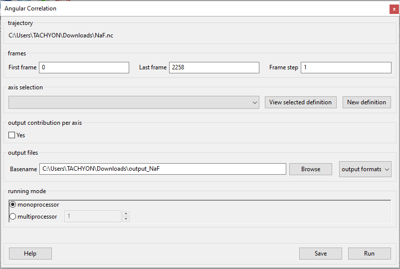
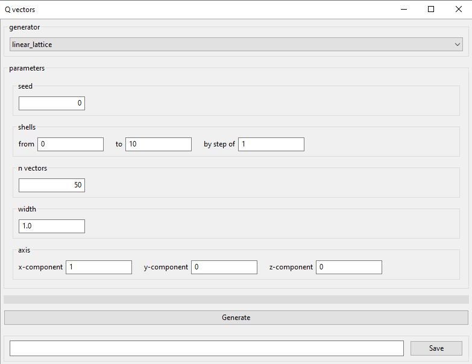
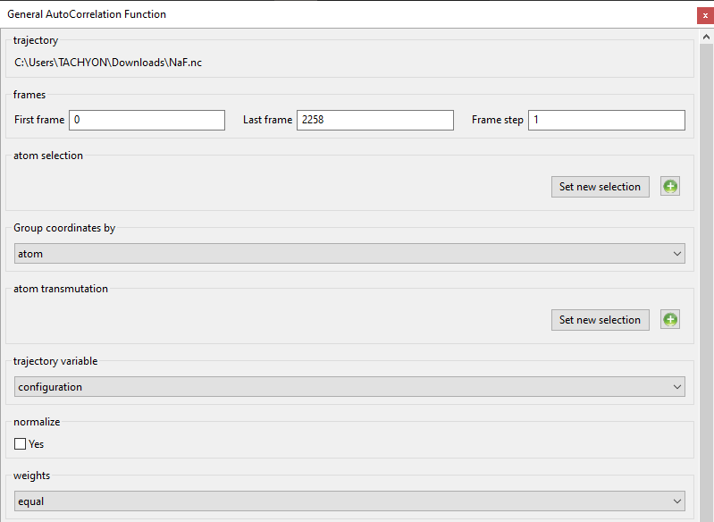

Glossary of Parameters
=======================

Each `analysis <#_Analysis>`__ window is different since each requires
different parameters to be configured before it can be run. However, all
of them have the same structure (example window below), consisting of
these parts:

-  **trajectory** box shows the path to the `MMTK
   NetCDF <#_NetCDF_file_format>`__ trajectory that this analysis will
   be performed on.

-  **Parameters** are a group of options, all of which are explored in
   the following sections. These are the options which vary from
   analysis to analysis. The only parameters that exist on every
   analysis are Frames and Output files.

-  **Buttons** are situated at the bottom of each analysis and consist
   of these options:

   -  **Help** opens the source code documentation for the relevant
      class in an MDANSE window.
   -  **Save** opens a file browser that allows you to save the current
      analysis with the set options into a python script which can be
      run from the command line. More information about scripts in
      `Using MDANSE from command line. <#_Using_MDANSE_from>`__
   -  **Run** starts the analysis and prompts you whether you want to
      close the window. The status of the analysis can be found in the
      `Jobs <#_Jobs>`__ panel, though there is a known bug where
      successful analyses do not show up.

Frames
~~~~~~

This parameter is always situated at the top of the analysis window,
right below the trajectory box. It allows you to configure which frames
in the trajectory are to be analysed. It consists of these three boxes:

-  **First frame**

*Format:* int

*Default:* 0

*Description:* the frame from which the analysis will begin, the first
frame taken into account.

-  **Last frame**

*Format:* int

*Default:* the last frame in the trajectory

*Description:* the frame until which the analysis proceeds. The last
frame taken into account.

-  **Frame step**

*Format:* int

*Default:* 1

*Description:* determines the periodicity of which steps are used and
which are skipped. 1 means that all frames are read, 2 means every other
is read, etc.

Output files
~~~~~~~~~~~~

This is one of the two parameters that are present in each analysis, the
other being `Frames <#_Frames>`__. It usually appears at the bottom of
an `analysis window <#_A3.2._Analysis_window>`__, right above the
buttons. It consists of these three parts:

-  **output files**

*Format:* str

*Default:*
mmtk_trajectory_directory_path\\<trajectory_filename>_<analysis_acronym>

Here, mmtk_trajectory_directory_path is the path to the directory where
the NetCDF file that is being used for analysis is located. The
<trajectory_filename> is the name of the NetCDF file.
<trajectory_filename> is the shortened name of the analysis, e.g. disf
for dynamic incoherent structure factor. How this translates into
practice can be seen in the picture above.

Further, if the above path already exists, (n) will be appended to the
end of the file name, where n is the lowest number for which a file
doesn’t exist. This way, no overwriting occurs.

*Description:* determines the location where the analysis results will
be stored. **Browse** button can be used to find the location using a
file browser.

-  **Browse** button opens a system file browser window, allowing the
   navigation of the filesystem.
-  **output formats**

*Format:* drop-down

*Default:* netcdf

*Description:* specifies the `file formats <#_Input_and_output>`__ in
which the analysis results are saved. `NetCDF <#_NetCDF_file_format>`__,
`ASCII <#_DAT_file_format>`__, or both can be selected. The name of
these files is given in the ‘Basename’ string.

Creating selections
~~~~~~~~~~~~~~~~~~~

There are the following Selections in MDANSE, each of which provides a
variety of ways to alter the analysis:

-  `Axis Selection <#_Axis_Selection_1>`__
-  `Atom Selection <#_Atom_Selection_1>`__
-  `Atom Transmutation <#_Atom_Transmutation_1>`__
-  `Atom Charges <#_Atom_Charges_1>`__
-  Q Vectors (explored separately in the `next
   section <#_A3.4._Q_vectors>`__)

The ones relevant to the analysis are present in its window, but some
can also be performed from `Molecular Viewer <#_Molecular_Viewer>`__. By
default, there are no Selections saved in MDANSE; they all have to be
created manually. Each selection is unique to a trajectory MMTK NetCDF
file, but all selections are stored in the same folder, $APPDATA/mdanse.
Therefore, if a selection is to be reuse, it is important to give
selections unique names even when creating the same selection for
multiple trajectories. To help with that, all existing saved selection
can be viewed in the User Definition Viewer which can be accessed from
the `toolbar <#_Toolbar>`__. To save a selection, type a name in the
field next to the **Save** button, and then click on the button. This
will save the selection without closing the window.

Axis Selection/Reference Basis
^^^^^^^^^^^^^^^^^^^^^^^^^^^^^^

Inside an analysis window, Axis Selection looks like this:

The drop-down menu is used to choose one of the existing definitions.
Only the definitions with the format matching the analysis, i.e. those
with the same number of selected atoms as the analysis expects, will
appear. New ones can be created by clicking on the **New definition**
button, which will open the window below. The details of the currently
selected definition can be viewed in the User Definition Viewer by
clicking on the **View selected definition**.

When this window is opened from an analysis window, the ‘Number of
atoms’ field at the top will be set to the number of atoms that must be
selected for the selection to work in the analysis from whose window it
was opened. The field will also not be editable. Thus, when the New
definition button is clicked in `Angular
Correlation <#_Angular_Correlation>`__ analysis, the field will be set
to 2, because that is how many it requires.

The number of atoms indicates how many atoms from one molecule must be
selected. To select an atom, click on the + button in the ‘Molecules’
list to show which atoms that molecule contains, and then double-click
the atom. That will cause the chosen atom to appear in the ‘Selected
atoms’ list, and its details in the box below. An atom can be removed
from selection by clicking on it in the ‘Selected atoms’ list and
hitting the Delete key on the keyboard.

Axis selection is available for `Angular
Correlation <#_Angular_Correlation>`__ and `Order
Parameter <#_Order_Parameter>`__ analyses, which both require 2 atoms to
be selected, and the `Spatial Density <#_Spatial_Density>`__ analysis,
which requires 3 atoms.

Output contribution per axis
''''''''''''''''''''''''''''

.. image:: ./Pictures/10000001000003220000027563B8CBFF70E2089C.png
   :width: 15.921cm
   :height: 1.147cm

This is an option that is always and only available in analyses that use
`Axis Selection <#_Axis_Selection_1>`__. It is a checkbox and is by
default unchecked. This represents that the analysis is performed
normally, ie. the calculated value is averaged over the selected axes.
If this box is checked, another output is generated by the analysis in
which the values calculated for each axis are saved separately. This can
then be plotted on a 3D graph.

Atom Selection
^^^^^^^^^^^^^^

Atom Selection allows you to select any set of atoms and/or other
particles. These selected particles are then the ones that are made the
target of the analysis. There is no limit to which particles can be
included in a selection, or to how many selections can be used
simultaneously. There can even be none; Atom Selection is entirely
optional.

Inside an analysis window, Atom Selection appears thusly:

The green button adds a line for another selection, allowing you to
choose one more selection to apply to that analysis:

.. image:: ./Pictures/100000010000030200000070CC785E9ACCB53208.png
   :width: 15.921cm
   :height: 2.316cm

The line can be removed by clicking on the red button. The drop-down
menu and the **View selected definition** button work the way they do in
Axis Selection <link>. The **Set new selection** button opens the
following window:

The **Filter by** field contains different ways to access the various
particles in the loaded trajectory. Clicking on a filter will make all
the relevant particles appear in the top right box:

Clicking on the particles/groups in that window will highlight them and
make them appear in the **Selection** box. Together with the buttons for
logical operations, it is possible to make complex selections, like so:

The large box below the **Selection** box should show information about
your selection, but it is broken for complex selections. The box at the
very bottom, next to the **Save** button, is used for naming the
selection. Each selection must be named with a unique name. The **Save**
button saves the selection for the loaded trajectory, but it will not
close the Atom Selection window. Once selection has been saved, it
should appear in the drop-down menu in the analysis window.

Atom selection is available for all the analyses for which `Atom
Transmutation <#_Atom_Transmutation_1>`__ is available, as well as all
`Trajectory <#_Trajectory>`__ analyses, `Dipole Auto Correlation
Function <#_Dipole_AutoCorrelation_Function>`__, `Molecular
Trace <#_Molecular_Trace>`__, `Root Mean Square
Fluctuation, <#_Root_Mean_Square_1>`__ `Radius of
Gyration <#_Radius_Of_Gyration>`__, `Solvent Accessible
Surface <#_Solvent_Accessible_Surface>`__, and `Spatial
Density <#_Spatial_Density>`__.

Atom Transmutation
^^^^^^^^^^^^^^^^^^

Atom Transmutation can be used to simulate the effect of isotopic
substitution. By default, in the converted trajectory each chemical
element corresponds to the weighted sum (using the natural abundances)
of all its possible isotopes. You can use this option to force a given
atom to be a particular isotope.

This selection appears very similar to Atom Selection inside an analysis
window (as in figure below) and so can be operated the same way. In
fact, it requires an Atom Selection to function. That is because Atom
Transmutation gets applied to an Atom Selection.

To use Atom Transmutation, simply select an Atom Selection in the grey
drop-down menu on the left, and then choose the element into which the
atoms in that Atom Selection will be transmuted from the white drop-down
menu next to the red button. For example, the below Atom Transmutation
will transmute all sodium ions into potassium ions:

This parameter is available for the following analyses: `Coordination
Number <#_Coordination_Number>`__, `Current Correlation
Function <#_Current_Correlation_Function>`__, `Density Of
States <#_Density_Of_States>`__, `Density
Profile <#_Density_Profile>`__, `Dynamic Coherent Structure
Factor <#_Dynamic_Coherent_Structure>`__, `Dynamic Incoherent Structure
Factor <#_Dynamic_Incoherent_Structure>`__,
`Eccentricity <#_Eccentricity>`__, `Elastic Incoherent Structure
Factor <#_Elastic_Incoherent_Structure>`__, `Gaussian Dynamic Incoherent
Structure Factor <#_Gaussian_Dynamic_Incoherent>`__, `General Auto
Correlation Function <#_General_AutoCorrelation_Function>`__, `Mean
Square Displacement <#_Mean_Square_Displacement>`__, `Neutron Dynamic
Total Structure Factor <#_Neutron_Dynamic_Total>`__, `Order
Parameter <#_Order_Parameter>`__, `Pair Distribution
Function <#_Pair_Distribution_Function>`__, `Position Auto Correlation
Function <#_Position_AutoCorrelation_Function>`__, `Root Mean Square
Deviation <#_Root_Mean_Square>`__, `Static Structure
Factor <#_Static_Structure_Factor>`__, `Velocity Auto Correlation
Function <#_Velocity_AutoCorrelation_Function>`__, `X-Ray Static
Structure Factor <#_Xray_Static_Structure>`__.

Atom Charges
^^^^^^^^^^^^

This selection works inside an analysis window exactly the same as `Axis
Selection <#_Axis_Selection>`__. The only difference is the window that
opens when **Set new selection** button is clicked. The Partial Charges
window appears as below, and allows you to edit the charges at each atom
inside the system. To do that, simply click on a field in the **charge**
column and type in a number. The change will be confirmed once you hit
enter or click outside the field. Once all changes have been made, name
the selection using the box at the bottom, then click the **Save**
button, and finally close the window.

This parameter is only available for the `Dipole Auto Correlation
Function <#_Dipole_AutoCorrelation_Function>`__ analysis.

Q vectors
~~~~~~~~~

Similar to the selections above but specific to `Scattering
Plugin <#_Scattering>`__\ s, Q vectors give the opportunity to change
how the analysis is performed. Each window has a part like this:

This section must be filled for analysis to be able to run. Like for
other selections, there are no definitions by default. Therefore, one
has to be created by clicking on the **New definition** button. This
will open a window like in one of the following subsections, which show
how Q Vectors are defined for each type of Q Vector. There are many
types, and it is up to you to choose which is the best for a given
experiment.

Once a definition of choice exists, it can be selected from the
drop-down menu. The **View selected definition** opens the User
Definition viewer <link> at the currently selected definition.

Spherical Lattice Vectors
^^^^^^^^^^^^^^^^^^^^^^^^^

Generates a set of hkl vectors compatible with the simulation box and
groups them in shells going from the minimum and maximum values provided
by the user with the given step (the values have to be given in
nm\ :sup:`-1`). The maximum number of vectors in each shell must also be
given. Increasing the number of vectors will improve the statistics of
your result, but the calculation will also take longer. Note also that
for the lowest values of \|Q|, the number of hkl vectors available may
be much smaller than this maximum number of vectors. The width defines
the accepted tolerance for a shell, so often the value for the width
will be the same as the step value. But it is also possible to give a
much smaller width in order to ensure a “high Q resolution” around
well-defined \|Q\| values.

This will be the usual choice whenever you want to compute the dynamical
coherent structure factor on an isotropic sample (a liquid or a
crystalline powder).

-  **seed**

*Format:* int

*Default:* 0

*Description*: the RNG seed used to generate the vectors. This will
ensure that the same random numbers are generated when the same **seed**
is used, therefore making the calculation more reproducible.

-  shells

   -  **from**

*Format:* int

*Default:* 0

*Description:* the minimum value used to construct the range of shells.

-  

   -  **to**

*Format:* int

*Default:* 0

*Description:* the maximum value used to construct the range of shells.

-  

   -  **by step of**

*Format:* int

*Default:* 1

*Description:* the step used to construct the range of shells. If it is
1, every integer between **from** and **to** is placed into the range,
if it is 2, every other, etc.

-  **n vectors**

*Format:* int

*Default:* 50

*Description:* the number of hkl vectors in each shell. Higher values
result in higher accuracy but at the cost of longer computational time.

-  **width**

*Format:* float

*Default:* 1.0

*Description:* the accepted tolerance of each shell. It is often
identical to **by step of**.

-  **Generate** button generates the hkl vectors based on the
   specifications above. It must be clicked before the vectors can be
   saved.
-  **Name**

*Format:* str

*Default:* None

*Description:* this is the empty box at the bottom of the window. It
allows you to name the generated vectors. This must be set before the
vectors can be saved.

-  **Save** button saves the generated vectors. It does not close the Q
   Vectors window.

Circular Lattice Vectors
^^^^^^^^^^^^^^^^^^^^^^^^

Similar to Spherical Lattice Vectors, but in this case the vectors are
generated only in a plane perpendicular to the two axes given.

-  **seed**

*Format:* int

*Default:* 0

*Description*: the RNG seed used to generate the vectors. This will
ensure that the same random numbers are generated when the same **seed**
is used, therefore making the calculation more reproducible.

-  shells

   -  **from**

*Format:* int

*Default:* 0

*Description:* the minimum value used to construct the range of shells.

-  

   -  **to**

*Format:* int

*Default:* 0

*Description:* the maximum value used to construct the range of shells.

-  

   -  **by step of**

*Format:* int

*Default:* 1

*Description:* the step used to construct the range of shells. If it is
1, every integer between **from** and **to** is placed into the range,
if it is 2, every other, etc.

-  **n vectors**

*Format:* int

*Default:* 50

*Description:* the number of hkl vectors in each shell. Higher values
result in higher accuracy but at the cost of longer computational time.

-  **width**

*Format:* float

*Default:* 1.0

*Description:* the accepted tolerance of each shell. It is often
identical to **by step of**.

-  axis 1

   -  **x-component**

*Format:* int

*Default:* 1

*Description:* the x-components of the first axis used to specify the
plane.

-  

   -  **y-component**

*Format:* int

*Default:* 0

*Description:* the y-components of the first axis used to specify the
plane.

-  

   -  **z-component**

*Format:* int

*Default:* 0

*Description:* the z-components of the first axis used to specify the
plane.

-  axis 2

   -  **x-component**

*Format:* int

*Default: 0*

*Description:* the x-components of the second axis used to specify the
plane.

-  

   -  **y-component**

*Format:* int

*Default:* 1

*Description:* the y-components of the second axis used to specify the
plane.

-  

   -  **z-component**

*Format:* int

*Default:* 0

*Description:* the z-components of the second axis used to specify the
plane.

-  **Generate** button generates the hkl vectors based on the
   specifications above. It must be clicked before the vectors can be
   saved.
-  **Name**

*Format:* str

*Default:* None

*Description:* this is the empty box at the bottom of the window. It
allows you to name the generated vectors. This must be set before the
vectors can be saved.

-  **Save** button saves the generated vectors. It does not close the Q
   Vectors window.

Linear Lattice Vectors
^^^^^^^^^^^^^^^^^^^^^^

Similar to Spherical Lattice Vectors and CircularLattice Vectors, but
now the vectors are generated only along a specific direction determined
by the axis given.

-  **seed**

*Format:* int

*Default:* 0

*Description*: the RNG seed used to generate the vectors. This will
ensure that the same random numbers are generated when the same **seed**
is used, therefore making the calculation more reproducible.

-  shells

   -  **from**

*Format:* int

*Default:* 0

*Description:* the minimum value used to construct the range of shells.

-  

   -  **to**

*Format:* int

*Default:* 0

*Description:* the maximum value used to construct the range of shells.

-  

   -  **by step of**

*Format:* int

*Default:* 1

*Description:* the step used to construct the range of shells. If it is
1, every integer between **from** and **to** is placed into the range,
if it is 2, every other, etc.

-  **n vectors**

*Format:* int

*Default:* 50

*Description:* the number of hkl vectors in each shell. Higher values
result in higher accuracy but at the cost of longer computational time.

-  **width**

*Format:* float

*Default:* 1.0

*Description:* the accepted tolerance of each shell. It is often
identical to **by step of**.

-  axis

   -  **x-component**

*Format:* int

*Default:* 1

*Description:* the x-components of the specified axis.

-  

   -  **y-component**

*Format:* int

*Default:* 0

*Description:* the y-components of the specified axis..

-  

   -  **z-component**

*Format:* int

*Default:* 0

*Description:* the z-components of the specified axis.

-  **Generate** button generates the hkl vectors based on the
   specifications above. It must be clicked before the vectors can be
   saved.
-  **Name**

*Format:* str

*Default:* None

*Description:* this is the empty box at the bottom of the window. It
allows you to name the generated vectors. This must be set before the
vectors can be saved.

-  **Save** button saves the generated vectors. It does not close the Q
   Vectors window.

Miller Indices Lattice Vectors
^^^^^^^^^^^^^^^^^^^^^^^^^^^^^^

Similar to spherical_lattice, as it generates integer hkl vectors, but
provides extra flexibility in selecting the hkl values. For example, it
can be used to generate only h00 vectors.

-  **seed**

*Format:* int

*Default:* 0

*Description*: the RNG seed used to generate the vectors. This will
ensure that the same random numbers are generated when the same **seed**
is used, therefore making the calculation more reproducible.

-  shells

   -  **from**

*Format:* int

*Default:* 0

*Description:* the minimum value used to construct the range of shells.

-  

   -  **to**

*Format:* int

*Default:* 0

*Description:* the maximum value used to construct the range of shells.

-  

   -  **by step of**

*Format:* int

*Default:* 1

*Description:* the step used to construct the range of shells. If it is
1, every integer between **from** and **to** is placed into the range,
if it is 2, every other, etc.

-  **width**

*Format:* float

*Default:* 1.0

*Description:* the accepted tolerance of each shell. It is often
identical to **by step of**.

-  h (and the same goes for k and l fields)

   -  **from**

*Format:* int

*Default:* 0

*Description:* the minimum value used to construct the range of h
vectors.

-  

   -  **to**

*Format:* int

*Default:* 0

*Description:* the maximum value used to construct the range of h
vectors.

-  

   -  **by step of**

*Format:* int

*Default:* 1

*Description:* the step used to construct the range of h vectors. If it
is 1, every integer between **from** and **to** is placed into the
range, if it is 2, every other, etc.

-  **Generate** button generates the hkl vectors based on the
   specifications above. It must be clicked before the vectors can be
   saved.
-  **Name**

*Format:* str

*Default:* None

*Description:* this is the empty box at the bottom of the window. It
allows you to name the generated vectors. This must be set before the
vectors can be saved.

-  **Save** button saves the generated vectors. It does not close the Q
   Vectors window.

Spherical Vectors
^^^^^^^^^^^^^^^^^

Similar to Spherical Lattice Vectors, but the generated hkl are not
integers. This means that **these vectors should never be used to
compute any coherent property!** But you can use them if you are only
interested in single particle properties, as the dynamic incoherent or
the elastic incoherent structure factor. They have the advantage that
there are no limitations in the available values, so you will be able to
generate always as many vectors as you want, including at low \|Q|.

However, if you are interested in computing and comparing/combining both
the dynamic coherent and incoherent structure factors, it is preferable
that you generate a single set of vectors using the Spherical_lattice
option and use the same set for both calculations.

-  **seed**

*Format:* int

*Default:* 0

*Description*: the RNG seed used to generate the vectors. This will
ensure that the same random numbers are generated when the same **seed**
is used, therefore making the calculation more reproducible.

-  shells

   -  **from**

*Format:* int

*Default:* 0

*Description:* the minimum value used to construct the range of shells.

-  

   -  **to**

*Format:* int

*Default:* 0

*Description:* the maximum value used to construct the range of shells.

-  

   -  **by step of**

*Format:* int

*Default:* 1

*Description:* the step used to construct the range of shells. If it is
1, every integer between **from** and **to** is placed into the range,
if it is 2, every other, etc.

-  **n vectors**

*Format:* int

*Default:* 50

*Description:* the number of hkl vectors in each shell. Higher values
result in higher accuracy but at the cost of longer computational time.

-  **width**

*Format:* float

*Default:* 1.0

*Description:* the accepted tolerance of each shell. It is often
identical to **by step of**.

-  **Generate** button generates the hkl vectors based on the
   specifications above. It must be clicked before the vectors can be
   saved.
-  **Name**

*Format:* str

*Default:* None

*Description:* this is the empty box at the bottom of the window. It
allows you to name the generated vectors. This must be set before the
vectors can be saved.

-  **Save** button saves the generated vectors. It does not close the Q
   Vectors window.

Circular Vectors
^^^^^^^^^^^^^^^^

Similar to Spherical Vectors, but in this case the vectors are generated
only in a plane perpendicular to the two axes given.

-  **seed**

*Format:* int

*Default:* 0

*Description*: the RNG seed used to generate the vectors. This will
ensure that the same random numbers are generated when the same **seed**
is used, therefore making the calculation more reproducible.

-  shells

   -  **from**

*Format:* int

*Default:* 0

*Description:* the minimum value used to construct the range of shells.

-  

   -  **to**

*Format:* int

*Default:* 0

*Description:* the maximum value used to construct the range of shells.

-  

   -  **by step of**

*Format:* int

*Default:* 1

*Description:* the step used to construct the range of shells. If it is
1, every integer between **from** and **to** is placed into the range,
if it is 2, every other, etc.

-  **n vectors**

*Format:* int

*Default:* 50

*Description:* the number of hkl vectors in each shell. Higher values
result in higher accuracy but at the cost of longer computational time.

-  **width**

*Format:* float

*Default:* 1.0

*Description:* the accepted tolerance of each shell. It is often
identical to **by step of**.

-  axis 1

   -  **x-component**

*Format:* int

*Default:* 1

*Description:* the x-components of the first axis used to specify the
plane.

-  

   -  **y-component**

*Format:* int

*Default:* 0

*Description:* the y-components of the first axis used to specify the
plane.

-  

   -  **z-component**

*Format:* int

*Default:* 0

*Description:* the z-components of the first axis used to specify the
plane.

-  axis 2

   -  **x-component**

*Format:* int

*Default: 0*

*Description:* the x-components of the second axis used to specify the
plane.

-  

   -  **y-component**

*Format:* int

*Default:* 1

*Description:* the y-components of the second axis used to specify the
plane.

-  

   -  **z-component**

*Format:* int

*Default:* 0

*Description:* the z-components of the second axis used to specify the
plane.

-  **Generate** button generates the hkl vectors based on the
   specifications above. It must be clicked before the vectors can be
   saved.
-  **Name**

*Format:* str

*Default:* None

*Description:* this is the empty box at the bottom of the window. It
allows you to name the generated vectors. This must be set before the
vectors can be saved.

-  **Save** button saves the generated vectors. It does not close the Q
   Vectors window.

Linear Vectors
^^^^^^^^^^^^^^

Similar to Spherical Vectors and Circular Vectors, but now the vectors
are generated only along a specific direction determined by the axis
given.

.. image:: ./Pictures/1000000100000312000002623129F3A7253B13AD.png
   :width: 15.921cm
   :height: 12.356cm

-  **seed**

*Format:* int

*Default:* 0

*Description*: the RNG seed used to generate the vectors. This will
ensure that the same random numbers are generated when the same **seed**
is used, therefore making the calculation more reproducible.

-  shells

   -  **from**

*Format:* int

*Default:* 0

*Description:* the minimum value used to construct the range of shells.

-  

   -  **to**

*Format:* int

*Default:* 0

*Description:* the maximum value used to construct the range of shells.

-  

   -  **by step of**

*Format:* int

*Default:* 1

*Description:* the step used to construct the range of shells. If it is
1, every integer between **from** and **to** is placed into the range,
if it is 2, every other, etc.

-  **n vectors**

*Format:* int

*Default:* 50

*Description:* the number of hkl vectors in each shell. Higher values
result in higher accuracy but at the cost of longer computational time.

-  **width**

*Format:* float

*Default:* 1.0

*Description:* the accepted tolerance of each shell. It is often
identical to **by step of**.

-  axis

   -  **x-component**

*Format:* int

*Default:* 1

*Description:* the x-components of the specified axis.

-  

   -  **y-component**

*Format:* int

*Default:* 0

*Description:* the y-components of the specified axis..

-  

   -  **z-component**

*Format:* int

*Default:* 0

*Description:* the z-components of the specified axis.

-  **Generate** button generates the hkl vectors based on the
   specifications above. It must be clicked before the vectors can be
   saved.
-  **Name**

*Format:* str

*Default:* None

*Description:* this is the empty box at the bottom of the window. It
allows you to name the generated vectors. This must be set before the
vectors can be saved.

-  **Save** button saves the generated vectors. It does not close the Q
   Vectors window.

Grid Vectors
^^^^^^^^^^^^

Generates hkl vectors in the given range. They are grouped together
according to the given qstep.

-  **seed**

*Format:* int

*Default:* 0

*Description*: the RNG seed used to generate the vectors. This will
ensure that the same random numbers are generated when the same **seed**
is used, therefore making the calculation more reproducible.

-  hrange (and the same goes for krange and lrange fields)

   -  **from**

*Format:* int

*Default:* 0

*Description:* the minimum value used to construct the range of h
vectors.

-  

   -  **to**

*Format:* int

*Default:* 0

*Description:* the maximum value used to construct the range of h
vectors.

-  

   -  **by step of**

*Format:* int

*Default:* 1

*Description:* the step used to construct the range of h vectors. If it
is 1, every integer between **from** and **to** is placed into the
range, if it is 2, every other, etc.

-  **qstep**

*Format:* float

*Default:* 0.01

*Description:* determines how the hkl vectors are grouped.

-  **Generate** button generates the hkl vectors based on the
   specifications above. It must be clicked before the vectors can be
   saved.
-  **Name**

*Format:* str

*Default:* None

*Description:* this is the empty box at the bottom of the window. It
allows you to name the generated vectors. This must be set before the
vectors can be saved.

-  **Save** button saves the generated vectors. It does not close the Q
   Vectors window.

Approximated Dispersion Vectors
^^^^^^^^^^^^^^^^^^^^^^^^^^^^^^^

Generates Q vectors along the line joining the 2 Q-points given as
input.

-  **generator**

*Format:* drop-down

*Default:* circular_lattice

*Description:* the selection of which type of Q Vectors is being
defined.

-  Q start (nm^-1) – the first of the two Q points (the same goes for
   the second one)

   -  **x-component**

*Format:* int

*Default:* 1

*Description:* the x-component of this Q point.

-  

   -  **y-component**

*Format:* int

*Default:* 0

*Description:* the y-component of this Q point.

-  

   -  **z-component**

*Format:* int

*Default:* 0

*Description:* the z-component of this Q point.

-  **Q step (nm^-1)**

*Format:* float

*Default:* 0.1

*Description:* the increment by which Q is increased when tracing the
line between the two points.

-  **Generate** button generates the hkl vectors based on the
   specifications above. It must be clicked before the vectors can be
   saved.
-  **Name**

*Format:* str

*Default:* None

*Description:* this is the empty box at the bottom of the window. It
allows you to name the generated vectors. This must be set before the
vectors can be saved.

-  **Save** button saves the generated vectors. It does not close the Q
   Vectors window.

Group coordinates by
~~~~~~~~~~~~~~~~~~~~

.. image:: ./Pictures/1000000100000323000002D1329469D922AFA541.png
   :width: 15.921cm
   :height: 1.27cm

Most of the analyses provide the Group coordinates option. The default
value is atom, indicating that the calculation will be done using the
atomic positions of all the atoms currently selected. But you can use
this option to “merge” all the atoms belonging to a given group into a
single position, which will be used then in the calculation. For
example, this can be used to compute the mean square displacement of the
molecular centres. Naturally, the availability of the different group
options (group, residue, chain, molecule) will depend on the nature of
your system and how MDANSE interpreted during the conversion step.

This parameter is available in the following analyses: `Centre of Masses
Trajectory <#_Center_Of_Masses>`__, `Density of
States <#_Density_Of_States>`__, `Dynamic Incoherent Structure
Factor <#_Dynamic_Incoherent_Structure>`__, `Elastic Incoherent
Structure Factor <#_Elastic_Incoherent_Structure>`__, `Gaussian Dynamic
Incoherent Structure Factor <#_Gaussian_Dynamic_Incoherent>`__, `General
Auto Correlation Function <#_General_AutoCorrelation_Function>`__, `Mean
Square Displacement <#_Mean_Square_Displacement>`__, `Order
Parameter <#_Order_Parameter>`__, `Rigid Body
Trajectory <#_Rigid_Body_Trajectory>`__, `Root Mean Square
Deviation <#_Root_Mean_Square>`__, `Root Mean Square
Fluctuation <#_Root_Mean_Square_1>`__, `Velocity Auto Correlation
Function <#_Velocity_AutoCorrelation_Function>`__.

Instrument resolution
~~~~~~~~~~~~~~~~~~~~~

.. image:: ./Pictures/1000000100000323000002D1329469D922AFA541.png
   :width: 15.921cm
   :height: 1.411cm

This option is available in all the analyses performing a time Fourier
Transform, e.g. for the calculation of the density of states or the
dynamic structure factor. You can choose the shape of the resolution
(default is Gaussian), the position (default is at =0) and the
parameter defining the width of the function in frequency space ( for
the Gaussian resolution). Those parameters define a function R() and
its analytical Fourier Transform R(t) is then used to compute I(t)R(t),
where I(t) is the time-dependent property directly computed from the
trajectory (e.g. the velocity autocorrelation function for the DOS, or
the intermediate scattering function for the S(Q,)). The product is the
Fourier transformed to obtain the final result.

The main purpose of the instrument resolution is therefore to smooth the
function computed directly in time before performing its Fourier
Transform into frequency space, in order to avoid numerical artefacts
when FT noisy data. But it can be also used as an approximate way of
estimating instrument resolution effects if you give a value of 
similar to the one of the experimental resolutions. For example, if you
are going to compare your simulation with data measured on a
spectrometer having a resolution of 0.1 meV (FWHM), then use:

.. math:: \sigma\approx\frac{\mathit{FWHM}{\lbrack\text{meV}\rbrack}}{2.35}\times 1.519\frac{\lbrack\text{ps}^{\text{-1}}\rbrack}{\lbrack\text{meV}\rbrack}\approx 0.065\text{ps}^{\text{-1}}

This parameter is available for the following analyses: `Current
Correlation Function <#_Current_Correlation_Function>`__, `Density of
States <#_Density_Of_States>`__, `Dynamic Coherent Structure
Factor <#_Dynamic_Coherent_Structure>`__, `Dynamic Incoherent Structure
Factor <#_Dynamic_Incoherent_Structure>`__, `Gaussian Dynamic Incoherent
Structure Factor <#_Gaussian_Dynamic_Incoherent>`__, `Neutron Dynamic
Total Structure Factor <#_Neutron_Dynamic_Total>`__, `Structure Factor
From Scattering Function <#_Structure_Factor_From>`__.

Interpolation order
~~~~~~~~~~~~~~~~~~~

.. image:: ./Pictures/1000000100000323000002D1329469D922AFA541.png
   :width: 15.921cm
   :height: 1.341cm

Analyses that require atomic velocity data have an option to interpolate
this data from atomic positions. By default, no interpolation is
performed and instead MDANSE attempts to use the velocities stored int
the NetCDF trajectory. If an order is selected, MDANSE performs a
numerical differentiation of the positional data. There are options to
differentiate using 1\ :sup:`st` to 5\ :sup:`th` order.

-  Order 1

   -  The first time-derivative of each point r(t\ :sub:`i`) is
      calculated as

.. math::

   \begin{matrix}
   {\overset{˙}{r}{\left( t_{i} \right) = \frac{r{\left( t_{i + 1} \right) - r}\left( t_{i} \right)}{\mathit{\Delta t}}}} \\
   \left( {\mathit{SEQ}\mathit{Equation}\mathit{ARABIC}113} \right) \\
   \end{matrix}

-  

   -  

      -  Δt is the time step

-  Order N = {2, 3, 4, 5}

   -  MDANSE calculates the first time-derivative of each point
      r(t\ :sub:`i`) (r = x,y,z) using the N-order polynomial,
      interpolating the N+1 points across r(t\ :sub:`i`), where
      r(t\ :sub:`i`) belongs to this set. Please see Ref
      [`36 <#SignetBibliographie_036>`__] for more information.

Interpolation order is available for the following analyses: `Current
Correlation Function <#_Current_Correlation_Function>`__, `Density of
States <#_Density_Of_States>`__, `Temperature <#_Temperature>`__,
`Velocity Auto Correlation
Function <#_Velocity_AutoCorrelation_Function>`__. However, please note
that due to the nature of the `Current Correlation
Function <#_Current_Correlation_Function>`__ analysis, the interpolation
there is more complicated, the details of which can be found in its
`section <#_GUI>`__.

Normalize
~~~~~~~~~

This parameter provides the option to normalise the results of the
analysis. By default, no normalisation is performed.

Normalisation is available for the following analyses: `Current
Correlation Function <#_Current_Correlation_Function>`__, `General Auto
Correlation Function <#_General_AutoCorrelation_Function>`__, `Position
Auto Correlation Function <#_Position_AutoCorrelation_Function>`__,
`Velocity Auto Correlation
Function <#_Velocity_AutoCorrelation_Function>`__.

Project coordinates 
~~~~~~~~~~~~~~~~~~~~

.. image:: ./Pictures/1000000100000323000002D1329469D922AFA541.png
   :width: 15.552cm
   :height: 2.399cm

Use this option to use only the projection of the atom coordinates on a
particular axis or plane. Note that the reference axis are the
orthonormal X, Y, Z axes, which in most cases correspond to the usual
axes of the simulation box. But if you have done a simulation using a
non-orthorombic box, remember that the projection is done using the
orthonormal X, Y, Z spatial axes as a reference, and not with the a, b,
c “crystal unit cell” ones.

This parameter is available for the following analyses: `Density of
States <#_Density_Of_States>`__, `Dynamic Incoherent Structure
Factor <#_Dynamic_Incoherent_Structure>`__, `Elastic Incoherent
Structure Factor <#_Elastic_Incoherent_Structure>`__, `Gaussian Dynamic
Incoherent Structure Factor <#_Gaussian_Dynamic_Incoherent>`__, `Mean
Square Displacement <#_Mean_Square_Displacement>`__, `Position Auto
Correlation Function <#_Position_AutoCorrelation_Function>`__, `Velocity
Auto Correlation Function <#_Velocity_AutoCorrelation_Function>`__.

Weights
~~~~~~~

.. image:: ./Pictures/1000000100000323000002D1329469D922AFA541.png
   :width: 15.921cm
   :height: 1.295cm

Most of the analyses include a weights option. The default value depends
on the nature of the analysis. In many cases, it is set to ‘equal’,
indicating that all atoms in the system contribute with the same weight
to the computation of this property. But in scattering analysis, the
default is b\ :sub:`coh` for coherent and b\ :sup:`2`\ :sub:`inc` for
incoherent analyses. In any case, if needed the user can select any
other numerical property from the MDANSE database to be used as
weighting factor.

The weights apply to the chemical elements present in the system and are
used to compute the total property. A particular analysis will compute
the desired property *P* either for all the different elements
identified in the system (in the case of a single particle analysis,
such as the mean square displacement, the velocity autocorrelation
function or the dynamic incoherent structure factor) or for all the
possible pairs of different elements (in the case of a collective
analysis such as the partial distribution function or the dynamic
coherent structure factor). The partials *P*\ :sub:`i` or *P*\ :sub:`ij`
are saved together with the total result, which is calculated as:

.. math:: {P_{\mathit{total}} = \frac{\sum\limits_{i}{c_{i}w_{i}P}_{i}}{\sum\limits_{i}{c_{i}\left| w_{i} \right|}}}\text{or}{P_{\mathit{total}} = \frac{\sum\limits_{\mathit{ij}}{c_{i}{c_{j}w}_{i}w_{j}P}_{i}}{\sum\limits_{\mathit{ij}}{c_{i}c_{j}\left| w_{i} \right|\left| w_{j} \right|}}},

where the sum runs over the number of different chemical elements,
*c*\ :sub:`i` is the number concentration of element *i* and
*w*\ :sub:`i` its weight.

This parameter is available in the following analyses: `Current
Correlation Function <#_Current_Correlation_Function>`__, `Density of
States <#_Density_Of_States>`__, `Density
Profile <#_Density_Profile>`__, `Dynamic Coherent Structure
Factor <#_Dynamic_Coherent_Structure>`__, `Dynamic Incoherent Structure
Factor <#_Dynamic_Incoherent_Structure>`__,
`Eccentricity <#_Eccentricity>`__, `Elastic Incoherent Structure
Factor <#_Elastic_Incoherent_Structure>`__, `Gaussian Dynamic Incoherent
Structure Factor <#_Gaussian_Dynamic_Incoherent>`__, `General Auto
Correlation Function <#_General_AutoCorrelation_Function>`__, `Mean
Square Displacement <#_Mean_Square_Displacement>`__, `Pair Distribution
Function <#_Pair_Distribution_Function>`__, `Radius of
Gyration <#_Radius_Of_Gyration>`__, `Rigid Body
Trajectory <#_Rigid_Body_Trajectory>`__, `Root Mean Square
Deviation <#_Root_Mean_Square>`__, `Static Structure
Factor <#_Static_Structure_Factor>`__, `Velocity Auto Correlation
Function <#_Velocity_AutoCorrelation_Function>`__.

Running mode
~~~~~~~~~~~~

This parameter allows for the configuration of the number of processors
used to perform the analysis. By default, only one processor is used,
but if more are configured, MDANSE performs the analysis using parallel
processing, speeding it up.

Running mode is available for most analyses: all
`Dynamics <#_Dynamics>`__ analyses, all `Trajectory <#_Trajectory>`__
analyses, all `Thermodynamics <#_Thermodynamics>`__ analyses, `Area Per
Molecule <#_Area_Per_Molecule>`__, `Coordination
Number <#_Coordination_Number>`__, `Current Correlation
Function <#_Current_Correlation_Function>`__, `Density
Profile <#_Density_Profile>`__, `Dipole Auto Correlation
Function <#_Dipole_AutoCorrelation_Function>`__, `Dynamic Coherent
Structure Factor <#_Dynamic_Coherent_Structure>`__, `Dynamic Incoherent
Structure Factor <#_Dynamic_Incoherent_Structure>`__,
`Eccentricity <#_Eccentricity>`__, `Elastic Incoherent Structure
Factor <#_Elastic_Incoherent_Structure>`__, `Gaussian Dynamic Incoherent
Structure Factor <#_Gaussian_Dynamic_Incoherent>`__, `McStas Virtual
Instrument <#_McStas_Virtual_Instrument>`__, `Molecular
Trace <#_Molecular_Trace>`__, `Neutron Dynamic Total Structure
Factor <#_Neutron_Dynamic_Total>`__, `Order
Parameter <#_Order_Parameter>`__, `Pair Distribution
Function <#_Pair_Distribution_Function>`__, `Radius of
Gyration <#_Radius_Of_Gyration>`__, `Rigid Body
Trajectory <#_Rigid_Body_Trajectory>`__, `Root Mean Square
Deviation <#_Root_Mean_Square>`__, `Root Mean Square
Fluctuation <#_Root_Mean_Square_1>`__, `Spatial
Density <#_Spatial_Density>`__, `Static Structure
Factor <#_Static_Structure_Factor>`__, `Voronoi <#_Voronoi>`__, `X-Ray
Static Structure Factor <#_Xray_Static_Structure>`__.
