Plotting Options
================

Line Plotter
~~~~~~~~~~~~

.. _toolbar-1:

Toolbar
^^^^^^^

Data plotted with the Line Plotter will have the following menu beneath
the graph:

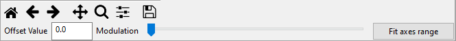

The top-row buttons, going from left to right, have the following
functions:

-  **Home** restores the plot to the default position. Ie. if it has
   been moved, zoomed in/out, axes adjusted, etc., it will be restored
   to the position it was in when it was plotted. This position is one
   MDANSE determined to be the best fit and shows all the data.

|image35|\ |image36|

-  **Back** undoes the latest action.
-  **Forward** redoes the latest undone action.
-  **Pan** gives the ability to use mouse to move the graph. After this
   option is activated, you can drag the plot around to adjust what is
   visible inside the axes. This mode can be disabled by clicking on its
   icon again.
-  **Zoom** gives the ability to zoom in. Once activated, you can select
   an area inside the axes that will be zoomed in on. This mode can be
   disabled by clicking on its icon again.
-  **Subplots** opens the Configure subplots window, like the one below.
   It can be used to adjust various parameters of the whole graph. The
   red lines signify the original positions, while the blue bars show
   the current value. The values can be adjusted by clicking inside the
   relevant bar, and the blue bar will move to the clicked position.
   PLEASE NOTE that whatever changes you make are automatically applied
   and saved. There is no confirmation prompt when closing this window,
   and when it is reopened, the red bars will move to the new positions.
   The changes can only be reverted by using the **Back** or **Home**
   buttons.

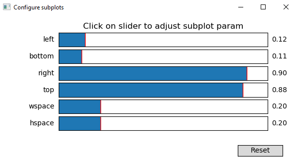

-  

   -  **left** moves the left vertical ax to change the size of the
      plot.

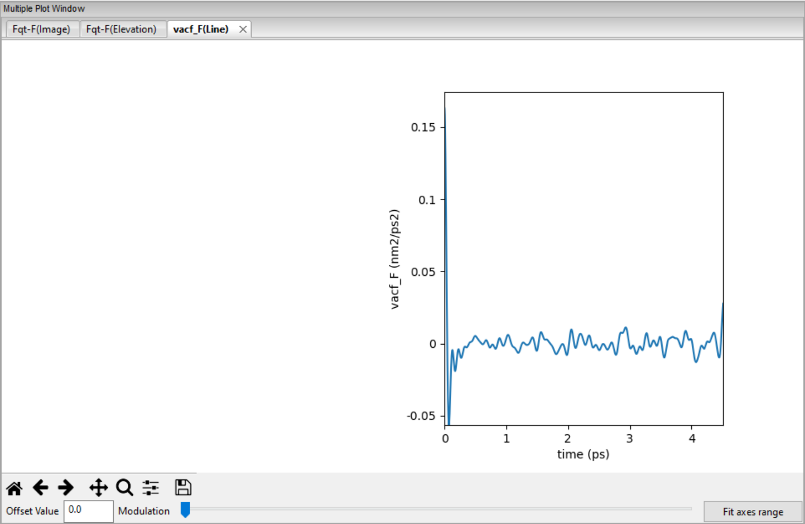

-  

   -  **bottom** moves the bottom horizontal ax to change the size of
      the plot.

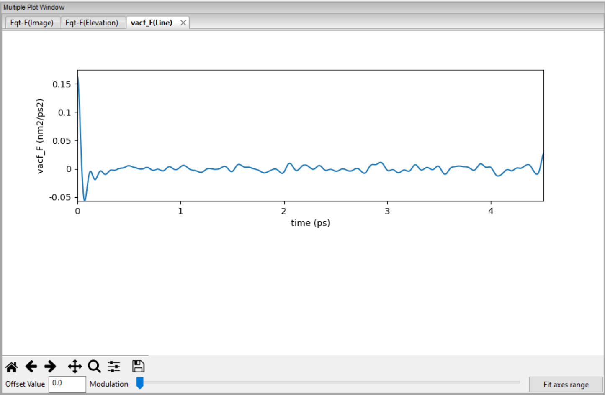

-  

   -  **right** moves the right vertical ax to change the size of the
      plot.

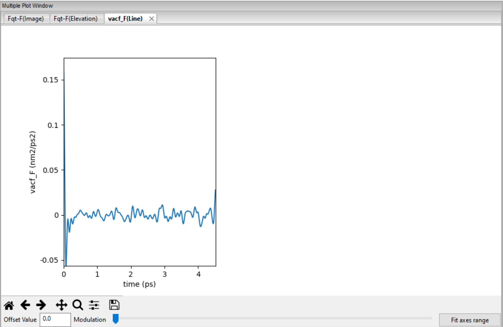

-  

   -  **top** moves the top horizontal to change the size of the plot.

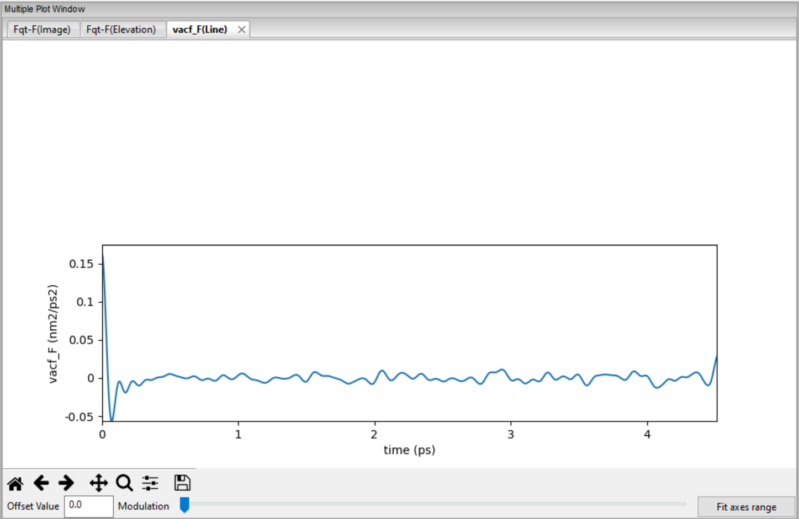

-  

   -  **wspace** changes the vertical spacing between multiple graphs
      (matplotlib subplots)
   -  **hspace** changes the horizontal spacing between multiple graphs
      (matplotlib subplots)

-  **Save** opens a file browser that allows you to save the graph in
   one of these formats: EPS, PGF, PDF, PNG, PS, RAW, RGBA, SVG, or
   SVGZ.

Below this row of buttons is a field called Offset value, which allows
for changing the y-axis offset.

Right-click menu
^^^^^^^^^^^^^^^^

Another way to adjust the plot is through a menu accessible through
right-clicking anywhere inside the tab:

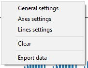

-  **Clear** removes all the lines from current graph. A prompt will
   appear asking for confirmation before this happens.
-  **Export data** opens a file browser that can be used to save the
   data making up the graph. The exported data is in columns separated
   by spaces. The adjustments made that affect the data itself, such as
   changes in `units <#_Units>`__, are applied. This option is useful if
   you would like to plot the data using a software of your choice
   rather than the MDANSE plotter.

General settings
^^^^^^^^^^^^^^^^

Clicking on General settings in the above menu opens this window:

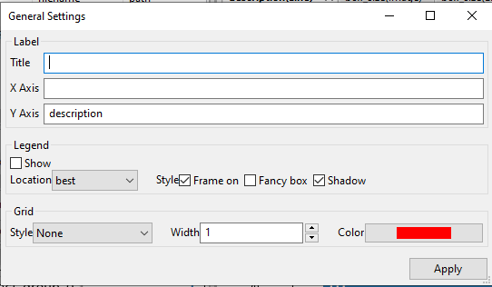

-  Label

   -  **Title**

*Format;* str

*Default:* None

*Description:* sets a title for the graph. This will appear above the
figure.

-  

   -  **X Axis**

*Format:* str

*Default:* the name of the variable plotted on the x-axis

*Description:* sets the x-axis label. This will appear below the bottom
ax, to the left of the x-axis units. The `units <#_Units>`__ cannot be
formatted here, but they can be changed in `Axes
settings <#_Axes_settings>`__.

-  

   -  **Y Axis**

*Format:* str

*Default:* the name of the first plotted variable

*Description:* sets the y-axis label. This will appear below the bottom
ax, to the left of the y-axis units. The `units <#_Units>`__ cannot be
formatted here, but they can be changed in `Axes
settings <#_Axes_settings>`__.

-  Legend

   -  **Show**

*Format:* bool

*Default:* False

*Description:* if ticked, causes the legend to appear.

-  

   -  **Location**

*Format:* drop-down

*Default:* best

*Description:* the location where the legend will appear on the graph.
Since MDANSE uses matplotlib for plotting, these options are all the
ones available in matplotlib and so function like those. For more
information, `matplotlib
documentation <https://matplotlib.org/stable/api/_as_gen/matplotlib.pyplot.legend.html>`__
might be of use.

-  

   -  Style

      -  **Frame on**

*Format:* bool

*Default:* True

*Description:* Adds a frame around the legend.

-  

   -  

      -  **Fancy box**

*Format:* bool

*Default:* False

*Description:* Slightly changes the legend frame/shadow. Only works if
the frame is on.

-  

   -  

      -  **Shadow**

*Format:* bool

*Default:* True

*Description:* Adds a shadow beneath the legend.

-  Grid

   -  **Style**

*Format:* drop-down

*Default:* None

*Description:* decides how the grid should look.

-  

   -  **Width**

*Format:* int

*Default:* 1

*Description:* the thickness of the lines making up the grid.

-  

   -  **Color**

*Format:* window

*Default:* red

*Description:* opens a window that allows for advanced colour selection.
The colour is the colour of the lines making up the grid.

-  **Apply** button applies the changes to the graph without closing the
   window.

Axes settings
^^^^^^^^^^^^^

The Axes settings button in the right-click menu opens the following
window:

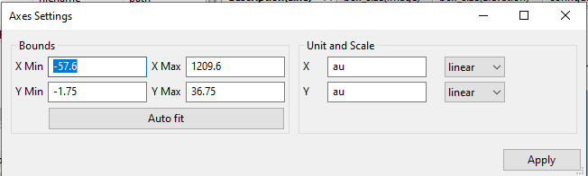

-  Bounds

   -  **X Min**

*Format:* float

*Default:* value corresponding to the best fit

*Description:* the x value at which the y ax intercepts the x ax.

-  

   -  **Y Min**

*Format:* float

*Default:* value corresponding to the best fit

*Description:* the y value at which the x ax intercepts the y ax.

-  

   -  **X Max**

*Format:* float

*Default:* value corresponding to the best fit

*Description:* the x value denominating the right end of the graph

-  

   -  **Y Max**

*Format:* float

*Default:* value corresponding to the best fit

*Description:* the y value denominating the top end of the graph

-  

   -  **Auto fit** button restores all the above values to their
      defaults, ie. it adjusts the graph to the best fit, where all data
      is visible and least white space is left. It automatically applies
      the changes.

-  Unit and Scale

   -  **X**

*Format:* str; drop-down

*Default:* depends on physical quantity (more info in
`Units <#_Units>`__); linear

*Description:* the units that the data making up the graph is in. Both
the plot and the axis label are adjusted once Apply is pressed.

-  

   -  **Y**

*Format:* str; drop-down

*Default:* depends on physical quantity (more info in
`Units <#_Units>`__); linear

*Description:* the units that the data making up the graph is in. Both
the plot and the axis label are adjusted once Apply is pressed.

-  **Apply** button applies the changes to the graph without closing the
   window.

Lines settings
^^^^^^^^^^^^^^

The Lines settings button in the right-click menu opens the following
window:

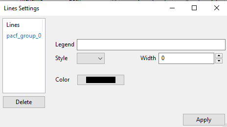

-  The **Lines** box is a list of all lines in the figure. These lines
   can be selected by clicking on them, which allows them to be
   manipulated.
-  **Delete** button deletes the line from the graph.
-  **Legend**

*Format:* str

*Default:* the name of the selected line as it shows up in the Lines
block

*Description:* the name of the line that appears in the legend.

-  **Style**

*Format:* drop-down

*Default:* -

*Description:* determines how the line should look like.

-  **Width**

*Format:* int

*Default:* 1

*Description:* the width of the line.

-  **Color**

*Format:* window

*Default:* generated automatically by matplotlib

*Description:* opens a window that allows for advanced colour selection.
Allows for changing the line colour.

-  **Apply** button applies the changes without closing the window.

Image Plotter
~~~~~~~~~~~~~

At the bottom of an Image Plotter is the menu below. The functions of
the buttons, from left to right, is below that.

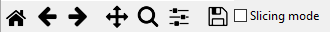

-  **Home** restores the plot to the default position. Ie. if it has
   been moved, zoomed in/out, axes adjusted, etc., it will be restored
   to the position it was in when it was plotted. This position is one
   MDANSE determined to be the best fit and shows all the data.

|image37|\ |image38|

-  **Back** undoes the latest action.
-  **Forward** redoes the latest undone action.
-  **Pan** gives the ability to use mouse to move the graph. After this
   option is activated, you can drag the plot around to adjust what is
   visible inside the axes. This mode can be disabled by clicking on its
   icon again.
-  **Zoom** gives the ability to zoom in. Once activated, you can select
   an area inside the axes that will be zoomed in on. This mode can be
   disabled by clicking on its icon again.
-  **Subplots** opens the Configure subplots window, like the one below.
   It can be used to adjust various parameters of the whole graph. The
   red lines signify the original positions, while the blue bars show
   the current value. The values can be adjusted by clicking inside the
   relevant bar, and the blue bar will move to the clicked position.
   PLEASE NOTE that whatever changes you make are automatically applied
   and saved. There is no confirmation prompt when closing this window,
   and when it is reopened, the red bars will move to the new positions.
   The changes can only be reverted by using the **Back** or **Home**
   buttons. (The illustrations are of a line plot, but exactly the same
   happens to an Image Plot)

-  

   -  **left** moves the left vertical ax to change the size of the
      plot.

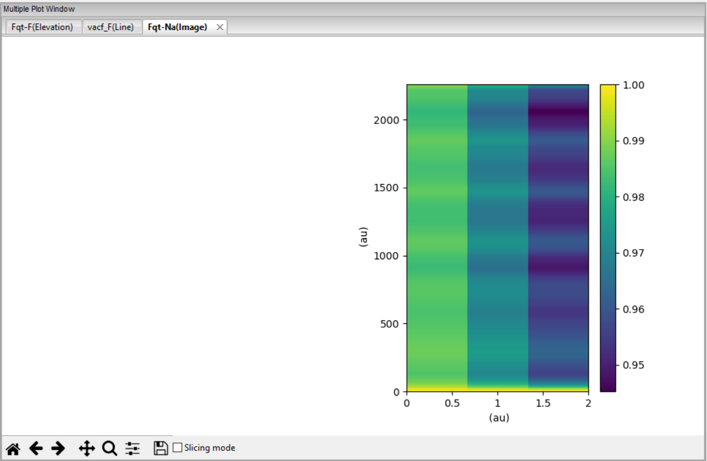

-  

   -  **bottom** moves the bottom horizontal ax to change the size of
      the plot.

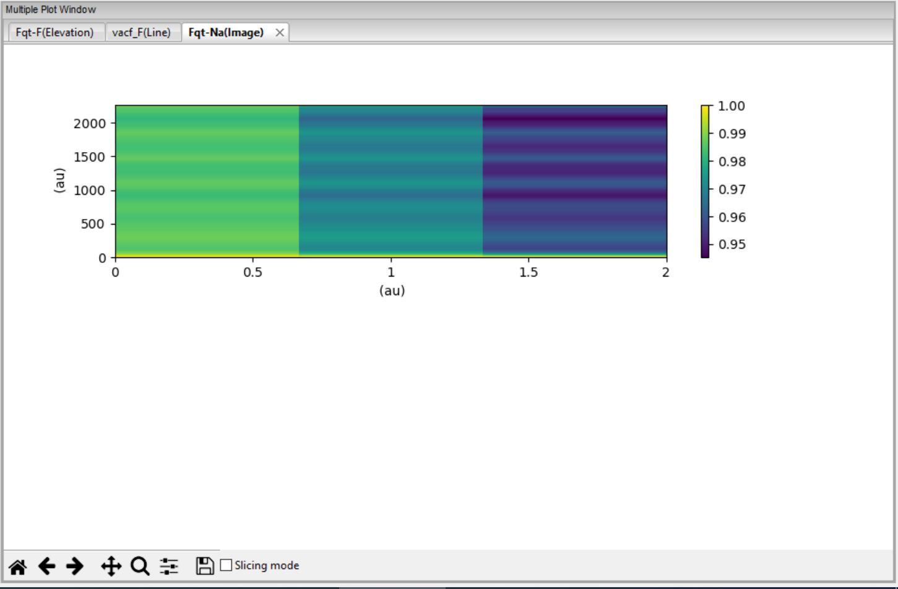

-  

   -  **right** moves the right vertical ax to change the size of the
      plot.

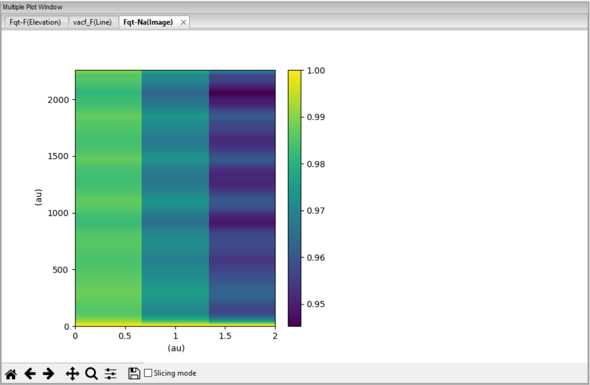

-  

   -  **top** moves the top horizontal to change the size of the plot.

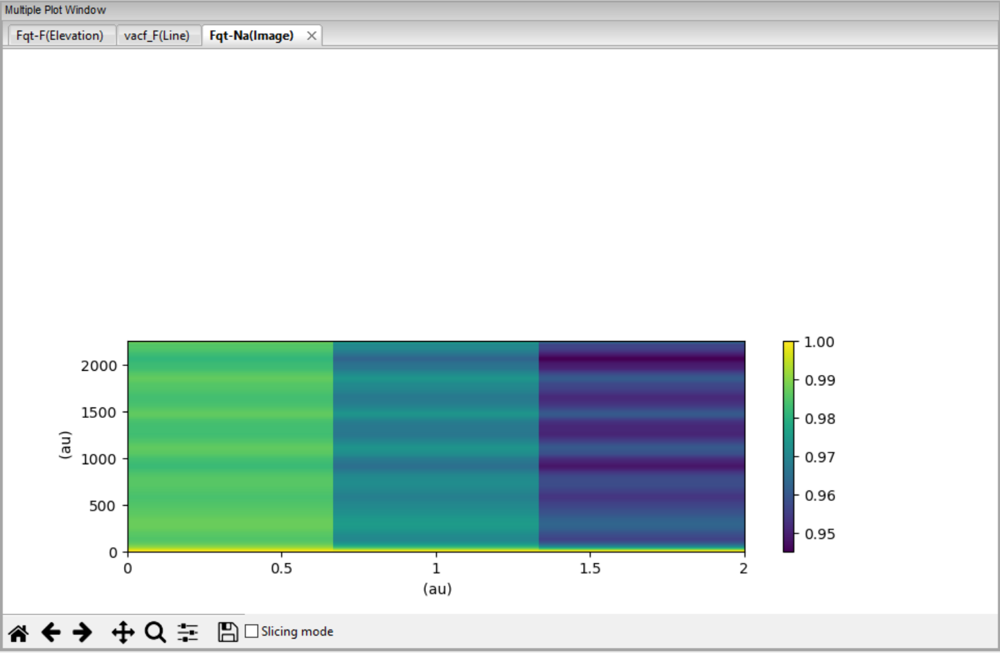

-  

   -  **wspace** changes the vertical spacing between multiple graphs
      (matplotlib subplots)
   -  **hspace** changes the horizontal spacing between multiple graphs
      (matplotlib subplots)

-  **Save** opens a file browser that allows you to save the graph in
   one of these formats: EPS, PGF, PDF, PNG, PS, RAW, RGBA, SVG, or
   SVGZ.

-  **Slicing mode**, when ticked, allows you to select any point in the
   plot. This point will remain marked by a cross (see below) on the
   plot until Slicing mode is deactivated.

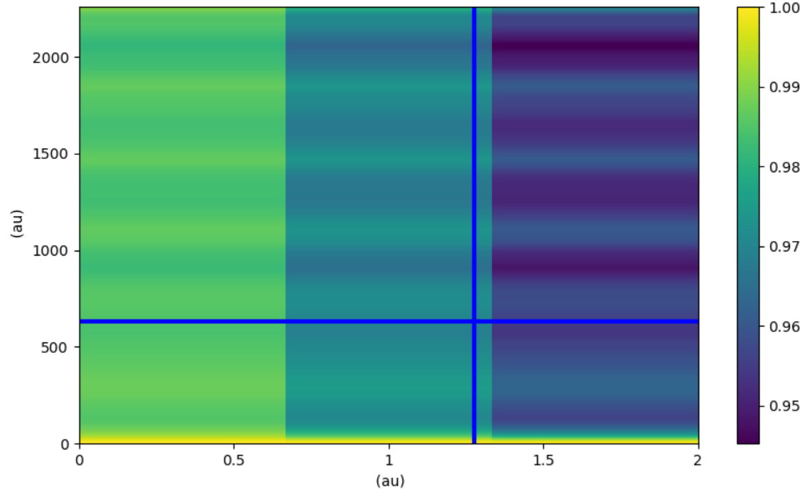

The selection also makes the following window to appear. There is no
limit to how many points may be selected, and each point will appear in
the window as different colour, corresponding to the colour of the
cross.

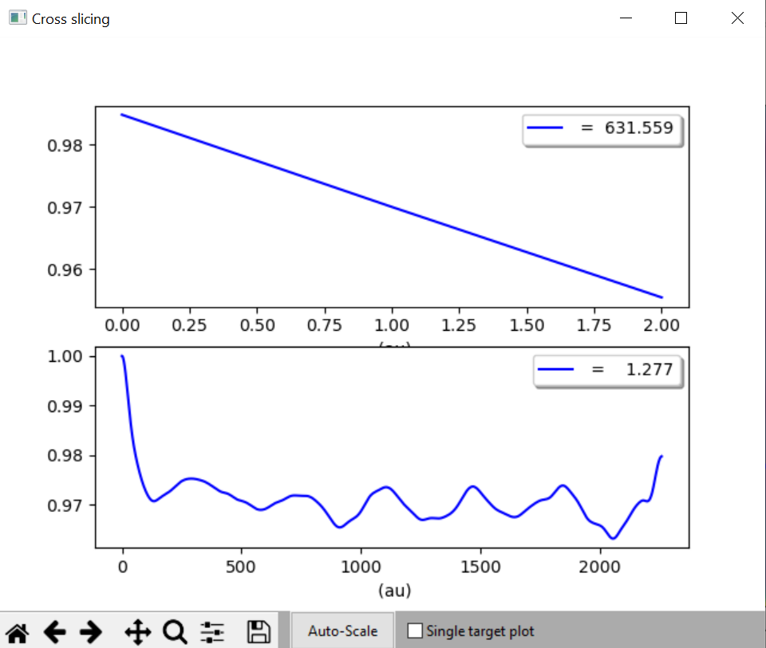

The upper plot shows how value changes across the x-axis at the y-value
of the chosen point, while the bottom plot shows how the value changes
across the y-axis at the x-value of the chosen point.

The buttons in the bottom bar work the same as the corresponding buttons
in the Image Plot. The other buttons work thusly:

-  **Auto Scale** adjusts the y-axis so that it contains 0.
-  **Single target plot** checkbox determines whether additional slices
   should be added to the same ‘Cross slicing’ window. It does not take
   effect immediately; if it is checked but the window is not closed,
   additional cross slices will be added to the plots in the opened
   window. However, if the box is checked then the window is closed, any
   cross slices made will open a new window where all the previously
   made slices are present plus the new one. In this case, the windows
   corresponding to older slices are not altered.

For illustration, if the box is unchecked or the window is not closed
after checking the box, only one ‘Cross slicing’ window will be open and
will change thusly (left to right) as further slices are performed:

|image39|\ |image40|\ |image41|

If the first window is closed after checking the box, new windows will
continue being created like so:

|image42| |image43|

.. _right-click-menu-1:

Right-click menu
^^^^^^^^^^^^^^^^

By right-clicking anywhere inside the axes, the following menu will
appear:

-  **Export data** opens a file browser that can be used to save the
   data making up the graph. The exported data is in columns separated
   by spaces. The adjustments made that affect the data itself, such as
   changes in `units <#_Units>`__, are applied. This option is useful if
   you would like to plot the data using a software of your choice
   rather than the MDANSE plotter.

Settings
^^^^^^^^

By clicking on Setting, the following window will open:

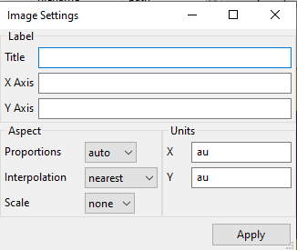

-  Label

   -  **Title**

*Format;* str

*Default:* None

*Description:* sets a title for the graph. This will appear above the
figure.

-  

   -  **X Axis**

*Format:* str

*Default:* the name of the variable plotted on the x-axis

*Description:* sets the x-axis label. This will appear below the bottom
ax, to the left of the x-axis units. The `units <#_Units>`__ cannot be
formatted here, but they can be changed in `Axes
settings <#_Axes_settings>`__.

-  

   -  **Y Axis**

*Format:* str

*Default:* the name of the first plotted variable

*Description:* sets the y-axis label. This will appear below the bottom
ax, to the left of the y-axis units. The `units <#_Units>`__ cannot be
formatted here, but they can be changed in `Axes
settings <#_Axes_settings>`__.

-  Aspect

   -  **Proportions**

*Format:* drop-down

*Default:* auto

Description: changes how the scale of the x-axis and y-axis is related.
’auto’ automatically decides how to fit the plot, while ‘equal’ makes
both axes range between the same values.

-  **interpolation order**

*Format:* drop-down

*Default:* Nearest

*Description:* the algorithm to use for image scaling. For more
information, see matplotlib documentation
[Ref37]_.

-  

   -  **Scale**

*Format:* drop-down

*Default:* none

*Description:* changes the scale of the axes.

-  Units

   -  **X**

*Format:* str

*Default:* depends on physical quantity (more info in
`Units <#_Units>`__)

*Description:* the units that the data making up the graph is in. Both
the plot and the axis label are adjusted once Apply is pressed.

-  

   -  **Y**

*Format:* str

*Default:* depends on physical quantity (more info in
`Units <#_Units>`__)

*Description:* the units that the data making up the graph is in. Both
the plot and the axis label are adjusted once Apply is pressed.

-  **Apply** button applies the changes without closing the window.

Elevation Plotter
~~~~~~~~~~~~~~~~~

An elevation plot should look like this when opened:

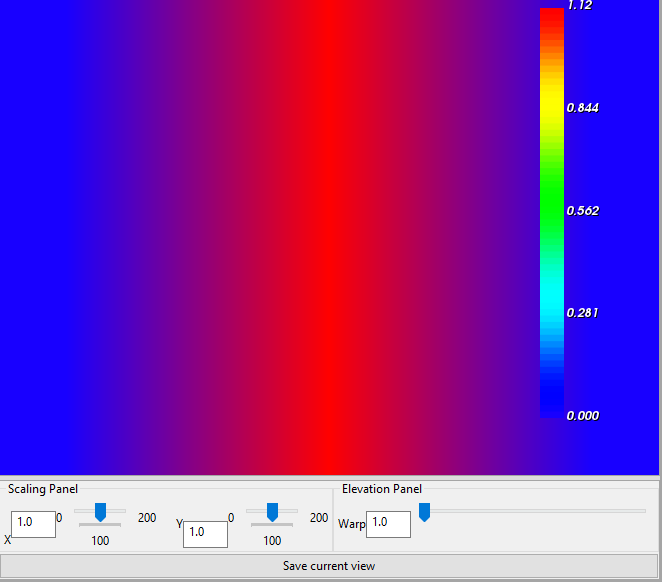

You can use the mouse to drag the plot around to change the perspective,
a bit similar to how Pan would behave in Image Plotter when activated.
The plot can be zoomed in or out using the scrolling wheel or touchpad.

The **Scaling Panel** in the toolbar can be used to change the size of
the plot, either along x-axis or y-axis, depending on which part is
used. Please note, however, that it is possible that only a part of the
plot is initially visible, meaning the changes on screen are only a
side-effect of actual changes. Both the input field and the sliding bar
achieve the same purpose.

The **Elevation Panel** changes the contrast of the colours in the plot.
Both the input field and the sliding bar achieve the same purpose.

The **Save current view** button opens a file browse, allowing the
current contents of the screen (inside the plot, ie. not toolbar) to be
saved as a PNG file.

2D Slice Plotter
~~~~~~~~~~~~~~~~

This plotter was created to help visualising the 3D trajectory
variables, configuration, velocities, and gradients. It creates a 2D
plot of a 3D variable. Therefore, extra setup is required before it can
be used, and so it looks as follows in the Data panel:

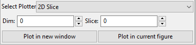

-  **Dim**

*Format:* positive int

*Default:* 0

*Description:* the dimension that will appear as the colour gradient in
the plot. The other two dimensions will be plotted on the x and y axes
of the plot. Only values 0, 1, and 2 are accepted. Which dimension is
which number can be determined from the ‘Axis’ column in the Data panel
if it is populated, or the ‘Size’ column if the former is not. The
dimensions are assigned number in the order in which they appear, so,
e.g., if ‘Axis’ column shows ‘time,atom,dim’, then time is 0, atom is 1,
and dim is 3.

-  **Slice**

*Format:* positive int

*Default:* 0

*Description:* the part of the dimension that is plotted. Only values
from 0 to the size of the dimension are accepted. For example, if Dim
corresponding to the dimension of the configuration variable (i.e., the
x, y, or z component) is selected, then the Slice field corresponds to
those x/y/z components. Thus, if in this example, we select Slice of 1
(i.e., the y component), then we get a 2D plot with time and the number
of atoms on the x and y axes, and the colour gradient corresponds to the
y-component of the position vectors (picture below).

When this plotter is configured with the above options and plotted, a
plot similar to below will be obtained.

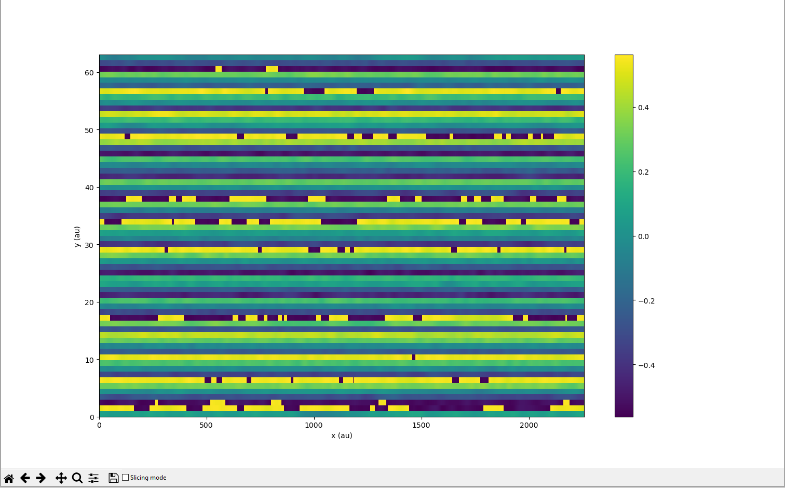

For the description of the various manipulations of this plot, please
see `Image Plotter <#_Image_Plotter>`__. 2D Slice Plotter uses Image
Plotter under the hood, meaning that the various options are identical.

Iso Surface Plotter
~~~~~~~~~~~~~~~~~~~

When opened, this plotter might look like this:

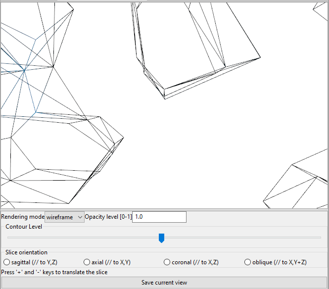

You can use the mouse to drag the plot around to move the 3D picture.
The plot can be zoomed in or out using the scrolling wheel or touchpad.

-  **Rendering mode**

*Format:* drop-down

*Default:* line

*Description:* changes which geometric shapes (points, lines, surface)
is used to display the surface.

-  **Opacity level**

*Format:* float of value 0-1

*Default:* 1.0

*Description:* changes the opacity/transparency of the objects used to
display the surface.

-  **Contour Level**

*Format:* sliding bar

*Default:* middle

*Description:* changes how much space the shapes making the surface
take. <insert>

-  **Slice orientation**

*Format:* multiple choice

*Default:* None

*Description:* adds a coloured plane described by the shown axes that
slices through the surface. After clicking on the plot, the plane can be
moved along the axis not mentioned in the chosen plane’s name by using +
and – keys.

-  **Save current view** button opens a file browser that allows the
   current view to be saved as a PNG file.

.. _units:

Units
=====

The units used by MDANSE are nm for length and ps for time, and their
inverses for Q (nm\ :sup:`-1`) and angular frequencies, :math:`\omega`
(ps\ :sup:`-1`). Any input must be given using these units, and the
output files do also employ the same units. The :ref:`2d3dplotter` includes
the Python magnitude module, so you can modify the units when plotting
the results using the `Axes settings <#_Axes_settings>`__ (available
from the context menu that appears by right clicking on the plot). If
you use the export option in the graphic after having changed the units,
your output file will be saved with the desired units. But remember that
the original output file (typically a HDF) is written using the
original standard units.

The list of prefixes to physical quantities is listed in Table 1.
The leftmost column is what can be written in front
of the symbol of a physical quantity.

Table 1: A list of prefixes that can be used to modify units.

====== ===== =====
Symbol Name  Value
y      yocto 1e-24
z      zepto 1e-21
a      atto  1e-18
f      femto 1e-15
p      pico  1e-12
n      nano  1e-9
u      micro 1e-6
m      mili  1e-3
c      centi 1e-2
d      deci  1e-1
da     deca  1e1
h      hecto 1e2
k      kilo  1e3
M      mega  1e6
G      giga  1e9
T      tera  1e12
P      peta  1e15
E      exa   1e18
Z      zetta 1e21
Y      yotta 1e24
====== ===== =====

All these prefixes can be used with any of the units from Table 2.
All these units can also be accessed through the
:ref:`units-editor`.

Table 2: A list of all units that can be used in MDANSE.

+--------------+----------------+----------------+----------------+
| **Symbol**   | **Unit**       | **Value in SI  | **Physical     |
|              |                | units**        | quantity**     |
+--------------+----------------+----------------+----------------+
| au           | atomic unit    | 0              | -              |
+--------------+----------------+----------------+----------------+
| m            | meter          | 1 m            | length         |
+--------------+----------------+----------------+----------------+
| ang          | Angstrom       | 1 \*           |                |
|              |                | 10\ :sup:`-10` |                |
|              |                | m              |                |
+--------------+----------------+----------------+----------------+
| ft           | foot           | 0.3048 m       |                |
+--------------+----------------+----------------+----------------+
| inch         | inch           | 0.0254 m       |                |
+--------------+----------------+----------------+----------------+
| ly           | light year     | 9.             |                |
|              |                | 460,730,472,58 |                |
|              |                | \*             |                |
|              |                | 10\ :sup:`15`  |                |
|              |                | m              |                |
+--------------+----------------+----------------+----------------+
| b            | Barn           | 1 \*           | surface        |
|              |                | 10\ :sup:`-28` |                |
|              |                | m\ :sup:`2`    |                |
+--------------+----------------+----------------+----------------+
| l            | litre          | 1 \*           | volume         |
|              |                | 10\ :sup:`-3`  |                |
|              |                | m\ :sup:`3`    |                |
+--------------+----------------+----------------+----------------+
| s            | second         | 1 s            | time           |
+--------------+----------------+----------------+----------------+
| year         | year           | 3              |                |
|              |                | 1,556,925.9747 |                |
|              |                | s              |                |
+--------------+----------------+----------------+----------------+
| day          | day            | 86400 s        |                |
+--------------+----------------+----------------+----------------+
| h            | hour           | 3600 s         |                |
+--------------+----------------+----------------+----------------+
| min          | minute         | 60 s           |                |
+--------------+----------------+----------------+----------------+
| kg           | kilogram       | 1 kg           | mass           |
+--------------+----------------+----------------+----------------+
| g            | gram           | 1 \*           |                |
|              |                | 10\ :sup:`-3`  |                |
|              |                | kg             |                |
+--------------+----------------+----------------+----------------+
| uma          | unified mass   | 1.660,540,2 \* |                |
|              | unit           | 10\ :sup:`-27` |                |
|              |                | kg             |                |
+--------------+----------------+----------------+----------------+
| mol          | mole           | 1 mol          | amount of mass |
+--------------+----------------+----------------+----------------+
| J            | Joule          | 1 kg           | energy         |
|              |                | m\ :sup:`2`    |                |
|              |                | s\ :sup:`-2`   |                |
+--------------+----------------+----------------+----------------+
| eV           | electron volt  | 1.602,176,49   |                |
|              |                | \*             |                |
|              |                | 10\ :sup:`-19` |                |
|              |                | kg m\ :sup:`2` |                |
|              |                | s\ :sup:`-2`   |                |
+--------------+----------------+----------------+----------------+
| cal          | calorie        | 4.184 kg       |                |
|              |                | m\ :sup:`2`    |                |
|              |                | s\ :sup:`-2`   |                |
+--------------+----------------+----------------+----------------+
| cal_per_mole | calorie per    | 6.947,78 \*    |                |
|              | mole           | 10\ :sup:`-24` |                |
|              |                | kg m\ :sup:`2` |                |
|              |                | s\ :sup:`-2`   |                |
|              |                | mol\ :sup:`-1` |                |
+--------------+----------------+----------------+----------------+
| J_per_mole   | Joule per mole | 1.             |                |
|              |                | 660,559,273,42 |                |
|              |                | \*             |                |
|              |                | 10\ :sup:`-24` |                |
|              |                | kg m\ :sup:`2` |                |
|              |                | s\ :sup:`-2`   |                |
|              |                | mol\ :sup:`-1` |                |
+--------------+----------------+----------------+----------------+
| Ha           | Hartree        | 4.359,743,94   |                |
|              |                | \*             |                |
|              |                | 10\ :sup:`-18` |                |
|              |                | kg m\ :sup:`2` |                |
|              |                | s\ :sup:`-2`   |                |
+--------------+----------------+----------------+----------------+
| K            | Kelvin         | 1 K            | temperature    |
+--------------+----------------+----------------+----------------+
| N            | Newton         | 1 kg m         | force          |
|              |                | s\ :sup:`-2`   |                |
+--------------+----------------+----------------+----------------+
| Pa           | Pascal         | 1 kg           | pressure       |
|              |                | m\ :sup:`-1`   |                |
|              |                | s\ :sup:`-2`   |                |
+--------------+----------------+----------------+----------------+
| W            | Watt           | 1 kg           | power          |
|              |                | m\ :sup:`2`    |                |
|              |                | s\ :sup:`-3`   |                |
+--------------+----------------+----------------+----------------+
| Hz           | Hertz          | 1 s\ :sup:`-1` | frequency      |
+--------------+----------------+----------------+----------------+
| A            | Ampere         | 1 A            | electric       |
|              |                |                | current        |
+--------------+----------------+----------------+----------------+
| C            | Coulomb        | 1 A s          | charge         |
+--------------+----------------+----------------+----------------+
| V            | Volt           | 1 kg           | voltage        |
|              |                | m\ :sup:`2`    |                |
|              |                | s\ :sup:`-3`   |                |
|              |                | A\ :sup:`-1`   |                |
+--------------+----------------+----------------+----------------+
| F            | Farad          | 1 s\ :sup:`4`  | capacitance    |
|              |                | A\ :sup:`2`    |                |
|              |                | kg\ :sup:`-1`  |                |
|              |                | m\ :sup:`-2`   |                |
+--------------+----------------+----------------+----------------+
| ohm          | Ohm            | 1 kg           | resistance     |
|              |                | m\ :sup:`2`    |                |
|              |                | s\ :sup:`-3`   |                |
|              |                | A\ :sup:`-2`   |                |
+--------------+----------------+----------------+----------------+
| S            | Siemens        | 1 s\ :sup:`3`  | conductance    |
|              |                | A\ :sup:`2`    |                |
|              |                | kg\ :sup:`-1`  |                |
|              |                | m\ :sup:`-2`   |                |
+--------------+----------------+----------------+----------------+
| Wb           | Weber          | 1 kg           | magnetic flux  |
|              |                | m\ :sup:`2`    |                |
|              |                | s\ :sup:`-2`   |                |
|              |                | A\ :sup:`-1`   |                |
+--------------+----------------+----------------+----------------+
| T            | Tesla          | 1 kg           | flux density   |
|              |                | s\ :sup:`-2`   |                |
|              |                | A\ :sup:`-1`   |                |
+--------------+----------------+----------------+----------------+
| H            | Henry          | 1 kg           | inductance     |
|              |                | m\ :sup:`2`    |                |
|              |                | s\ :sup:`-2`   |                |
|              |                | A\ :sup:`-2`   |                |
+--------------+----------------+----------------+----------------+
| cd           | Candela        | 1 cd           | luminous       |
|              |                |                | intensity      |
+--------------+----------------+----------------+----------------+
| lm           | Lumen          | 1 cd sr        | luminous flux  |
+--------------+----------------+----------------+----------------+
| lux          | lux            | 1 cd sr        | illuminance    |
|              |                | m\ :sup:`-2`   |                |
+--------------+----------------+----------------+----------------+
| Bq           | Becquerel      | 1 s\ :sup:`-1` | radioactivity  |
+--------------+----------------+----------------+----------------+
| Gy           | gray           | 1 m\ :sup:`2`  | ionising       |
|              |                | s\ :sup:`-2`   | radiation      |
+--------------+----------------+----------------+----------------+
| kat          | Katal          | 1 mol          | catalytic      |
|              |                | s\ :sup:`-1`   | activity       |
+--------------+----------------+----------------+----------------+
| dpi          | inches in      | 39.370,        | -              |
|              | meter          | 078,740,157,48 |                |
|              |                | m\ :sup:`-1`   |                |
+--------------+----------------+----------------+----------------+
| gravity      | gravitational  | 9.80665 m      | acceleration   |
|              | constant       | s\ :sup:`-2`   |                |
+--------------+----------------+----------------+----------------+
| c            | speed of light | 2.997,924,58   | velocity       |
|              |                | \*             |                |
|              |                | 10\ :sup:`8` m |                |
|              |                | s\ :sup:`-1`   |                |
+--------------+----------------+----------------+----------------+
| rad          | radian         | 1 rad          | angle          |
+--------------+----------------+----------------+----------------+
| cyc          | cycle          | 6.283,1        |                |
|              |                | 85,307,179,586 |                |
|              |                | rad            |                |
+--------------+----------------+----------------+----------------+
| sr           | steradian      | 1 sr           | solid angle    |
+--------------+----------------+----------------+----------------+
| inv_nm       | inverse nm     | 1 \*           | Inverse length |
|              |                | 10\ :sup:`9`   |                |
|              |                | m\ :sup:`-1`   |                |
+--------------+----------------+----------------+----------------+
| akma_time    | AKMA time      | 20.454,        | time           |
|              |                | 829,497,745,98 |                |
|              |                | \*             |                |
|              |                | 10\ :sup:`-12` |                |
|              |                | s              |                |
+--------------+----------------+----------------+----------------+

.. _section-1:

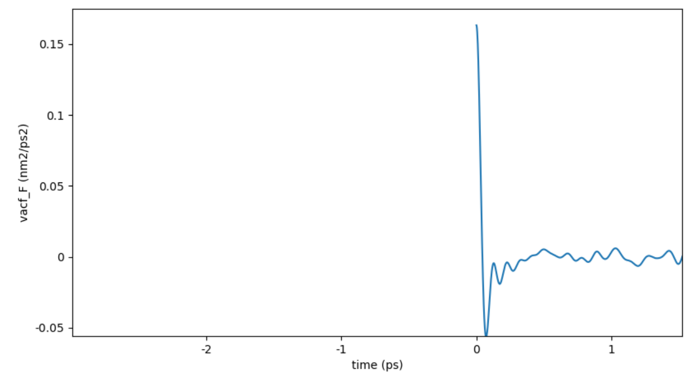
.. |image36| image:: ./Pictures/10000001000004E4000002A94202A3BFD79098BA.png
   :width: 7.465cm
   :height: 4.096cm
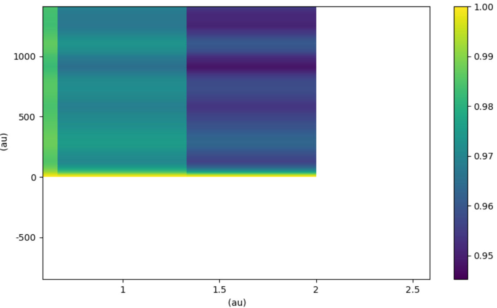
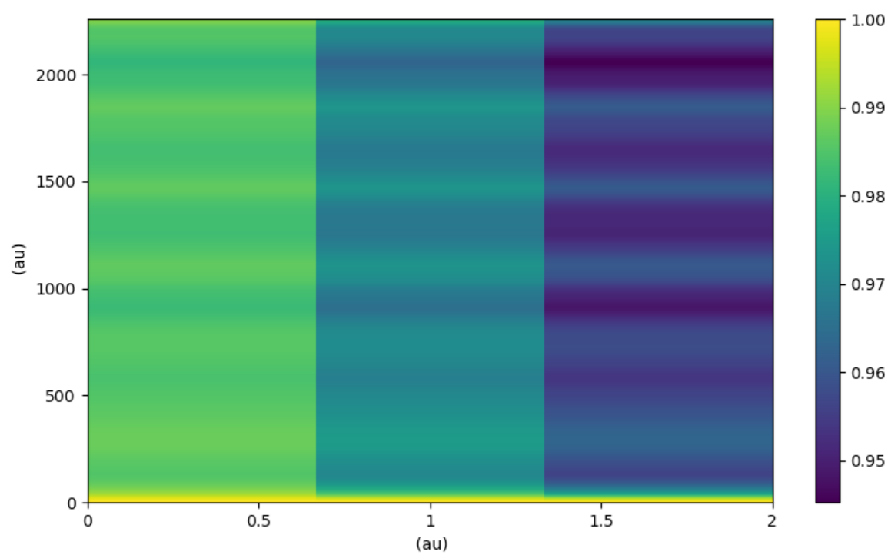
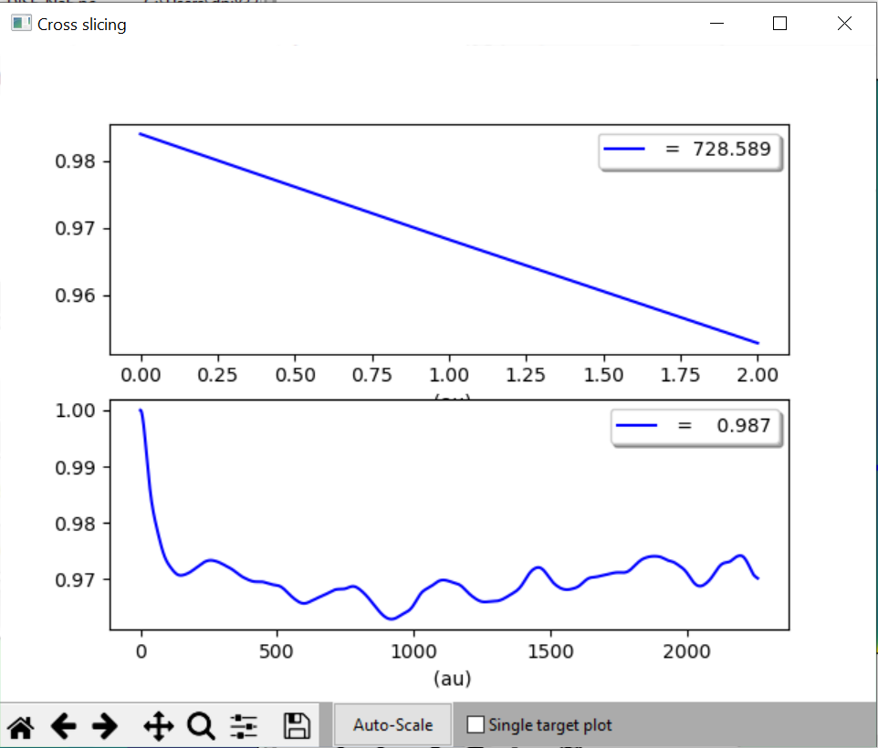
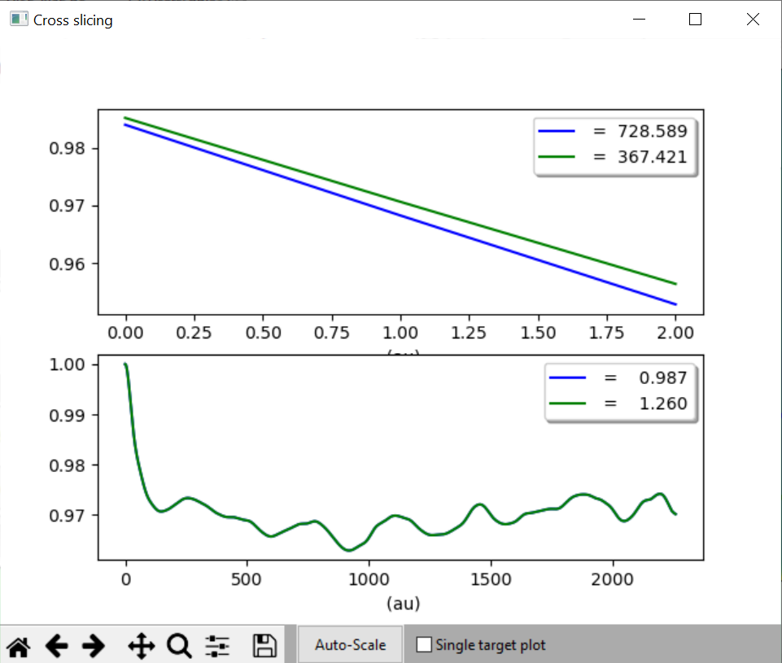
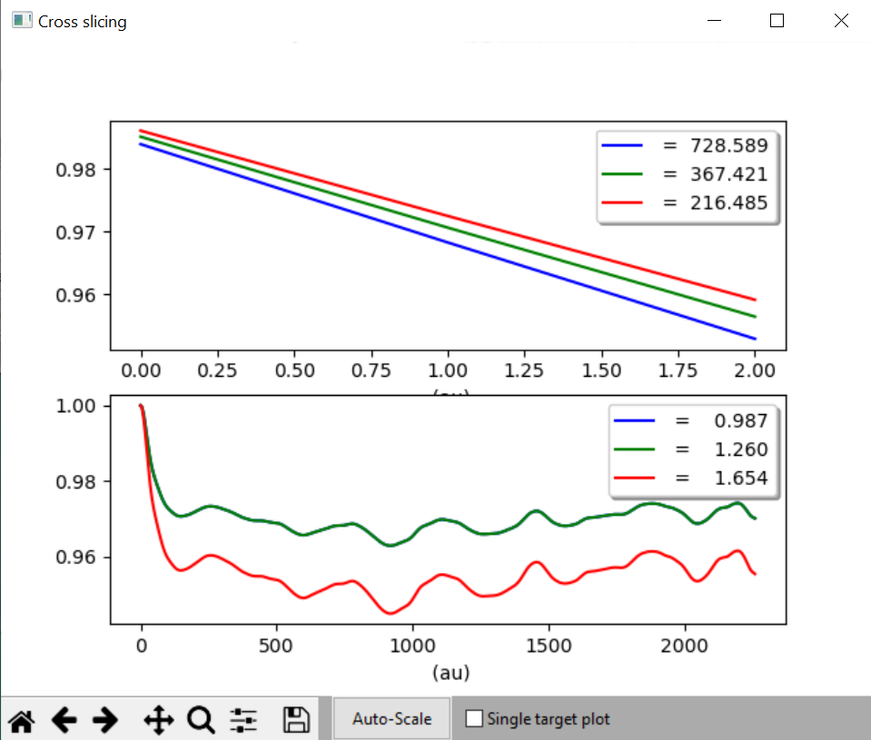
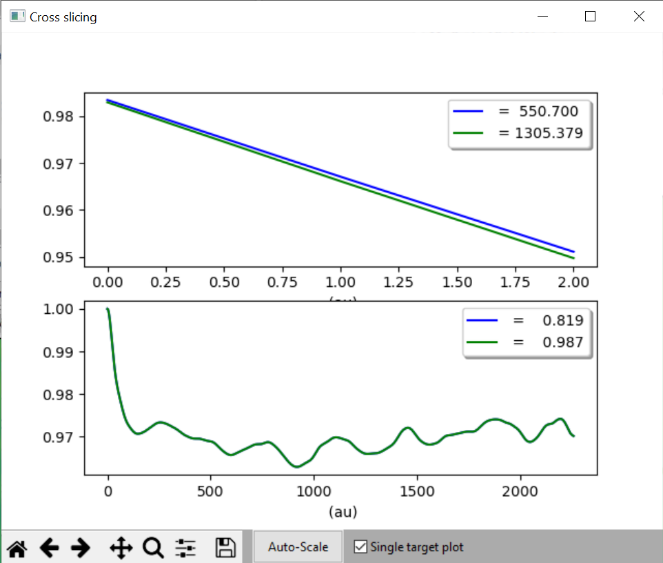
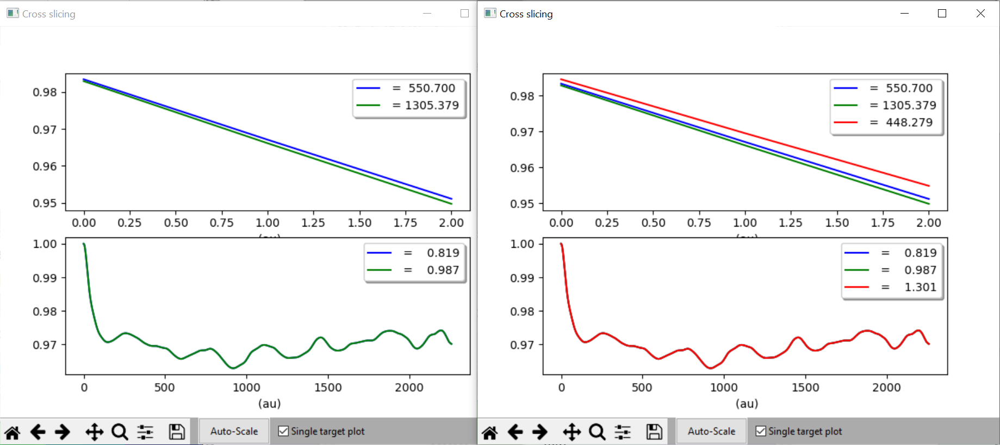
