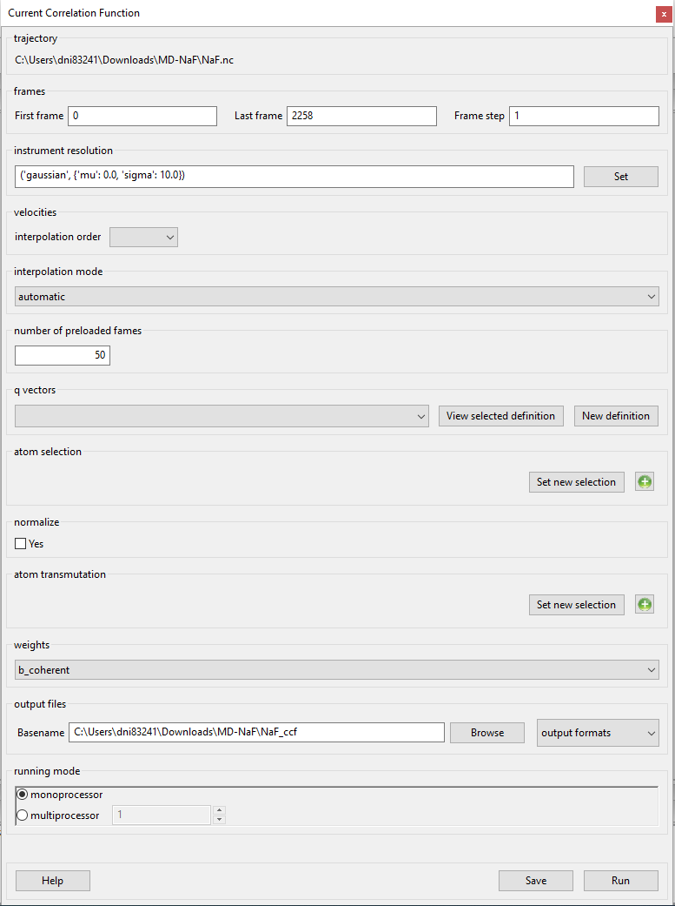
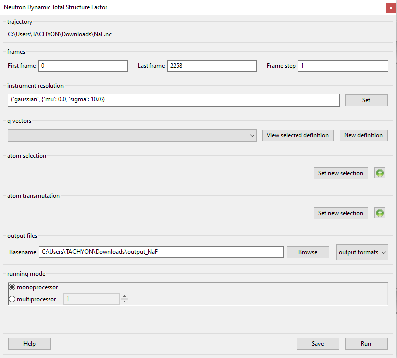
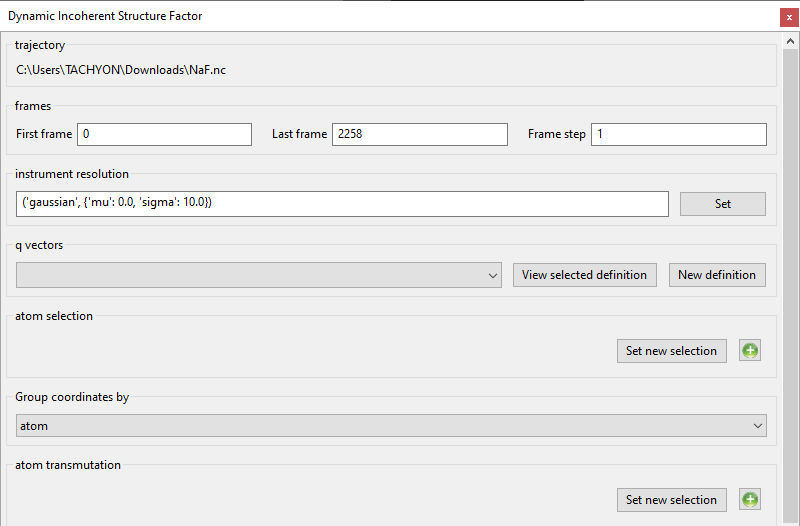
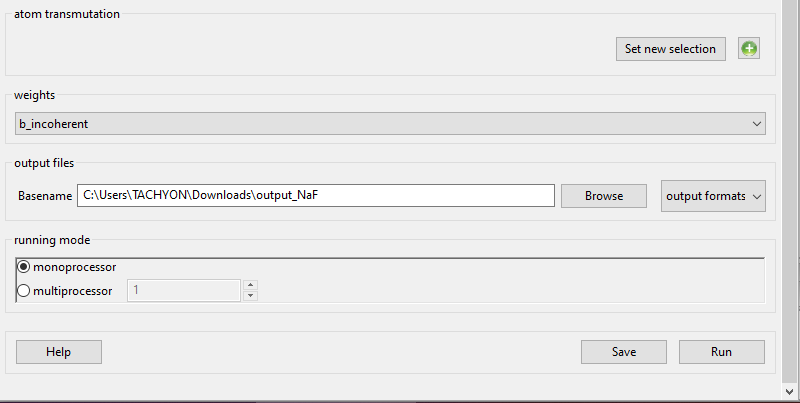
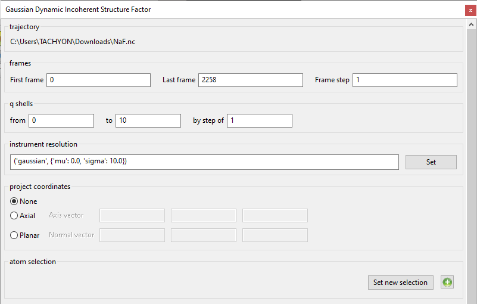

This section is dealing with specific types of analysis performed by
MDANSE. If you are not sure where these fit into the general workflow
of data analysis, please read :ref:`workflow-of-analysis`.

Analysis: Scattering
====================

This section discusses plugins used
to calculate neutron spectroscopy observables from the trajectory.
These plugins will be explored in depth in further sections, however,
before that, it is important to understand how MDANSE performs these
analyses. A part of that are :ref:`param-q-vectors`, which
are used to perform these analyses. An in-depth discussion of this
aspect is present in `Appendix 2 <#_Appendix_2>`__.

.. _scattering_theory:

Theory and background
'''''''''''''''''''''

The quantity of interest in neutron scattering experiments with thermal
neutrons is the *dynamic structure factor*, S(**q**, :math:`\omega`), which is
closely related to the double differential cross-section [7],
:math:`{d^{2}{\sigma/\mathit{d\Omega dE}}}`.
The double differential cross section is defined as the number of
neutrons which are scattered per unit time into the solid angle interval
:math:`{\left\lbrack {\Omega,{\Omega + d}\Omega} \right\rbrack}`
and into the energy interval
:math:`{{\lbrack{E,{E + \mathit{dE}}}\rbrack}}`.
It is normalized to d, *dE*, and the flux of the incoming neutrons,

.. math::
   :label: pfx55

   {{\frac{d^{2}\sigma}{d\Omega\mathit{dE}} = N}\cdot\frac{k}{k_{0}}S\left( {q,\omega} \right).}

Here *N* is the number of atoms, and k ≡ \|\ **k**\ \| and k\ :sub:`0` ≡
\|\ **k**\ :sub:`0`\ \| are the wave numbers of scattered and incident
neutrons, respectively. They are related to the corresponding neutron
energies by

.. math::
   :label: pfx56
   
   {E = \hslash^{2}}k^{2}\text{/}2m

\ and

.. math::
   :label: pfx57
   
   {E_{0} = \hslash^{2}}k_{0}^{2}\text{/}2m

\ where :math:`m` is the neutron mass. The arguments of the dynamic structure factor,
:math:`q` and :math:`\omega`, are the momentum and energy transfer in units of
:math:`\hslash`, respectively:

.. math::
   :label: pfx58

   {{q = \frac{k_{0} - k}{\hslash}},}

.. math::
   :label: pfx59

   {{\omega = \frac{E_{0} - E}{\hslash}}.}

The modulus of the momentum transfer can be expressed in the scattering
angle :math:`\theta` , the energy transfer, and the energy of the
incident neutrons:

.. math::
   :label: pfx60

   {{q = \sqrt{{2 - \frac{\mathit{\hslash\omega}}{E_{0}} - 2}\cos{\theta\sqrt{2 - \frac{\mathit{\hslash\omega}}{E_{0}}}}}}.}

The dynamic structure factor contains information about the structure
and dynamics of the scattering system
[Ref16]_. It can be written as

.. math::
   :label: pfx61

   {S{\left( {q,\omega} \right) = \frac{1}{2\pi}}{\int\limits_{- \infty}^{+ \infty}\mathit{dt}}\exp\left\lbrack {{- i}\omega t} \right\rbrack F\left( {q,t} \right).}

F(**q**, t) is called the *intermediate scattering function* and is
defined as

.. math::
   :label: pfx62

   {\text{F}{\left( {q,t} \right) = {\sum\limits_{\alpha,\beta}{\Gamma_{\mathit{\alpha\beta}}\left\langle {\exp\left\lbrack {{- i}q\cdot\hat{R_{\alpha}}(0)} \right\rbrack\exp\left\lbrack {iq\cdot\hat{R_{\beta}}(t)} \right\rbrack} \right\rangle}}},}

.. math::
   :label: pfx63

   {{\Gamma_{\mathit{\alpha\beta}} = \frac{1}{N}}\left\lbrack {\overline{b_{\alpha}}{\overline{b_{\beta}} + \delta_{\mathit{\alpha\beta}}}\left( {\overline{b_{\alpha}^{2}} - {\overline{b_{\alpha}}}^{2}} \right)} \right\rbrack.}

The operators :math:`\hat{R_{\alpha}}(t)`
in Eq. :math:numref:`pfx62` are the position
operators of the nuclei in the sample. The brackets
:math:`\langle\ldots\rangle`
denote a quantum thermal average and the time dependence of the position
operators is defined by the Heisenberg picture. The quantities
:math:`b_{\alpha}` are the scattering lengths of the nuclei
which depend on the isotope and
the relative orientation of the spin of the neutron and the spin of the
scattering nucleus. If the spins of the nuclei and the neutron are not
prepared in a special orientation one can assume a random relative
orientation and that spin and position of the nuclei are uncorrelated.
The symbol :math:`\overline{...}` appearing in :math:`{\Gamma_{\mathit{\alpha\beta}}}`
denotes an average over isotopes and relative spin orientations of
neutron and nucleus.

Usually, one splits the intermediate scattering function and the dynamic
structure factor into their *coherent* and *incoherent* parts which
describe collective and single particle motions, respectively. Defining

.. math::
   :label: pfx65

   {b_{\alpha,\mathit{coh}}\doteq\overline{b_{\alpha}},}

.. math::
   :label: pfx66

   {b_{\alpha,\mathit{inc}}\doteq\sqrt{\overline{b_{\alpha}^{2}} - {\overline{b_{\alpha}}}^{2}},}

the coherent and incoherent intermediate scattering functions can be
cast in the form

.. math::
   :label: pfx67

   {\text{F}_{\text{coh}}{\left( {q,t} \right) = \frac{1}{N}}{\sum\limits_{\alpha,\beta}b_{\alpha,\mathit{coh}}}b_{\beta,\mathit{coh}}\left\langle {\exp\left\lbrack {{- i}q\cdot\hat{R_{\alpha}}(0)} \right\rbrack\exp\left\lbrack {iq\cdot\hat{R_{\beta}}(t)} \right\rbrack} \right\rangle,}

.. math::
   :label: pfx68

   {\text{F}_{\text{inc}}{\left( {q,t} \right) = \frac{1}{N}}{\sum\limits_{\alpha}{b_{\alpha,\mathit{inc}}^{2}\left\langle {\exp\left\lbrack {{- i}q\cdot\hat{R_{\alpha}}(0)} \right\rbrack\exp\left\lbrack {iq\cdot\hat{R_{\alpha}}(t)} \right\rbrack} \right\rangle}}.}

Rewriting these formulas, *MDANSE* introduces the partial terms as:

.. math::
   :label: pfx69

   {\text{F}_{\text{coh}}{\left( {q,t} \right) = \sum\limits_{I,J\geq I}^{N_{\mathit{species}}}}\sqrt{n_{I}n_{J}\omega_{I,\text{coh}}\omega_{J,\text{coh}}}F_{\mathit{IJ},\text{coh}}\left( {q,t} \right),}

.. math::
   :label: pfx70

   {\text{F}_{\text{inc}}{\left( {q,t} \right) = {\sum\limits_{I = 1}^{N_{\mathit{species}}}{n_{I}\omega_{I,\text{inc}}F_{I,\text{inc}}\left( {q,t} \right)}}}}

where:

.. math::
   :label: pfx71

   {\text{F}_{\mathit{IJ},\text{coh}}{\left( {q,t} \right) = \frac{1}{\sqrt{n_{I}n_{J}}}}{\sum\limits_{\alpha}^{n_{I}}{\sum\limits_{\beta}^{n_{J}}\left\langle {\exp\left\lbrack {{- i}q\cdot\hat{R_{\alpha}}\left( t_{0} \right)} \right\rbrack\exp\left\lbrack {iq\cdot\hat{R_{\beta}}\left( {t_{0} + t} \right)} \right\rbrack} \right\rangle_{t_{0}}}},}

.. math::
   :label: pfx72

   {\text{F}_{I,\text{inc}}{\left( {q,t} \right) = \frac{1}{n_{I}}}{\sum\limits_{\alpha = 1}^{n_{I}}\left\langle {\exp\left\lbrack {{- i}q\cdot\hat{R_{\alpha}}\left( t_{0} \right)} \right\rbrack\exp\left\lbrack {iq\cdot\hat{R_{\alpha}}\left( {t_{0} + t} \right)} \right\rbrack} \right\rangle_{t_{0}}}.}

where n\ :sub:`I`, n\ :sub:`J`, N\ :sub:`species`, :math:`\omega`\ :sub:`I,coh,inc`
and :math:`\omega`\ :sub:`J,coh,inc` are defined in Section :ref:`target_CN`.

The corresponding dynamic structure factors are obtained by performing
the Fourier transformation defined in Eq. :math:numref:`pfx61`.

An important quantity describing *structural* properties of liquids is
the *static structure factor*, which is defined as

.. math::
   :label: pfx73

   {\text{S}(q)\doteq{\int\limits_{- \infty}^{+ \infty}{d\omega}}\text{S}_{\mathit{coh}}\left( {q,\omega} \right)\text{F}_{\mathit{coh}}\left( {q,0} \right).}

In the classical framework the intermediate scattering functions are
interpreted as classical time correlation functions. The position
operators are replaced by time-dependent vector functions and quantum
thermal averages are replaced by classical *ensemble averages*. It is
well known that this procedure leads to a loss of the universal detailed
balance relation,

.. math::
   :label: pfx74

   {\text{S}{\left( {q,\omega} \right) = \exp}\left\lbrack {\beta\hslash\omega} \right\rbrack\text{S}\left( {{- q}{, - \omega}} \right),}

and also to a loss of all odd moments

.. math::
   :label: pfx75

   {\left\langle \omega^{2{n + 1}} \right\rangle\doteq{\int\limits_{- \infty}^{+ \infty}{d\omega}}\omega^{2{n + 1}}S\left( {q,\omega} \right),{n = 1,2},\ldots.}

The odd moments vanish since the classical dynamic structure factor is
even in :math:`\omega`, assuming invariance of the scattering process with respect to
reflections in space. The first moment is also universal. For an atomic
liquid, containing only one sort of atoms, it reads

.. math::
   :label: pfx76

   {{\left\langle \omega \right\rangle = \frac{\hslash q^{2}}{2M}},}

where M is the mass of the atoms. Formula :math:numref:`pfx76`
shows that the
first moment is given by the average kinetic energy (in units of
:math:`\hslash`) of a particle which receives a momentum transfer
:math:`\hslash q`. Therefore,
:math:`\langle\omega\rangle`
is called the *recoil moment*. A number of 'recipes' has been suggested
to correct classical dynamic structure factors for detailed balance and
to describe recoil effects in an approximate way. The most popular one
has been suggested by Schofield [Ref17]_

.. math::
   :label: pfx77

   {{\text{S}\left( {q,\omega} \right)\approx\exp\left\lbrack \frac{\beta\hslash\omega}{2} \right\rbrack}_{}\text{S}_{\mathit{cl}}\left( {q,\omega} \right)}

One can easily verify that the resulting dynamic structure factor
fulfils the relation of detailed balance. Formally, the correction :math:numref:`pfx77`
is correct to first order in :math:`\hslash`. Therefore, it cannot be used
for large *q*-values which correspond to large momentum transfers
:math:`\hslash q`. This is actually true for all correction
methods which have suggested
so far. For more details we refer to Ref.
[Ref18]_.

MDANSE computes the partial S(Q)'s as the Fourier transform of the
partial g(r), corresponding to the Faber-Ziman definition:

.. math::
   :label: pfx78
   
   {S_{\alpha\beta}(Q) = 1 + \frac{4\pi\rho_0}{Q}\int\limits_{0}^{\infty}{r\left\lbrack {g_\alpha\beta}(r)-1 \right\rbrack\text{sin}(Qr)dr}}

The total S(Q) is computed as a weighted sum similar to the one used for
the total g(r). In the case of the analysis 'X-ray Static structure
factor', the Q-dependence of the atomic form factors is taken into
account in this weighted sum.

Again, Soper has provided experimental data (table 4 in *ISRN Physical
Chemistry*, 279463 (2013), given in file soper13_fx.dat). Here a source
of confusion is that the data can be normalized in different ways (see
Soper's paper). Using the normalization II in that reference we have
that:

.. math::
   :label: pfx79
   
   {D_{x}{(Q) = \frac{\sum\limits_{\mathit{\alpha\beta}\geq\alpha}{\left( {2 - \delta_{\mathit{\alpha\beta}}} \right)\times c_{\alpha}c_{\beta}f_{\alpha}{(Q)}f_{\beta}{(Q)}\left\lbrack {S_{\mathit{\alpha\beta}}{(Q) - 1}} \right\rbrack}}{\sum\limits_{\alpha}{c_{\alpha}f_{\alpha}^{2}{(Q)}}} = \left\lbrack {S{(Q) - 1}} \right\rbrack}\times\frac{\sum\limits_{\mathit{\alpha\beta}}{c_{\alpha}c_{\beta}f_{\alpha}{(Q)}f_{\beta}{(Q)}}}{\sum\limits_{\alpha}{c_{\alpha}f_{\alpha}^{2}{(Q)}}}}

Where S(Q) would be the static structure factor (going to 1 at large Q)
computed by MDANSE. Therefore, even after using MDANSE we should
recalculate the x-ray observable using the atomic factors.

.. _current-correlation-function:

Current Correlation Function
''''''''''''''''''''''''''''

.. _theory-and-implementation-5:

Theory and implementation
-------------------------                         

Current correlation function is typically used to study the propagation
of excitations in disordered systems. In MDANSE, its longitudinal and
transverse components are calculated, which are related to density
fluctuations and propagating shear modes respectively. Formalism and
other details can be found in Ref [Ref19]_.

.. _gui-5:

GUI
---   

-  available for trajectories only

-  :ref:`param-frames`
-  :ref:`param-instrument-resolution`
-  :ref:`params-interpolation-order`
-  **interpolation mode** (only applicable when interpolation order is
   set to something different than 'no interpolation')

*Format:* str

*Default:* automatic

*Description:* the method that will be used to interpolate velocities.
All modes give identical results but differ in speed and memory usage.
The following modes are available:

-  *one-time in-memory interpolation*

In this mode, all velocities are interpolated once, at the beginning,
and stored in memory. This mode is the fastest but requires large
amounts of memory. It is recommended for use with small trajectories.
When used with large trajectories, it is advisable that a computer with
sufficient memory is used.

-  *repeated interpolation*

In this mode, all velocities are interpolated in each loop over
Q-shells. Therefore, it is slower, though less memory is required.
However, the largest memory usage depends on the composition of the
sample; it is most efficient when all elements have equal number of
particles in the sample, and the least when one element has the majority
of particles. Thus, it is advisable that this mode is used with medium
trajectories with even distribution of elements, especially when the
computer has only an HDD. When used with large trajectories, please
ensure that the computer has sufficient memory.

-  *one-time disk interpolation*

In this mode, all velocities are interpolated once, at the beginning,
and stored on disk. This makes it slow but with little memory
requirement. This balance of speed and memory can be further altered by
using the 'number of preloaded frames' option. This mode is meant for
when the computer has insufficient memory for the other modes and is
advisable to be used with large trajectories. Further, since disk is
involved, it is advisable that the computer has an SSD, and that the
operating system's temp folder is on that disk.

-  *automatic*

In this mode, MDANSE selects one of the above modes to be used that
should be best given the hardware. It does this by estimating the memory
requirements and comparing them to the total memory of the computer.

-  **number of preloaded frames** (only applicable when 'interpolation
   mode' is set to 'one-time disk interpolation)

*Format:* int

*Default:* 50

*Description:* this option allows for the optimisation of the 'one-time
disk interpolation' interpolation mode. It governs the number of frames
for which the velocities are loaded from disk to memory at once. Thus,
if it is set to 1, the interpolated velocities of all particles are
loaded into memory one frame at a time, and if it is 50, 50 frames worth
of interpolated velocities are loaded, and then no loading occurs for
the next 49 frames, after which the next 50 are loaded. This way, the
speed and memory usage can be adjusted; the larger the number, the
faster (though with diminishing returns) but the more memory required.

Please note that this option can be set to a value of -1, which will
cause all the interpolated velocities for all the particles of one
element to be loaded into memory at once. This way, the memory usage is
comparable to the 'repeated interpolation' interpolation mode. Further,
when SSD is used, the analysis can be faster than in the 'repeated
interpolation' mode.

-  :ref:`param-q-vectors`
-  :ref:`param-atom-selection`
-  `normalize <#_Normalize>`__
-  :ref:`param-atom-transmutation`
-  `weights <#_Weights>`__
-  :ref:`param-output-files`
-  :ref:`param-running-mode`

.. _analysis-dcsf:

Dynamic Coherent Structure Factor
'''''''''''''''''''''''''''''''''

.. _theory-and-implementation-6:

Theory and implementation
-------------------------                         

Please refer to `Theory and background`_ for more details about the
theoretical background related to the dynamic coherent structure factor.
In this analysis, *MDANSE* proceeds in two steps. First, it computes the
partial and total intermediate coherent scattering function using
equation :math:numref:`pfx69`. Then, the partial
and total dynamic coherent structure factors are obtained by performing
the Fourier Transformation, defined in Eq. :math:numref:`pfx61`, respectively on
the total and partial intermediate coherent scattering functions.

*MDANSE* computes the coherent intermediate scattering function on a
rectangular grid of equidistantly spaced points along the time-and the
*q*-axis, respectively:

.. math::
   :label: pfx80
   
   {{F}_{\text{coh}}\left( {q_{m},k\cdot\Delta t} \right)\doteq{\sum\limits_{{I = 1},J\geq I}^{N_{\mathit{species}}}\sqrt{n_{I}n_{J}\omega_{I,\text{com}}\omega_{I,\text{com}}}}{\overline{\left\langle {\rho_{I}\left( {{-q},0} \right)\rho_{J}\left( {q,k\cdot\Delta t} \right)} \right\rangle}}^{q},}

.. math::
   :label: pfx81

   {{k = 0}\ldots{N_{t} - 1},{m = 0}\ldots{N_{q} - 1.}}

where N\ :sub:`t` is the number of time steps in the coordinate time
series, N\ :sub:`q` is a user-defined number of *q*-shells,
N\ :sub:`species` is the number of selected species, n\ :sub:`I` the
number of atoms of species *I*, :math:`\omega`\ :sub:`I` the weight for species *I*
(see Section :ref:`target_CN` for more details) and

.. math::
   :label: pfx82
   
   {\rho_{I}\left( {q,k\cdot\Delta t} \right)}

\ is the Fourier transformed particle density for species *I* defined as,

.. math::
   :label: pfx83

   {\rho_{I}{\left( {q,k\cdot\Delta t} \right) = \sum\limits_{\alpha}^{n_{I}}}\exp\left\lbrack {\mathit{iq}\cdot R_{\alpha}\left( {k\cdot\Delta t} \right)} \right\rbrack.}

The symbol

.. math::
   :label: pfx84
   
   {\overline{...}}^{q}

\ in Eq. :math:numref:`pfx80` denotes an average
over *q*-vectors having *approximately* the same modulus

.. math::
   :label: pfx85
   
   {{q_{m} = {q_{\mathit{\min}} + m}}\cdot\Delta q}

. The particle density must not change if jumps in the particle
trajectories due to periodic boundary conditions occur. In addition, the
*average* particle density, :math:`N/V`
, must not change. This can be achieved by choosing *q*-vectors on a
lattice which is reciprocal to the lattice defined by the *MD* box. Let
**b**\ :sub:`1`, **b**\ :sub:`2`, **b**\ :sub:`3` be the basis vectors
which span the *MD* cell. Any position vector in the *MD* cell can be
written as

.. math::
   :label: pfx86

   {{R = x^{'}}{b_{1} + y^{'}}{b_{2} + z^{'}}b_{3},}

with x', y', z' having values between 0 and 1. The primes indicate that
the coordinates are box coordinates. A jump due to periodic boundary
conditions causes x', y', z' to jump by :math:`\pm1`. The set of dual basis
vectors **b**\ :sup:`1`, **b**\ :sup:`2`, **b**\ :sup:`3` is defined by
the relation

.. math::
   :label: pfx87

   {b_{i}{b^{j} = \delta_{i}^{j}}.}

If the q-vectors are now chosen as

.. math::
   :label: pfx88

   {{q = 2}\pi\left( {k{b^{1} + l}{b^{2} + m}b^{3}} \right),}

where *k,l,m* are integer numbers, jumps in the particle trajectories
produce phase changes of multiples of :math:`2\pi` in the Fourier transformed
particle density, i.e. leave it unchanged. One can define a grid of
*q*-shells or a grid of *q*-vectors along a given direction or on a
given plane, giving in addition a *tolerance* for *q*. *MDANSE* looks
then for *q*-vectors of the form given in Eq. 61 whose moduli
deviate within the prescribed tolerance from the equidistant *q*-grid.
From these *q*-vectors only a maximum number per grid-point (called
generically *q*-shell also in the anisotropic case) is kept.

The *q*-vectors can be generated isotropically, anisotropically or along
user-defined directions. The :math:`\sqrt{\omega_{I}}`

\ may be negative if they represent normalized coherent scattering
lengths, i.e.

.. math::
   :label: pfx89

   {{\sqrt{\omega_{I}} = \frac{b_{I,\text{coh}}}{\sqrt{\sum\limits_{I = 1}^{N_{\mathit{species}}}{n_{I}b_{I,\text{coh}}^{2}}}}}.}

Negative coherent scattering lengths occur in hydrogenous materials
since :math:`b_{\mathit{coh},H}`

\ Is negative [Ref20]_. The density-density
correlation is computed via the *FCA* technique described in the section
:ref:`appendix-fca`.

.. _gui-6:

GUI
---   

-  available for trajectories only

|image24| |image25|

-  :ref:`param-frames`
-  :ref:`param-instrument-resolution`
-  :ref:`param-q-vectors`
-  :ref:`param-atom-selection`
-  :ref:`param-atom-transmutation`
-  `weights <#_Weights>`__
-  :ref:`param-output-files`
-  :ref:`param-running-mode`

.. _analysis-disf:

Dynamic Incoherent Structure Factor
'''''''''''''''''''''''''''''''''''

.. _theory-and-implementation-7:

Theory and implementation
-------------------------                         

Please refer to `Theory and background`_
section for more details about the theoretical background related to the
dynamic incoherent structure factor. In this analysis, *MDANSE* proceeds
in two steps. First, it computes the partial and total intermediate
incoherent scattering function F\ :sub:`inc`\ (**q**, t) using equation
:math:numref:`pfx69`. Then, the partial
and total dynamic incoherent structure factors are obtained by
performing the Fourier Transformation, defined in Eq. :math:numref:`pfx61`,
respectively on
the total and partial intermediate incoherent scattering function.

*MDANSE* computes the incoherent intermediate scattering function on a
rectangular grid of equidistantly spaced points along the time-and the
*q*-axis, respectively:

.. math::
   :label: pfx90

   {\text{F}_{\text{inc}}\left( {q_{m},k\cdot\Delta t} \right)\doteq{\sum\limits_{I = 1}^{N_{\mathit{species}}}{n_{I}\omega_{I,\text{inc}}}}\text{F}_{I,\text{inc}}\left( {q_{m},k\cdot\Delta t} \right),\\
   {k = 0}\ldots{N_{t} - 1},{m = 0}\ldots{N_{q} - 1.}}

where N\ :sub:`t` is the number of time steps in the coordinate time
series, N\ :sub:`q` is a user-defined number of *q*-shells,
N\ :sub:`species` is the number of selected species, n\ :sub:`I` the
number of atoms of species *I*, :math:`\omega`\ :sub:`I` the weight for species *I*
(see Section :ref:`target_CN` for more details) and

.. math::
   :label: pfx91
   
   {F_{I,\text{inc}}\left( {q_{m},k\cdot\Delta t} \right)}

\ is defined as:

.. math::
   :label: pfx92

   {\text{F}_{I,\mathit{inc},\alpha}{\left( {q_{m},k\cdot\Delta t} \right) = \sum\limits_{\alpha = 1}^{n_{I}}}{\overline{\left\langle {\exp\left\lbrack {{-i}q\cdot R_{\alpha}(0)} \right\rbrack\exp\left\lbrack {iq\cdot R_{\alpha}(t)} \right\rbrack} \right\rangle}}^{q}.}

The symbol :math:`{\overline{...}}^{q}` in Eq. :math:numref:`pfx92`
denotes an average
over *q*-vectors having *approximately* the same modulus
:math:`{{q_{m} = {q_{\mathit{\min}} + m}}\cdot\Delta q}`. The
particle density must not change if jumps in the particle
trajectories due to periodic boundary conditions occur. In addition, the
*average* particle density, N/V, must not change. This can be achieved
by choosing *q*-vectors on a lattice which is reciprocal to the lattice
defined by the *MD* box. Let **b**\ :sub:`1`, **b**\ :sub:`2`,
**b**\ :sub:`3` be the basis vectors which span the *MD* cell. Any
position vector in the *MD* cell can be written as

.. math::
   :label: pfx94

   {{R = x^{'}}{b_{1} + y^{'}}{b_{2} + z^{'}}b_{3},}

with x', y', z' having values between 0 and 1. The primes indicate that
the coordinates are box coordinates. A jump due to periodic boundary
conditions causes x', y', z' to jump by :math:`\pm 1`. The set of dual basis
vectors **b**\ :sup:`1`, **b**\ :sup:`2`, **b**\ :sup:`3` is defined by
the relation

.. math::
   :label: pfx95

   {b_{i}{b^{j} = \delta_{i}^{j}}.}

If the q-vectors are now chosen as

.. math::
   :label: pfx96

   {{q = 2}\pi\left( {k{b^{1} + l}{b^{2} + m}b^{3}} \right),}

where *k,l,m* are integer numbers, jumps in the particle trajectories
produce phase changes of multiples of 2π in the Fourier transformed
particle density, i.e. leave it unchanged. One can define a grid of
*q*-shells or a grid of *q*-vectors along a given direction or on a
given plane, giving in addition a *tolerance* for *q*. *MDANSE* looks
then for *q*-vectors of the form given in Eq. :math:numref:`pfx96` whose moduli
deviate within the prescribed tolerance from the equidistant *q*-grid.
From these *q*-vectors only a maximum number per grid-point (called
generically *q*-shell also in the anisotropic case) is kept.

The *q*-vectors can be generated isotropically, anisotropically or along
user-defined directions.

The correlation functions defined in :math:numref:`pfx92`
are computed via
the *FCA* technique described in the section :ref:`appendix-fca`.
Although the efficient
*FCA* technique is used to compute the atomic time correlation
functions, the program may consume a considerable amount of CPU-time
since the number of time correlation functions to be computed equals the
number of atoms times the total number of *q*-vectors. This analysis is
actually one of the most time-consuming among all the analysis available
in *MDANSE*.

.. _gui-7:

GUI
---   

-  available for trajectories only

|image26| |image27|

-  :ref:`param-frames`
-  :ref:`param-instrument-resolution`
-  :ref:`param-q-vectors`
-  :ref:`param-atom-selection`
-  :ref:`param-group-coordinates`
-  :ref:`param-atom-transmutation`
-  `project coordinates <#_Project_coordinates>`__
-  `weights <#_Weights>`__
-  :ref:`param-output-files`
-  :ref:`param-running-mode`

.. _analysis-eisf:

Elastic Incoherent Structure Factor
'''''''''''''''''''''''''''''''''''

.. _theory-and-implementation-8:

Theory and implementation
-------------------------                        

The Elastic Incoherent Structure Factor (*EISF*) is defined as the limit
of the incoherent intermediate scattering function for infinite time,

.. math::
   :label: pfx97

   {\mathit{EISF}(q)\doteq\lim\limits_{t\rightarrow\infty}\text{F}_{\mathit{inc}}\left( {q,t} \right).}

Using the above definition of the EISF one can decompose the incoherent
intermediate scattering function as follows:

.. math::
   :label: pfx98

   {\text{F}_{\text{inc}}{\left( {q,t} \right) = \mathit{EISF}}{(q) + \text{F}_{\text{inc}}^{'}}\left( {q,t} \right),}

where F\ :sub:`inc`\ '(**q**,t) decays to zero for infinite time. Taking
now the Fourier transform it follows immediately that

.. math::
   :label: pfx99

   {\text{S}_{\text{inc}}{\left( {q,\omega} \right) = \mathit{EISF}}(q)\delta{(\omega) + \text{S}_{\text{inc}}^{'}}\left( {q,\omega} \right).}

The *EISF* appears as the amplitude of the *elastic* line in the neutron
scattering spectrum. Elastic scattering is only present for systems in
which the atomic motion is confined in space, as for solids. To
understand which information is contained in the *EISF* we consider for
simplicity a system where only one sort of atoms is visible to the
neutrons. To a very good approximation this is the case for all systems
containing a large amount of hydrogen atoms, as biological systems.
Incoherent scattering from hydrogen dominates by far all other
contributions. Using the definition of the van Hove self-correlation
function G\ :sub:`s`\ (r, t) [Ref20]_,

.. math::
   :label: pfx100

   {b_{\text{inc}}^{2}G_{s}\left( {r,t} \right)\doteq\frac{1}{2\pi^{3}}{\int d^{3}}q\exp\left\lbrack {{- i}q\cdot r} \right\rbrack\text{F}_{\mathit{inc}}\left( {q,t} \right),}

which can be interpreted as the conditional probability to find a tagged
particle at the position **r** at time t, given it started at **r** = 0,
one can write:

.. math::
   :label: pfx101

   {\mathit{EISF}{(q) = b_{\text{inc}}^{2{\int d^{3}}}}r\exp\left\lbrack {\mathit{iq}\cdot r} \right\rbrack G_{s}\left( {r,{t = \infty}} \right).}

The *EISF* gives the sampling distribution of the points in space in the
limit of infinite time. In a real experiment this means times longer
than the time which is observable with a given instrument. The *EISF*
vanishes for all systems in which the particles can access an infinite
volume since G\ :sub:`s`\ (r, t) approaches 1/V for large times. This is
the case for molecules in liquids and gases.

For computational purposes it is convenient to use the following
representation of the *EISF* [Ref21]_:

.. math::
   :label: pfx102

   {\mathit{EISF}{(q) = {\sum\limits_{I = 1}^{N_{\mathit{species}}}{n_{I}\omega_{I,\text{inc}}\mathit{EIS}F_{I}(q)}}}}

where N\ :sub:`species` is the number of selected species, n\ :sub:`I`
the number of atoms of species *I*, :math:`\omega`\ :sub:`I,inc` the weight for
species *I* (see Section :ref:`target_CN` for more details) and for each species the
following expression for the elastic incoherent scattering function is

.. math::
   :label: pfx103

   {\mathit{EIS}F_{I}{(q) = \frac{1}{n_{I}}}{\sum\limits_{\alpha}^{n_{I}}\left\langle {|{\exp\left\lbrack {\mathit{iq}\cdot R_{\alpha}} \right\rbrack\left. {} \right|^{2}}} \right\rangle}.}

This expression is derived from definition :math:numref:`pfx97`
of the *EISF* and expression :math:numref:`pfx70` for the
intermediate scattering function, using that for infinite time the
relation

.. math::
   :label: pfx104
   
   {\left\langle {\mathit{ex}p\left\lbrack {{- \mathit{iq}}\cdot R_{\alpha}(0)} \right\rbrack\mathit{ex}p\left\lbrack {\mathit{iq}\cdot R_{\alpha}(t)} \right\rbrack} \right\rangle = \left\langle {|{\mathit{ex}p\left\lbrack {\mathit{iq}\cdot R_{\alpha}} \right\rbrack\left. {} \right|^{2}}} \right\rangle}

holds. In this way the computation of the *EISF* is reduced to the
computation of a static thermal average. We remark at this point that
the length of the *MD* trajectory from which the *EISF* is computed
should be long enough to allow for a representative sampling of the
conformational space.

*MDANSE* allows one to compute the elastic incoherent structure factor
on a grid of equidistantly spaced points along the *q*-axis:

.. math::
   :label: pfx105

   {\mathit{EISF}\left( q_{m} \right)\doteq{\sum\limits_{I = 1}^{N_{\mathit{species}}}{n_{I}\omega_{I}\mathit{EIS}F_{I}\left( q_{m} \right)}},{m = 0}\ldots{N_{q} - 1.}}

where N\ :sub:`q` is a user-defined number of *q*-shells, the values for
q\ :sub:`m` are defined as

.. math::
   :label: pfx106
   
   {{q_{m} = {q_{\mathit{\min}} + m}}\cdot\Delta q}

, and for each species the following expression for the elastic
incoherent scattering function is:

.. math::
   :label: pfx107

   {\mathit{EIS}F_{I}{\left( q_{m} \right) = \frac{1}{n_{I}}}{\sum\limits_{\alpha}^{n_{I}}{\overline{\left\langle {|{\exp\left\lbrack {\mathit{iq}\cdot R_{\alpha}} \right\rbrack\left. {} \right|^{2}}} \right\rangle}}^{q}}.}

Here the symbol :math:`{\overline{...}}^{q}`
denotes an average over the *q*-vectors having the same modulus
q\ :sub:`m`. The program corrects the atomic input trajectories for
jumps due to periodic boundary conditions.

.. _gui-8:

GUI
---   

-  available for trajectories only

|image28|\ |image29|

-  :ref:`param-frames`
-  :ref:`param-q-vectors`
-  `project coordinates <#_Project_coordinates>`__
-  :ref:`param-atom-selection`
-  :ref:`param-group-coordinates`
-  :ref:`param-atom-transmutation`
-  `weights <#_Weights>`__
-  :ref:`param-output-files`
-  :ref:`param-running-mode`

.. _analysis-gdisf:

Gaussian Dynamic Incoherent Structure Factor
''''''''''''''''''''''''''''''''''''''''''''

.. _theory-and-implementation-9:

Theory and implementation
-------------------------                         

The *MSD* can be related to the incoherent intermediate scattering
function via the cumulant expansion [Ref11]_,
[Ref22]_

.. math::
   :label: pfx108

   {\text{F}_{\text{inc}}^{g}{\left( {q,t} \right) = {\sum\limits_{I = 1}^{N_{\mathit{species}}}{n_{I}\omega_{I,\text{inc}}}}}\text{F}_{I,\text{inc}}^{g}\left( {q,t} \right)}

where N\ :sub:`species` is the number of selected species, n\ :sub:`I`
the number of atoms of species *I*, :math:`\omega`\ :sub:`I,inc` the weight for
species *I* (see Section :ref:`target_CN` for more details) and

.. math::
   :label: pfx109

   {\text{F}_{I,\text{inc}}^{g}{\left( {q,t} \right) = \frac{1}{n_{I}}}\sum\limits_{\alpha}^{n_{I}}\exp\left\lbrack {{- q^{2}}\rho_{\alpha,1}{(t) + q^{4}}\rho_{\alpha,2}(t)\mp\ldots} \right\rbrack.}

The cumulants

.. math::
   :label: pfx110
   
   {\rho_{\alpha,k}(t)}

\ are identified as

.. math::
   :label: pfx111

   {\rho_{\alpha,1}{(t) = \left\langle {d_{\alpha}^{2}\left( {t;n_{q}} \right)} \right\rangle}}

.. math::
   :label: pfx112

   {\rho_{\alpha,2}{(t) = \frac{1}{4!}}\left\lbrack {{\left\langle {d_{\alpha}^{4}\left( {t;n_{q}} \right)} \right\rangle - 3}\left\langle {d_{\alpha}^{2}\left( {t;n_{q}} \right)} \right\rangle^{2}} \right\rbrack}

.. math::
   
   {\vdots}

The vector nq is the unit vector in the direction of q. In the Gaussian
approximation the above expansion is truncated after the
q\ :sup:`2`-term. For certain model systems like the ideal gas, the
harmonic oscillator, and a particle undergoing Einstein diffusion, this
is exact. For these systems the incoherent intermediate scattering
function is completely determined by the *MSD*. *MDANSE* allows one to
compute the total and partial incoherent intermediate scattering
function in the *Gaussian approximation* by discretizing equation
:math:numref:`pfx108`:

.. math::
   :label: pfx113

   {\text{F}_{\text{inc}}^{g}\left( {q_{m},k\cdot\Delta t} \right)\doteq{\sum\limits_{I = 1}^{N_{\mathit{species}}}{n_{I}\omega_{I,\text{inc}}\text{F}_{I,\text{inc}}^{g}\left( {q_{m},k\cdot\Delta t} \right)}},{k = 0}\ldots{N_{t} - 1},{m = 0}\ldots{N_{q} - 1.}}

with for each species the following expression for the intermediate
scattering function:

.. math::
   :label: pfx114

   {\text{F}_{I,\alpha,\text{inc}}^{g}{\left( {q_{m},k\cdot\Delta t} \right) = \frac{1}{n_{I}}}\sum\limits_{\alpha}^{n_{I}}\exp\left\lbrack {\frac{- \left( q_{m} \right)^{2}}{6}\Delta_{\alpha}^{2}\left( {k\cdot\Delta t} \right)} \right\rbrack\mathit{isotropic}\mathit{system}}

.. math::
   :label: pfx115

   {\text{F}_{I,\alpha,\text{inc}}^{g}{\left( {q_{m},k\cdot\Delta t} \right) = \frac{1}{n_{I}}}\sum\limits_{\alpha}^{n_{I}}\exp\left\lbrack {\frac{- \left( q_{m} \right)^{2}}{2}\Delta_{\alpha}^{2}\left( {k\cdot\Delta t;n} \right)} \right\rbrack\mathit{isotropic}\mathit{system}}

N\ :sub:`t` is the total number of time steps in the coordinate time
series and N\ :sub:`q` is a user-defined number of *q*-shells. The (q,
t)-grid is the same as for the calculation of the intermediate
incoherent scattering function (see `Dynamic Incoherent Structure
Factor <#_Dynamic_Incoherent_Structure>`__). The quantities

.. math::
   :label: pfx116
   
   {\Delta_{\alpha}^{2}(t)}

\ and

.. math::
   :label: pfx117
   
   {\Delta_{\alpha}^{2}\left( {t;n} \right)}

are the mean-square displacements, defined in Equations :math:numref:`pfx14`
and :math:numref:`pfx15`, respectively.
They are computed by using the algorithm described in the `Mean Square
Displacement <#_Theory_and_implementation_2>`__ section. *MDANSE*
corrects the atomic input trajectories for jumps due to periodic
boundary conditions. It should be noted that the computation of the
intermediate scattering function in the Gaussian approximation is much
'cheaper' than the computation of the full intermediate scattering
function, F\ :sub:`inc`\ (q, t), since no averaging over different
*q*-vectors needs to be performed. It is sufficient to compute a single
mean-square displacement per atom.

.. _gui-9:

GUI
---   

-  available for trajectories only

|image30| |image31|

-  :ref:`param-frames`

-  q shells

   -  **from**

*Format:* int

*Default:* 0

*Description:* <insert>

-  

   -  **to**

*Format:* int

*Default:* 10

*Description:* <insert>

-  

   -  **by step of**

*Format:* int

*Default:* 1

*Description:* determines the periodicity of which values are used and
which are skipped. 1 means that all values are used, 2 means every other
one is, etc.

-  :ref:`param-instrument-resolution`
-  `project coordinates <#_Project_coordinates>`__
-  :ref:`param-atom-selection`
-  :ref:`param-group-coordinates`
-  :ref:`param-atom-transmutation`
-  `weights <#_Weights>`__
-  :ref:`param-output-files`
-  :ref:`param-running-mode`

.. _analysis-ndtsf:

Neutron Dynamic Total Structure Factor
''''''''''''''''''''''''''''''''''''''

-  available for trajectories only

This is a specific combination of the Dynamic Coherent and the
Dynamic Incoherent Structure Factors. It calculates both the
coherent and the incoherent parts of the strucutre factor, using
the neutron scattering lengths of atoms as weights, and then
combines them into the Dynamic Total Structure Factor (DTFS).

It is important to note that the coherent and the incoherent
components of the DTFS need to be rescaled before they can
be combined. While the DISF :ref:`analysis-disf`
is a time correlation and is normalised to the value at t=0
so that the :math:`DISF(t=0)=1``, the same constaint is not 
present for the DCSF :ref:`analysis-dcsf`.
Therefore, the calculation of the Neutron Dynamic Total Structure Factor
applies a scaling factor to the DCSF before it can be included
in the final result. For this reason, one should *not* expect
the DCSF component in the output of the analysis to be identical
to the output of the :ref:`analysis-dcsf`
analysis; these will differ by a scaling factor.

-  :ref:`param-frames`
-  :ref:`param-instrument-resolution`
-  :ref:`param-q-vectors`
-  :ref:`param-atom-selection`
-  :ref:`param-atom-transmutation`
-  :ref:`param-output-files`
-  :ref:`param-running-mode`

.. _structure-factor-from-scattering-function:

Structure Factor From Scattering Function
'''''''''''''''''''''''''''''''''''''''''

-  available for analysis results only

   -  it appears in all analysis results, even for non-scattering
      analyses which cannot be used to compute this

.. image:: ./Pictures/10000001000003220000013C4FCA0D96691C6F5F.png
   :width: 15.921cm
   :height: 6.272cm

-  :ref:`param-instrument-resolution`
-  :ref:`param-output-files`

.. |image24| image:: ./Pictures/100000010000032200000261D8E9E9FE2C36FF14.png
   :width: 15.921cm
   :height: 12.09cm
.. |image25| image:: ./Pictures/1000000100000320000000F8750817242922EC77.png
   :width: 15.921cm
   :height: 3.447cm

.. |image27| image:: ./Pictures/1000000100000321000001BF1AACC92E311ED8D8.png
   :width: 15.921cm
   :height: 8.885cm
.. |image28| image:: ./Pictures/100000010000031F000001FD2749283C27712371.png
   :width: 15.921cm
   :height: 10.142cm

.. |image31| image:: ./Pictures/1000000100000320000001E1A38060C427362263.png
   :width: 15.921cm
   :height: 9.573cm
