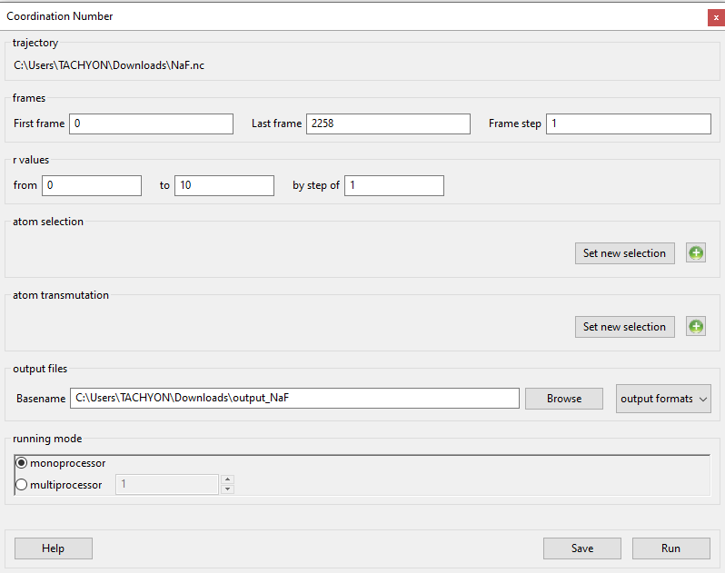
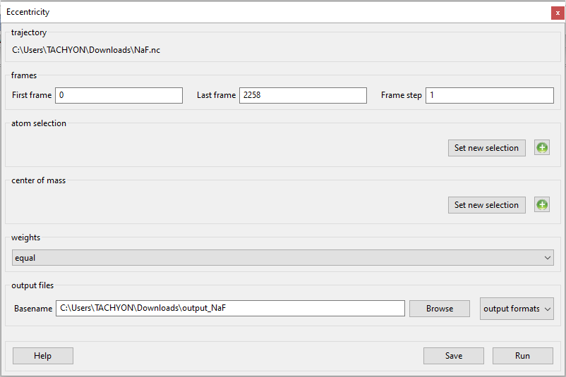
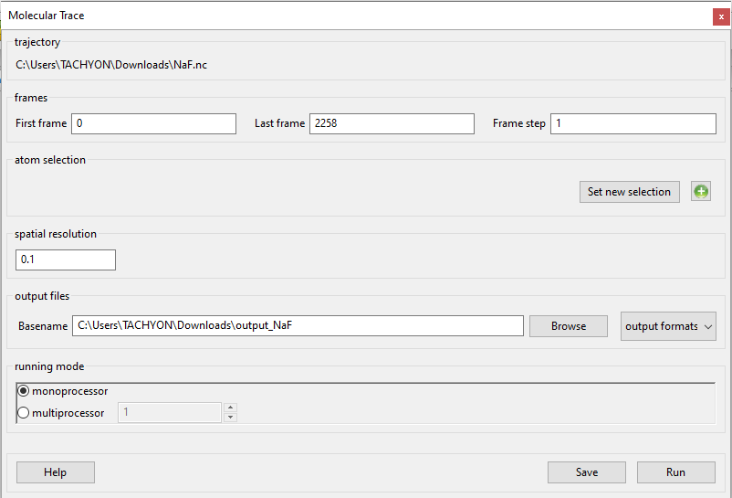
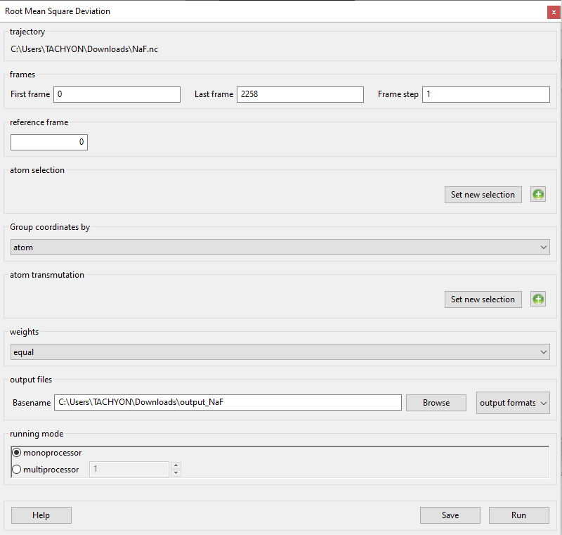
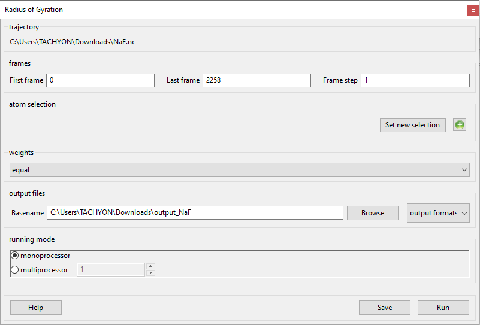
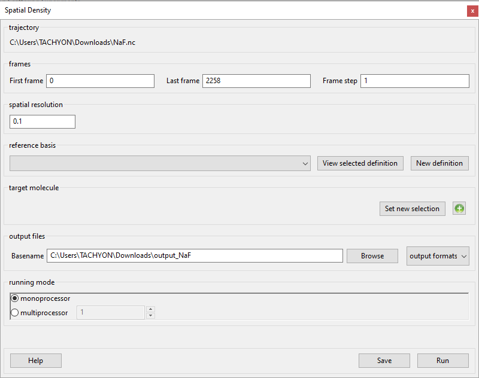
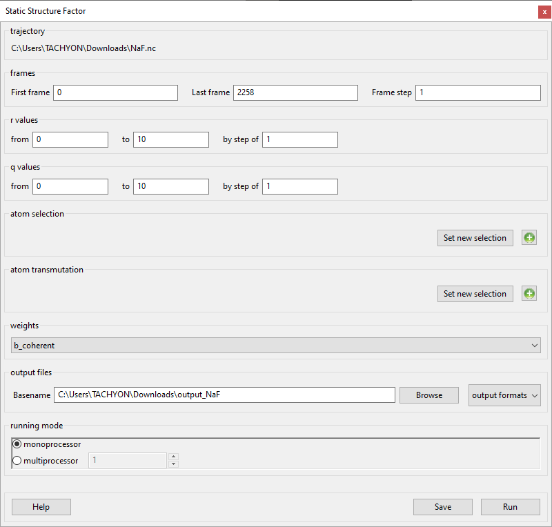
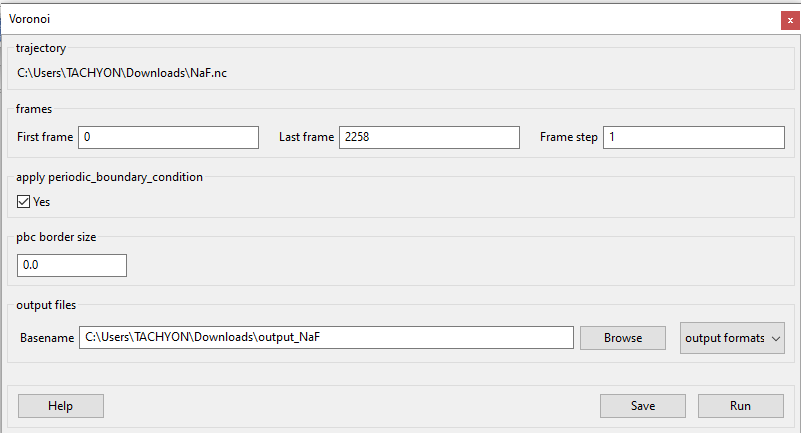
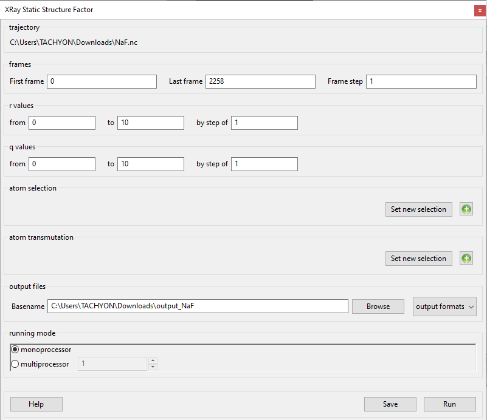

This section is dealing with specific types of analysis performed by
MDANSE. If you are not sure where these fit into the general workflow
of data analysis, please read :ref:`workflow-of-analysis`.

Analysis: Structure
===================

Area Per Molecule
'''''''''''''''''

-  available for trajectories only

.. image:: ./Pictures/100000010000032500000217C794C16C077B23E0.png
   :width: 15.774cm
   :height: 10.582cm

-  :ref:`param-frames`
-  **area vectors**

*Format:* drop-down

*Default:* a, b

*Description:* <insert>

-  **molecule name**

*Format:* str

*Default:* DMPC

*Description:* the name of the molecules for which the calculation will
take place. The name inputted here must match a name that MMTK assigned
to inside the NetCDF file.

-  :ref:`param-output-files`
-  :ref:`param-running-mode`

.. _target_CN:

Coordination Number
'''''''''''''''''''

.. _theory-and-implementation-10:

Theory and implementation
                         

In chemistry, the Coordination Number (*CN*) is the total number of
neighbours of a central atom in a molecule or ion. The definition used
in *MDANSE* is somewhat different and can be seen as an extension of as
the former definition. Indeed, in *MDANSE*, the *CN* is not defined over
one defined central atom but around the centres of gravity of a set of
group of atoms. So, if only one group made of only atom is selected for
the analysis, then, the definition is the same as the original
definition. In that context, the *CN* is defined as:

.. math::
   :label: pfx118

   {n{\left( {r,{r + \mathit{dr}}} \right) = \frac{1}{N_{G}}}{\sum\limits_{g = 1}^{N_{G}}{\sum\limits_{I = 1}^{N_{\mathit{species}}}{n_{\mathit{gI}}\left( {r,{r + \mathit{dr}}} \right)}}}}

where NG is the number of groups of atoms, N\ :sub:`species` is the
number of species found in the system and n\ :sub:`gI`\ (r) is the *CN*
defined for species *I* defined as the number of atoms of species *I*
found in a shell of width *dr* at a distance *r* of the center of
gravity of the group of atom *g*.

*MDANSE* allows one to compute the *CN* on a set of equidistantly spaced
distances at different times

.. math::
   :label: pfx119

   {\mathit{CN}\left( r_{m} \right)\doteq\frac{1}{N_{\mathit{frames}}}\frac{1}{N_{G}}{\sum\limits_{f = 1}^{N_{\mathit{frames}}}{\sum\limits_{g = 1}^{N_{G}}{\sum\limits_{I = 1}^{N_{\mathit{species}}}{CN_{\mathit{gI}}\left( {r_{m},t_{f}} \right)}}}},\\
   {m = 0}\ldots{N_{r} - 1},{n = 0}\ldots{N_{\mathit{frames}} - 1.}}

where N\ :sub:`r` and N\ :sub:`frames` are respectively the number of
distances and times at which the *CN* is evaluated and

.. math::
   :label: pfx120

   {CN_{\mathit{gI}}{\left( {r_{m},t_{f}} \right) = n_{\mathit{gI}}}\left( {r_{m},t_{f}} \right),}

is the number of atoms of species *I* found within [rm, rm + dr] at frame
*f* from the centre of gravity of group *g*.

From these expressions, several remarks can be done. Firstly, the Eqs.
:math:numref:`pfx119` and :math:numref:`pfx120` can be restricted
to intramolecular and intermolecular distances only. Secondly, these
equations can be averaged over the selected frames providing a time
averaged intra and intermolecular *CN*. Finally, the same equations
(time-dependent and time-averaged) can be integrated over r to provide a
cumulative *CN*. *MDANSE* computes all these variations.

The concept of *CN* is useful for structure-related analysis. It can
reveal for instance some packing effects that may have occurred during
the simulation.

.. _gui-10:

GUI
   

-  available for trajectories only

-  :ref:`param-frames`

-  r values

   -  **from**

*Format:* int

*Default:* 0

*Description:* the minimum distance from a central particle in
nanometers taken into consideration. Only particles at that distance or
further will be counted.

-  

   -  **to**

*Format:* int

*Default:* 10

*Description:* the maximum distance from a central particle in
nanometers. Only particles up to and including this distance will be
counted.

-  

   -  **by step of**

*Format:* int

*Default:* 1

*Description:* the size of the step in nanometers used to generate a
range of values between the above two extremes above. Eg. using the
default r-values, the range will be {0, 1, 2, 3, 4, 5, 6, 7, 8, 9, 10}.

-  :ref:`param-atom-selection`
-  :ref:`param-atom-transmutation`
-  :ref:`param-output-files`
-  :ref:`param-running-mode`

Density Profile
'''''''''''''''

-  available for trajectories only

.. image:: ./Pictures/1000000100000323000002F7066E8CC898B27610.png
   :width: 15.921cm
   :height: 15.048cm

-  :ref:`param-frames`
-  :ref:`param-atom-selection`
-  :ref:`param-atom-transmutation`
-  **axis**

*Format:* drop-down

*Default:* c

*Description:* the simulation box axis that Density Profile will be
calculated along.

-  **dr**

*Format:* float

*Default:* 0.01

*Description:* during Density Profile calculation the axis specified in
the **axis** field is divided into a number of bins along its length.
**dr** specifies how large each of these bins will be.

-  `weights <#_Weights>`__
-  :ref:`param-output-files`
-  :ref:`param-running-mode`

Eccentricity
''''''''''''

-  available for trajectories only

-  :ref:`param-frames`
-  :ref:`param-atom-selection`
-  :ref:`param-atom-transmutation`
-  `weights <#_Weights>`__
-  :ref:`param-output-files`

Molecular Trace
'''''''''''''''

-  available for trajectories only

-  :ref:`param-frames`
-  :ref:`param-atom-selection`
-  **spatial resolution**

*Format:* float

*Default:* 0.1

*Description:* the resolution with which Molecular Trace is calculated.
It is used to determine how many grid points are used to represent a
unit of length.

-  :ref:`param-output-files`
-  :ref:`param-running-mode`

Pair Distribution Function
''''''''''''''''''''''''''

.. _theory-and-implementation-11:

Theory and implementation
                         

The Pair Distribution Function (*PDF*) is an example of a pair
correlation function, which describes how, on average, the atoms in a
system are radially packed around each other. This proves to be a
particularly effective way of describing the average structure of
disordered molecular systems such as liquids. Also in systems like
liquids, where there is continual movement of the atoms and a single
snapshot of the system shows only the instantaneous disorder, it is
extremely useful to be able to deal with the average structure.

The *PDF* is useful in other ways. For example, it is something that can
be deduced experimentally from x-ray or neutron diffraction studies,
thus providing a direct comparison between experiment and simulation. It
can also be used in conjunction with the interatomic pair potential
function to calculate the internal energy of the system, usually quite
accurately.

Mathematically, the *PDF* can be computed using the following formula:

.. math::
   :label: pfx121

   {\mathit{PDF}{(r) = {\sum\limits_{{I = 1},J\geq I}^{N_{\mathit{species}}}n_{I}}}n_{J}\omega_{I}\omega_{J}g_{\mathit{IJ}}(r)}

where N\ :sub:`species` is the number of selected species, n\ :sub:`I`
and n\ :sub:`J` are respectively the numbers of atoms of species *I* and
*J*, :math:`\omega`\ :sub:`I` and :math:`\omega`\ :sub:`J` respectively the weights for species
*I* and *J* (see Section `Coordination Number`_ for more details) and

.. math::
   :label: pfx122
   
   {\mathit{PD}F_{\mathit{\alpha\beta}}(r)}

\ is the partial *PDF* for I and J species that can be defined as:

.. math::
   :label: pfx123

   {\mathit{PD}F_{\mathit{IJ}}{(r) = \frac{\left\langle {\sum\limits_{\alpha = 1}^{n_{I}}{n_{\alpha J}(r)}} \right\rangle}{n_{I}\rho_{J}4\pi r^{2}\mathit{dr}}}}

where :math:`\rho`\ :sub:`J` is the density of atom of species *J* and

.. math::
   :label: pfx124
   
   {n_{\alpha J}(r)}

\ is the mean number of atoms of species *J* in a shell of width *dr* at
distance *r* of the atom :math:`\alpha` of species *I*.

From the computation of PDF, two related quantities are also calculated;
the Radial Distribution Function (RDF), defined as

.. math::
   :label: pfx125

   {\mathit{RDF}{(r) = 4}\pi r^{2}\rho_{0}\mathit{PDF}(r),}

and the Total Correlation Function (TCF), defined as

.. math::
   :label: pfx126

   {\mathit{TCF}{(r) = 4}\pi r\rho_{0}\left( {\mathit{PDF}{(r) - 1}} \right),}

where :math:`\rho`\ :sub:`0` is the average atomic density, which is defined as

.. math::
   :label: pfx127

   {{\rho_{0} = \frac{N}{V}},}

where N is the total number of atoms in the system and V the volume of
the simulation.

All these quantities are initially calculated as intramolecular and
intermolecular parts for each pair of atoms, which are then added to
create the total PDF/RDF/TCF for each pair of atoms, as well as the
total intramolecular and total intermolecular values. Lastly, the total
functions are computed. Please note, however, that in the case of TCF,
the below set of equations has been chosen, which will return results
that differ from those of nMOLDYN.

.. math::
   :label: pfx128

   {\mathit{TCF}_{\mathit{intramolecular}}{(r) = 4}\pi r\rho_{0}\mathit{PDF}_{\mathit{intramolecular}}(r),}

.. math::
   :label: pfx129

   {\mathit{TCF}_{\mathit{intermolecular}}{(r) = 4}\pi r\rho_{0}\left( {\mathit{PDF}_{\mathit{intermolecular}}{(r) - 1}} \right),}

.. math::
   :label: pfx130

   {\mathit{TCF}_{\mathit{total}}{(r) = 4}\pi r\rho_{0}\left( {\mathit{PDF}_{\mathit{total}}{(r) - 1}} \right),}

.. _gui-11:

GUI
   

-  available for trajectories only

.. image:: ./Pictures/1000000100000321000002AF539D7E98B51D2ABC.png
   :width: 15.921cm
   :height: 13.656cm

-  :ref:`param-frames`

r values

-  **from**

*Format:* int

*Default:* 0

*Description:* the minimum distance from a central particle in
nanometers taken into consideration. Only particles at that distance or
further will be counted.

-  **to**

*Format:* int

*Default:* 10

*Description:* the maximum distance from a central particle in
nanometers. Only particles up to and including this distance will be
counted.

-  **by step of**

*Format:* int

*Default:* 1

*Description:* the size of the step in nanometers used to generate a
range of values between the above two extremes above. Eg. using the
default r-values, the range will be {0, 1, 2, 3, 4, 5, 6, 7, 8, 9, 10}.

-  :ref:`param-atom-selection`
-  :ref:`param-atom-transmutation`
-  `weights <#_Weights>`__
-  :ref:`param-output-files`
-  :ref:`param-running-mode`

Root Mean Square Deviation
''''''''''''''''''''''''''

.. _theory-and-implementation-12:

Theory and implementation
                         

The Root Mean-Square Deviation (*RMSD*) is maybe the most popular
estimator of structural similarity. It is a numerical measure of the
difference between two structures that can be defined as:

.. math::
   :label: pfx131

   {\mathit{RMSD}{(t) = \sqrt{\frac{\sum\limits_{\alpha = 1}^{N_{\alpha}}\left( {r_{\alpha}{(t) - r_{\alpha}}\left( t_{\mathit{ref}} \right)} \right)}{N_{\alpha}}}}}

where N\_ is the number of atoms of the system, and r_(t) and r_(tref )
are respectively the position of atom :math:`\alpha` at time t and tref where tref is
a reference time usually chosen as the first step of the simulation.
Typically, *RMSD* is used to quantify the structural evolution of the
system during the simulation. It can provide precious information about
the system especially if it reached equilibrium or conversely if major
structural changes occurred during the simulation.

In Molecular Dynamics Analysis for Neutron Scattering Experiments
(*MDANSE*), *RMSD* is computed using the discretized version of equation
:math:numref:`pfx130`:

.. math::
   :label: pfx132

   {\mathit{RMSD}{\left( {n\cdot\Delta t} \right) = \sqrt{\frac{\sum\limits_{\alpha = 1}^{N_{\alpha}}\left( {r_{\alpha}{(t) - r_{\mathit{ref}}}(t)} \right)}{N_{\alpha}}}},{n = 0}\ldots{N_{t} - 1}.}

where Nt is the number of frames and

.. math::
   :label: pfx133
   
   {\mathrm{\Delta}t}

\ is the time step.

.. _gui-12:

GUI
   

-  available for trajectories only

-  :ref:`param-frames`
-  **reference frame**

*Format:* int

*Default:* 0

*Description:* the number of the frame which will be used as reference
for the calculation. The deviation will be calculated as how it deviates
from the values in this frame.

-  :ref:`param-atom-selection`
-  :ref:`param-group-coordinates`
-  :ref:`param-atom-transmutation`
-  `weights <#_Weights>`__
-  :ref:`param-output-files`
-  :ref:`param-running-mode`

Root Mean Square Fluctuation
''''''''''''''''''''''''''''

-  available for trajectories only

.. image:: ./Pictures/100000010000031E0000021D3A0201B22A02F0F8.png
   :width: 15.921cm
   :height: 10.793cm

-  :ref:`param-frames`
-  :ref:`param-atom-selection`
-  :ref:`param-group-coordinates`
-  :ref:`param-output-files`
-  :ref:`param-running-mode`

Radius Of Gyration
''''''''''''''''''

.. _theory-and-implementation-13:

Theory and implementation
                         

Radius Of Gyration (*ROG*) is the name of several related measures of
the size of an object, a surface, or an ensemble of points. It is
calculated as the Root Mean Square Distance between the system and a
reference that can be either the centre of gravity of the system either
a given axis. In *MDANSE*, the reference is chosen to be the centre of
gravity of the system under study. Mathematically, it can be defined as:

.. math::
   :label: pfx134

   {\mathit{ROG}{(t) = \sqrt{\frac{\sum\limits_{\alpha = 1}^{N_{\alpha}}\left( {r_{\alpha}{(t) - r_{\mathit{cms}}}(t)} \right)}{N_{\alpha}}}}}

where :math:`N_{\alpha}`
is the number of atoms of the system, and :math:`r_{\alpha}(t)` and
:math:`r_{cms}(t)` are respectively the position of atom :math:`\alpha` and the
centre of mass of the system at time t.

*ROG* describes the overall spread of the molecule and as such is a good
measure for the molecule compactness. For example, it can be useful when
monitoring folding process.

In *MDANSE*, *ROG* is computed using the discretized version of equation
:math:numref:`pfx131`:

.. math::
   :label: pfx135

   {\mathit{ROG}{\left( {n\cdot\Delta t} \right) = \sqrt{\frac{\sum\limits_{\alpha = 1}^{N_{\alpha}}\left( {r_{\alpha}{(t) - r_{\mathit{cms}}}(t)} \right)}{N_{\alpha}}}},{n = 0}\ldots{N_{t} - 1.}}

where N\ :sub:`t` is the number of frames and Δt is the time step.

.. _gui-13:

GUI
   

-  available for trajectories only

-  :ref:`param-frames`
-  :ref:`param-atom-selection`
-  `weights <#_Weights>`__
-  :ref:`param-output-files`
-  :ref:`param-running-mode`

Solvent Accessible Surface
''''''''''''''''''''''''''

-  available for trajectories only

.. image:: ./Pictures/1000000100000326000002790EB025922D724131.png
   :width: 15.921cm
   :height: 12.504cm

-  :ref:`param-frames`
-  :ref:`param-atom-selection`
-  **n sphere points**

*Format:* int

*Default:* 1000

*Description:* Solvent Accessible Surface calculation involves the
creation of a mesh of points equidistant form each atom or molecule.
This field determines how many of these points should be created.

-  **probe radius**

*Format:* float

*Default:* 0.14

*Description:* (in nanometers) affects the observed surface area.
Smaller probe radius detects more detail and therefore reports larger
surface area. The default value is approximately equal to the radius of
a water molecule.

-  :ref:`param-output-files`
-  :ref:`param-running-mode`

Spatial Density
'''''''''''''''

.. _theory-and-implementation-14:

Theory and implementation
                         

The Spatial Density (*SD*) can be seen as a generalization of the pair
distribution function. Indeed, pair distribution functions are defined
as orientationally averaged distribution functions. Although these
correlation functions reflect many key features of the short-range order
in molecular systems, it should be realized that an average spatial
assembly of non-spherical particles cannot be uniquely characterized
from these one-dimensional functions. So, structural models postulated
for the molecular ordering in non-simple systems based only on
one-dimensional *PDF* will always be somewhat ambiguous. The goal of
*SD* analysis is to provide greater clarity in the structural analysis
of molecular systems by utilizing distribution function which span both
the radial and angular coordinates of the separation vector. This can
provide useful information about the average local structure in a
complex system.

*MDANSE* allows one to compute the *SD* in spherical coordinates on a
set of concentric shells surrounding the centres of mass of selected
triplets of atoms using the formula:

.. math::
   :label: pfx136
   
   {\mathit{SD}\left( {r_{l},\theta_{m},\phi_{n}} \right)\doteq\frac{1}{N_{\mathit{triplets}N_{\mathit{groups}}}}{\sum\limits_{t = 1}^{N_{\mathit{triplets}}}{\sum\limits_{g = 1}^{N_{\mathit{groups}}}\left\langle {n_{\mathit{tg}}\left( {r_{l},\theta_{m},\phi_{n}} \right)} \right\rangle}},}

.. math::
   :label: pfx137

   {l = 0}\ldots{N_{r} - 1},{m = 0}\ldots{N_{\theta} - 1},{n = 0}\ldots{N_{\phi} - 1.}

where N\ :sub:`triplets` and N\ :sub:`groups` are respectively the
number of triplets and groups, r\ :sub:`l`, θ\ :sub:`m` and φ\ :sub:`n`
are the spherical coordinates at which the *SD* is evaluated,
N\ :sub:`r`, :math:`N_{\theta}` and :math:`N_{\phi}`
are respectively the number of discrete *r*, θ and φ values and
n\ :sub:`tg`\ (r\ :sub:`l`, θ\ :sub:`m`, φ\ :sub:`n`) is the number of
group of atoms of type *g* whose centres of mass is found to be in the
volume element defined by [r, r + dr], [θ, θ + dθ] and [φ, φ + dφ] in
the spherical coordinates basis cantered on the centre of mass of
triplet *t*. So technically, *MDANSE* proceeds more or less in the
following way:

-  defines the centre of mass

   .. math::
     :label: pfx138
   
     {c_{i}^{t}{i = 1},2\ldots N_{\mathit{triplets}}}

   \ for each triplet of atoms,

-  defines the centre of mass

   .. math::
     :label: pfx139
     
     {c_{i}^{g}{i = 1},2\ldots N_{\mathit{groups}}}

   \ for each group of atoms,

-  constructs an oriented orthonormal basis

   .. math::
     :label: pfx140
     
     {R_{i}^{t}{i = 1},2\ldots N_{\mathit{triplets}}}

   \ cantered on each c\ :sup:`t`, this basis is defined from the three
   vectors **v1**, **v2**, **v3**,

   -  

      .. math::
        :label: pfx141 
        
        {v_{1} = \frac{n_{1} + n_{2}}{\left| \left| {n_{1} + n_{2}} \right| \right|}}

      \ where **n1** and **n2** are respectively the normalized vectors
      in (**a1**,\ **a2**) and (**a1**,\ **a3**) directions where
      (**a1**,\ **a2**,\ **a3**) are the three atoms of the triplet *t*,
   -  v\ :sub:`2` is defined as the clockwise normal vector orthogonal
      to v1 that belongs to the plane defined by **a1**, **a2** and
      **a3** atoms,
   -  

      .. math::
        :label: pfx142
        
        {{\overrightarrow{v_{3}} = \overrightarrow{v_{1}}}\times\overrightarrow{v_{2}}}

-  expresses the cartesian coordinates of each c\ :sup:`g` in each
   R\ :sup:`t`,

-  transforms these coordinates in spherical coordinates,

-  discretizes the spherical coordinates in r\ :sub:`l`, θ\ :sub:`m` and
   φ\ :sub:`n`,

-  does

   .. math::
     :label: pfx143
     
     {n_{\mathit{tg}}{\left( {r_{l},\theta_{m},\phi_{n}} \right) = n_{\mathit{tg}}}{\left( {r_{l},\theta_{m},\phi_{n}} \right) + 1}}

.. _gui-14:

GUI
   

-  available for trajectories only

-  :ref:`param-frames`
-  **spatial resolution**

*Format:* float

*Default:* 0.1

*Description:* the resolution with which Spatial Density is calculated.
It is used to determine how many grid points are used to represent a
unit of length.

-  **reference basis**

*Format:* drop-down

*Default:* None

*Description:* can be used exactly like `Axis
Selection <#_Axis_Selection_1>`__. <insert> what it does

-  **target molecule**

*Format:* drop-down

*Default:* None

*Description:* can be used exactly an Atom Selection. Allows for a
subset of particles to be selected on which the analysis will be
performed. More information in :ref:`param-atom-selection`.

-  :ref:`param-output-files`
-  :ref:`param-running-mode`

Static Structure Factor
'''''''''''''''''''''''

.. _theory-and-implementation-15:

Theory and implementation
                         

This analysis is a shortcut to obtain the static coherent structure
factor defined as S(q) = F\ :sub:`coh`\ (q, t = 0). It uses exactly the
same procedure as the one defined in the `Dynamic Coherent Structure
Factor <#_Theory_and_implementation_3>`__ section.

.. _gui-15:

GUI
   

-  available for trajectories only

-  :ref:`param-frames`

-  r values

   -  **from**

*Format:* int

*Default:* 0

*Description:* the minimum distance from a central particle in
nanometers taken into consideration. Only particles at that distance or
further will be counted.

-  

   -  **to**

*Format:* int

*Default:* 10

*Description:* the maximum distance from a central particle in
nanometers. Only particles up to and including this distance will be
counted.

-  

   -  **by step of**

*Format:* int

*Default:* 1

*Description:* the size of the step in nanometers used to generate a
range of values between the above two extremes above. Eg. using the
default r-values, the range will be {0, 1, 2, 3, 4, 5, 6, 7, 8, 9, 10}.

-  q values

   -  **from**

*Format:* int

*Default:* 0

*Description:* the minimum value used to generate the range of q values.

-  

   -  **to**

*Format:* int

*Default:* 10

*Description:* the maximum value used to generate the range of q values.

-  

   -  **by step of**

*Format:* int

*Default:* 1

*Description:* the step size value used to generate the range of q
values.

-  :ref:`param-atom-selection`
-  :ref:`param-atom-transmutation`
-  `weights <#_Weights>`__
-  :ref:`param-output-files`
-  :ref:`param-running-mode`

Voronoi
'''''''

-  available for trajectories only

-  :ref:`param-frames`
-  **apply periodic_boundary_condition**

*Format:* bool

*Default:* True

*Description:* determines if the periodic boundary conditions is applied
to the Voronoi cell.

-  **pbc border size**

*Format:* float

*Default:* 0.0

*Description:* <insert>

-  :ref:`param-output-files`
-  :ref:`param-running-mode`

Xray Static Structure Factor
''''''''''''''''''''''''''''

-  available for trajectories only

-  :ref:`param-frames`

-  r values

   -  **from**

*Format:* int

*Default:* 0

*Description:* the minimum distance from a central particle in
nanometers taken into consideration. Only particles at that distance or
further will be counted.

-  

   -  **to**

*Format:* int

*Default:* 10

*Description:* the maximum distance from a central particle in
nanometers. Only particles up to and including this distance will be
counted.

-  

   -  **by step of**

*Format:* int

*Default:* 1

*Description:* the size of the step in nanometers used to generate a
range of values between the above two extremes above. Eg. using the
default r-values, the range will be {0, 1, 2, 3, 4, 5, 6, 7, 8, 9, 10}.

-  q values

   -  **from**

*Format:* int

*Default:* 0

*Description:* the minimum value used to generate the range of q values.

-  

   -  **to**

*Format:* int

*Default:* 10

*Description:* the maximum value used to generate the range of q values.

-  

   -  **by step of**

*Format:* int

*Default:* 1

*Description:* the step size value used to generate the range of q
values.

-  :ref:`param-atom-selection`
-  :ref:`param-atom-transmutation`
-  :ref:`param-output-files`
-  :ref:`param-running-mode`
