.. _trajectory-converters:

Trajectory Converters
=====================

Below is the list of converters present in MDANSE. These allow for the
outputs of a variety of MD simulation software to be able to be used in
MDANSE by converting the various file formats to MMTK NetCDF format that
can be used by MDANSE. All converters convert the positions and other
vital values such as unit cell parameters, but velocities and forces are
converted by only select converters.

Each converter requires different things to work and provides different
options. This is detailed in the sections below. The only things that
all converter windows have in common are the buttons (described in `main
text <#_Trajectory_converter>`__) and the output files field. At the
beginning, that is just as the converter window is opened, this field
will appear as follows:

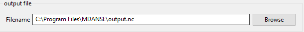

-  **Output files**

*Format:* string

*Default:* ~\\output.nc (where ~ is the home directory)

*Description:* the path to and name of the file that will be created in
MMTK NetCDF format, containing all the information from the MD file
except velocities.

However, once an input file is selected (that is, Browse button next to
an input file field is clicked, a file is selected in the file browser,
and OK is clicked), MDANSE tries to generate a useful file name and
place it in the same folder as the input file. Therefore, the output
file field will appear as follows:

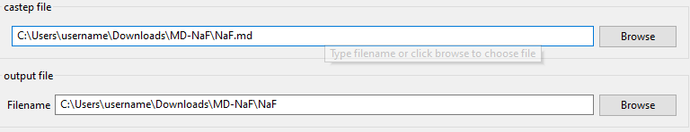

-  **Output files**

*Format:* string

*Default:*
original_trajectory_directory_path\\original_trajectory_file_name (where
original_trajectory_directory_path is the path where the trajectory
being converted is located, and original_trajectory_file_name is the
name of the trajectory being converted)

Also, (n) may be appended to the end of the proposed file name if a file
with the initial name already exists, where n is the lowest number for
which a file does not exist.

*Description:* the path to and name of the file that will be created in
MMTK NetCDF format, containing all the information from the MD file
except velocities.

CASTEP converter
~~~~~~~~~~~~~~~~

MDANSE can convert .md files generated by **CA**\ mbridge **S**\ erial
**T**\ otal **E**\ nergy **P**\ ackage (CASTEP)
[Ref27]_ of any version, and the header can
be of any length. The converter expects velocities and forces to be
written in the MD file. Clicking on the CASTEP button brings up this
window:

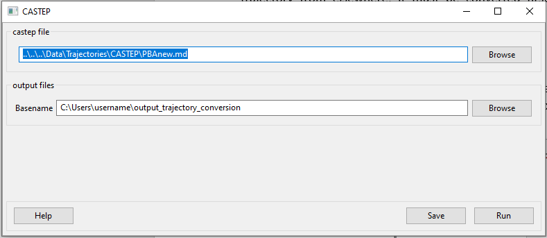

-  **castep file**

*Format:* string

*Default:* ..\\..\\..\\Data\\Trajectories\\CASTEP\\PBAnew.md

*Description:* the path to an MD file that contains the trajectory. The
Browse button can be used to search for the file using the file browser.

-  **Output files**

*Format:* string

*Default:* ~\\output_trajectory_conversion (where ~ is the home
directory)

*Description:* the path to and name of the file that will be created in
MMTK NetCDF format, containing all the information from the MD file
except velocities.

CHARMM converter
~~~~~~~~~~~~~~~~

This converter allows the conversion from a trajectory generated with
**C**\ hemistry at **HAR**\ vard **M**\ acromolecular **M**\ echanics
(CHARMM) [Ref28]_. Selecting CHARMM button
will open the following window:

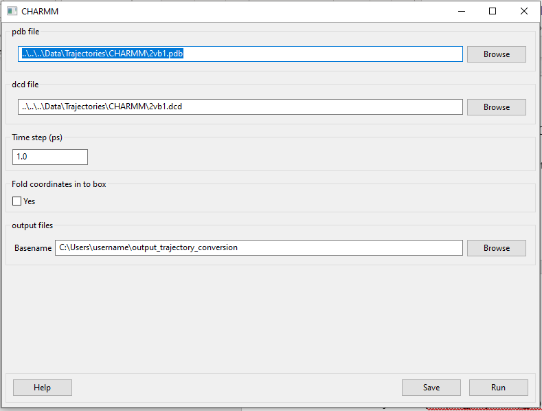

-  **pdb file**

*Format:* string

*Default:* ..\\..\\..\\Data\\Trajectories\\CHARMM\\2vb1.pdb

*Description:* a PDB file of the system must be provided for the
conversion. This file is necessary to build up the MMTK universe related
to the MMTK trajectory. If you do not have a PDB file, you can generate
it in many ways, such as by using ‘gmx editconf’ Gromacs command.

Please note, however, that there are multiple ‘versions’ of PDB files,
but MDANSE is quite strict regarding which ones it can read. Therefore,
it is best to make sure the PDB complies with the specification in Ref
[Ref29]_. Notably, the terminal oxygens on
the carboxylic acid end must be noted as OT1 and OT2; O1 and O2 will
result in an obscure error.

-  **dcd file**

*Format:* string

*Default:* ..\\..\\..\\Data\\Trajectories\\CHARMM\\2vb1.dcd

*Description:* the CHARMM DCD trajectory file that stores the trajectory
frames.

-  **Time step (ps)**

*Format:* strictly positive float

*Default:* 1.0

*Description:* the time step in picoseconds between two consecutive
frames of CHARMM trajectory.

-  **Fold coordinates in to box**

*Format:* bool

*Default:* False

*Description:* <insert>

-  **output files**

*Format:* string

*Default:* ~\\output_trajectory_conversion (where ~ is the home
directory)

*Description:* the path to and name of the file that will be created in
MMTK NetCDF format, containing all the information from the PDB and DCD
files except velocities.

DFTB converter
~~~~~~~~~~~~~~

Converts trajectories generated using software based on the
**D**\ ensity **F**\ unctional based **T**\ ight **B**\ inding (DFTB)
method [Ref30]_. It should work with all the
related software, but if you have any issues, please let us know.

Selecting DFTB will open this window:

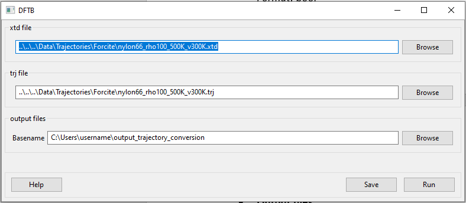

-  **xtd file**

*Format:* string

*Default:*
..\\..\\..\\Data\\Trajectories\\Forcite\\nylon66_rho100_500K_v300K.xtd

*Description:* a XTD file of the system must be provided for the
conversion. This file is necessary to build up the MMTK universe related
to the MMTK trajectory.

-  **trj file**

*Format:* string

*Default:*
..\\..\\..\\Data\\Trajectories\\Forcite\\nylon66_rho100_500K_v300K.trj

*Description:* the DFTB TRJ trajectory file that stores the trajectory
frames.

-  **output files**

*Format:* string

*Default:* ~\\output_trajectory_conversion (where ~ is the home
directory)

*Description:* the path to and name of the file that will be created in
MMTK NetCDF format, containing all the information from the XTD and TRJ
files except velocities.

Discover converter
~~~~~~~~~~~~~~~~~~

This converter allows the conversion from a trajectory generated with
Materials Studio [Ref31]_ Discover module to
a MMTK NetCDF trajectory. It converts velocities but not forces.
Clicking on Discover button will open this window:

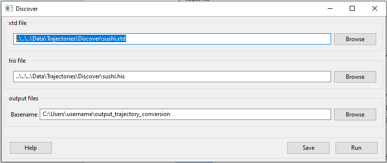

-  **xtd file**

*Format:* string

*Default:* ..\\..\\..\\Data\\Trajectories\\Discover\\sushi.xtd

*Description:* a XTD file of the system must be provided for the
conversion. This file is necessary to build up the MMTK universe related
to the MMTK trajectory.

-  **his file**

*Format:* string

*Default:* ..\\..\\..\\Data\\Trajectories\\Discover\\sushi.his

*Description:* the Discover HIS trajectory file that stores the
trajectory frames.

-  **output files**

*Format:* string

*Default:* ~\\output_trajectory_conversion (where ~ is the home
directory)

*Description:* the path to and name of the file that will be created in
MMTK NetCDF format, containing all the information from the XTD and HIS
files except velocities.

DL_POLY converter
~~~~~~~~~~~~~~~~~

This converter allows the conversion from a trajectory generated with DL
POLY [Ref32]_ to a MMTK NetCDF trajectory. It
can convert both velocities and forces. Pressing the DL-POLY button will
open this window:

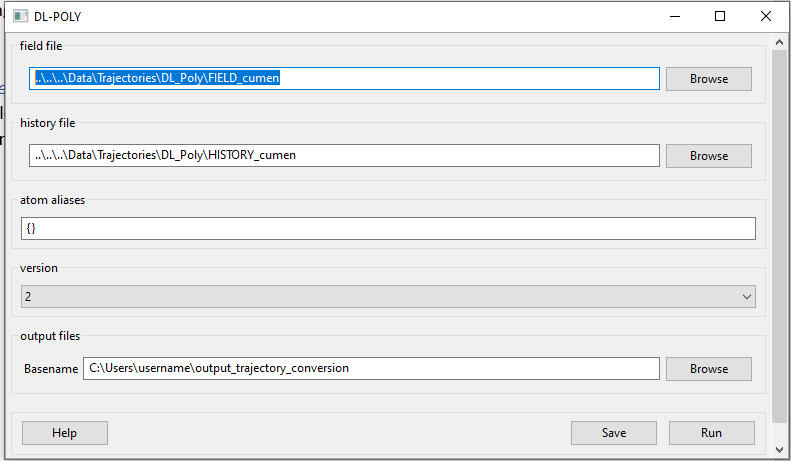

-  **field file**

*Format:* string

*Default:* ..\\..\\..\\Data\\Trajectories\\DL_POLY\\FIELD_cumen

*Description:* the DL POLY FIELD file that stores the information about
the system. This file is necessary to build up the MMTK universe related
to the MMTK trajectory.

-  **history file**

*Format:* string

*Default:* ..\\..\\..\\Data\\Trajectories\\DL_POLY\\HISTORY_cumen

*Description:* the DL POLY HISTORY file that stores the trajectory
frames.

-  **atom aliases**

*Format:* string

*Default:* {}

*Description:* MDANSE will create the MMTK universe with the atom names
specified in the FIELD file. By default, MDANSE will interpret these
names directly as if they were a chemical symbol. If this fails, MDANSE
will remove the last character until it corresponds to a known chemical
symbol. For example, an atom defined in the FIELD file as CB, will first
be interpreted as an atom of chemical symbol CB. As it does not exist,
MDANSE will interpret it as an atom of chemical symbol C, namely a
carbon atom. Using this procedure, it can happen that some atom names
can be misunderstood, or event not understood at all by MMTK. For
example, aromatic carbons (CA) can be interpreted as calcium.

The aim of the Special atoms field is precisely to avoid such problems.
The format for the Special atoms field is

*{atom_name1:element1 <sep> atom_name2:element2 etc.}*

where <sep> can be a white space, a comma, or a semicolon. In the
example showed in figure 4.7, the string CS:C should be entered in the
Special atoms field. Interestingly, the Special atoms field can also be
used to specify united atoms. The syntax is exactly the same but, in
that case, the element name must be replaced by the MMTK united atom
code (e.g. CH3, CH2, CH, NH, NH2, NH3, OH, SH, etc.)

-  **version**

*Format:* int

*Default:* 2

*Description:* The version of DL POLY software. Different versions
format the HISTORY file differently, so it is necessary to select the
correct format.

-  **output files**

*Format:* string

*Default:* ~\\output_trajectory_conversion (where ~ is the home
directory)

*Description:* the path to and name of the file that will be created in
MMTK NetCDF format, containing all the information from the FIELD and
HISTORY files.

DMol converter
~~~~~~~~~~~~~~

This converter allows the conversion from a trajectory generated with
Materials Studio [Ref31]_ DMol module to a
MMTK NetCDF trajectory. Clicking on DMol button will open this window:

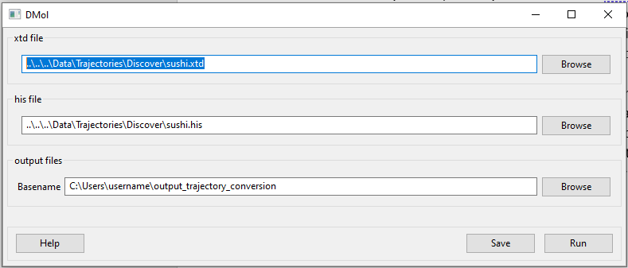

-  **xtd file**

*Format:* string

*Default:* ..\\..\\..\\Data\\Trajectories\\Discover\\sushi.xtd

*Description:* an XTD file of the system must be provided for the
conversion. This file is necessary to build up the MMTK universe related
to the MMTK trajectory.

-  **his file**

*Format:* string

*Default:* ..\\..\\..\\Data\\Trajectories\\Discover\\sushi.his

*Description:* the DMol HIS trajectory file that stores the trajectory
frames.

-  **output files**

*Format:* string

*Default:* ~\\output_trajectory_conversion (where ~ is the home
directory)

*Description:* the path to and name of the file that will be created in
MMTK NetCDF format, containing all the information from the XTD and HIS
files except velocities.

Forcite converter
~~~~~~~~~~~~~~~~~

This converter allows for the conversion from a trajectory generated
with Materials Studio [Ref31]_ Forcite module
to a MMTK NetCDF trajectory. It can convert both velocities and forces,
if present. Clicking on DMol button will open this window:

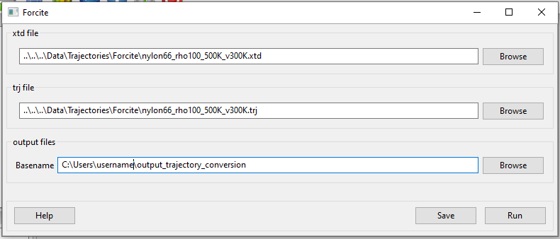

-  **xtd file**

*Format:* string

*Default:*
..\\..\\..\\Data\\Trajectories\\Forcite\\nylon66_rho100_500K_v300K.xtd

*Description:* a XTD file of the system must be provided for the
conversion. This file is necessary to build up the MMTK universe related
to the MMTK trajectory.

-  **trj file**

*Format:* string

*Default:*
..\\..\\..\\Data\\Trajectories\\Forcite\\nylon66_rho100_500K_v300K.trj

*Description:* the Forcite TRJ trajectory file that stores the
trajectory frames.

-  **output files**

*Format:* string

*Default:* ~\\output_trajectory_conversion (where ~ is the home
directory)

*Description:* the path to and name of the file that will be created in
MMTK NetCDF format, containing all the information from the XTD and HIS
files except velocities.

Generic converter
~~~~~~~~~~~~~~~~~

Converts a trajectory written in ASCII to an MMTK NetCDF file, including
both velocities and forces if present. This is useful if you have a
trajectory from a software not currently supported by MDANSE. An example
of such ASCII file can be found by clicking on Help in the window that
appears when Generic is selected:

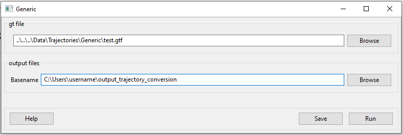

-  **gt file**

*Format:* string

*Default*: ..\\..\\..\\Data\\Trajectories\\Generic\\test.gt

*Description: path to* an ASCII trajectory file that will be converted
to MMTK NetCDF format.

-  **output files**

*Format:* string

*Default:* ~\\output_trajectory_conversion (where ~ is the home
directory)

*Description:* the path to and name of the file that will be created in
MMTK NetCDF format, containing all the information from the XTD and HIS
files except velocities.

Gromacs converter
~~~~~~~~~~~~~~~~~

Converts a trajectory generated by the Gromacs software
[Ref33]_ into MMTK NetCDF format. A PDF file
containing the data about the initial configuration must be provided,
along with a trajectory in either an XTC, or, since version 1.6.0, a TRR
format. The latter format supports velocity reading. Selecting Gromacs
opens the following window:

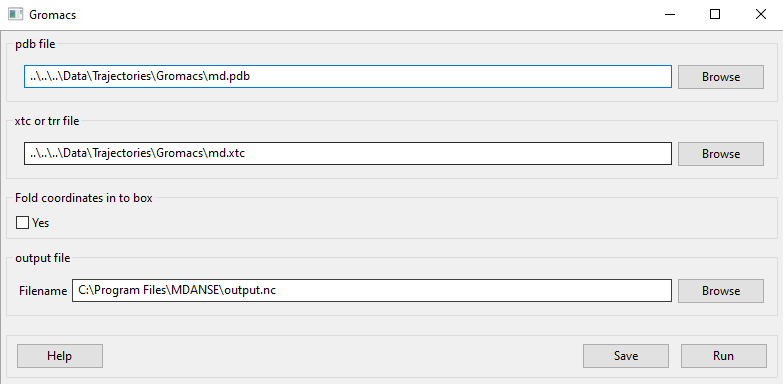

-  **pdb file**

*Format:* string

*Default:* ..\\..\\..\\Data\\Trajectories\\Gromacs\\md.pdb

*Description:* a PDB file of the system must be provided for the
conversion. This file is necessary to build up the MMTK universe related
to the MMTK trajectory. If you do not have a PDB file, you can generate
it in many ways, such as by using ‘gmx editconf’ Gromacs command.

Please note, however, that there are multiple ‘versions’ of PDB files,
but MDANSE is quite strict regarding which ones it can read. Therefore,
it is best to make sure the PDB complies with the specification in Ref
[Ref29]_. Notably, the terminal oxygens on
the carboxylic acid end must be noted as OT1 and OT2; O1 and O2 will
result in an obscure error.

-  **xtc or trr file**

*Format:* string

*Default:* ..\\..\\..\\Data\\Trajectories\\Gromacs\\md.xtc

*Description:* the Gromacs XTC or TRR trajectory file that stores the
trajectory frames.

-  **Fold coordinates in to box**

*Format:* bool

*Default:* False

*Description:* <insert>

-  **output files**

*Format:* string

*Default:* ~\\output_trajectory_conversion (where ~ is the home
directory)

*Description:* the path to and name of the file that will be created in
MMTK NetCDF format, containing all the information from the PDB and DCD
files except velocities.

LAMMPS converter
~~~~~~~~~~~~~~~~

Converts trajectories generated by **L**\ arge-scale
**A**\ tomic/**M**\ olecular **M**\ assively **P**\ arallel
**S**\ imulator (LAMMPS) [Ref34]_ into MMTK
NetCDF format. Selecting LAMMPS opens the following window:

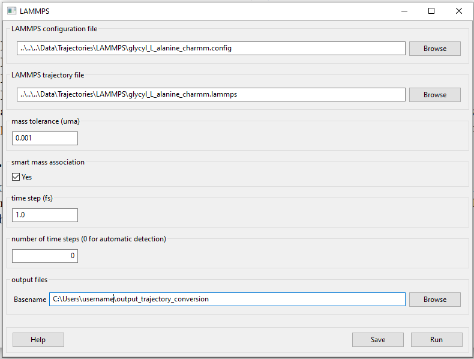

-  **LAMMPS configuration file**

*Format:* string

*Default:*
..\\..\\..\\Data\\Trajectories\\LAMMPS\\glycyl_L_alanine_charmm.config

*Description:* LAMMPS configuration file. It should contain box
dimensions and the masses block.

-  **LAMMPS trajectory file**

*Format:* string

*Default:*
..\\..\\..\\Data\\Trajectories\\LAMMPS\\glycyl_L_alanine_charmm.config

*Description*: a .lammps file that stores the trajectory frames.

-  **mass tolerance (uma)**

*Format:* float

*Default:* 0.001

*Description:* For LAMMPS trajectories, the parameter used to identify
the chemical elements present in the simulated system is the mass.
MDANSE compares the values present in the “Masses” block in the LAMMPS
configuration file with those stored in MDANSE’s own database and
identify an element when both agree between the mass tolerance (the
other input parameter available in the conversion interface). Naturally
the masses appearing in the configuration file should be close to those
in the database, but they are not necessarily the same. For example, the
mass for hydrogen in the database is 1.0079 uma, but you could have a
simulation done with a mass value of 1.008 or 1.01 or even just 1.

A possible solution may be to change the mass tolerance given using this
option. However, as the MDANSE database contains the masses of all the
isotopes, if the tolerance is such that more than one isotope can be
assigned, the converter will also fail. Therefore, the safest solution
is to check the values of the masses in the MDANSE database and modify
the LAMMPS configuration file to use the same masses.

-  **smart mass association**

*Format:* bool

*Default:* True

*Description:* If this is set to True and there are two or more elements
in the MDANSE database within the tolerance of the LAMMPS mass (ie. If
there is more than one match), MDANSE will not fail with an error but
instead match the element from the database that most closely matches
the mass in the LAMMPS .config file.

-  **Time step (fs)**

*Format:* strictly positive float

*Default:* 1.0

*Description:* the time step in **femtoseconds** between two consecutive
frames of the LAMMPS trajectory.

-  **Number of time steps**

*Format:* strictly positive int

*Default:* 0

*Description:* the number of steps you want to convert. If this is set
to 0, MDANSE will convert all the frames in the trajectory.

-  **output files**

*Format:* string

*Default:* ~\\output_trajectory_conversion (where ~ is the home
directory)

*Description:* the path to and name of the file that will be created in
MMTK NetCDF format, containing all the information from the PDB and DCD
files except velocities.

NAMD converter
~~~~~~~~~~~~~~

Converts a trajectory generated with **NA**\ noscale **M**\ olecular
**D**\ ynamics (NAMD) [Ref35]_ to an MMTK
NetCDF trajectory. Selecting NAMD opens the following window:

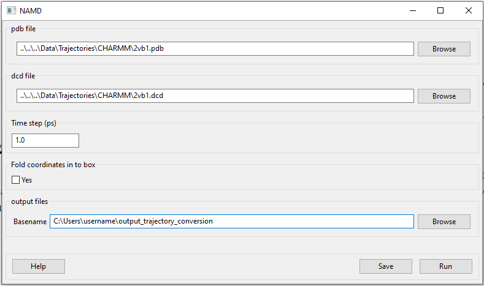

-  **pdb file**

*Format:* string

*Default:* ..\\..\\..\\Data\\Trajectories\\CHARMM\\2vb1.pdb

*Description:* a PDB file of the system must be provided for the
conversion. This file is necessary to build up the MMTK universe related
to the MMTK trajectory.

Please note, however, that there are multiple ‘versions’ of PDB files,
but MDANSE is quite strict regarding which ones it can read. Therefore,
it is best to make sure the PDB complies with the specification in Ref
[Ref29]_. Notably, the terminal oxygens on
the carboxylic acid end must be noted as OT1 and OT2; O1 and O2 will
result in an obscure error.

-  **dcd file**

*Format:* string

*Default:* ..\\..\\..\\Data\\Trajectories\\CHARMM\\2vb1.dcd

*Description:* the NAMD DCD trajectory file that stores the trajectory
frames.

-  **Time step (ps)**

*Format:* strictly positive float

*Default:* 1.0

*Description:* the time step in **picoseconds** between two consecutive
frames of CHARMM trajectory.

-  **Fold coordinates in to box**

*Format:* bool

*Default:* False

*Description:* <insert>

-  **output files**

*Format:* string

*Default:* ~\\output_trajectory_conversion (where ~ is the home
directory)

*Description:* the path to and name of the file that will be created in
MMTK NetCDF format, containing all the information from the PDB and DCD
files except velocities.

PDB converter
~~~~~~~~~~~~~

MDANSE can convert standalone PDB files into MMTK NetCDF. However, of
the variety of PDB format, MMTK is capable of parsing only some; to
ensure that a PDB can be read, it should comply with the specification
in Ref [Ref29]_. To do that, select PDB, and
the following window will open:

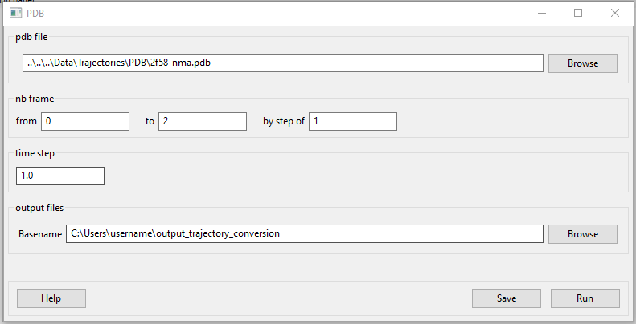

-  **pdb file**

*Format:* string

*Default:* ..\\..\\..\\Data\\Trajectories\\CHARMM\\2vb1.pdb

*Description:* a PDB file of the system must be provided for the
conversion. This file is necessary to build up the MMTK universe related
to the MMTK trajectory. If you do not have a PDB file, you can generate
it in many ways, such as by using ‘gmx editconf’ Gromacs command.

Please note, however, that there are multiple ‘versions’ of PDB files,
but MDANSE is quite strict regarding which ones it can read. Therefore,
it is best to make sure the PDB complies with the specification in Ref
[Ref29]_. Notably, the terminal oxygens on
the carboxylic acid end must be noted as OT1 and OT2; O1 and O2 will
result in an obscure error.

-  **nb frame**

*Format:* int int int

*Default:* 0 2 1

*Description:* The selection of frames that will be converted. The
frames specified in both ‘from’ and ‘to’ are included (ie. by default
frames 0, 1, and 2 are converted). The ‘by step of’ field specifies the
periodicity of which frames are skipped, ie. if it is 1, every frame is
converted, if it is 2, every other is converted, etc.

-  **Time step (ps)**

*Format:* strictly positive float

*Default:* 1.0

*Description:* the time step in **picoseconds** between two consecutive
frames of CHARMM trajectory.

-  **output files**

*Format:* string

*Default:* ~\\output_trajectory_conversion (where ~ is the home
directory)

*Description:* the path to and name of the file that will be created in
MMTK NetCDF format, containing all the information from the PDB file
except velocities.

VASP converter
~~~~~~~~~~~~~~

Converts a trajectory generated with **V**\ ienna **A**\ b-initio
**S**\ imulation **P**\ ackage (`VASP <https://www.vasp.at/>`__) to an
MMTK NetCDF trajectory. Only trajectories created with VASP version 5 or
higher can be converted. Selecting VASP opens the following window:

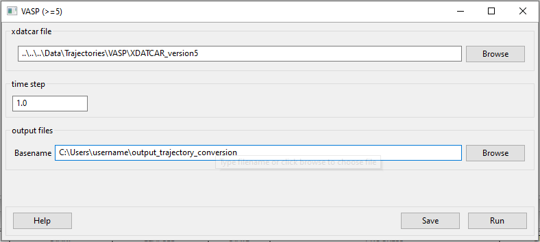

-  **xdatcar file**

*Format:* string

*Default:* ..\\..\\..\\Data\\Trajectories\\VASP\\XDATCAR_version5

*Description:* an XDATCAR file storing a trajectory.

-  **Time step (ps)**

*Format:* strictly positive float

*Default:* 1.0

*Description:* the time step in **picoseconds** between two consecutive
frames of CHARMM trajectory.

-  **output files**

*Format:* string

*Default:* ~\\output_trajectory_conversion (where ~ is the home
directory)

*Description:* the path to and name of the file that will be created in
MMTK NetCDF format, containing all the information from the PDB file
except velocities.

XPLOR converter
~~~~~~~~~~~~~~~

Converts a trajectory generated by X-PLOR into the MMTK NetCDF format.
Selecting XPLOR opens the following window:

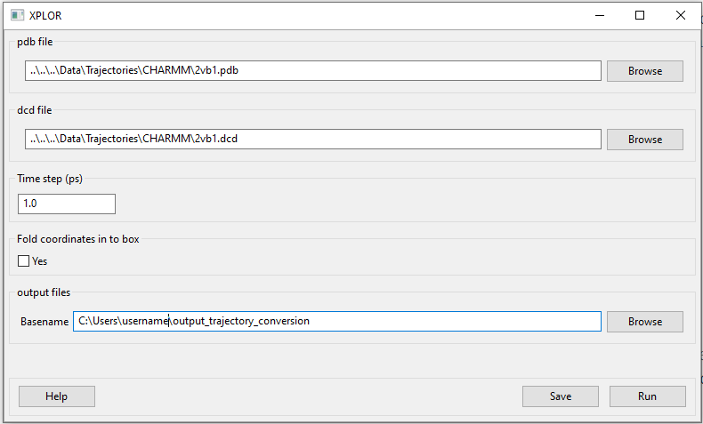

-  **pdb file**

*Format:* string

*Default:* ..\\..\\..\\Data\\Trajectories\\CHARMM\\2vb1.pdb

*Description:* a PDB file of the system must be provided for the
conversion. This file is necessary to build up the MMTK universe related
to the MMTK trajectory.

Please note, however, that there are multiple ‘versions’ of PDB files,
but MDANSE is quite strict regarding which ones it can read. Therefore,
it is best to make sure the PDB complies with the specification in Ref
[Ref29]_. Notably, the terminal
oxygens on the carboxylic acid end must be noted as OT1 and OT2; O1 and
O2 will result in an obscure error.

-  **dcd file**

*Format:* string

*Default:* ..\\..\\..\\Data\\Trajectories\\CHARMM\\2vb1.dcd

*Description:* an X-PLOR DCD trajectory file that stores the trajectory
frames.

-  **Time step (ps)**

*Format:* strictly positive float

*Default:* 1.0

*Description:* the time step in **picoseconds** between two consecutive
frames of CHARMM trajectory.

-  **Fold coordinates in to box**

*Format:* bool

*Default:* False

*Description:* <insert>

-  **output files**

*Format:* string

*Default:* ~\\output_trajectory_conversion (where ~ is the home
directory)

*Description:* the path to and name of the file that will be created in
MMTK NetCDF format, containing all the information from the PDB and DCD
files except velocities.

